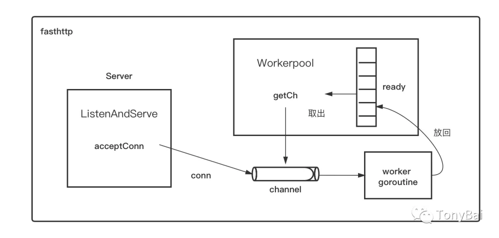
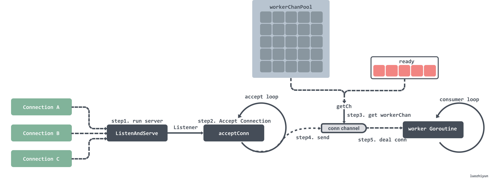

no free connections available to host
-------

- 原因： 连接数已经达到了 maxConns = DefaultMaxConnsPerHost = 512(默认值)。连接数达到最大值了

```go
func (c *HostClient) acquireConn() (*clientConn, error) {
    if n == 0 {
        maxConns := c.MaxConns
        if maxConns <= 0 {
            maxConns = DefaultMaxConnsPerHost
        }
        if c.connsCount < maxConns {
            c.connsCount++
            createConn = true
            if !c.connsCleanerRun {
                startCleaner = true
                c.connsCleanerRun = true
            }
        }
    } else {
        n--
        cc = c.conns[n]
        c.conns[n] = nil
        c.conns = c.conns[:n]
    }
    c.connsLock.Unlock()
```

处理链接源码 

```go
func clientDoDeadline(req *Request, resp *Response, deadline time.Time, c clientDoer) error {
   ...

    // Note that the request continues execution on ErrTimeout until
    // client-specific ReadTimeout exceeds. This helps limiting load
    // on slow hosts by MaxConns* concurrent requests.
    //
    // Without this 'hack' the load on slow host could exceed MaxConns*
    // concurrent requests, since timed out requests on client side
    // usually continue execution on the host.

    var mu sync.Mutex
    var timedout bool
        //这个goroutine是用来处理连接以及发送请求的
    gofunc() {
        errDo := c.Do(reqCopy, respCopy)
        mu.Lock()
        {
            if !timedout {
                if resp != nil {
                    respCopy.copyToSkipBody(resp)
                    swapResponseBody(resp, respCopy)
                }
                swapRequestBody(reqCopy, req)
                ch <- errDo
            }
        }
        mu.Unlock()

        ReleaseResponse(respCopy)
        ReleaseRequest(reqCopy)
    }()
        //这块内容是用来处理超时的
    tc := AcquireTimer(timeout)
    var err error
    select {
    case err = <-ch:
    case <-tc.C:
        mu.Lock()
        {
            timedout = true
            err = ErrTimeout
        }
        mu.Unlock()
    }
    ReleaseTimer(tc)

    select {
    case <-ch:
    default:
    }
    errorChPool.Put(chv)

    return err
}
```

```go
// DoTimeout performs the given request and waits for response during
// the given timeout duration.
//
// Request must contain at least non-zero RequestURI with full url (including
// scheme and host) or non-zero Host header + RequestURI.
//
// The function doesn't follow redirects. Use Get* for following redirects.
//
// Response is ignored if resp is nil.
//
// ErrTimeout is returned if the response wasn't returned during
// the given timeout.
//
// ErrNoFreeConns is returned if all HostClient.MaxConns connections
// to the host are busy.
//
// It is recommended obtaining req and resp via AcquireRequest
// and AcquireResponse in performance-critical code.
//
// Warning: DoTimeout does not terminate the request itself. The request will
// continue in the background and the response will be discarded.
// If requests take too long and the connection pool gets filled up please
// try setting a ReadTimeout.
func (c *HostClient) DoTimeout(req *Request, resp *Response, timeout time.Duration) error {
    return clientDoTimeout(req, resp, timeout, c)
}
```

- Solution：

需要设置 ReadTimeout 字段，达到 ReadTimeout 时间还没有得到返回值，客户端就会把连接断开（


ErrConnectionClosed
--------------

fasthttp default idle timeout is 15 seconds. 如果对方默认keep-live 时间是8s。
需要设置 IdleConnTimeout 小于 8s 

原生http木有问题，是因为两个 协程 在 loop write read,所以对 server 端 FIN 是 及时响应的，也就是client 及时也关闭了链接

Context with sync.Pool
-------------

fasthttp 它几乎把所有的对象都用sync.Pool维护。

但这样的复用不一定全是合理的。比如在fasthttp中，传递上下文相关信息的RequestCtx就是用sync.Pool维护的，这就导致了你不能把它传递给其他的goroutine。

如果要在fasthttp中实现类似接受请求->异步处理的逻辑, **必须得拷贝一份RequestCtx再传递**。

[Best Practices](https://github.com/valyala/fasthttp#fasthttp-best-practices)
--------------

- Do not allocate objects and []byte buffers - just reuse them as much as possible. Fasthttp API design encourages this.
- sync.Pool is your best friend.
- Profile your program in production. go tool pprof --alloc_objects your-program mem.pprof usually gives better insights for optimization opportunities than go tool pprof your-program cpu.pprof.
- Write tests and benchmarks for hot paths.
- Avoid conversion between []byte and string, since this may result in memory allocation+copy. Fasthttp API provides functions for both []byte and string - use these functions instead of converting manually between []byte and string. There are some exceptions - see this wiki page for more details.

[Design Details](https://www.jianshu.com/p/12f3955c7e1c)
--------------

- 
- fasthttp设计了一套机制，目的是尽量复用goroutine，而不是每次都创建新的goroutine。fasthttp的Server accept一个conn之后，会尝试从workerpool中的ready切片中取出一个channel，该channel与某个worker goroutine一一对应。一旦取出channel，就会将accept到的conn写到该channel里，而channel另一端的worker goroutine就会处理该conn上的数据读写。当处理完该conn后，该worker goroutine不会退出，而是会将自己对应的那个channel重新放回workerpool中的ready切片中，等待这下一次被取出。
- 我们看到fasthttp的模型不太适合这种连接连上后进行持续“饱和”请求的场景，更适合短连接或长连接但没有持续饱和请求，在后面这样的场景下，它的goroutine复用模型才能更好的得以发挥。
- 但即便“退化”为了net/http模型，fasthttp的性能依然要比net/http略好，这是为什么呢？这些性能提升主要是fasthttp在内存分配层面的优化trick的结果，比如大量使用sync.Pool，比如避免在[]byte和string互转等。
- fasthttp.Server中的Concurrency可以用来限制workerpool中并发处理的goroutine的个数，但由于每个goroutine只处理一个连接，当Concurrency设置过小时，后续的连接可能就会被fasthttp拒绝服务。因此fasthttp的默认Concurrency为
   `const DefaultConcurrency = 256 * 1024`

- 
- 启动监听；
- 循环监听端口获取连接；
- 获取到连接之后首先会去 ready 队列里获取 workerChan，获取不到就会去对象池获取；
- 将监听的连接传入到 workerChan 的 channel 中；
- workerChan 有一个 Goroutine 一直循环获取 channel 中的数据，获取到之后就会对请求进行处理然后返回。
- 上面有提到 workerChan 其实就是一个连接处理对象，这个对象里面有一个 channel 用来传递连接；每个 workerChan 在后台都会有一个 Goroutine 循环获取 channel 中的连接，然后进行处理。如果没有设置最大同时连接处理数的话，默认是 256 * 1024个。这样可以在并发很高的时候还可以同时保证对外提供服务。

- [优化点](https://www.luozhiyun.com/archives/574)
  - 在实现上还通过 sync.Pool 来大量的复用对象，减少内存分配，如： workerChanPool 、ctxPool 、readerPool、writerPool 等等多大30多个 sync.Pool 。
  - 除了复用对象，fasthttp 还会切片，通过 `s = s[:0]`和 `s = append(s[:0], b…)`来减少切片的再次创建。
  - fasthttp 由于需要和 string 打交道的地方很多，所以还从很多地方尽量的避免[]byte到string转换时带来的内存分配和拷贝带来的消耗 
  - 控制异步 Goroutine 的同时处理数量，最大默认是 256 * 1024个

- [HTTP]
  - Server side
    - 服务端的代码看主逻辑主要是看两部分，一个是注册处理器，标准库使用map进行存储，本质是一个静态索引，同时维护了一个切片，用来做前缀匹配，只要以/结尾的，都会在切片中存储；
    - 服务端监听端口本质也是使用net网络库进行TCP连接，然后监听对应的TCP连接，每一个HTTP请求都会开一个goroutine去处理请求，所以如果有海量请求，会在一瞬间创建大量的goroutine，这个可能是一个性能瓶颈点
  - Client side
    - 优点是HTTP客户端使用了连接池，避免频繁建立带来的大开销，
    - 缺点是HTTP服务端的路由只是一个静态索引匹配，对于动态路由匹配支持的不好，并且每一个请求都会创建一个gouroutine进行处理，海量请求到来时需要考虑这块的性能瓶颈；
    - HTTP在建立连接时会耗费大量的资源，需要开辟一个goroutine去创建TCP连接，连接建立后会在创建两个goroutine用于HTTP请求的写入和响应的解析，然后使用channel进行通信，所以要合理利用连接池，避免大量的TCP连接的建立可以优化性能

- Overview
  - 核心优化点
    - 对象复用
      - workerpool 对象表示 连接处理 工作池，这样可以控制连接建立后的处理方式，而不是像标准库 net/http 一样，对每个请求连接都启动一个 goroutine 处理， 内部的 ready 字段存储空闲的 workerChan 对象，workerChanPool 字段表示管理 workerChan 的对象池。
      - Cookie 对象也是通过对象池进行管理的, fasthttp 中一共有 38 个对象是通过对象池进行管理的，可以说几乎复用了所有对象
    - []byte 复用
      - fasthttp 中的 []byte 都是通过 sync.Pool 进行管理的，这样可以减少内存分配，减少 GC 压力，比如：ctxPool 、readerPool、writerPool 等等多大30多个 sync.Pool 。
      - fasthttp 中复用的对象在使用完成后归还到对象池之前，需要调用对应的 Reset 方法进行重置，如果对象中包含 []byte 类型的字段， 那么会直接进行复用，而不是初始化新的 []byte, 例如 URI 对象的 Reset 方法:
    - []byte 和 string 转换
      - fasthttp 专门提供了 []byte 和 string 这两种常见的数据类型相互转换的方法 ，避免了 内存分配 + 复制，提升性能
    - bytebufferpool
      - 核心优化点是 避免内存拷贝 + 底层 byte 切片复用
    - 避免反射
      - fasthttp 中的所有 对象深拷贝 内部实现中都没有使用 反射，而是手动实现的，这样可以完全规避 反射 带来的影响
  - fasthttp 的问题
    - 异步 处理场景，框架核心的 对象复用 机制可能导致各种问题，如对象提前归还、对象指针 hang 起、还有更严重的对象字段被重置后继续引用
    - 复杂度提升， 代码可读性
  - 最佳实践
    - 尽可能复用对象和 []byte buffers, 而不是重新分配
    - 使用 []byte 特性技巧
    - 使用 sync.Pool 对象池
    - 在生产环境对程序进行性能分析，go tool pprof --alloc_objects app mem.pprof 通常比 go tool pprof app cpu.pprof 更容易体现性能瓶颈
    - 为 hot path 上的代码编写测试和基准测试
    - 避免 []byte 和 string 直接进行类型转换，因为这可能会导致 内存分配 + 复制，可以参考 fasthttp 包内的 s2b 方法和 b2s 方法

