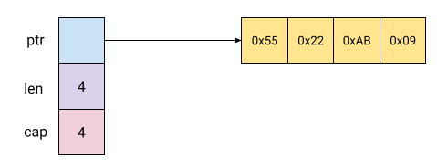
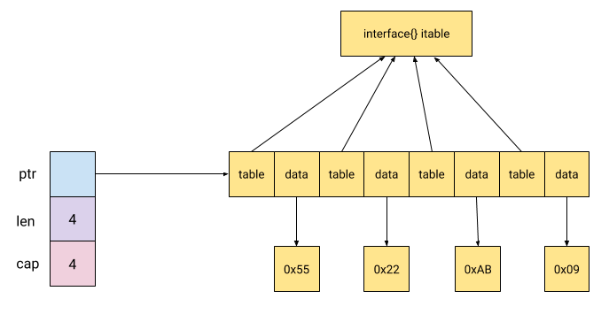
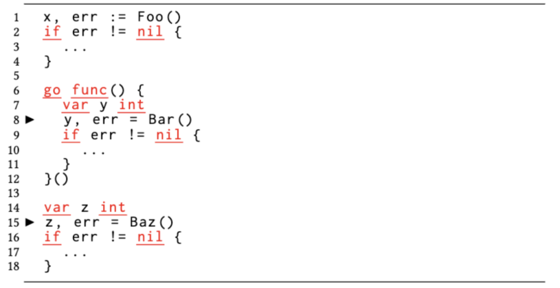
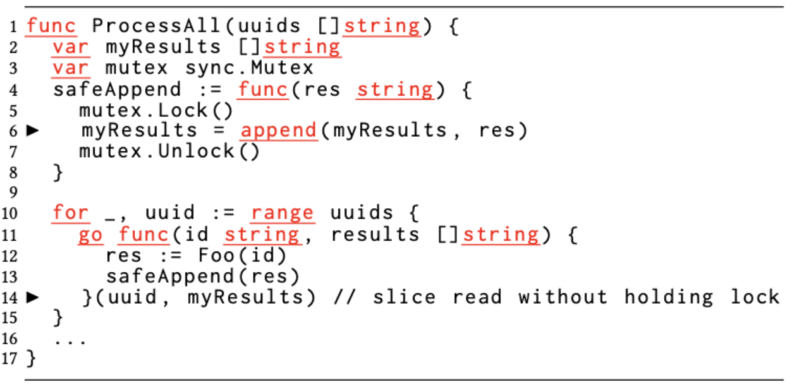
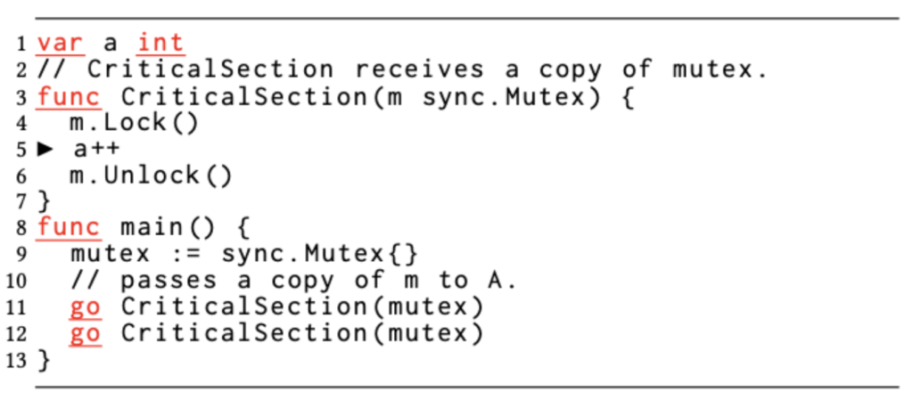
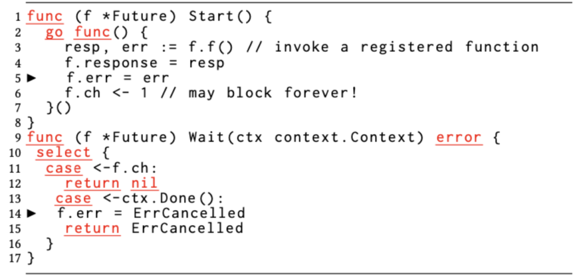
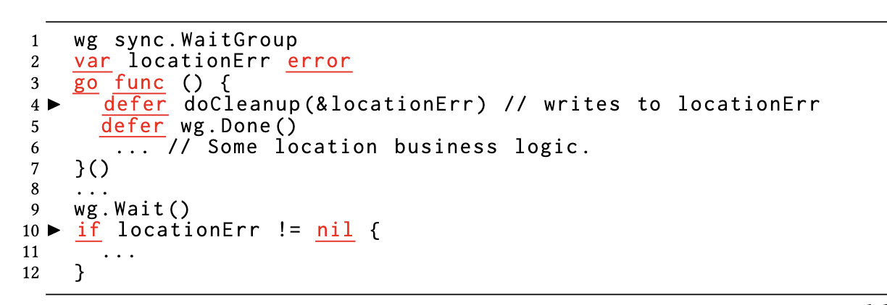

- [sync.Once](https://mp.weixin.qq.com/s/Eu6T5-4v82kdh-Url4O5_w)
  - `sync.Once`底层通过`defer`标记初始化完成，所以无论初始化是否成功都会标记初始化完成，即**不可重入**。
  - G1和G2同时执行时，G1执行失败后，G2不会执行初始化逻辑，因此需要double check。
  ```go
      if atomic.LoadUint32(&o.done) == 0 {
          // Outlined slow-path to allow inlining of the fast-path.
          o.doSlow(f)
      }
  }
  
  func (o *Once) doSlow(f func()) {
      o.m.Lock()
      defer o.m.Unlock()
      if o.done == 0 {
          defer atomic.StoreUint32(&o.done, 1)
          f()
      }
  }
  ```
  
  可重入且并发安全的sync.Once
  ```go
  type IOnce struct {
   done uint32
   m    sync.Mutex
  }
  // Do方法传递的函数增加一个error返回值
  func (o *IOnce) Do(f func() error) {
   if atomic.LoadUint32(&o.done) == 0 {
    o.doSlow(f)
   }
  }
  
  // 不使用defer控制don标识，而通过也无妨的返回值来控制
  func (o *IOnce) doSlow(f func() error) {
   o.m.Lock()
   defer o.m.Unlock()
   if o.done == 0 {
    if f() != nil {
     return
    }
    // 执行成功后才将done置为1
    atomic.StoreUint32(&o.done, 1)
   }
  }
  
  ```

- [零值](https://mp.weixin.qq.com/s/o7SwVDpscSDbi6ePxpjjLQ)
  - 零值channels
    
    给定一个nil channel c:
      - <-c 从c 接收将永远阻塞
      - c <- v 发送值到c 会永远阻塞
      - close(c) 关闭c 引发panic

- [InterfaceSlice](https://github.com/golang/go/wiki/InterfaceSlice)
  Given that you can assign a variable of any type to an interface{}, often people will try code like the following.
  ```go
  var dataSlice []int = foo()
  var interfaceSlice []interface{} = dataSlice
  ```
  
  [This gets the error](https://mp.weixin.qq.com/s/rAIhapDHrA7jQVr_uvQpEg)
  
  `cannot use dataSlice (type []int) as type []interface { } in assignment`

  A variable with type []interface{} has a specific memory layout, known at compile time.

  Each interface{} takes up two words (one word for the type of what is contained, the other word for either the contained data or a pointer to it). As a consequence, a slice with length N and with type []interface{} is backed by a chunk of data that is N*2 words long.

  This is different than the chunk of data backing a slice with type []MyType and the same length. Its chunk of data will be N*sizeof(MyType) words long.

  - fix it
    ```go
    var dataSlice []int = foo()
    var interfaceSlice []interface{} = make([]interface{}, len(dataSlice))
    for i, d := range dataSlice {
        interfaceSlice[i] = d
    }
    ```
- [golang redis pipeline管道引发乱序串读](http://xiaorui.cc/archives/7179)
  - 在使用 golang redigo pipeline 模式下，错误使用会引发乱序串读的问题。简单说，发了一组 pipeline命 令，但由于只发送而没有去解析接收结果，那么后面通过连接池重用该连接时，会拿到了上次的请求结果，乱序串读了。
  - 看源码可得知，Flush() 只是把buffer缓冲区的数据写到连接里，而没有从连接读取的过程。所以说，在redigo的pipeline里，有几次的写，就应该有几次的 Receive() 。Receive是从连接读缓冲区里读取解析数据。 receive() 是不可或缺的！ 不能多，也不能少，每个 send() 都对应一个 receive()。
  - 使用了 pipeline 批量确实有效的减少了时延，也减少了 redis 压力。不要再去使用 golang redigo 这个库了，请直接选择 go-redis 库。

- [defer 坑过](https://mp.weixin.qq.com/s/1T6Z74Wri27Ap8skeJiyWQ)
  - case 1
     ```go
     package main
     
     import (
         "fmt"
     )
     
     func a() (r int) {
         defer func() {
             r++
         }()
         return 0
     }
     
     func b() (r int) {
         t := 5
         defer func() {
             t = t + 5
         }()
         return t
     }
     
     func c() (r int) {
         defer func(r int) {
             r = r + 5
         }(r)
         return 1
     }
     
     func main() {
         fmt.Println("a = ", a())
         fmt.Println("b = ", b())
         fmt.Println("c = ", c())
     }
     ```
  - case 2

  defer 表达式的函数如果在 panic 后面，则这个函数无法被执行。
   ```go
   func main() {
       panic("a")
       defer func() {
           fmt.Println("b")
       }()
   }
   ```
- [defer Close() 的风险](https://mp.weixin.qq.com/s?__biz=MzkyMzIyNjIxMQ==&mid=2247484680&idx=1&sn=5df7d6a7b410fcdec01982470ca2158d&chksm=c1e91c04f69e9512628968de16dd081582fea5aae45b17f0facdc33322c9d447d9c09529f36c&scene=21#wechat_redirect)
  - 问题：
    - `defer x.Close()` 会忽略它的返回值，但在执行 x.Close() 时，我们并不能保证 x 一定能正常关闭，万一它返回错误应该怎么办？这种写法，会让程序有可能出现非常难以排查的错误。
  - Close() 方法会返回什么错误呢
    - 在 POSIX 操作系统中，例如 Linux 或者 maxOS，关闭文件的 Close() 函数最终是调用了系统方法 close()，我们可以通过 man close 手册，查看 close() 可能会返回什么错误
      - [EBADF]            fildes is not a valid, active file descriptor.
      - [EINTR]            Its execution was interrupted by a signal.
      - [EIO]              A previously-uncommitted write(2) encountered an input/output error.
    - EIO 的错误是指未提交写。 EIO 错误的确是我们需要提防的错误。这意味着如果我们尝试将数据保存到磁盘，在 defer x.Close() 执行时，操作系统还并未将数据刷到磁盘，这时我们应该获取到该错误提示
  - 改造方案
    - 不使用 defer
      ```go
       1func solution01() error {
       2    f, err := os.Create("/home/golangshare/gopher.txt")
       3    if err != nil {
       4        return err
       5    }
       6
       7    if _, err = io.WriteString(f, "hello gopher"); err != nil {
       8        f.Close()
       9        return err
      10    }
      11
      12    return f.Close()
      13}
      ```
      需要在每个发生错误的地方都要加上关闭语句 f.Close()，如果对 f 的写操作 case 较多，容易存在遗漏关闭文件的风险。
    - 通过命名返回值 err 和闭包来处理
       ```go
       1func solution02() (err error) {
       2    f, err := os.Create("/home/golangshare/gopher.txt")
       3    if err != nil {
       4        return
       5    }
       6
       7    defer func() {
       8        closeErr := f.Close()
       9        if err == nil {
       10            err = closeErr
       11        }
       12    }()
       13
       14    _, err = io.WriteString(f, "hello gopher")
       15    return
       16}
       ```
      如果有更多 if err !=nil 的条件分支，这种模式可以有效降低代码行数。
    - 在函数最后 return 语句之前，显示调用一次 f.Close()
      ```go
      1func solution03() error {
       2    f, err := os.Create("/home/golangshare/gopher.txt")
       3    if err != nil {
       4        return err
       5    }
       6    defer f.Close()
       7
       8    if _, err := io.WriteString(f, "hello gopher"); err != nil {
       9        return err
      10    }
      11
      12    if err := f.Close(); err != nil {
      13        return err
      14    }
      15    return nil
      16}
      ```
      这种解决方案能在 io.WriteString 发生错误时，由于 defer f.Close() 的存在能得到 close 调用。也能在 io.WriteString 未发生错误，但缓存未刷新到磁盘时，得到 err := f.Close() 的错误，而且由于 defer f.Close() 并不会返回错误，所以并不担心两次 Close() 调用会将错误覆盖。
    - 函数 return 时执行 f.Sync()
      ```go
      func solution04() error {
       2    f, err := os.Create("/home/golangshare/gopher.txt")
       3    if err != nil {
       4        return err
       5    }
       6    defer f.Close()
       7
       8    if _, err = io.WriteString(f, "hello world"); err != nil {
       9        return err
      10    }
      11
      12    return f.Sync()
      13}
      ```
      由于 fsync 的调用，这种模式能很好地避免 close 出现的 EIO。可以预见的是，由于强制性刷盘，这种方案虽然能很好地保证数据安全性，但是在执行效率上却会大打折扣。
- [字符串底层原理](https://mp.weixin.qq.com/s/1ozBAEYpf07aei0xh3_kNQ)
  - 字符串
    ```go
    type stringStruct struct {
        str unsafe.Pointer // 一个指向底层数据的指针. 使用 utf-8 编码方式
        len int            // 字符串的字节长度，非字符个数
    }
    ```
  - [rune](https://kvs-vishnu23.medium.com/what-exactly-is-a-rune-datatype-in-go-f652093a88eb)
    - 在 unicode 字符集中，每一个字符都有一个对应的编号，我们称这个编号为 code point，而 Go 中的rune 类型就代表一个字符的 code point。
    
    - rune is an alias for int32 value which represents a single Unicode point. From the above program to print the rune equivalent of 128513, we used Printf() function with %c control string
     ```go
         oo := '中'
         fmt.Println("As an int value ", oo) // 20013, this is rune
         fmt.Printf("As a string: %s, %s and as a char: %c \n", oo, string(oo), oo)
     ```
- [一个打点引发的事故](https://mp.weixin.qq.com/s?__biz=MjM5MDUwNTQwMQ==&mid=2257486531&idx=1&sn=a996f5932ca9018f78ce0049f3a7baa8&chksm=a539e215924e6b03ab2c6d2ab370ca184afa85d0f6fac0af644dc3bef4fbdd319d1f0a7a932e&cur_album_id=1690026440752168967&scene=189#wechat_redirect)
  - 查到了 OOM 的实例 goroutine 数暴涨，接口 QPS 有尖峰，比正常翻了几倍。所以，得到的结论就是接口流量太多，超过服务极限，导致 OOM
  - 由于 metrics 底层是用 udp 发送的，有文件锁，大量打点的情况下，会引起激烈的锁冲突，造成 goroutine 堆积、请求堆积，和请求关联的 model 无法释放，于是就 OOM 了
  - 由于这个地方的打点非常多，几十万 QPS，一冲突，goroutine 都 gopark 去等锁了，持有的内存无法释放，服务一会儿就 gg 了
- [mutex 出问题怎么办？强大的 goroutine 诊断工具](https://mp.weixin.qq.com/s/JadUu7odckhNfcXDULoXVA)
    ```go
    type Hub struct {
        // Maps client IDs to clients.
        clients map[string]*Client
        // Maps streams to clients
        // (stream -> client id -> struct{}).
        streams map[string]map[string]struct{}
        // A goroutine pool is used to do the actual broadcasting work.
        pool *GoPool
    
        mu sync.RWMutex
    }
    
    func NewHub() *Hub {
        return &Hub{
          clients: make(map[string]*Client),
          streams: make(map[string]map[string]struct{}),
          // Initialize a pool with 1024 workers.
          pool: NewGoPool(1024),
        }
    }
    
    func (h *Hub) subscribeSession(c *Client, stream string) {
        h.mu.Lock()
        defer h.mu.Unlock()
    
        if _, ok := h.clients[c.ID]; !ok {
            h.clients[c.ID] = c
        }
    
        if _, ok := h.streams[stream]; !ok {
            h.streams[stream] = make(map[string]map[string]bool)
        }
    
        h.streams[stream][c.ID] = struct{}{}
    }
    
    func (h *Hub) unsubscribeSession(c *Client, stream string) {
        h.mu.Lock()
        defer h.mu.Unlock()
    
        if _, ok := h.clients[c.ID]; !ok {
            return
        }
    
        delete(h.clients, c.ID)
    
        if _, ok := h.streams[stream]; !ok {
            return
        }
    
        delete(h.streams[stream], c.ID)
    }
    
    func (h *Hub) broadcastToStream(stream string, msg string) {
        // First, we check if we have a particular stream,
        // if not, we return.
        // Note that here we use a read lock here.
        h.mu.RLock()
        defer h.mu.RUnlock()
    
        if _, ok := h.streams[stream]; !ok {
            return
        }
    
        // If there is a stream, schedule a task.
        h.pool.Schedule(func() {
            // Here we need to acquire a lock again
            // since we're reading from the map.
            h.mu.RLock()
            defer h.mu.RUnlock()
    
            if _, ok := h.streams[stream]; !ok {
                return
            }
    
            for id := range h.streams[stream] {
                client, ok := h.clients[id]
    
                if !ok {
                    continue
                }
    
                client.Send(msg)
            }
        })
    }
    ```
  - 我们如何才能看到所有 goroutine 在任何给定时刻都在做什么
    - 每个 Go 程序都带有[一个默认 SIGQUIT 信号处理程序](https://pkg.go.dev/os/signal#hdr-Default_behavior_of_signals_in_Go_programs)的开箱即用的解决方案 。收到此信号后，程序将堆栈转储打印到 stderr 并退出
      ```go
      func main() {
          ch := make(chan (bool), 1)
      
          go func() {
              readForever(ch)
          }()
      
          writeForever(ch)
      }
      
      func readForever(ch chan (bool)) {
          for {
              <-ch
          }
      }
      
      func writeForever(ch chan (bool)) {
          for {
              ch <- true
          }
      }
      ```
      - 运行这个程序并通过 `CTRL+\` 发送一个 SIGQUIT 来终止它.
      - 我们可以使用以下 kill命令发送信号：
       `kill -SIGQUIT <process id>`
      - 对于 Docker，我们需要向正在运行的容器发送 SIGQUIT。没问题：
        ```shell
        docker kill --signal=SIGQUIT <container_id>
        # Then, grab the stack dump from the container logs.
        docker logs <container_id>
        ```
  - [goroutine-inspect](https://github.com/linuxerwang/goroutine-inspect)
    - goroutine-inspect 的工具。它是一个 pprof 风格的交互式 CLI，它允许你操作堆栈转储、过滤掉不相关的跟踪或搜索特定功能
      ```
      # First, we load a dump and store a reference to it in the 'a' variable.
      > a = load("tmp/go-crash-1.dump")
      
      # The show() function prints a summary.
      > a.show()
      \# of goroutines: 4663
      
      # goroutine-inspect 最有用的功能之一 是 dedup()函数，它通过堆栈跟踪对 goroutine 进行分组
      > a.dedup()
      # of goroutines: 27
      
      #哇！我们最终只有 27 个独特的堆栈！现在我们可以扫描它们并删除不相关的：
      > a.delete(...) # delete many routines by their ids
      # of goroutines: 8
      
      #在删除了所有 安全的goroutine（HTTP 服务器、gRPC 客户端等）之后，我们得到了最后 8 个。我发现了多个包含broadcastToStream和 subscribeSesssion功能的痕迹
      > a.search("contains(trace, 'subscribeSesssion')")
      
      goroutine 461 [semacquire, 14 minutes]: 820 times: [461,...]
      ```
    - 尽管在  broadcastSession 中使用 RLock，我们还引入了另一个潜在的阻塞调用—— pool.Schedule。这个调用发生在锁内！我们 defer 的好习惯在 Unlock 这里失败了
      ```go
      func (h *Hub) broadcastToStream(stream string, msg string) {
          // First, we check if we have a particular stream,
          // if not, we return.
          // Note that here we use a read lock here.
          h.mu.RLock()
          defer h.mu.RUnlock()  --> unlock here
      
          if _, ok := h.streams[stream]; !ok {
              return
          }
      
          // If there is a stream, schedule a task.
          h.pool.Schedule(func() {
              // Here we need to acquire a lock again
              // since we're reading from the map.
              h.mu.RLock()          --> lock again...
              defer h.mu.RUnlock()
      
              if _, ok := h.streams[stream]; !ok {
                  return
              }
      ```

- [Go 程序自己监控自己](https://mp.weixin.qq.com/s?__biz=MzUzNTY5MzU2MA==&mid=2247490745&idx=1&sn=6a04327f98a734fd50e509362fc04d48&scene=21#wechat_redirect)
  - 怎么用Go获取进程的各项指标
    - 获取Go进程的资源使用情况使用[gopstuil库](github.com/shirou/gopsutil)
      ```go
      p, _ := process.NewProcess(int32(os.Getpid()))
      // cpu
      cpuPercent, err := p.Percent(time.Second)
      cp := cpuPercent / float64(runtime.NumCPU())
      // 获取进程占用内存的比例
      mp, _ := p.MemoryPercent()
      // 创建的线程数
      threadCount := pprof.Lookup("threadcreate").Count()
      // Goroutine数 
      gNum := runtime.NumGoroutine()
      ```
    - 容器环境下获取进程指标
      - Cgroups给用户暴露出来的操作接口是文件系统，它以文件和目录的方式组织在操作系统的/sys/fs/cgroup路径下，在 /sys/fs/cgroup下面有很多诸cpuset、cpu、 memory这样的子目录
    ```go
    cpuPeriod, err := readUint("/sys/fs/cgroup/cpu/cpu.cfs_period_us")
    cpuQuota, err := readUint("/sys/fs/cgroup/cpu/cpu.cfs_quota_us")
    cpuNum := float64(cpuQuota) / float64(cpuPeriod)
    cpuPercent, err := p.Percent(time.Second)
    // cp := cpuPercent / float64(runtime.NumCPU())
    // 调整为
    cp := cpuPercent / cpuNum
    
    // 容器的能使用的最大内存数，自然就是在memory.limit_in_bytes里指定
    memLimit, err := readUint("/sys/fs/cgroup/memory/memory.limit_in_bytes")
    memInfo, err := p.MemoryInfo
    mp := memInfo.RSS * 100 / memLimit
    // 上面进程内存信息里的RSS叫常驻内存，是在RAM里分配给进程，允许进程访问的内存量。而读取容器资源用的readUint，是containerd组织在cgroups实现里给出的方法。
    func readUint(path string) (uint64, error) {
        v, err := ioutil.ReadFile(path)
        if err != nil {
            return 0, err
        }
        return parseUint(strings.TrimSpace(string(v)), 10, 64)
    }
    
    func parseUint(s string, base, bitSize int) (uint64, error) {
        v, err := strconv.ParseUint(s, base, bitSize)
        if err != nil {
            intValue, intErr := strconv.ParseInt(s, base, bitSize)
            // 1. Handle negative values greater than MinInt64 (and)
            // 2. Handle negative values lesser than MinInt64
            if intErr == nil && intValue < 0 {
                return 0, nil
            } else if intErr != nil &&
                intErr.(*strconv.NumError).Err == strconv.ErrRange &&
                intValue < 0 {
                return 0, nil
            }
            return 0, err
        }
        return v, nil
    }
    ```
- [Go 程序进行自动采样](https://mp.weixin.qq.com/s/oBhMwMx20QIlWq0_O7G32A)
  - 工具
    - Go的pprof工具集，提供了Go程序内部多种性能指标的采样能力
  - 怎么获取采样信息
    - 最常见的例子是在服务端开启端口让客户端通过HTTP访问指定的路由进行各种信息的采样
    - 弊端就是
      - 需要客户端主动请求特定路由进行采样，没法在资源出现尖刺的第一时间进行采样。
      - 会注册多个/debug/pprof类的路由，相当于对 Web 服务有部分侵入。
      - 对于非 Web 服务，还需在服务所在的节点上单独开 HTTP 端口，起 Web 服务注册 debug 路由才能进行采集，对原服务侵入性更大。
    - Runtime pprof
      - 使用runtime.pprof 提供的Lookup方法完成各资源维度的信息采样
         ```go
         pprof.Lookup("heap").WriteTo(some_file, 0)
         pprof.Lookup("goroutine").WriteTo(some_file, 0)
         pprof.Lookup("threadcreate").WriteTo(some_file, 0)
         
         // CPU的采样方式runtime/pprof提供了单独的方法在开关时间段内对 CPU 进行采样
         bf, err := os.OpenFile('tmp/profile.out', os.O_RDWR | os.O_CREATE | os.O_APPEND, 0644)
         err = pprof.StartCPUProfile(bf)
         time.Sleep(2 * time.Second)
         pprof.StopCPUProfile()
         ```
      - 这种方式是操作简单，把采样信息可以直接写到文件里，不需要额外开端口，再手动通过HTTP进行采样，但是弊端也很明显--不停的采样会影响性能
    - 适合采样的时间点
      - Go进程在自己占用资源突增或者超过一定的阈值时再用pprof对程序Runtime进行采样，才是最合适的
  - 判断采样时间点的规则
    - CPU 使用，内存占用和 goroutine 数，都可以用数值表示，所以无论是使用率慢慢上升直到超过阈值，还是突增之后迅速回落，都可以用简单的规则来表示，比如：
      - cpu/mem/goroutine数 突然比正常情况下的平均值高出了一定的比例，比如说资源占用率突增25%就是出现了资源尖刺。- 比如进程的内存使用率，我们可以以每 10 秒为一个周期，运行一次采集，在内存中保留最近 5 ~ 10 个周期的内存使用率，并持续与之前记录的内存使用率均值进行比较
      - cpu/mem/goroutine数 超过了程序正常运行情况下的阈值，比如说80%就定义为服务资源紧张。
  - 开源的自动采样库
    - [holmes](github.com/mosn/holmes)
- [无人值守的自动 dump](https://mp.weixin.qq.com/s?__biz=MjM5MDUwNTQwMQ==&mid=2257484360&idx=2&sn=70316f266b7b7c27afab9cdb021a7120&scene=21#wechat_redirect)
  - Go 内置的 pprof 虽然是问题定位的神器，但是没有办法让你恰好在出问题的那个时间点，把相应的现场保存下来进行分析。特别是一些随机出现的内存泄露、CPU 抖动，等你发现有泄露的时候，可能程序已经 OOM 被 kill 掉了。而 CPU 抖动，你可以蹲了一星期都不一定蹲得到
  - CPU 使用，内存占用和 goroutine 数，都可以用数值表示，所以不管是“暴涨”还是抖动，都可以用简单的规则来表示：
     - xx 突然比正常情况下的平均值高出了 25%
     - xx 超过了模块正常情况下的最高水位线
  - 比如 goroutine 的数据，我们可以每 x 秒运行一次采集，在内存中保留最近 N 个周期的 goroutine 计数，并持续与之前记录的 goroutine 数据均值进行 diff
- [生产环境Issue](https://mp.weixin.qq.com/s?__biz=MjM5MDUwNTQwMQ==&mid=2257484360&idx=2&sn=70316f266b7b7c27afab9cdb021a7120&scene=21#wechat_redirect)
  - OOM 类问题
    - RPC decode 未做防御性编程
      - 一些私有协议 decode 工程中会读诸如 list len 之类的字段，如果外部编码实现有问题，发生了字节错位，就可能会读出一个很大的值。
    - tls 开启后线上进程占用内存上涨
      - 老版本的 Go 代码，发现其 TLS 的 write buffer 会随着写出的数据包大小增加而逐渐扩容
      - 在 Go1.12 之后已经进行了优化, 变成了需要多少，分配多少的朴实逻辑
  - goroutine 暴涨类问题
    - 本地 app GC hang 死，导致 goroutine 卡 channel send
      - 在我们的程序中有一段和本地进程通信的逻辑，write goroutine 会向一个 channel 中写数据，按常理来讲，同物理机的两个进程通过网络通信成本比较低
      - 当前憋了 5w 个 goroutine，有 4w 个卡在 channel send 上，这个 channel 的对面还是一条本地连接，令人难以接受
      - 对我们的程序进行保护是必要的，修改起来也很简单，给 channel send 加一个超时就可以了。
    - 应用逻辑死锁，导致连接不可用，大量 goroutine 阻塞在 lock 上
  - CPU 尖刺问题
    - 应用逻辑导致死循环问题
      - 从夏令时切换到冬令时，会将时钟向前拔一个月，但天级日志轮转时，会根据轮转前的时间计算 24 小时后的时间，并按与 24:00 的差值来进行 time.Sleep，这时会发现整个应用的 CPU 飚高。自动采样结果发现一直在循环计算时间和重命名文件。
- [Go 系统可能遇到的锁问题](https://xargin.com/lock-contention-in-go/)
  - 底层依赖 sync.Pool 的场景
    - 有一些开源库，为了优化性能，使用了官方提供的 sync.Pool，比如我们使用的 https://github.com/valyala/fasttemplate
    - 这种设计会带来一个问题，如果使用方每次请求都 New 一个 Template 对象。并进行求值，比如我们最初的用法，在每次拿到了用户的请求之后，都会用参数填入到模板
    - 在模板求值的时候, 会对该 Template 对象的 byteBufferPool 进行 Get，在使用完之后，把 ByteBuffer Reset 再放回到对象池中。但问题在于，我们的 Template 对象本身并没有进行复用，所以这里的 byteBufferPool 本身的作用其实并没有发挥出来
    - 相反的，因为每一个请求都需要新生成一个 sync.Pool，在高并发场景下，执行时会卡在 bb := t.byteBufferPool.Get() 这一句上，通过压测可以比较快地发现问题，达到一定 QPS 压力时，会有大量的 Goroutine 堆积
    - 标准库的 sync.Pool 之所以要维护这么一个 allPools 意图也比较容易推测，主要是为了 GC 的时候对 pool 进行清理，这也就是为什么说使用 sync.Pool 做对象池时，其中的对象活不过一个 GC 周期的原因。sync.Pool 本身也是为了解决大量生成临时对象对 GC 造成的压力问题
    - 问题也就比较明显了，每一个用户请求最终都需要去抢一把全局锁，高并发场景下全局锁是大忌。但是这个全局锁是因为开源库间接带来的全局锁问题，通过看自己的代码并不是那么容易发现
  - metrics 上报和 log 锁
    - 公司之前 metrics 上报 client 都是基于 udp 的，大多数做的简单粗暴，就是一个 client，用户传什么就写什么
    - 本质上，就是在高成本的网络操作上套了一把大的写锁，同样在高并发场景下会导致大量的锁冲突，进而导致大量的 Goroutine 堆积和接口延迟
    - 和 UDP 网络 FD 一样有 writeLock，在系统打日志打得很多的情况下，这个 writeLock 会导致和 metrics 上报一样的问题。

- Misc
  - 同学反馈 getty “在一个大量使用短链接的场景，XX 发现造成内存大量占用，因为大块的buffer被收集起来了，没有被释放”。
    - 通过定位，发现原因是 sync.Pool 把大量的 bytes.Buffer 对象缓存起来后没有释放。集团的同学简单粗暴地去掉了 sync.Pool 后，问题得以解决。复盘这个问题，其根因是 Go 1.13 对 sync.Pool 进行了优化：在 1.13 之前 pool 中每个对象的生命周期是两次 gc 之间的时间间隔，每次 gc 后 pool 中的对象会被释放掉，1.13 之后可以做到 pool 中每个对象在每次 gc 后不会一次将 pool 内对象全部回收。
    - 所以，Go 官方没有 ”修复“ sync.Pool 的这个 bug ，其上层的 dubbogo 还能稳定运行，当他们 ”修复“ 之后，上层的 dubbogo 运行反而出了问题。
  - Go 语言 另外一个比较著名的例子便是 `godebug=madvdontneed=1`。Go 1.12 对其内存分配算法做了改进：Go runtime 在释放内存时，使用了一个自认为更加高效的 MADV_FREE 而不是之前的 MADV_DONTNEED，其导致的后果是 Go 程序释放内存后，RSS 不会立刻下降。这影响了很多程序监控指标的准确性，在大家怨声载道的抱怨后，Go 1.16 又改回了默认的内存分配算法。

- [线上偶现的panic问题](https://mp.weixin.qq.com/s/VOwlkkm_KC9FG_c2jQhcew)
  - panic 
    ```shell
    runtime error: invalid memory address or nil pointer dereference
    
    panic(0xbd1c80, 0x1271710)
            /root/.go/src/runtime/panic.go:969 +0x175
    github.com/json-iterator/go.(*Stream).WriteStringWithHTMLEscaped(0xc00b0c6000, 0x0, 0x24)
            /go/pkg/mod/github.com/json-iterator/go@v1.1.11/stream_str.go:227 +0x7b
    github.com/json-iterator/go.(*htmlEscapedStringEncoder).Encode(0x12b9250, 0xc0096c4c00, 0xc00b0c6000)
    ```
  - source codes
    ```go
    func doReq() {
        req := paramsPool.Get().(*model.Params)
        // defer 1
        defer func() {
         reqBytes, _ := json.Marshal(req)
         // 省略其他打印日志的代码
        }()
        // defer 2
        defer paramsPool.Put(req)
        // req初始化以及发起请求和其他操作
    }
    ```
    上面代码中paramsPool是sync.Pool类型的变量，而sync.Pool想必大家都很熟悉。sync.Pool是为了复用已经使用过的对象(协程安全)，减少内存分配和降低GC压力。
    ```go
    type test struct {
     a string
    }
    
    var sp = sync.Pool{
     New: func() interface{} {
      return new(test)
     },
    }
    
    func main() {
     t := sp.Get().(*test)
     fmt.Println(unsafe.Pointer(t))
     sp.Put(t)
     t1 := sp.Get().(*test)
     t2 := sp.Get().(*test)
     fmt.Println(unsafe.Pointer(t1), unsafe.Pointer(t2))
    }
    
    ```
    根据上述代码和输出结果知，t1变量和t变量地址一致，因此他们是复用对象。此时再回顾上面的doReq函数就很容易发现问题的根因
    - defer 2和defer 1顺序反了！！！
    - sync.Pool提供的Get和Put方法是协程安全的，但是高并发调用doReq函数时json.Marshal(req)和请求初始化会存在并发问题，极有可能引起panic的并发调用时间线如下图所示。
    
- [大内存 Go 服务性能优化](https://mp.weixin.qq.com/s?__biz=Mzg5MTYyNzM3OQ==&mid=2247484159&idx=1&sn=94a524d651aabdb9a42b2a5e1d5011ef&scene=21#wechat_redirect)
  - 明明 call RPC 时设置了超时时间 timeout, 但是 Grafna 看到 P99 latency 很高
    - 要么是 timeout 设置不合理，比如只设置了单次 socket timeout, 并没有设置 circuit breaker 外层超时
    - GC 在捣乱，我们知道 Go GC 使用三色标记法，在 GC 压力大时用户态 goroutine 是要 assit 协助标记对象的，同时 GC STW 时间如果非常高，那么业务看起来 latency 就会得比 timeout 大很多
  - 该服务使用 go1.7, 需要加载海量的机器学习词表，标准的 Go 大内存服务，优化前表现为 latency 非常高
    - Pprof
      ```shell
      go tool pprof bin/dupsdc http://127.0.0.1:6060/debug/pprof/profile
      ```
      可以看到 runtime.greyobject, runtime.mallocgc, runtime.heapBitsForObject, runtime.scanobject, runtime.memmove 就些与 GC 相关的占据了 CPU 消耗的 TOP 6
      ```shell
      go tool pprof -inuse_objects http://127.0.0.1:6060/debug/pprof/heap
      ```
      再查看下常驻对像个数，发现 1kw 常驻内存对像
    - 优化对像
      - 词表主要使用两种类型，`map[int64][]float32` 和 `map[string]int`
      - 三色标记，本质是递归扫描所有的指针类型，遍历确定有没有被引用
      - 所有显示 *T 以及内部有 pointer 的对像都是指针类型，比如 map[int64][]float32 因为值是 slice, 内部包含了指针，如果 map 有 1kw 个元素，那么 GC 也要递归所描所有 key/value
      - 优化方法就来了
        - 把 map[int64][]float32 变成 map[int64][6]float32, 这里 slice 变成 6 个元素的数组，业务可以接受
        - 同时把 map[string]int 里的 key 由 string 类型换成 int 枚举值
    - 例外
      - 比如 map 内部的实现，如果 key/value 值类型大小超过 128 字节，就会退化成指针
      - Go 每个版本性能都会提升很多，go1.7 1kw 对像服务压力非常大，但是我司现在 go1.15 2kw 对像未优化也毫无压力
- [不执行resp.Body.Close()的情况下, 泄漏了多少个goroutine?](https://mp.weixin.qq.com/s?__biz=Mzg5NDY2MDk4Mw==&mid=2247486370&idx=1&sn=8b8bbd7ef43849ad71b72f7fddbb12b7&source=41#wechat_redirect)
  - Question
    ```go
    func main() {
     num := 6
     for index := 0; index < num; index++ {
      resp, _ := http.Get("https://www.baidu.com")
      _, _ = ioutil.ReadAll(resp.Body)
     }
     fmt.Printf("此时goroutine个数= %d\n", runtime.NumGoroutine())
    }
    ```
    在不执行resp.Body.Close()的情况下，泄漏了吗？如果泄漏，泄漏了多少个goroutine?
  - Anwser
    - 不进行resp.Body.Close()，泄漏是一定的。但是泄漏的goroutine个数就让我迷糊了。由于执行了6遍，每次泄漏一个读和写goroutine，就是12个goroutine，加上main函数本身也是一个goroutine，所以答案是13.
      然而执行程序，发现答案是3
  - Explanation
    - http.Get 默认使用 DefaultTransport 管理连接
    - DefaultTransport 的作用是根据需要建立网络连接并缓存它们以供后续调用重用
    - 一次建立连接，就会启动一个读goroutine和写goroutine。这就是为什么一次http.Get()会泄漏两个goroutine的来源
       ````go
       func (t *Transport) RoundTrip(req *http.Request)
       func (t *Transport) roundTrip(req *Request)
       func (t *Transport) getConn(treq *transportRequest, cm connectMethod)
       func (t *Transport) dialConn(ctx context.Context, cm connectMethod) (*persistConn, error) {
           ...
        go pconn.readLoop()  // 启动一个读goroutine
        go pconn.writeLoop() // 启动一个写goroutine
        return pconn, nil
       }
       ````
    - 读goroutine 的 readLoop() 代码里. 简单来说readLoop就是一个死循环，只要alive为true，goroutine就会一直存在
      select 里面是 goroutine 有可能退出的场景：
      - body 被读取完毕或body关闭
      - bodyEOF 来源于到一个通道 waitForBodyRead，这个字段的 true 和 false 直接决定了 alive 变量的值（alive=true那读goroutine继续活着，循环，否则退出goroutine
        - 那么这个通道的值是从哪里过来的呢？
          - 如果执行 earlyCloseFn ，waitForBodyRead 通道输入的是 false，alive 也会是 false，那 readLoop() 这个 goroutine 就会退出。
          - 如果执行 fn ，其中包括正常情况下 body 读完数据抛出 io.EOF 时的 case，waitForBodyRead 通道输入的是 true，那 alive 会是 true，那么 readLoop() 这个 goroutine 就不会退出，同时还顺便执行了 tryPutIdleConn(trace) 
          - tryPutIdleConn 将 pconn 添加到等待新请求的空闲持久连接列表中，也就是之前说的连接会复用。
        - 那么问题又来了，什么时候会执行这个 fn 和 earlyCloseFn 呢？
          - 上面这个其实就是我们比较熟悉的 resp.Body.Close() ,在里面会执行 earlyCloseFn，也就是此时 readLoop() 里的 waitForBodyRead 通道输入的是 false，alive 也会是 false，那 readLoop() 这个 goroutine 就会退出，goroutine 不会泄露
             ```go
             func (es *bodyEOFSignal) Read(p []byte) (n int, err error) 
             func (es *bodyEOFSignal) condfn(err error) error
             ```
          - 这个其实就是我们比较熟悉的读取 body 里的内容。ioutil.ReadAll() ,在读完 body 的内容时会执行 fn，也就是此时 readLoop() 里的 waitForBodyRead 通道输入的是 true，alive 也会是 true，那 readLoop() 这个 goroutine 就不会退出，goroutine 会泄露，然后执行 tryPutIdleConn(trace) 把连接放回池子里复用
      - request 主动 cancel
      - request 的 context Done 状态 true
      - 当前的 persistConn 关闭
  - 总结
    - 从另外一个角度说，正常情况下我们的代码都会执行 ioutil.ReadAll()，但如果此时忘了 resp.Body.Close()，确实会导致泄漏。但如果你调用的域名一直是同一个的话，那么只会泄漏一个 读goroutine 和一个写goroutine，这就是为什么代码明明不规范但却看不到明显内存泄漏的原因。
    - 那么问题又来了，为什么上面要特意强调是同一个域名呢
- [Can I convert a []T to an []interface{}](https://eli.thegreenplace.net/2021/go-internals-invariance-and-memory-layout-of-slices/)
  - Not directly. It is disallowed by the language specification because the two types do not have the same representation in memory. It is necessary to copy the elements individually to the destination slice.
  - slice `is := []int64{0x55, 0x22, 0xab, 0x9}`
    
  - `[]interface{}` an interface{} itself looks in memory. occupies two quadwords (on a 64-bit machine), because it holds two pointers: the first points to the dispatch table for the methods of the value (itable), and the second points to the runtime value itself
    
- [Deadlocks: the dark side of concurrency](https://www.craig-wood.com/nick/articles/deadlocks-in-go/)
  - [Source](https://www.youtube.com/watch?v=9j0oQkqzhAE)
- [select 死锁](https://mp.weixin.qq.com/s/Ov1FvLsLfSaY8GNzfjfMbg)
  - Sample. [Source](https://stackoverflow.com/questions/51167940/chained-channel-operations-in-a-single-select-case。)
    ```go
    func main() {
     var wg sync.WaitGroup
     foo := make(chan int)
     bar := make(chan int)
     wg.Add(1)
     go func() {
      defer wg.Done()
      select {
      case foo <- <-bar:
      default:
       println("default")
      }
     }()
     wg.Wait()
    }
    ```
  - For all the cases in the statement, the channel operands of receive operations and the channel and right-hand-side expressions of send statements are evaluated exactly once, in source order, upon entering the “select” statement. The result is a set of channels to receive from or send to, and the corresponding values to send. Any side effects in that evaluation will occur irrespective of which (if any) communication operation is selected to proceed. Expressions on the left-hand side of a RecvStmt with a short variable declaration or assignment are not yet evaluated.
  - 对于 select 语句，在进入该语句时，会按源码的顺序对每一个 case 子句进行求值：这个求值只针对发送或接收操作的额外表达式。
    ```go
    select {
    case ch <- <-input1:
    case ch <- <-input2:
    }
    ```
  - <-input1 和 <-input2 都会执行，相应的值是：A x 和 B x（其中 x 是 0-5）。但每次 select 只会选择其中一个 case 执行，所以 <-input1 和 <-input2 的结果，必然有一个被丢弃了，也就是不会被写入 ch 中。因此，一共只会输出 5 次，另外 5 次结果丢掉了。（你会发现，输出的 5 次结果中，x 比如是 0 1 2 3 4）
  - 而 main 中循环 10 次，只获得 5 次结果，所以输出 5 次后，报死锁。
- [不可被取地址的情况](https://gfw.go101.org/article/unofficial-faq.html#unaddressable-values)
  - 字符串中的字节元素
    ```go
        s := "hello"
        println(&s[1]) // invalid operation: cannot take address of s[1] (value of type byte)
    ```
  - map键值对中的值元素
    ```go
        m := make(map[string]int)
        m["hello"] = 5
        println(&m["hello"]) // invalid operation: cannot take address of m["hello"] (map index expression of type int)
        for k, v := range m {
           println(&k) // ok, 键元素是可以取地址的
           _ = v
        }
    ```
  - 接口值的动态值（类型断言的结果）
    ```go
    var a int = 5
    var i interface{} = a
    println(&(i.(int))) // invalid operation: cannot take address of i.(int) (comma, ok expression of type int)
    ```
  - 常量（包括具名常量和字面量）
    ```go
    const s = "hello" // 具名常量
    
    println(&s) // invalid operation: cannot take address of s (untyped string constant "hello")
    println(&("golang")) // invalid ope
    ```
- [有必要内存对齐](https://ms2008.github.io/2019/08/01/golang-memory-alignment/)
  - 为什么要做对齐，主要考虑下面两个原因：
    - 平台（移植性: 不是所有的硬件平台都能够访问任意地址上的任意数据。例如：特定的硬件平台只允许在特定地址获取特定类型的数据，否则会导致异常情况
    - 性能: 若访问未对齐的内存，将会导致 CPU 进行两次内存访问，并且要花费额外的时钟周期来处理对齐及运算。而本身就对齐的内存仅需要一次访问就可以完成读取动作，这显然高效很多，是标准的空间换时间做法
  - 在 x86_64 平台上，int64 的对齐系数为 8，而在 x86 平台上其对齐系数就是 4。
  - 在 x86 平台上原子操作 64bit 指针。之所以要强制对齐，是因为在 32bit 平台下进行 64bit 原子操作要求必须 8 字节对齐，[否则程序会 panic](https://pkg.go.dev/sync/atomic#pkg-note-bug)。
    ```go
    type T3 struct {
        b int64
        c int32
        d int64
    }
    
    func main() {
        a := T3{}
        atomic.AddInt64(&a.d, 1)
    }
    
    $ GOARCH=386 go build aligned.go  panic
    ```
    - solve
    ```go
    我们必须手动 padding T3，让其 “看起来” 像是 8 字节对齐的：
    
    type T3 struct {
        b int64
        c int32
        _ int32
        d int64
    }
    ```
  - 用 golangci-lint 做静态检测 `golangci-lint run --disable-all -E maligned`
- [Memory Leaking Scenarios](https://go101.org/article/memory-leaking.html)
  - Kind-of Memory Leaking Caused by Substrings
  - Kind-of Memory Leaking Caused by Subslices
  - Kind-of Memory Leaking Caused by Not Resetting Pointers in Lost Slice Elements
  - Real Memory Leaking Caused by Hanging Goroutines
  - Real Memory Leaking Caused by Not Stopping time.Ticker Values Which Are Not Used Any More
  - Real Memory Leaking Caused by Using Finalizers Improperly
  - Kind-of Resource Leaking by Deferring Function Calls
  - [Avoiding Memory Leak From Unclosed Response’s Body](https://hackernoon.com/avoiding-memory-leak-in-golang-api-1843ef45fca8)
    ```go
    req, err:= http.NewRequest("GET","http://example.com?q=one",nil)
    if err != nil {
      return err
    }
    resp, err:= client.Do(req)
    //=================================================
    // CLOSE THE RESPONSE BODY
    //=================================================
    if resp != nil {
        defer resp.Body.Close() // MUST CLOSED THIS 
    }
    if err != nil {
      return err
    }
    //=================================================
    // READ THE BODY EVEN THE DATA IS NOT IMPORTANT
    // THIS MUST TO DO, TO AVOID MEMORY LEAK WHEN REUSING HTTP 
    // CONNECTION
    //=================================================
    _, err = io.Copy(ioutil.Discard, resp.Body) // WE READ THE BODY
    if err != nil { 
       return err
    }
    ```
- [channel 三大坑](https://mp.weixin.qq.com/s/--vpHBw-yRPL7x4n35kUQQ)
  - for-range 操作channel在收到 close 的信号后会退出、goroutine 不再阻塞，能够被回收。
  - 如何优雅地 close channel
    - 除非必须关闭 chan，否则不要主动关闭。关闭 chan 最优雅的方式，就是不要关闭 chan~
    - 当一个 chan 没有 sender 和 receiver 时，即不再被使用时，GC 会在一段时间后标记、清理掉这个 chan。
  - chan 关闭的原则
    - Don't close a channel from the receiver side 不要在消费者端关闭 chan
    - Don't close a channel if the channel has multiple concurrent senders  有多个并发写的生产者时也别关
- [Data Race Patterns in Go](https://eng.uber.com/data-race-patterns-in-go/)
  - Go’s design choice to transparently capture free variables by reference in goroutines is a recipe for data races
    - Data race due to loop index variable capture
    - Data race due to idiomatic `err` variable capture. 
    - 
    - Data race due to named return variable capture.
    - 
  - Slices are confusing types that create subtle and hard-to-diagnose data races
    - 
  - Concurrent accesses to Go’s built-in, thread-unsafe maps cause frequent data races 
  - Go developers often err on the side of pass-by-value (or methods over values), which can cause non-trivial data races
    - 
    - A converse of this situation happens when developers accidentally implement a method where the receiver is a pointer to the structure instead of a value/copy of the structure. In these situations, multiple goroutines invoking the method end up accidentally sharing the same internal state of the structure, whereas the developer intended otherwise. Here, also, the caller is unaware that the value type was transparently converted to a pointer type at the receiver.
  - Mixed use of message passing (channels) and shared memory makes code complex and susceptible to data races
    - 
  - Go offers more leeway in its group synchronization construct sync.WaitGroup, but the incorrect placement of Add/Done methods leads to data races
  - Data race due to defer statement ordering leading to incorrect WaitGroup.Done() placement.
    - 
- [一次线上内存使用率异常问题排查](https://fanlv.wiki/2022/06/02/golang-pprof-mem/)
  - 背景
    - 某个集群内存的RSS使用率一直在80%左右，他用的是8核16G. 但是在pprof里面查的堆内存才使用了6.3G左右，程序里面主要用了6G的LocalCache所以heap用了6.3G是符合预期的。
  - 基础知识
    - TCMalloc 算法
      - TCMalloc是用来替代传统的malloc内存分配函数。它有减少内存碎片，适用于多核，更好的并行性支持等特性
    - mmap 函数
      - mmap它的主要功能是将一个虚拟内存区域与一个磁盘上的文件关联起来. 就是可以将一个文件，映射到一段虚拟内存，写内存的时候操作系统会自动同步内存的内容到文件。内存同步到磁盘，还涉及到一个PageCache的概念
      - 文件可以是磁盘上的一个实体文件，比如kafka写日志文件的时候，就用了mmap
      - 文件也可以是一个匿名文件，这种场景mmap不会去写磁盘，主要用于内存申请的场景。比如调用malloc函数申请内存，当申请的大小超过MMAP_THRESHOLD（默认是128K）大小，内核就会用mmap去申请内存。
      - 介绍mmap，就会说到zero copy，就是相对于标准IO来说少了一次内存Copy的开销。
      - 
      - mmap申请的内存不在虚拟地址空间的堆区，在内存映射段（Memory Mapping Region）
      - 
    - Golang 内存分配
      - 用的 TCMalloc（Thread-Caching Malloc）算法, 简单点说就是Golang是使用 mmap 函数去操作系统申请一大块内存，然后把内存按照 0~32KB``68个 size 类型的mspan，每个mspan按照它自身的属性 Size Class 的大小分割成若干个object
      - mspan：Go中内存管理的基本单元，是由一片连续的8KB的页组成的大块内存，每个mspan按照它自身的属性Size Class的大小分割成若干个object，mspan的Size Class共有68种（算上0） , numSpanClasses = _NumSizeClasses << 1 (因为需要区分需要GC和不需要GC的)
      - mcache：每个工作线程都会绑定一个mcache，本地缓存可用的mspan资源。
      - mcentral：为所有 mcache提供切分好的 mspan资源。需要加锁
      - mheap：代表Go程序持有的所有堆空间，Go程序使用一个mheap的全局对象_mheap来管理堆内存。
    - TCMalloc 的内存浪费
      - Golang的 sizeclasses.go 源码里面已经给我们已经计算了出每个size的tail waste和max waste比例
    - Go 查看内存使用情况几种方式
      - 执行前添加系统环境变量GODEBUG='gctrace=1'来跟踪打印垃圾回收器信息
      - 代码中使用runtime.ReadMemStats来获取程序当前内存的使用情况
      - 通过pprof获取
    - Sysmon 监控线程
      - Go Runtime在启动程序的时候，会创建一个独立的M作为监控线程，称为sysmon，它是一个系统级的daemon线程。这个sysmon独立于GPM之外，也就是说不需要P就可以运行
      - sysmon主要如下几件事
        - 释放闲置超过5分钟的span物理内存，scavenging。（Go 1.12之前）
        - 如果超过两分钟没有执行垃圾回收，则强制执行GC。
        - 将长时间未处理的netpoll结果添加到任务队列
        - 向长时间运行的g进行抢占
        - 收回因为syscall而长时间阻塞的p
  - 问题排查过程
    - 内存泄露？
      - 服务内存一周内一直都是在80%~85%左右波动，然后pprof看的heap的使用也是符合预期的。看了下程序的Runtime监控，容器的内存监控，都是正常的。基本可以排除内存泄露的可能性。
    - madvise
      - GO 1.12 ~ Go 1.15 版本，被提到很多次的问题。
      - madvise() 函数建议内核,在从addr指定的地址开始,长度等于len参数值的范围内,该区域的用户虚拟内存应遵循特定的使用模式。内核使用这些信息优化与指定范围关联的资源的处理和维护过程。
        - MADV_FREE ：（Linux 4.5以后开始支持这个特性），内核在当出现内存压力时才会主动释放这块内存。
        - MADV_DONTNEED：预计未来长时间不会被访问，可以认为应用程序完成了对这部分内容的访问，因此内核可以立即释放与之相关的资源。
      - Go Runtime 对 madvise 的使用
        - 在Go 1.12版本的时候，为了提高内存的使用效率，把madvise的参数从MADV_DONTNEED改成MADV_FREE
        - 使用MADV_FREE的问题是，Golang程序释放的内存，操作系统并不会立即回收，只有操作系统内存紧张的时候，才会主动去回收，而我们的程序，都是跑在容器中的，所以造成了，我们容器内存使用快满了，但是物理机的内存还有很多内存，导致的现象就是用pprof看的内存不一样跟看的RES相差巨大。
    - memory scavenging
      - Go把内存归还给系统的操作叫做scavenging。在Go程序执行过程中，当对象释放的时候，对象占用的内存并没有立即返还给操作系统(为了提高内存分配效率，方式归还以后又理解需要申请)，而是需要等待GC（定时或者条件触发）和scavenging（定时或者条件触发）才会把空闲的内存归还给操作系统。
      - 当然我们也可以在代码里面调用debug.FreeOSMemory()来主动释放内存。debug.FreeOSMemory()的功能是强制进行垃圾收集，然后尝试将尽可能多的内存返回给操作系统
    - GC 触发机制
      - GO的GC触发可以分为主动触发和被动触发
        - 主动触发就是在代码里面主动执行runtime.GC()，线上环境我们一般很少主动触发。
        - 这里我们主要讲下被动触发，被动触发有两种情况：
          - 当前内存分配达到一定比例则触发，可以通过环境变量GOGC或者代码中调用runtime.SetGCPercent来设置
          - 定时触发GC，这个是sysmon线程里面干的时区，一般是2分钟（runtime中写死的）内没有触发GC，会强制执行一次GC
    - scavenging 触发机制
      - GO 1.12之前是通过定时触发，2.5min会执行一次scavenge，然后会回收超过5分钟内没有使用过的mspan
      - 这样会有个问题是，如果不停的有大量内存申请和释放，会导致mspan内存一直不会释放给操作系统（因为不停被使用然后释放），导致堆内存监控和RSS监控不一致
  - 结论
    - 我们知道了pprof抓的堆内存的大小和RSS不一致，有几种可能：
      - 是程序申请的内存还没有被GC。
      - 内存虽然被GO执行了GC，但是可能并没有归还给操作系统（scavenging）
    - `curl http://ip:port/debug/pprof/heap?debug=1 | grep Heap`
      - HeapInuse： 堆上使用中的mspan大小。
      - HeapReleased：归还了多少内存给操作系统。
      - HeapIdle：空闲的mspan大小。HeapIdle - HeapReleased 等于runtime持有了多少个空闲的mspan，这部分还没有释放给操作系统
    - 为什么我们程序的localcache大小设置的只有了6G，实际heap使用了10.88G，因为HeapInuse除了程序真正使用的内存，还包括：
      - 程序释放的内存，但是还没有被GC。这部分内存还是算在HeapInuse中（这个应该是大头）。
      - 上面说的mspan的max waste和tail waste这部分也在HeapInuse（这个应该很少）。
      - 假设一个8k的mspan上只使用了一个大小为8Byte的obj，这个在HeapInuse会算8K。
- []()
  - select 很多 channel 的时候，并发较高时会有性能问题。因为 select 本质是按 chan 地址排序，顺序加锁。lock1->lock2->lock3->lock4 活跃 goroutine 数量较多时，会导致全局的延迟不可控
  - map 中 key value 超过 128 字节时，会被转为 indirectkey 和 indirectvalue，会对 GC 的扫描阶段造成压力，如果 k v 多，则扫描的 stw 就会很长
  - sync.Pool
    - Get 的整个过程：
      - 首先，调用 p.pin() 函数将当前的 goroutine 和 P 绑定，禁止被抢占，返回当前 P 对应的 poolLocal，以及 pid。然后直接取 l.private，赋值给 x，并置 l.private 为 nil。判断 x 是否为空，若为空，则尝试从 l.shared 的头部 pop 一个对象出来，同时赋值给 x。如果 x 仍然为空，则调用 getSlow 尝试从其他 P 的 shared 双端队列尾部“偷”一个对象出来。Pool 的相关操作做完了，调用 runtime_procUnpin() 解除非抢占。最后如果还是没有取到缓存的对象，那就直接调用预先设置好的 New 函数，创建一个出来。
    - Put 的逻辑：
      - 先绑定 g 和 P，然后尝试将 x 赋值给 private 字段。如果失败，就调用 pushHead 方法尝试将其放入 shared 字段所维护的双端队列中
  - 观察 GC 占用 CPU 程度
    - pprof 的 cpuprofile 火焰图 启动时传入环境变量 Debug=gctrace
    - go tool trace，可以看到 p 绑定的 g 实际的 GC 动作和相应时长，以及阻塞时间
  - strings.Builder 用WriteString()进行拼接，内部实现是指针+切片，同时String()返回拼接后的字符串，它是直接把[]byte转换为string，从而避免变量拷贝
  - goroutine
    - runtime.GOMAXPROCS(num int)可以设置线程数目。该值默认为CPU逻辑核数，如果设的太大，会引起频繁的线程切换，降低性能。
    - runtime.Gosched()，用于让出CPU时间片，让出当前goroutine的执行权限，调度器安排其它等待的任务运行，并在下次某个时候从该位置恢复执行。
    - runtime.Goexit()，调用此函数会立即使当前的goroutine的运行终止（终止协程），而其它的goroutine并不会受此影响


