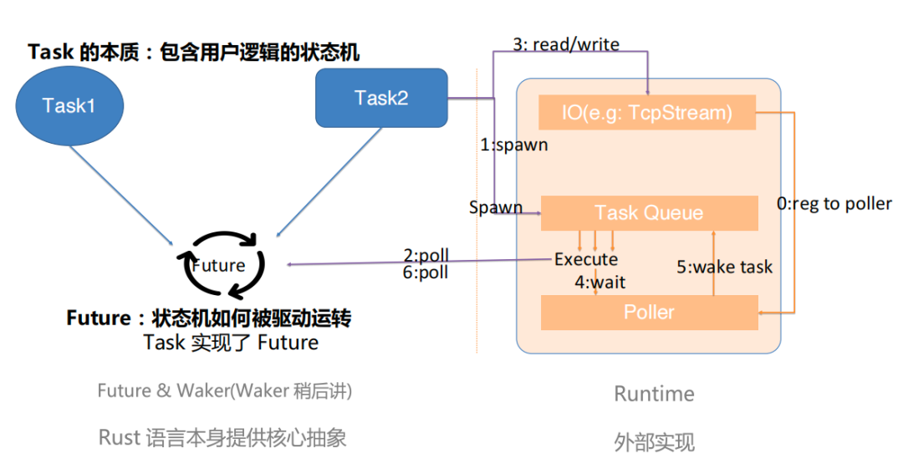
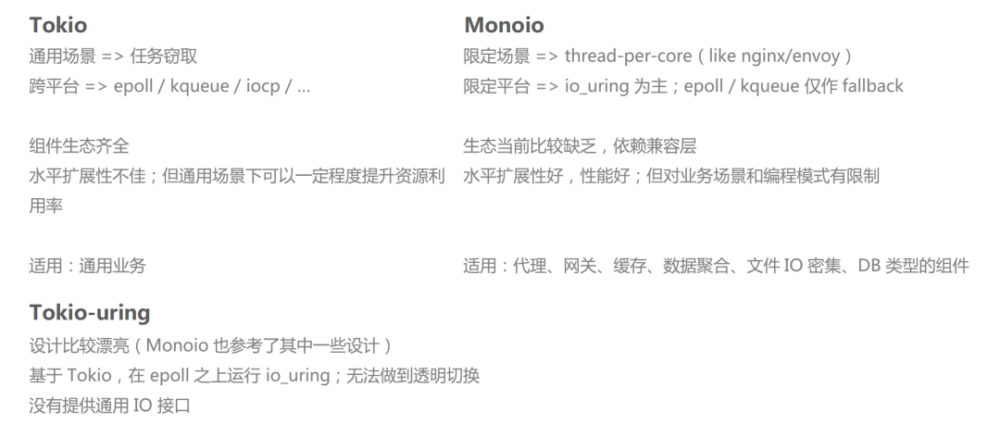

- [learn rust](https://tinyurl.com/learn-rust-lang)
- [Effective rust](https://www.lurklurk.org/effective-rust/cover.html#david-drysdale)
- [Rust 内存泄露？如何修复](https://mp.weixin.qq.com/s/k6vwE5YgONuYkv2g-lRduQ)
  - Rust 的借用检查器不能防止内存错误吗？Rust 不应该是“安全的”吗？事实证明，根据 Rust 的规则，泄漏内存是完全安全的！事实上，我们可以使用函数故意泄漏尽可能多的内存std::mem::forget
  - 使用分布式跟踪进行故障排除
    - 我们可以使用 Rustopentelemetry库，它是根据 OpenTelemetry 规范通用和标准化的。
    - 我们使用 tracing，它是一个 façade crate，类似于log. 它允许我们连接和配置多个跟踪后端，并且可以直接从 log crate 中捕获数据。
      ```rust
      let (res, body) = {
          let query_span = tracing::info_span!("send HTTP request");
          let _guard = query_span.enter();
          self.client.request(body).await?.into_parts()
      };
      ```
    - 如果我们查看 enter 方法的文档，我们可能会注意到一些问题。
      - 在使用 async/await 语法[7]的异步代码中，应非常小心地使用 Span::enter 或完全避免使用。Span .await 持有 Span::enter 返回的 drop guard 将导致不正确的跟踪。
  - 解决方案
     ```rust
     let (res, body) = {
         let query_span = tracing::info_span!("send HTTP request");
         self.client.request(body).instrument(query_span).await?.into_parts()
     };
     ```
- [Rust 编码规范](https://rust-coding-guidelines.github.io/rust-coding-guidelines-zh/safe-guides/code_style/naming/P.NAM.01.html)
- [Zero-Copy](https://manishearth.github.io/blog/2022/08/03/zero-copy-1-not-a-yoking-matter/)
- [Async Rust In Practice: Performance, Pitfalls, Profiling](https://www.p99conf.io/2022/08/02/async-rust-in-practice-performance-pitfalls-profiling/)
- [Rust Is Hard, Or: The Misery of Mainstream Programming](https://mp.weixin.qq.com/s/kUtMIfl74ejMlQHTax00bQ)
- [从一道面试题看学会Rust的难度](https://mp.weixin.qq.com/s/pLPVGKyfYBuSnltLPS7QeA)
  - Question
    ```rust
    fn to_string(v: i32) -> Result<String, i32> {
        match v {
            0.. => Ok(v.to_string()),
            _ => Err(v)
        }
    }
    
    fn main() -> Result<(), String> {
        let o1 = Some(1);
        let o2: Option<String> = o1.map(|v| to_string(v))?;
        println!("option value is: {:?}", o2);
        
        let arr1 = [1,2,3,4,5];
        let arr2: Vec<String> = arr1.iter().map(|v| to_string(*v)).collect()?;
        println!("array value is: {:?}", arr2);
        
        Ok(())
    }
    ```
  - 错误E0308 操作符的输入参数的类型Result<String, i32>与期望的参数类型Option<String>不匹配
  - E0277提示的是?操作符只能用在Result类型，而不能是Option类型
  - 其实o1.map(|v| to_string(v))的返回类型不是Result<String, i32>，而是Option<Result<String, i32>>，后面再加上？操作符，才有E0277的提示，表示Option类型不能进行?操作；
  - 到此，可知现在问题变成由Option<Result<String, i32>>类型数据经过?操作后，期望返回Option<String>类型值；
  - 简单看下来，直接将Option中的Result<String, i32>通过unwrap相关方法可转换成String，应该最方便
  - 如果对?操作符功能有最基本的了解的话，可知它用来将当前函数可能发生的错误直接返回抛出到上层函数调用者；
  - 而我们使用了unwrap_or()实际是将当前函数的错误给屏蔽掉，并强制转换成空，这某种程度上可能违反函数设计者及实现者的初衷(虽然面试者没有明确提到这一点)，如果我们要符合预期将错误抛出，哪怎么办？
  - 实际上Option有这样一个transpose接口可以将Option<Result<String, i32>>，转换成Result<Option<String>,i32>
  - 因为上层函数main的返回类型为Result<(),String>，?操作会隐式的对可能发生的错误类型进行转换即尝试从i32类型转换成String类型(也许这是出题者故意留下的坑)；
  - 需要显式的手工将Result<Option<String>, i32>转换成Result<Option<String>,String>，就可正常编译通过并更优雅的解决使用?进行错误抛出的情况
  - 这涉及一个通用的逻辑，如何将一组Result<T, E>元素，收集成Vec<T>或一旦其中有一个是E，直接返回E的问题；
  - 标准库中通过定制化类型Result<T,E>提供FromIterator Trait的实现可以实现上面的逻辑(如果原来不知道这种方式的话，哪可能就没有办法啦)
    ```rust
    fn main() -> Result<(), String> {
        let o1 = Some(1);
        let o2: Option<String> = o1.map(|v| to_string(v)).transpose().map_err(|i| i.to_string())?;
        println!("option value is: {:?}", o2);
    
        let arr1 = [1,2,3,4,5];
        let arr2: Vec<String> = arr1.iter().map(|v| to_string(*v)).collect::<Result<Vec<String>, i32>>().map_err(|i| i.to_string())?;
        println!("array value is: {:?}", arr2);
    
        Ok(())
    }
    ```
- [错误处理](https://mp.weixin.qq.com/s/r5cmcflZcKICQWZ9YxuhlA)
  - Result的完整形态是Result<T, E>，其中T和E是泛型参数 - Result是两个类型的集合：
    - 一个是没有错误时的计算结果
    - 一个是出错时，要返回的错误
    ```rust
    async fn client_test() {
        let res = client
            .post(...
            ))
        .header("Authorization", &config_env::get__api_token())
            .header("Accept", "application/json")
            .json(&task)
            .send()
            .await;
        match res {
            Ok(body) => {
                println!("Succeed posting task {:?}", body);
                if body.status() == reqwest::StatusCode::OK {
                    if let Ok(result) = body.json::<serde_json::Value>().await {
                        if let Some(code) = result.get("code") {
                            if let Some(code) = code.as_u64() {
                                if code != 200 {
    
                                    if let Err(e) = github::issue::post_issue_comment(...
                                    ).await
                                    {
                                        eprintln!("{}", e);
                                    }
                                }
                            }
                        }
                    }
                }
            }}
    }
    ```
  - 方式一、首先先把代码段提到一个单独的函数post_sending_task()，然后将返回值改成Result
  - 方式二、使用组合子，如将Option转换成Result，从而可以使用问号 `let res = get_something().ok_or_else(|| err)?;`
  - 方式三、提前返回。通过反转if的条件，提前返回
  - 方式四、如果获取结果的同时必须处理错误的情况，那么使用下面的形式，
    `let res = match step1() {
    Ok(o)=> o,
    Err(e) => { handle error }}`
    ```
    async fn post_sending_task(body: reqwest::Response, backend_task: &Task) -> Result<(), E> {
        if body.status() != reqwest::StatusCode::OK {
            return Err(anyhow::anyhow!(format!("Failed to send job with status code {}", body.status())));
        }
    
        let result = body.json::<serde_json::Value>().await?;
        let code = result.get("code").ok_or(Err(anyhow::anyhow!(format!("no code in it"))))?;
        let code = code.as_u64().ok_or(anyhow::anyhow!(format!("code is not u64")))?;
        if code < 400 {
            return Ok(());
        }
        
        github::issue::post_issue_comment(...).await
    }
    ```
- [Rust笔记](https://mp.weixin.qq.com/mp/appmsgalbum?__biz=MzI1MjAzNDI1MA==&action=getalbum&album_id=2170724251283095557&scene=173&from_msgid=2648217143&from_itemidx=2&count=3&nolastread=1#wechat_redirect)
- [Rust 的泛型](https://mp.weixin.qq.com/s/OBg5B93G8Gz9srB-jQQGiw)
- [Rust 语法梳理与总结](https://mp.weixin.qq.com/s/H0oZZg6YBzQDRMzyujVYcg)
- [Box<T>智能指针](https://mp.weixin.qq.com/s/wSHBxpj8yv4Y12E8z_8cag)
- [规则宏代码](https://mp.weixin.qq.com/s/8hp1HhLGEH_ve-OsIYhS8w)
- [写Rust，有三大内伤](https://mp.weixin.qq.com/s/GO8f3EH9-MRvDACYH8rUSg)
- [When Rust hurts](https://mmapped.blog/posts/15-when-rust-hurts.html)
- [类型状态设计模式](https://mp.weixin.qq.com/s/OqXYweARmPrE-LH8TAIxFQ)
- [Rust wiki](https://rustwiki.org/zh-CN/book/ch03-02-data-types.html)
- [Go vs Rust Idioms](https://programming-idioms.org/cheatsheet/Go/Rust)
- [Using unwrap() in Rust is Okay](https://blog.burntsushi.net/unwrap/)
- [Error Handling in Rust](https://blog.burntsushi.net/rust-error-handling/)
- [Rust 错误处理在 GreptimeDB 的实践](https://mp.weixin.qq.com/s/jBPD3C0quxwpQY5RgpBY5A)
  - 构建一个高效且精确的错误堆栈来取代系统 Backtrace 的堆栈；（2）如何在大型项目中组织错误定义；以及（3）如何在不同的方案中打印错误日志，并向最终用户报告错误
- [Rust Runtime 设计与实现](https://www.ihcblog.com/rust-runtime-design-1/)
- [Monoio ：基于 io-uring 的高性能 Rust Runtime](https://mp.weixin.qq.com/s/84EiGzKZG3DHWLsefJZT6Q)
  - Rust 异步机制
    - 借助 Rustc 和 llvm，Rust 可以生成足够高效且安全的机器码. 一个应用程序除了计算逻辑以外往往还有 IO，特别是对于网络中间件，IO 其实是占了相当大比例的
    - 程序做 IO 需要和操作系统打交道，编写异步程序通常并不是一件简单的事情 - Rust 允许自行实现 Runtime 来调度任务和执行 syscall；并提供了 Future 等统一的接口；另外内置了 async-await 语法糖从面向 callback 编程中解放出来。
    - Async Await 背后的秘密
      - 其生成结构最终实现 Future trait 
      - Async + Await 其实是语法糖，可以在 HIR 阶段被展开为 Generator 语法，然后 Generator 又会在 MIR 阶段被编译器展开成状态机
    - Future 抽象
      - Future 描述状态机对外暴露的接口：
        - 推动状态机执行：Poll 方法顾名思义就是去推动状态机执行，给定一个任务，就会推动这个任务做状态转换。
      - 返回执行结果：
        - 遇到了阻塞：Pending
        - 执行完毕：Ready + 返回值
    - Task, Future 和 Runtime 的关系
      - 
  - Monoio 设计
    - 基于 GAT(Generic associated types) 的异步 IO 接口
      - 两种通知机制。第一种是和 epoll 类似的，基于就绪状态的一种通知。第二种是 io-uring 的模式，它是一个基于“完成通知”的模式
      - io_uring
        - io_uring 允许用户和内核共享两个无锁队列，submission queue 是用户态程序写，内核态消费；completion queue 是内核态写，用户态消费。通过 enter syscall 可以将队列中放入的 SQE 提交给 kernel，并可选地陷入并等待 CQE。
        - 在 syscall 密集的应用中，使用 io_uring 可以大大减少上下文切换次数，并且 io_uring 本身也可以减少内核中数据拷贝。
    - 设计上是一个 thread-per-core 模式的 Runtime。
      - 所有 Task 均仅在固定线程运行，无任务窃取。
      - Task Queue 为 thread local 结构操作无锁无竞争。
      - Thread-per-core 不代表没有跨线程能力。用户依旧可以使用一些跨线程共享的结构，这些和 Runtime 无关；Runtime 提供了跨线程等待的能力。
  - Runtime 对比
    - 对于较大量的轻任务，thread-per-core 模式是适合的。特别是代理、网关和文件 IO 密集的应用，使用 Monoio 就非常合适。
    - 
- [Rust程序内存布局](https://mp.weixin.qq.com/s/igQDY3VX5dV7GIWDIOkLDw)
- [Rust 内存泄漏排查](https://mp.weixin.qq.com/s/l5l6o0xUNJNdFyzzNm82GQ)
  - Heap Profiling
    - Rust 有两种方式可以进行堆内存分析，一种是使用 Valgrind，另一种是使用 tcmalloc
    -  jemalloc 自带 heap profiling，我们也支持了导出 jemalloc 的 profile dump 文件
    -  dump 出了其内存 profile 文件，再用 jemalloc 自带的 jeprof 分析两者内存差异
    - 简单用 ps -T -p 命令看了几次 Frontend 节点的进程，线程数稳定在 84 个，而且都是预知的会创建的线程
  - Tokio Console
    - 通过 tokio console 可以看到当前 tokio 的状态，包括当前的 task 数量，以及每个线程的 task 数量
    - 我们在某个会被经常创建的 struct 的构造方法中，spawn 了一个可以在后台持续运行的 Tokio task，却未能及时回收它。
    - 这个构造方法同时在该 struct 的 Default::default() 方法当中被调用了，更增加了我们找到根因的难度
    - Rust 有一个很方便的，可以用另一个 struct 来构造自己 struct 的方法，即 "Struct Update Syntax"。如果 struct 实现了 Default，我们可以简单地在 struct 的 field 构造中使用 ..Default::default()
  - Summary
    -  尽量不要在常用 struct 的构造方法中留下有副作用的代码。
    - Default 只应该用于值类型 struct。
- [rust重写mping](https://github.com/smallnest/mping-rs)
  - [软硬件时间戳](https://mp.weixin.qq.com/s/F65-LD3NweBJt-VdIuIDMw)
    - Go 版本的 mping 对于低版本的内核，不支持SO_TIMESTAMPING的话，会退化使用SO_TIMESTAMPNS,
    - 而 mping-rs 会使用SO_TIMESTAMP,这并没有啥特殊的设计，两者都可以，知识从 Out-Of-Bound 控制数据中读取的数据结构略有不同。
    - 要读取软硬件时间戳
      - 你需要setsockopt把相应的参数设置上。比较新的 Linux 内核版本支持SO_TIMESTAMPING选项，你设置这个选项的时候需要设置一堆的 flags,指定要不要把发送和接收的软硬件时间戳的 flag 加上，把 CMSG 和 TSONLY flag 设置上，这就我们就能从控制信息中获取到时间戳了。
  - OOB
    - OOB 是 Out-Of-Band 的缩写，意思是在正常的数据流之外的数据流，这个数据流是在 TCP 协议中的，它是 TCP 协议的一部分，但是它不是 TCP 协议的数据流，而是在 TCP 协议的数据流之外的数据流。
    - 控制信息中可能包含多条信息，我们需要遍历找出我们需要的控制信息。对于设置了SO_TIMESTAMPING的场景，我们可以通过(*cmsg).cmsg_level == SOL_SOCKET && (*cmsg).cmsg_type == SCM_TIMESTAMPING把控制信息筛选到
    - 对于设置了SO_TIMESTAMP的场景，我们可以通过(*cmsg).cmsg_level == SOL_SOCKET && (*cmsg).cmsg_type == SO_TIMESTAMP筛选出来，它的值是一个类型为timeval的值，包含秒数和微秒数。
    - 这样我们就获取了软硬件的时间戳。
- [基本并发原语](https://mp.weixin.qq.com/s/fV8cnzh9U3XmPWciQX1Ihg)
- [rust 的 partial copy](https://mp.weixin.qq.com/s/xD4YmOy1jpmh8fDacb7iew)
  - 在 rust 2021 中，一个使用了 move 的闭包在捕获一个 struct 的时候，会尽可能少地去捕获 struct 中的字段。
    - 如果一个 struct 没有实现 Drop，这意味着他里面的字段可以被分开 move，而闭包只会捕获闭包中用到的字段。
    - 如果某个被闭包使用的字段实现了 Copy，那他闭包并不会捕获这个字段的 ownership，而是将这个字段 copy 一份放在闭包中。
    - 如果一个 struct 实现了 Drop，那他里面的字段只能作为一个整体被捕获。但如果闭包只使用了这个闭包中实现了 Copy 的字段，那这个闭包不会捕获这个 struct，而是将使用到的字段 copy 一份。
- [用 Rust 过程宏魔法简化 SQL 函数实现](https://mp.weixin.qq.com/s/tk31Vd45xkRx7z5hJI8VpA)
  - 设计了 #[function] 过程宏在编译期做类型反射和代码生成，最终暴露给用户一个尽可能简单直观的接口。
- [The Rust Performance Book](https://nnethercote.github.io/perf-book/benchmarking.html)
- Rust Questions
  - [Rust Questions](https://mp.weixin.qq.com/s/y_x1xTNOlS-oRUBWo5mZnw)
    - 什么是匹配表达式？Rust 如何使用匹配表达式？
    - trait bound 和 where 子句有什么区别?
    - Rust 中的闭包捕获有哪些类型？ 移动捕获, 借用捕获
    - 在 Rust 中可变闭包和不可变闭包有什么区别？
      - 不可变闭包通过引用捕获变量，这意味着它可以读取变量但不能修改它们。
      - 可变闭包通过可变引用捕获变量，这意味着它可以读取和修改捕获的变量。值得注意的是，可变闭包要求捕获的变量也是可变的。
    - Rust 特征 (Traits) 和接口有什么区别？
    - 什么是 Rust 中的生命周期？为什么需要生命周期？
      - 防止悬垂引用和非法引用
- [Protobuf解析优化](https://mp.weixin.qq.com/s/ktOGySi9HJ31G2-IOfxHZw)
  - 首先我们使用了池化技术避免反复的内存分配和释放，从而直接将耗时降低到 baseline 的 36% 左右。
  - 接着为了使用零拷贝的特性，我们将 Label 的 String 字段替换为了 Bytes 类型，但是发现性能却下降了。
    - 通过火焰图我们发现 Prost 为了让 Bytes 在 BytesAdapter 和 Buf 两个 trait 之间转换引入了一些额外的开销。通过把类型特化我们得以去除这些开销
    - 在火焰图中发现了 Bytes:slice 自身为了确保内存安全引入的一些额外的开销。考虑到我们的用法，我们 hack 了 slice 的实现从而最终将耗时降低到 baseline 的 20% 左右。
- [Rust 的 IO性能](https://mp.weixin.qq.com/s/unGVUk-02RiQfoNnytBveA)
- [Rust tips](https://mp.weixin.qq.com/s/8r_8k6mN54obPSs1lUkz6Q)
  - Rust 不支持静态 vec(static vec),但是最接近的是静态数组。例如,如果你想存储三个字符串的数组,可以尝试这样: static STRINGS : [&str;3] = ["a", "b", "c"]
  - 什么是可选值(optional)和 unwrap()? 可以将可选值想象成一个信封,它可以包含一个值(Some(item))或者什么都没有(None)。对可选值调用 unwrap() 要么返回包含的值,要么如果可选值是 None 的话就会使程序 panic
  - 可选值( optional)的安全解包方式:
    - 使用 match 语句明确处理不同情况
    - unwrap_or_default: 要么解包得到值,要么返回默认值
    - unwrap_or_else: 允许你指定一个函数来处理 None/Error 解包结果
  - 如果你没有时间完成特定的一段代码,但仍然希望程序可以编译,可以考虑使用 todo!() 或 unimplemented!() 宏
  - 测试一个枚举类型的实例是否符合枚举的特定变体,你可以使用 matches! 宏,例如:let match_res = matches!(my_variable, enum_type)
  - {} 块可以像函数一样返回结果?这使得基于条件的赋值变得非常容易,例如: let x = { if condition { 1 } else { 2 } }
  - const 和 static 之间有什么区别?
     - const 值在编译期间会被替换("内联")到你的代码中。这对于在代码的各个地方使用的常量值来说是理想的。
     - static 值在运行时有一个内存地址,并且会在整个应用程序的生命周期中存在。它们可以是可变的。如果你需要一个固定的位置来存放共享资源,例如硬件驱动程序或数据库接口,那么静态变量就很有用
  - String 和 str。
    - String: (也称为 Owned String),在堆上分配内存并且可变。String 在运行时使用,当你想要创建和修改字符串时。你可以将 String 作为 &str 引用传递给只读函数。
    - str: (也称为 String Slice) 是对一序列 UTF8 数据的引用。你可以在编译时以常量、静态字面量的形式创建 str,或者在运行时从 String 对象获取它们。str 总是不可变的。
  - 在闭包中使用 move 可以从周围作用域捕获变量。这意味着闭包将获取这些变量的所有权,而无需传递任何参数:
  - 


