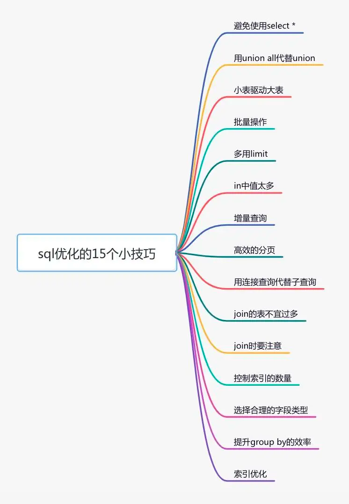

- [Redis请求毛刺](https://mp.weixin.qq.com/s/8l2Qf2vozhCcb9AvvJSBYA)
  
  步骤
  - 首先排查是不是网络问题，查一段时间的 redis slowlog（slowlog 最直接简单）
  - 本地抓包，看日志中 redis 的 get key 网络耗时跟日志的时间是否对的上
  - 查机器负载，是否对的上毛刺时间（弹性云机器，宿主机情况比较复杂）
  - 查 redis sdk，看源码，看实时栈，看是否有阻塞（sdk 用了pool，pool 逻辑是否可能造成阻塞）
    - 源码追踪
    - trace实时栈，看是否有 lock，wait 之类的逻辑
  - 查看 runtime 监控，看是否有协程暴增，看 gc stw 时间是否影响 redis（go 版本有点低，同时内存占用大）；
    - 抓了下线上heap 图，查看历史的gc stw 信息:
      `curl http://localhost:8003/debug/pprof/heap?debug=1`
  - trace ，看调度时间和调度时机是否有问题（并发协程数，GOMAXPROCS cpu负载都会影响调度）
    ```shell
    curl http://127.0.0.1:8080/debug/pprof/trace?seconds=300 > trace.out
    go tool trace trace.out
    ```
    查看goroutine analysis
    - 按 scheduler wait 排序后数据，影响调度的，主要是协程数量和线程数量
    - 线程数查看 `ps -T -p pid`，线程数是200+
    - 将 GOMAXPROC 设置成8，然后重新上线。然后抖动立刻降下来了
    
    原因： 怎么解决获取正确核数的问题？
    - 是设置环境变量 GOMAXPROCS 启动
    - 显式调用 uber/automaxprocs。

- Request无响应
  - 网络正常
    
  - 问题触发：进程要向容器标准输出打印日志 容器引擎重启
    

- 95% percentile request < 5 ms
  - 存储：
    
    问题：一次调用一个用户的三百个特征原方案是用 redis hash 做表，每个 field 为用户的一个特征。由于用户单个请求会获取几百个特征，即使用hmget做合并，存储也需要去多个 slot 中获取数据，效率较低
    
    改进1：把 hash 表的所有 filed 打包成一个 json 格式的 string
    
    改进的问题：若 hash filed 过多，string 的 value 值会很大，（redis 大key）
    
    改进2：
      - 按照类型将特征做细分，比如原来一个 string 里面有 300 的字段，拆分成 3 个有 100 个值的 string 类型。 
      - 对 string val 进行压缩
      - 再加一层cache
  - 代码
    
    分析：pprof 可以看 CPU、内存、协程等信息在压测流量进来时系统调用的各部分耗时情况。而 trace 可以查看 runtime 的情况

    改进：
      - 采用优化的json库
      - string <--> []byte 优化
      - json.Unmarshal 的结果cache，防止多次冗余unmarshal
      - prealloc， slice 与map 预分配大小
    
- [GC pause over 100ms排查](https://mp.weixin.qq.com/s/Lk1EbiT7WprVOyX_dXYMyg)
  
  - 复现：用ab 50并发构造些请求看看. 网络来回延时60ms, 但是平均处理耗时200多ms, 99%耗时到了679ms
  - GC以及trace： 该进程的runtime信息, 发现内存很少，gc-pause很大，GOMAXPROCS为76，是机器的核数
    `export GODEBUG=gctrace=1`, 重启进程看看. 可以看出gc停顿的确很严重
    ```shell
        curl -o trace.out 'http://ip:port/debug/pprof/trace?seconds=20'
        sz ./trace.out
    ```
  - 原因： 容器中Go进程没有正确的设置GOMAXPROCS的个数, 导致可运行的线程过多, 可能出现调度延迟的问题. 正好出现进入gc发起stw的线程把其他线程停止后, 其被调度器切换出去, 很久没有调度该线程, 实质上造成了stw时间变得很长  
  - Solution: go.uber.org/automaxprocs, 容器中go进程启动时, 会正确设置GOMAXPROCS. 
  - 总结
    - 容器中进程看到的核数为母机CPU核数，一般这个值比较大>32, 导致go进程把P设置成较大的数，开启了很多P及线程
    - 一般容器的quota都不大，0.5-4，linux调度器以该容器为一个组，里面的线程的调度是公平，且每个可运行的线程会保证一定的运行时间，因为线程多, 配额小, 虽然请求量很小, 但上下文切换多, 也可能导致发起stw的线程的调度延迟, 引起stw时间升到100ms的级别，极大的影响了请求
    - 通过使用automaxprocs库, 可根据分配给容器的cpu quota, 正确设置GOMAXPROCS以及P的数量, 减少线程数，使得GC停顿稳定在<1ms了. 且同等CPU消耗情况下, QPS可增大一倍，平均响应时间由200ms减少到100ms. 线程上下文切换减少为原来的1/6
    - 同时还简单分析了该库的原理. 找到容器的cgroup目录, 计算cpuacct,cpu下cpu.cfs_quota_us/cpu.cfs_period_us, 即为分配的cpu核数.

- `free -m`查看free为零，而cache很大

  ```shell
  ps auxw|head -1;ps auxw|sort -rn -k4|head -10
  
  lsof -n|awk '{print $2}'|sort|uniq -c|sort -nr|more
  ```

  我们之前遇到过SLAB内存泄露的情况，某公司物理机写了个定时脚本 echo 1 > /proc/sys/vm/drop_caches，会跑满一个核，除此之外没有观测到明显影响，你可以考虑在业务不活跃的情况下试一下。

- 定时器
  - 定时器这块业务早有标准实现：_小顶堆_, _红黑树_ 和 _时间轮_
    - Linux 内核和 Nginx 的定时器采用了 _红黑树_ 实现
    - 长连接系统多采用 _时间轮_
    - Go 使用 _小顶堆_, 四叉堆，比较矮胖，不是最朴素的二叉堆

- [timeout](https://jishuin.proginn.com/p/763bfbd67c63)
  - 案例
    - 一个 python 服务与公网交互，request 库发出去的请求没有设置 timeout ... 而且还是个定时任务，占用了超多 fd
    - 微服务场景下某下游的服务阻塞卡顿，这样会造成他的级联上下游都雪崩了
  - HTTP timeout
  - database
    - Redis 服务端要注意两个参数：timeout 和 tcp-keepalive
      - 其中 timeout 用于关闭 idle client conn, 默认是 0 不关闭，为了减少服务端 fd 占用，建议设置一个合理的值
      - tcp-keepalive 在很早的 redis 版本是不开启的，这样经常会遇到因为网格抖动等原因，socket conn 一直存在，但实际上 client 早己经不存在的情况
      - Redis Client 实现有一个重大问题，对于集群环境下，有些请求会做 Redirect 跳转，默认是 16 次，如果 tcp read timeout 设置了 100ms, 那总时间很可能超过了 1s
    - MySQL 也同样服务端可以设置 MAX_EXECUTION_TIME 来控制 sql 执行时间

- 简述什么是伪分享，如何解决
  - 当多线程拥有各自的变量，且这批变量共享同一个缓存行 cache line，线程更新变量时导致缓存行失效的现象就是伪分享。
  - 详细说明：CPU 缓存的最小单位是缓存行（默认是 64 字节），当 CPU 缓存读取变量时，默认是按照行从内存中读取的，它将读取变量附近的所有变量。这会导致在多核 CPU 下，单个 CPU 核心更新时，会强制其他 CPU 核心也同样更新。
- 内核态和用户态的区别
  - 区别在于运行指令集的权限不一样。内核态运行 CPU 指令集的权限更高（ring 0），用户态运行 CPU 指令集权限更低（ring 3）。所以如果用户态需要操作硬件相关的内容，只能切换到内核态去提高运行 CPU 指令集的权限去运行。
- 什么时候会导致用户态切换到内核态
  - **系统调用**。用户态调用一些内核态提供的接口，用户态主动切换至内核态。比如 redis fork 进程进行 rdb 时就会进行系统调用
  - **异常**。当进程在用户态执行任务的时候，发生一些异常会切换到内核态去处理。比如 redis rdb 时  cow 会触发缺页异常
  - **中断**。外围硬件设备如果处理完请求，就会向 CPU  发出中断信号，让 CPU 暂停执行下一条指令，转到中断信号对应的程序去执行。比如磁盘 IO 读写完成
- 同步/异步、阻塞/非阻塞
  - 同步和异步关注的是调用的消息通知的机制，比如同步是调用后是等到消息返回才结束调用，异步调用后马上结束，等待被调用方异步通知
  - 阻塞和非阻塞关注的是调用时等待消息的状态，指的是调用后没有返回之前的调用者状态
  - 一般来说同步才能去谈阻塞和非阻塞，异步就没有阻塞和非阻塞之分了
- 为什么 MySQL 不建议使用 uuid 作为主键
  - **增大了磁盘 IO**。因为uuid 不是自增的，所以有可能需要读更多的索引页去查找合适的位置。
  - **插入耗时变长**。因为 uuid 不是自增的，导致以 B+ 树为基础的索引树会在插入时，索引节点分裂的概率更高。
  - **内存碎片变多**，根据（2）中说的，分裂的越多，导致页变得稀疏，最终导致数据有碎片。

- 如果请求超时可能的原因有哪些？
  - 应用层代码问题
    - 数据库压力
    - timeout、deadline设置过短
    - 。。。
  - epoll任务分发问题
  - 调度问题 - GMP调度算法
  - GC问题
  - CPU负载高 - cpu metric
  - 内核线程调度 - 调度算法？
  - cgroup throttle问题
  - 网络问题
    - 丢包 - tcp重传时间
    - 错包率导致重传增多
    - 消息乱序 消息在缓冲区积压
  - 交换机背板带宽打满导致消息积压
  - [高并发场景下disk io引发的高时延](http://xiaorui.cc/archives/7229)
    - 发现生产消息的业务服务端因为某 bug ，把大量消息堆积在内存里，在一段时间后，突发性的发送大量消息到推送系统 导致消息时延从 < 100ms 干到 < 3s 左右
    - 主机出现了磁盘 iops 剧烈抖动, iowait 也随之飙高。但问题来了，大家都知道通常来说linux下的读写都有使用 buffer io，写数据是先写到 page buffer 里，然后由内核的 kworker/flush 线程 dirty pages 刷入磁盘，但当脏写率超过阈值 dirty_ratio 时，业务中的write会被堵塞住，被动触发进行同步刷盘。
    - 通过监控的趋势可分析出，随着消息的突增造成的抖动，我们只需要解决抖动就好了。上面有说，虽然是buffer io写日志，但随着大量脏数据的产生，来不及刷盘还是会阻塞 write 调用的。
    
    解决： 异步写
    - 实例化一个 ringbuffer 结构，该 ringbuffer 的本质就是一个环形的 []byte 数组，可使用 Lock Free 提高读写性能；
    - 为了避免 OOM, 需要限定最大的字节数；为了调和空间利用率及性能，支持扩缩容；缩容不要太频繁，可设定一个空闲时间;
    - 启动一个协程去消费 ringbuffer 的数据，写入到日志文件里；
      - 当 ringbuffer 为空时，进行休眠百个毫秒；
      - 当 ringbuffer 满了时，直接覆盖写入。
- [服务 go_cpu 占满如何处理](https://mp.weixin.qq.com/s/343ImRi82NCoLzDWm0iuwg)
  - 如何测试服务连接 MySQL 的问题？在 pod 上，按照 MySQL 客户端连接并执行 SQL语句即可
    ```shell
    
    // centos 使用yum安装mysql 客户端
    yum install mysql-community-client.x86_64 -y
    
    // 登上mysql client
    mysql -h ip -u root -p
    
    // 打开profile 开关
    show variables like "%prof%”
    set profiling = 1; // 0是off，1是on
    
    // 查看语句执行情况
    select count(*) from c_consumer;
    show profiles;
    
    set profiling = 0;
    ```
  - pprof 分析
    - 导入  'net/http/pprof '，并运行   'http server '
      ```go
      import _ "net/http/pprof”
      // 服务启动的时候，在main函数中，另起一个 goroutines 跑一下 http server
      go func() {
         if err := agent.Listen(agent.Options{Addr: "0.0.0.0:6061"}); err != nil {
            log.Println(err)
         }
      }()
      ```
    - 两种方式查看 pprof 分析结果
      - 应用中使用 pprof 中后，使用  ip:port 进入网址查看分析结果 `http://9.145.241.216:8080/debug/pprof/`
      - 使用命令行查看分析结果
        ```shell
        1. 查看堆栈调用信息
        go tool pprof http://9.xxx:8080/debug/pprof/heap
        
        2. 查看 60 秒内的 CPU 信息
        go tool pprof http://9.xxx:8080/debug/pprof/profile?seconds=60
        
        3. 查看 goroutine 阻塞
        go tool pprof http://9.xxx:8080/debug/pprof/block
        
        4. 收集 5 秒内的执行路径
        go tool pprof http://9.xxx:8080/debug/pprof/trace?seconds=5
        
        5. 争用互斥持有者的堆栈跟踪
        go tool pprof http://9.xxx:8080/debug/pprof/mutex
        ```
  - 排查 CPU 占满问题
    - 查看完分析结果后，登录 IDC 环境，执行命令，得到相关日志文件。
      `go tool pprof http://9.xxx:8080/debug/pprof/profile?seconds=60`
    - select default 分支引起的问题。代码的 default 中，只有一个判断项，而且这个一直是 false，未见 true 的条件，所以一直没有 return ，导致 CPU 一直卡在 default 中，无法出去。

- [优化接口性能的办法](https://mp.weixin.qq.com/s/gmPiT_fe0hqfdT_Mjb77LA)
  - 索引
    - 没加索引
    - 索引没生效
      
    - 选错索引 - 使用 force index 来强制查询 SQL 走某个索引
  - SQL 优化
    
  - 远程调用
    - 并行调用
    - 数据异构 - 数据冗余一下
  - 重复调用
    - 循环查数据库 - 批量查询
    - 死循环
  - 数据库分布式锁
  - 分页处理
  - 锁粒度
  - 异步处理
    - 线程池
    - MQ
  - 缓存
  - 分库分表
  - 监控metric 以及 trace


