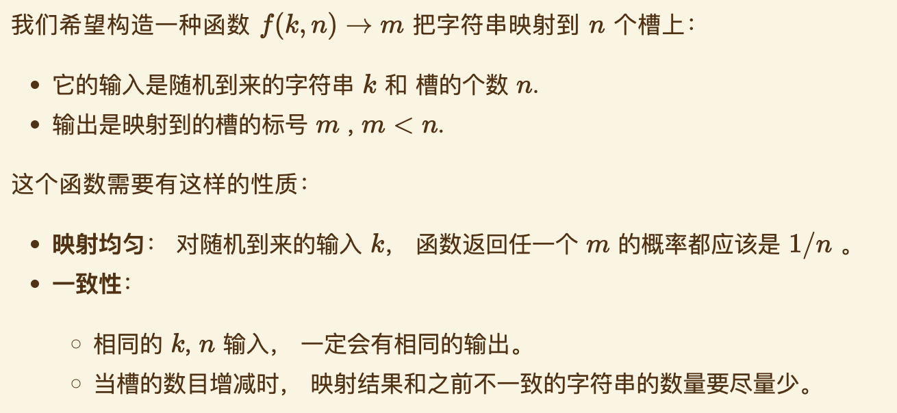
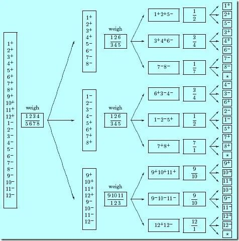
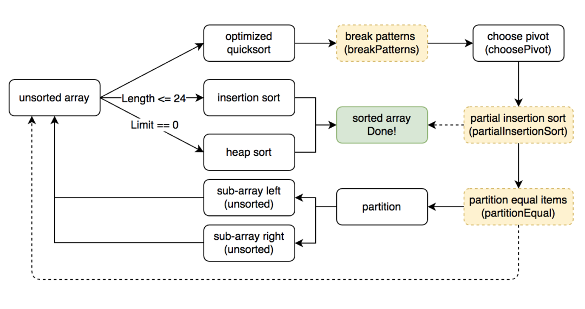
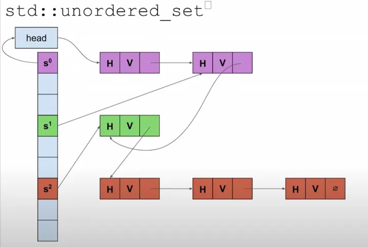

- [map 缩容？](https://mp.weixin.qq.com/s/Slvgl3KZax2jsy2xGDdFKw)
  - 在 Go 底层源码 src/runtime/map.go 中，扩缩容的处理方法是 grow 为前缀的方法来处理的. 无论是扩容还是缩容，其都是由 hashGrow 方法进行处理
  - 若是扩容，则 bigger 为 1，也就是 B+1。代表 hash 表容量扩大 1 倍。不满足就是缩容，也就是 hash 表容量不变。
  - 可以得出结论：map 的扩缩容的主要区别在于 hmap.B 的容量大小改变。_而缩容由于 hmap.B 压根没变，内存空间的占用也是没有变化的_。
  - 若要实现 ”真缩容“，唯一可用的解决方法是：**创建一个新的 map 并从旧的 map 中复制元素**。
  - [为什么不支持？](https://github.com/golang/go/issues/20135)
  - 简单来讲，就是没有找到一个很好的方法实现，存在明确的实现成本问题，没法很方便的 告诉 Go 运行时，我要：
    - 记得保留存储空间，我要立即重用 map。
    - 赶紧释放存储空间，map 从现在开始会小很多。
- [LSM Tree](https://mp.weixin.qq.com/s/sK2qqYCM-dZJTbbFn-23zg)
  - Log Structured Merge Tree ，是一种在机械盘时代大放异彩的存储架构设计。LSM Tree 是一个把顺序写发挥到极致的设计架构
    - 一个 key/value 存储引擎
    - 用户递交数据流程分为两步：写 log 文件，修改内存
    - 删除也是写入。往存储里面写一条带删除标记的记录，而不是直接更新原来的数据。
    - 从用户 key/value 来讲是 log 的结构是一种无序的结构，它的查找效率非常低。所以，自然而然，LSM 的架构里就需要引入一种新型的**有序的数据结构，这个就是 sst** 文件（ 全名：sorted string  table ）
    - 把有效的数据从 sst 文件中读出来（删除或者被覆盖的旧数据丢弃）写到新的文件，然后修改指向关系，然后把旧的文件删掉。这个过程叫做 compact 
  - LSM Tree 的设计思想 - 保存一组合理组织、后台合并的 SSTables
    - 
    - SSTable（Sorted String Table）
      - 构建 SSTable 文件 
        - 在内存中维护一个有序结构（称为 MemTable）。红黑树、AVL 树、条表。
        - 到达一定阈值之后全量 dump 到外存。
      - 维护 SSTable 文件
        - 先去 MemTable 中查找，如果命中则返回。
        - 再去 SSTable 按时间顺序由新到旧逐一查找。
      - 如果 SSTable 文件越来越多，则查找代价会越来越大。因此需要将多个 SSTable 文件合并，以减少文件数量，同时进行 GC，我们称之为紧缩（ Compaction）
      - 性能优化
        - 优化 SSTable 的查找。常用 Bloom Filter。
        - 层级化组织 SSTable。以控制 Compaction 的顺序和时间。常见的有 size-tiered 和 leveled compaction。
    - leveldb 的 compact 分为两种：
      - minor compact ：这个是 memtable 到 Level 0 的转变；
      - major compact ：这个是 Level 0 到底层或者底下的 Level 的 sstable 的相互转变
  - 为什么越来越多“唱衰” LSM 的声音呢
    - SSD 多通道并发、超高的随机性能是变革的核心因素。
    - 《WiscKey: Separating Keys from Values in SSD-Conscious Storage》就讨论了在 SSD 时代，LSM 架构的优化思路
  - LSM vs B-Tree
    - B 树是数据可变的代表结构
      - B 树的难点在于平衡性维护和并发控制，一般用在读多写少的场景
      - 以页（page）为粒度对磁盘数据进行修改, 面向页、查找树
      - 维护了所有数据的有序性，读取性能必然起飞，但写入性能你也别抱太大希望。
      - 优化：
        - 不使用 WAL，而在写入时利用 Copy On Write 技术。同时，也方便了并发控制。如 LMDB、BoltDB。
        - 对中间节点的 Key 做压缩，保留足够的路由信息即可。以此，可以节省空间，增大分支因子。
        - 为了优化范围查询，有的 B 族树将叶子节点存储时物理连续。但当数据不断插入时，维护此有序性的代价非常大。
    - LSM 树是数据不可变的代表结构。你只能在尾部追加新数据，不能修改之前已经插入的数据。变随机写为顺序写
      - LSM 树的难点在于 compact 操作和读取数据时的效率优化，一般用在写多读少的场景。
      - 可以维护局部数据的有序性，从而一定程度提升读性能。
    - 
- [BitMap Index](https://github.com/mkevac/gopherconrussia2019)
  - [Details](https://medium.com/bumble-tech/bitmap-indexes-in-go-unbelievable-search-speed-bb4a6b00851)
  - Indexing approach
    - Hierarchical division - *-trees
    - Hash Mapping - hash maps, reverse indexes
    - Instantly - Bloom filter, Cuckoo filter
    - Bitmap index
  - Bitmap Index
    - bitmap/bitset AND OR
    - high-performance for low cardinality
  - Bitmap Index Problems
    - High-cardinality problem
      - Solution 1: Roaring bitmap - bitmaps, arrays, bit runs
      - Solution 2: Binning
    - High-throughput problem
      - it can be expensive to update bitmaps.
      - Solution 1: Sharding
      - Solution 2: Versioned Indexes
    - Non-trivial queries
      - range query
      - geo query
- [Introducing Serialized Roaring Bitmaps in Golang](https://dgraph.io/blog/post/serialized-roaring-bitmaps-golang/)
  - [Roaring Bitmap](https://github.com/RoaringBitmap/roaring)
  - [Serialized Roaring Bitmaps](https://github.com/dgraph-io/sroar)
    - Sroar operates on 64-bit integers and uses a single byte slice to store all the keys and containers. This byte slice can then be stored on disk, operated on directly in memory, or transmitted over the wire. There’s no encoding/decoding step required. For all practical purposes, sroar can be treated just like a byte slice.
- [When Bloom filters don't bloom](https://blog.cloudflare.com/when-bloom-filters-dont-bloom/)
- [布谷鸟过滤器](https://juejin.cn/post/6844903861749055502)
  - 布隆过滤器有以下不足：查询性能弱(布隆过滤器存储空间和插入/查询时间都是O(k))、空间利用效率低、不支持反向操作（删除）以及不支持计数
    - 查询性能弱是因为布隆过滤器需要使用多个 hash 函数探测位图中多个不同的位点，这些位点在内存上跨度很大，会导致 CPU 缓存行命中率低。
    - 空间效率低是因为在相同的误判率下，布谷鸟过滤器的空间利用率要明显高于布隆，空间上大概能节省 40% 多。不过布隆过滤器并没有要求位图的长度必须是 2 的指数，而布谷鸟过滤器必须有这个要求。从这一点出发，似乎布隆过滤器的空间伸缩性更强一些。
    - 不支持反向删除操作这个问题着实是击中了布隆过滤器的软肋。在一个动态的系统里面元素总是不断的来也是不断的走。布隆过滤器就好比是印迹，来过来就会有痕迹，就算走了也无法清理干净。比如你的系统里本来只留下 1kw 个元素，但是整体上来过了上亿的流水元素，布隆过滤器很无奈，它会将这些流失的元素的印迹也会永远存放在那里。随着时间的流失，这个过滤器会越来越拥挤，直到有一天你发现它的误判率太高了，不得不进行重建。
    - 布谷鸟过滤器在论文里声称自己解决了这个问题，它可以有效支持反向删除操作。而且将它作为一个重要的卖点，诱惑你们放弃布隆过滤器改用布谷鸟过滤器。
  - 布谷鸟哈希
    - 最简单的布谷鸟哈希结构是一维数组结构，会有两个 hash 算法将新来的元素映射到数组的两个位置。如果两个位置中有一个位置为空，那么就可以将元素直接放进去。但是如果这两个位置都满了，它就不得不「鸠占鹊巢」，随机踢走一个，然后自己霸占了这个位置。不同于布谷鸟的是，布谷鸟哈希算法会帮这些受害者（被挤走的蛋）寻找其它的窝。因为每一个元素都可以放在两个位置，只要任意一个有空位置，就可以塞进去。所以这个伤心的被挤走的蛋会看看自己的另一个位置有没有空，如果空了，自己挪过去也就皆大欢喜了。但是如果这个位置也被别人占了呢？好，那么它会再来一次「鸠占鹊巢」，将受害者的角色转嫁给别人。然后这个新的受害者还会重复这个过程直到所有的蛋都找到了自己的巢为止。
  - 优化
    - 改良的方案之一是增加 hash 函数，让每个元素不止有两个巢，而是三个巢、四个巢。这样可以大大降低碰撞的概率，将空间利用率提高到 95%左右。
    - 另一个改良方案是在数组的每个位置上挂上多个座位，这样即使两个元素被 hash 在了同一个位置，也不必立即「鸠占鹊巢」，因为这里有多个座位，你可以随意坐一个。除非这多个座位都被占了，才需要进行挤兑。
  - 布谷鸟过滤器
    - 首先布谷鸟过滤器还是只会选用两个 hash 函数，但是每个位置可以放置多个座位。这两个 hash 函数选择的比较特殊，因为过滤器中只能存储指纹信息。当这个位置上的指纹被挤兑之后，它需要计算出另一个对偶位置。而计算这个对偶位置是需要元素本身的，我们来回忆一下前面的哈希位置计算公式。
    ```
    fp = fingerprint(x)
    p1 = hash1(x) % l
    p2 = hash2(x) % l
    ```
    - 特殊的 hash 函数
      - 布谷鸟过滤器巧妙的地方就在于设计了一个独特的 hash 函数，使得可以根据 p1 和 元素指纹 直接计算出 p2，而不需要完整的 x 元素。
        ```
        fp = fingerprint(x)
        p1 = hash(x)
        p2 = p1 ^ hash(fp)  // 异或
        ```
      - 从上面的公式中可以看出，当我们知道 fp 和 p1，就可以直接算出 p2。同样如果我们知道 p2 和 fp，也可以直接算出 p1 —— 对偶性。
        `p1 = p2 ^ hash(fp)`
      - 布谷鸟过滤器强制数组的长度必须是 2 的指数，所以对数组的长度取模等价于取 hash 值的最后 n 位。在进行异或运算时，忽略掉低 n 位 之外的其它位就行。将计算出来的位置 p 保留低 n 位就是最终的对偶位置。
    - 一个明显的弱点
      - 如果布谷鸟过滤器对同一个元素进行多次连续的插入会怎样？
      - 根据上面的逻辑，毫无疑问，这个元素的指纹会霸占两个位置上的所有座位 —— 8个座位。这 8 个座位上的值都是一样的，都是这个元素的指纹。如果继续插入，则会立即出现挤兑循环。从 p1 槽挤向 p2 槽，又从 p2 槽挤向 p1 槽。
      - 如果想要让布谷鸟过滤器支持删除操作，那么就必须不能允许插入操作多次插入同一个元素，确保每一个元素不会被插入多次（kb+1）。这里的 k 是指 hash 函数的个数 2，b 是指单个位置上的座位数，这里我们是 4
    - 优点：
      - 查询性能较高；
      - 空间利用率较高；
      - 保证了一个比特只被一个元素映射，所以允许删除操作；
    - 缺点：
      - 不能完美的支持删除，存在误删的情况；
      - 存储空间的大小必须为2的指数的限制让空间效率打了折扣
  - [Golang ](https://mp.weixin.qq.com/s/0d1wiY4QLz8yhPPsdhg8QQ)
- [Queue](https://github.com/gammazero/deque)
  - Most queue implementations are in one of three flavors: slice-based, linked list-based, and circular-buffer (ring-buffer) based.
    - Slice-based queues tend to waste memory because they do not reuse the memory previously occupied by removed items. Also, slice based queues tend to only be single-ended.
    - Linked list queues can be better about memory reuse, but are generally a little slower and use more memory overall because of the overhead of maintaining links. They can offer the ability to add and remove items from the middle of the queue without moving memory around, but if you are doing much of that a list is the wrong data structure.
    - Ring-buffer queues offer all the efficiency of slices, with the advantage of not wasting memory. Fewer allocations means better performance. They are just as efficient adding and removing items from either end so you naturally get a double-ended queue. So, as a general recommendation I would recommend a ring-buffer based queue implementation. This is what is discussed in the rest of this post.
- [Why doesn't Dijkstra's algorithm work for negative weight edges?](https://stackoverflow.com/questions/13159337/why-doesnt-dijkstras-algorithm-work-for-negative-weight-edges)
  - The reason for this is that Dijkstra's algorithm are greedy algorithms that assume that once they've computed the distance to some node, the distance found must be the optimal distance. In other words, the algorithm doesn't allow itself to take the distance of a node it has expanded and change what that distance is. In the case of negative edges, your algorithm, and Dijkstra's algorithm, can be "surprised" by seeing a negative-cost edge that would indeed decrease the cost of the best path from the starting node to some other node.
  - Note that this is important, because in each relaxation step, the algorithm assumes the "cost" to the "closed" nodes is indeed minimal, and thus the node that will next be selected is also minimal.
  - The idea of it is: If we have a vertex in open such that its cost is minimal - by adding any positive number to any vertex - the minimality will never change.
  - Without the constraint on positive numbers - the above assumption is not true.
  - Since we do "know" each vertex which was "closed" is minimal - we can safely do the relaxation step - without "looking back". If we do need to "look back" - Bellman-Ford offers a recursive-like (DP) solution of doing so.
- [一致性 Hash 算法原理总结](https://mp.weixin.qq.com/s/b9wRO3q-9XW4yQYDtbJyvQ)
  - 算法详述
    - 一致性哈希解决了简单哈希算法在分布式哈希表（Distributed Hash Table，DHT）中存在的动态伸缩等问题
    - 一致性 hash 是对固定值 2^32 取模. 使用服务器 IP 地址进行 hash 计算，用哈希后的结果对2^32取模，结果一定是一个 0 到2^32-1之间的整数；
    - 一致性 Hash 就是：将原本单个点的 Hash 映射，转变为了在一个环上的某个片段上的映射
  - [数据偏斜&服务器性能平衡问题](https://github.com/JasonkayZK/consistent-hashing-demo)
    - 引入虚拟节点来解决负载不均衡的问题 
      - 即将每台物理服务器虚拟为一组虚拟服务器，将虚拟服务器放置到哈希环上，如果要确定对象的服务器，需先确定对象的虚拟服务器，再由虚拟服务器确定物理服务器；
    - 分配的虚拟节点个数越多，映射在 hash 环上才会越趋于均匀，节点太少的话很难看出效果；
    - 引入虚拟节点的同时也增加了新的问题，要做虚拟节点和真实节点间的映射，对象key->虚拟节点->实际节点之间的转换；
  - [含有负载边界值的一致性 Hash](https://ai.googleblog.com/2017/04/consistent-hashing-with-bounded-loads.html)
    - 如果很多的热点数据都落在了同一台缓存服务器上，则可能会出现性能瓶颈
    - Google 提出了含有[负载边界值的一致性 Hash 算法](https://arxiv.org/abs/1608.01350)，此算法主要应用于在实现一致性的同时，实现负载的平均性；
    - 这个算法将缓存服务器视为一个含有一定容量的桶（可以简单理解为 Hash 桶），将客户端视为球，则平均性目标表示为：所有约等于平均密度（球的数量除以桶的数量）
- [一致性哈希算法](https://writings.sh/post/consistent-hashing-algorithms-part-1-the-problem-and-the-concept)
  - 问题的提出
    
  - [哈希环法](https://writings.sh/post/consistent-hashing-algorithms-part-2-consistent-hash-ring)
    - 实现哈希环的方法一般叫做 ketama 或 hash ring。 核心的逻辑在于如何在环上找一个和目标值 z 相近的槽位， 我们把环拉开成一个自然数轴， 所有的槽位在环上的哈希值组成一个有序表。 在有序表里做查找， 这是二分查找可以解决的事情， 所以哈希环的映射函数的时间复杂度是
    - 带权重的一致性哈希环
      - 采用影子节点可以减少真实节点之间的负载差异。
      - 影子节点是一个绝妙的设计，不仅提高了映射结果的均匀性， 而且为实现加权映射提供了方式。 但是，影子节点增加了内存消耗和查找时间
    - 一致性哈希环下的热扩容和容灾 
      - 对于增删节点的情况，哈希环法做到了增量式的重新映射， 不再需要全量数据迁移的工作。 但仍然有部分数据出现了变更前后映射不一致， 技术运营上仍然存在如下问题：
        - 扩容：当增加节点时，新节点需要对齐下一节点的数据后才可以正常服务。
        - 缩容：当删除节点时，需要先把数据备份到下一节点才可以停服移除。
        - 故障：节点突然故障不得不移除时，面临数据丢失风险。
      - 如果我们要实现动态扩容和缩容，即所谓的热扩容，不停止服务对系统进行增删节点， 可以这样做：
        - 数据备份(双写)： 数据写入到某个节点时，同时写一个备份(replica)到顺时针的邻居节点。
        - 请求中继(代理)： 新节点刚加入后，数据没有同步完成时，对读取不到的数据，可以把请求中继(replay)到顺时针方向的邻居节点。
  - [跳跃一致性哈希法](https://writings.sh/post/consistent-hashing-algorithms-part-3-jump-consistent-hash)
    ```cgo
    int32_t JumpConsistentHash(uint64_t key, int32_t num_buckets) {
      int64_t b = -1, j = 0;
      while (j < num_buckets) {
        b = j;
        key = key * 2862933555777941757ULL + 1;
        j = (b + 1) * (double(1LL << 31) / double((key >> 33) + 1));
      }
      return b;
    }
    ```
    - 用随机数来决定一个 k 每次要不要跳到新槽位中去。 但是请注意，这里所说的「随机数」是指伪随机数，即只要种子不变，随机序列就不变。
    - 跳跃一致性哈希算法的设计非常精妙， 我认为最美的部分是利用了伪随机数的一致性和分布均匀性。
    - 跳跃一致性哈希在执行速度、内存消耗、映射均匀性上都比经典的哈希环法要好。
    - 跳跃一致性哈希算法有两个显著缺点：
      - 无法自定义槽位标号
        - 跳跃一致性哈希算法中， 因为我们没有存储任何数据结构， 所以我们无法自定义槽位标号， 标号是从 0 开始数过来的。
      - 只能在尾部增删节点
    - 跳跃一致性哈希下的热扩容和容灾 
      - 热扩容 -  可以采用和一致性哈希环法类似的办法， 即请求中继： 新加入的节点对于读取不到的数据，可以把请求中继(relay)到老节点，并把这个数据迁移过来。
      - 容灾 - 在执行数据写操作时，同时写一份数据到备份节点。 备份节点这样选定：
         - 尾部节点备份一份数据到老节点。
         - 非尾部节点备份一份数据到右侧邻居节点。
  - [Maglev一致性哈希法](https://writings.sh/post/consistent-hashing-algorithms-part-4-maglev-consistent-hash)
    - Maglev一致性哈希的思路是查表： 建立一个槽位的查找表(lookup table)， 对输入 k 做哈希再取余，即可映射到表中一个槽位。
    - 为每个槽位生成一个大小为 M 的序列 permutation 叫做「偏好序列」吧。 然后， 按照偏好序列中数字的顺序，每个槽位轮流填充查找表。 将偏好序列中的数字当做查找表中的目标位置，把槽位标号填充到目标位置。 如果填充的目标位置已经被占用，则顺延该序列的下一个填
    - 这是一种类似「二次哈希」的方法， 使用了两个独立无关的哈希函数来减少映射结果的碰撞次数，提高随机性。
    - 查找表的长度 M 必须是一个质数。 和「哈希表的槽位数量最好是质数」是一个道理， 这样可以减少哈希值的聚集和碰撞，让分布更均匀
    - Maglev一致性哈希的算法的内容， 简单来说：
      - 为每个槽位生成一个偏好序列， 尽量均匀随机。
      - 建表：每个槽位轮流用自己的偏好序列填充查找表。
      - 查表：哈希后取余数的方法做映射。
    - 难以实现后端节点的数据备份逻辑，因此工程上更适合弱状态后端的场景
  - 
- [Go 语言高性能哈希表的设计与实现](https://mp.weixin.qq.com/s/KB-VwshP7FlzO-OutuT-2w)
  - 碰撞处理
    - 链地址法（chaining）
      - 实现最简单直观
      - 空间浪费较少
    - 开放寻址法（open-addressing）
      - 每次插入或查找操作只有一次指针跳转，对CPU缓存更友好
      - 所有数据存放在一块连续内存中，内存碎片更少
      - 当max load factor较大时，性能不如链地址法。
      - 然而当我们主动牺牲内存，选择较小的max load factor时（例如0.5），形势就发生逆转，开放寻址法反而性能更好。因为这时哈希碰撞的概率大大减小，缓存友好的优势得以凸显。
      - 空闲桶探测方法
        - 线性探测（linear probing）：对i = 0, 1, 2...，依次探测第H(k, i) = H(k) + ci mod |T|个桶。
        - 平方探测（quadratic probing）：对i = 0, 1, 2...，依次探测H(k, i) = H(k) + c1i + c2i2 mod |T|。其中c2不能为0，否则退化成线性探测。
        - 双重哈希（double hashing）：使用两个不同哈希函数，依次探测H(k, i) = (H1(k) + i * H2(k)) mod |T|
  - Max load factor
    - 对链地址法哈希表，指平均每个桶所含元素个数上限。 
    - 对开放寻址法哈希表，指已填充的桶个数占总的桶个数的最大比值。 
    - max load factor越小，哈希碰撞的概率越小，同时浪费的空间也越多。
  - Growth factor
    - 指当已填充的桶达到max load factor限定的上限，哈希表需要rehash时，内存扩张的倍数。growth factor越大，哈希表rehash的次数越少，但是内存浪费越多。
  - 基本设计与参数选择 [Source](https://github.com/matrixorigin/matrixone/tree/main/pkg/container/hashtable)
    - 我们照搬了ClickHouse的如下设计：
      - 开放寻址
      - 线性探测
      - max load factor = 0.5，growth factor = 4
      - 整数哈希函数基于CRC32指令
    - 具体原因前面已经提到，当max load factor不大时，开放寻址法要优于链地制法，同时线性探测法又优于其他的探测方法。
    - 并做了如下修改（优化）：
      - 字符串哈希函数基于AESENC指令
      - 插入、查找、扩张时批量计算哈希函数
      - 扩张时直接遍历旧表插入新表
- [Skip List](https://mp.weixin.qq.com/s/nZdZeiquIjYui-Fy_QuXQw)
  - LevelDB 牺牲部分 Get 性能，换取强悍 Put 性能，再极力优化 Get。
  - 跳表使用概率均衡而非严格均衡策略，从而相对于平衡树，大大简化和加速了元素的插入和删除。
  - 思路： 跳步采样，构建索引，逐层递减
  - C++11 中 atomic 标准库中新支持的几种 memory order，规定了一些指令重排方面的限制，仅说明下用到的三种：
    - std::memory_order_release：不对重排做限制，只保证相关共享内存访问的原子性。
    - std::memory_order_acquire: 用在 load 时，保证同线程中该 load 之后的对相关内存读写语句不会被重排到 load 之前，并且其他线程中对同样内存用了 store release 都对其可见。
    - std::memory_order_release：用在 store 时，保证同线程中该 store 之后的对相关内存的读写语句不会被重排到 store 之前，并且该线程的所有修改对用了 load acquire 的其他线程都可见。
  - Why would you wanna use SkipLists?
    - lookup, deletion and insertion has logarithmic complexity
    - these are relatively very easy to implement as you don’t need to take care of rebalancing tree (as with RB Trees, AVL Trees, B+Trees) or container resizing (as with HashMaps).
    - thread safe implementation is also not too complex, there are lock and lock-free concurrent implemetations out there and memory footprint is generally low when compared to other ordered collection.
  - Improving performance
    - Memory Access - This can be done with manual memory management and using a custom memory pool.
    - Unrolled SkipList is one which stores multiple elements in each node. Unrolling is designed to give a better cache performance which can depend on the size of the objects which are accessed.
- Quick Sort
  - 答案的任何一个分支都是等概率的
  - 
  - 排序的本质可以这样来表述：一组未排序的N个数字，它们一共有N!种重排，其中只有一种排列是满足题意的（譬如从大到小排列）。换句话说，排序问题的可能性一共有N!种。任何基于比较的排序的基本操作单元都是“比较a和b”
  - 一个只有两种输出的问题最多只能将可能性空间切成两半，根据上面的思路，最佳切法就是切成1/2和1/2。也就是说，我们希望在比较了a和b的大小关系之后，如果发现a<b的话剩下的排列可能性就变成N!/2，如果发现a>b也是剩下N!/2种可能性
  - 一个直接的推论是，如果每次都像上面这样的完美比较，那么N个元素的N!种可能排列只需要log_2{N!}就排查玩了，而log_2{N!}近似于NlogN。这正是快排的复杂度。
- [pdqsort](https://mp.weixin.qq.com/s/5HqfRGqPyAhFt0krPgMHOQ)
  - 插入排序 快速排序  堆排序
    - 所有短序列和元素有序情况下，插入排序性能最好
    - 大部分case，快速排序有较好的性能
    - 任何情况下，堆排序的性能比较稳定, 在最坏情况下的时间复杂度仍然为 O(n* logn)
  - [pdqsort](https://arxiv.org/pdf/2106.05123.pdf): pattern-defeating-quicksort  不稳定的混合排序
    - 其理想情况下的时间复杂度为 O(n)，最坏情况下的时间复杂度为 O(n* logn)，不需要额外的空间。
    - 短序列 - 插入排序  - 长度（12 ~ 32）
    - 快速排序保证整体性能 - pivot使用中位数， 改进partition
      - 短序列 ，固定元素
      - 中序列 <= 50, 采样三个元素 median of three
        ```go
        int medianThree(int a, int b, int c) {
            if ((a > b) ^ (a > c)) 
                return a;
            else if ((b < a) ^ (b < c)) 
                return b;
            else
                return c;
        }
        ```
      - 长序列 > 50,采样九个元素 median of medians
      - 采用序列是逆序序列 - 翻转整个序列
      - 采样序列是顺序序列 - 插入排序 partial insert sort 有限次数的插入排序 提高性能
    - 快速排序不佳的时候，堆排序保证最坏情况下仍为 nlogn
      - pivot离着序列端点比较近 （len/8）
    - 元素重复度比较高的情况
      - 采样pivot重复度？NO
      - 如果两次partition的 pivot相同，即partition是无效分割
  - details
    - 
    - wasBalanced: Bool, 代表上次 partition 是否平衡。在 pivot 和真正的 median 很接近时我们认为是平衡的（true），此变量可以用 partition 后的 pivot index 同 array 两端的距离来判定。
    - wasPartitioned: Bool, 如果为真，则代表上次 partition 没有交换任何元素（即上次 partition 分割的是一个本身已经有序的 array）。
    - limit: int，如果为 0，则后续对 unsorted array 的排序都会使用 heap sort 而不是 quick sort。这种情况发生在 quicksort 有很多次选择的 pivot 和真正的 median 差距很大，从而导致 partition 后的两个 sub-arrays 长度相差较大的场景中。limit 的初始值是根据待排序 array 的长度计算出来的，每次发现快排策略效果不佳时，即 !wasBalanced 为真，则使得 limit 减小 1。
  - pdqsort 相比于 Go 原有算法的优势
    - 在纯粹的算法层面，即 pdqsort (with sort.Interface) ，pdqsort 在完全随机的情况下和原有算法（类似于 IntroSort）性能几乎一致
    - 在常见的场景下（例如序列有序|几乎有序|逆序|几乎逆序|重复元素较多）等情况下，会比原有的算法快 1 ~ 30 倍。
    - Go 原有的算法类似于 introsort，其通过递归次数来决定是否切换到 fall back 算法，而 pdqsort 使用了另一种计算方式（基于序列长度），使得切换到 fall back 算法的时机更加合理。
- [Hash](https://zhuanlan.zhihu.com/p/277732297)
  - [CS166](http://web.stanford.edu/class/cs166/)
  - Hashmap
    - Load factor 
      - Load factor is the ratio of the number of elements in the hashmap to the number of buckets
      - 装载因子主要是进行扩容，以减少哈希碰撞
    - std::unordered_set
      - 为了优化遍历操作(不会遍历空的桶)，GCC 将值用单链表的形式组织起来了
      - 
  - 优化
    - 丢弃额外的数据结构，使用同一个数组来存储元素。
    - 通过抛弃多种数据结构的实现方式，同时使用线性探测法来进行存储，对 cache 更加友好，也提高的空间局部性的利用。
    - 如何处理哈希冲突
      - 线性探测法的好处是有很好的缓存表现，比如线性探测法是顺序性地访问元素，而这些连续的内存正是缓存行的一部分，省下了 CPU 指令周期。作为对比，平方探测法就没有很好的缓存表现，因为它会跳着查找。
    - Robin Hood hashing
      - 我们将元素的实际存放位置和它算出来的哈希值做差，称之为距离。D(value) = abs( 实际存放位置 - hash(value) )
      - 在新的哈希操作中，如果 当前元素的距离 小于 要被插入元素的距离，就进行替换，并继续操作替换出来的元素插入。
      - advantage
        - 由于进行了元素位置的重新分配，所以装载因子可以设置得很高。
        - 而且查找效率也变高了，不需要查询直到出现空桶为止，根据插入规则，可以直接判断距离 D(当前元素) < D(查询元素)，就能停止了，返回元素不存在。
        - 同时也可以提供更好的空间局部性的利用。
  - **Hopscotch hashing** is a mix between open addressing and chained hashing that can be thought of as taking a chained hash table and storing each item in each bucket in a slot near where the item wants to go. This strategy plays well with multithreading. 
  - **The Swiss table** uses the fact that some processors can perform multiple operations in parallel with a single instruction to speed up a linear probing table.
    - [Golang runtime: use SwissTable](https://github.com/golang/go/issues/54766)
    - [SwissMap: A smaller, faster Golang Hash Table](https://www.dolthub.com/blog/2023-03-28-swiss-map/)
    - [SwissTable: A Fast and Cache-Efficient Hash Table](https://arxiv.org/pdf/2004.06804.pdf)
    - [Designing a Fast, Efficient, Cache-friendly Hash Table, Step by Step](https://www.youtube.com/watch?v=ncHmEUmJZf4&t=1449s)
      - https://github.com/dolthub/swiss
      - The SwissTable uses a different hashing scheme called "closed-hashing"
      - Rather than collect elements into buckets, each key-value pair in the hash-table is assigned its own "slot". The location of this slot is determined by a probing algorithm whose starting point is determined by the hash of the key. The simplest example is a linear probing search which starts at slot hash(key) mod size and stops when the desired key is found, or when an empty slot is reached.
      - The segmented memory layout of SwissTable is a key driver of its performance. Probe sequences through the table only access the metadata array until a short hash match is found. This access pattern maximizes cache-locality during probing.
      - Using SSE instructions effectively allows us to divide the length of average probe sequence by 16. Empirical measurements show that even at maximum load, the average probe sequence performs fewer than two 16-way comparisons
      - Golang support for SSE instructions, and for SIMD instructions in general, is minimal. To leverage these intrinsics, SwissMap uses the excellent Avo package to generate assembly functions with the relevant SSE instructions.
    - [Go](https://mp.weixin.qq.com/s/MlxxDYQ_VROPZQk0TYbWYQ)
      - 内建的 map 采用开放寻址法(open-hashing，也叫拉链法),哈希值冲突(哈希值一样)的键值对会被放在一个桶中，查找的时候，先根据哈希值找到对应的桶，然后再遍历桶中的元素，找到对应的值
      - SwissTable 使用一种称为“封闭哈希”（Closed Hashing,也叫开地址法）的不同哈希方案。每一个哈希值都会有一个自己的槽(slot),槽的选择是由哈希值决定，最简单的方式就是从hash(key) mod size的槽开始查找，一直往后查找，直到直到对应的键或者空的槽(不存在的 key),这也是开地址法常见的套路
      - SwissTable 的内存布局是其性能的关键驱动因素。通过使用 SSE 指令，可以将平均探测序列的长度除以 16。实验测量表明，即使在最大负载下，平均探测序列也执行少于两个 16 路比较
      - 对 CPU 的 cache 更友好，更重要的是，可以通过 SSE 指令并行比较 16 个短哈希。
      - 在 key 的数量比较少时,swiss 并不能发挥它的 SSE 指令的优势，但是在 key 值非常多的情况下， swiss 优势明显
      - swiss 库采用了Daniel Lemire提出的一个快速求余(更准确的说，是 modulo reduction)的算法，这个想法看似简单，但实际上非常巧妙 (x * N) / 232
  - **Extendible hashing** is designed for databases and file systems and uses a mix of a trie and a chained hash table to dynamically increase bucket sizes as individual buckets get loaded. 
  - **Robin Hood hashing** is a variant of linear probing in which items can be moved after being inserted to reduce the variance in how far from home each element can live.
  - **cuckoo hashing** have two hash tables and two hash functions. Each item can be in exactly one of two places - it's either in the location in the first table given by the first hash function, or it's in the location in the second table given by the second hash function. This means that lookups are worst-case efficient, since you only have to check two spots to see if something is in the table.
- [lock-free synchronization always superior to synchronization using locks?]
  - lock free
    - Lock-free data structures often perform very well when there is no contention, and will perform correctly even in the presence of contention, but the presence of contention may cause their performance to be severely degraded. 
    - If 100 threads all try to update a lock-free data structure simultaneously, one would succeed on its first try, at least two would succeed on the first and second try, and least three would succeed within three tries, etc. but the worst-case total number of update attempts required might be over 5,000. 
    - By contrast, if 100 threads all try to update a lock-based data structure, one would be allowed to perform the update immediately while the other 99 would be blocked, but each of those 99 threads would only be awakened when it would be able to access the data structure without further delay.
  - lock 
    - a thread which is waylaid while it holds a lock will block all other threads unless or until it finishes whatever it needs to do and releases the lock. By contrast, when using a lock-free data structure, competing threads which get waylaid will provide less impediment to other other threads than they would have otherwise.
  - Ex.
    - Suppose you have two cores and three threads that are ready-to-run. Assume threads A and B are accessing the same collection and will contend significantly while thread C is accessing totally different data and will minimize contention.
    - If threads A and B use locks, one of those threads will rapidly wind up being de-scheduled and thread C will run on one core. This will allow whichever thread gets scheduled, A or B, to run with nearly no contention at all.
    - By contrast, with a lock-free collection, the scheduler never gets a chance to deschedule thread A or B. It is entirely possible that threads A and B will run concurrently through their entire timeslice, ping-ponging the same cache lines between their L2 caches the whole time.
  - Usage
    - Lock free tends to work out better in more or less the opposite situation: you have more hardware available at any given time than you have threads to run. In this case, a busy-wait with lock-free code can react very quickly when a resource becomes free, make its modification, and keep moving forward.


