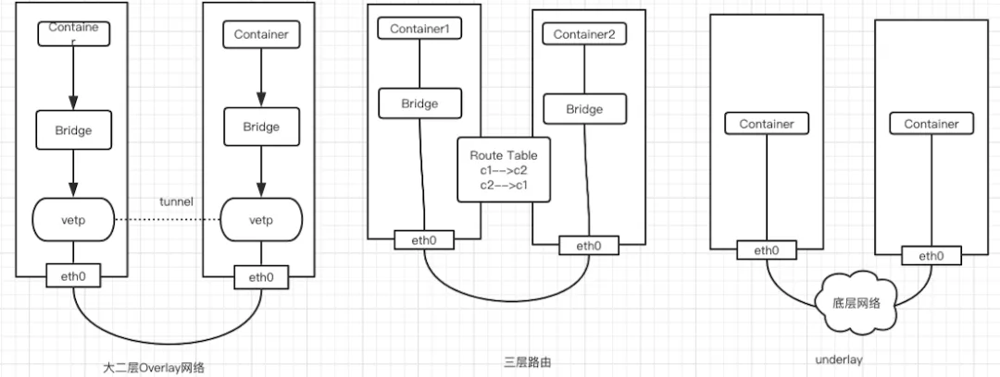
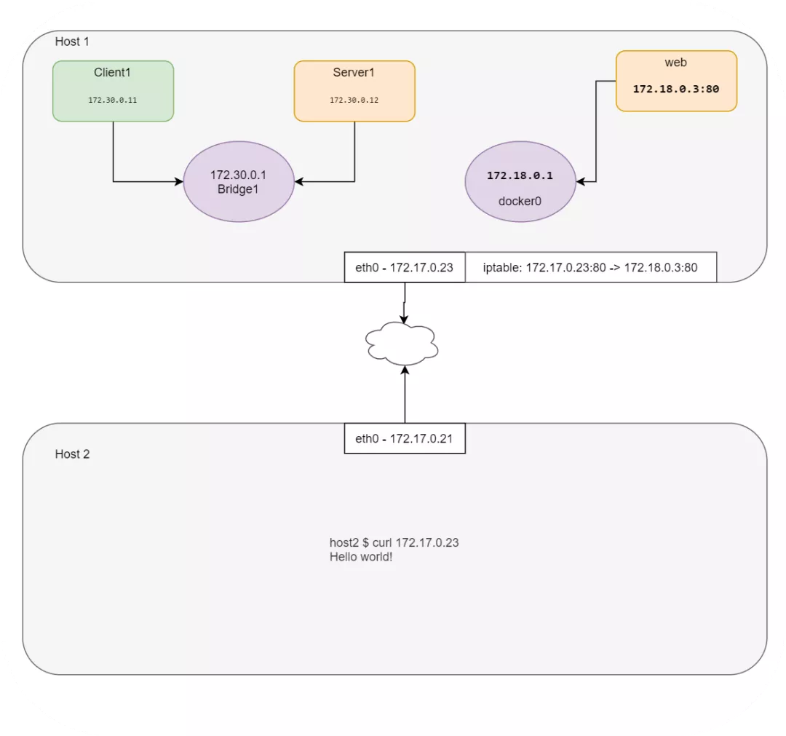
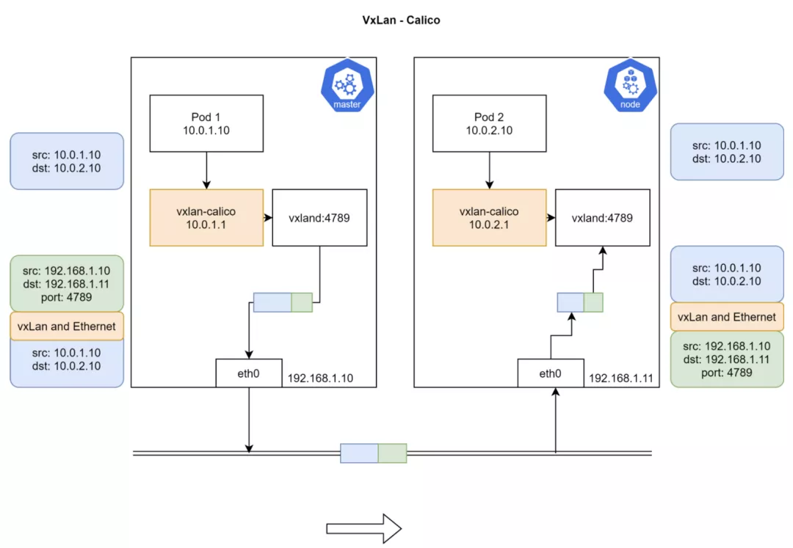
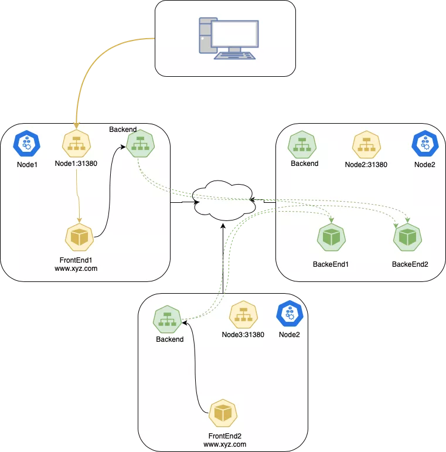

- [K8s Network Namespace](https://mp.weixin.qq.com/s/Vf_Pj5ofj0am6SRPtMn6GA)
  - 包含网卡（Network Interface），回环设备（Lookback Device），路由表（Routing Table）和iptables规则
    - Veth Pair：Veth设备对的引入是为了实现在不同网络命名空间的通信，总是以两张虚拟网卡（veth peer）的形式成对出现的。并且，从其中一端发出的数据，总是能在另外一端收到
    - Iptables/Netfilter：
        - Netfilter负责在内核中执行各种挂接的规则（过滤、修改、丢弃等），运行在内核中
        - Iptables模式是在用户模式下运行的进程，负责协助维护内核中Netfilter的各种规则表
    - 网桥：网桥是一个二层网络虚拟设备，类似交换机，主要功能是通过学习而来的Mac地址将数据帧转发到网桥的不同端口上
    - 路由: Linux系统包含一个完整的路由功能，当IP层在处理数据发送或转发的时候，会使用路由表来决定发往哪里
  - 同宿主机的容器时间如何通信呢？
    - 我们可以简单把他们理解成两台主机，主机之间通过网线连接起来，如果要多台主机通信，我们通过交换机就可以实现彼此互通，在Linux中，我们可以通过网桥来转发数据。
    - 在容器中，以上的实现是通过docker0网桥，凡是连接到docker0的容器，就可以通过它来进行通信。要想容器能够连接到docker0网桥，我们也需要类似网线的虚拟设备Veth Pair来把容器连接到网桥上。
    
    - 默认情况下，通过network namespace限制的容器进程，本质上是通过Veth peer设备和宿主机网桥的方式，实现了不同network namespace的数据交换。
    - 与之类似地，当你在一台宿主机上，访问该宿主机上的容器的IP地址时，这个请求的数据包，也是先根据路由规则到达docker0网桥，然后被转发到对应的Veth Pair设备，最后出现在容器里。
  -跨主机网络通信
    - CNI即容器网络的API接口
    - CNI维护了一个单独的网桥来代替 docker0。这个网桥的名字就叫作：CNI 网桥，它在宿主机上的设备名称默认是：cni0。cni的设计思想，就是：Kubernetes在启动Infra容器之后，就可以直接调用CNI网络插件，为这个Infra容器的Network Namespace，配置符合预期的网络栈
    - CNI插件三种网络实现模式
      - Overlay模式是基于隧道技术实现的，整个容器网络和主机网络独立，容器之间跨主机通信时将整个容器网络封装到底层网络中，然后到达目标机器后再解封装传递到目标容器。不依赖与底层网络的实现。实现的插件有Flannel（UDP、vxlan）、Calico（IPIP）等等
      - 三层路由模式中容器和主机也属于不通的网段，他们容器互通主要是基于路由表打通，无需在主机之间建立隧道封包。但是限制条件必须依赖大二层同个局域网内。实现的插件有Flannel（host-gw）、Calico（BGP）等等
      - Underlay网络是底层网络，负责互联互通。容器网络和主机网络依然分属不同的网段，但是彼此处于同一层网络，处于相同的地位。整个网络三层互通，没有大二层的限制，但是需要强依赖底层网络的实现支持.实现的插件有Calico（BGP）等等
      
      
- GOMAXPROCS
  - CPU Affinity
    - CPU Affinity 是一种调度属性，它可以将单个进程绑定到一个或一组 CPU 上。
    - 在 SMP（Symmetric Multi-Processing 对称多处理）架构下，Linux 调度器（Scheduler）会根据 CPU affinity 的设置让指定的进程运行在绑定的 CPU 上，而不会在别的 CPU 上运行。 CPU Affinity 就是进程要在某个给定的 CPU 上尽量长时间地运行而不被迁移到其他处理器的倾向性。Linux 内核进程调度器天生就具有被称为软 CPU Affinity 的特性，这意味着进程通常不会在处理器之间频繁迁移。合理的设置 CPU Affinity（进程独占 CPU Core）可以提高程序处理性能。
  - GOMAXPROCS
    - Golang 的 Runtime 包中获取和设置 GOMAXPROCS，也就是 Go Scheduler 确定 P 数量的逻辑。在 Linux 上，它会利用系统调用 sched_getaffinity 来获得系统的 CPU 核数。
    - 可以通过 runtime.GOMAXPROCS() 来设定 P 的值，当前 Go 版本的 GOMAXPROCS 默认值已经设置为 CPU 的（逻辑核）核数， 这允许我们的 Go 程序充分使用机器的每一个 CPU, 最大程度的提高我们程序的并发性能。不过从实践经验中来看，IO 密集型的应用，可以稍微调高 P 的个数；而本文讨论的 Affinity 设置更适合 CPU 密集型的应用。
  - Docker CPU 调度
    - 默认容器会使用宿主机 CPU 是不受限制的
    - 要限制容器使用 CPU，可以通过参数设置 CPU 的使用，又细分为两种策略：
      - 将容器设置为普通进程，通过完全公平调度算法（CFS，Completely Fair Scheduler）调度类实现对容器 CPU 的限制 – 默认方案
      - 将容器设置为实时进程，通过实时调度类进行限制
    - docker（docker run）配置 CPU 使用量的参数主要下面几个，这些参数主要是通过配置在容器对应 cgroup 中，由 cgroup 进行实际的 CPU 管控。其对应的路径可以从 cgroup 中查看到
     ```shell
       --cpu-shares                    CPU shares (relative weight)
       --cpu-period                    Limit CPU CFS (Completely Fair Scheduler) period
       --cpu-quota                     Limit CPU CFS (Completely Fair Scheduler) quota
       --cpuset-cpus                   CPUs in which to allow execution (0-3, 0,1)
     ```
  - K8S里的CPU调度
    - kubernetes 对容器可以设置两个关于 CPU 的值：limits 和 requests，即 spec.containers[].resources.limits.cpu 和 spec.containers[].resources.requests.cpu
    - limits：该（单）pod 使用的最大的 CPU 核数 limits=cfs_quota_us/cfs_period_us 的值。比如 limits.cpu=3（核），则 cfs_quota_us=300000，cfs_period_us 值一般都使用默认的 100000
    - requests：该（单）pod 使用的最小的 CPU 核数，为 pod 调度提供计算依据
      - 一方面则体现在容器设置 --cpu-shares 上，比如 requests.cpu=3，–cpu-shares=1024，则 cpushare=1024*3=3072。
      - 另一方面，比较重要的一点，用来计算 Node 的 CPU 的已经分配的量就是通过计算所有容器的 requests 的和得到的，那么该 Node 还可以分配的量就是该 Node 的 CPU 核数减去前面这个值。当创建一个 Pod 时，Kubernetes 调度程序将为 Pod 选择一个 Node。每个 Node 具有每种资源类型的最大容量：可为 Pods 提供的 CPU 和内存量。调度程序确保对于每种资源类型，调度的容器的资源请求的总和小于 Node 的容量。尽管 Node 上的实际内存或 CPU 资源使用量非常低，但如果容量检查失败，则调度程序仍然拒绝在节点上放置 Pod。
  - 在 Docker-container 和 Kubernetes 集群中，存在 GOMAXPROCS 会错误识别容器 cpu 核心数的问题
    - Uber 的这个库 automaxprocs，大致原理是读取 CGroup 值识别容器的 CPU quota，计算得到实际核心数，并自动设置 GOMAXPROCS 线程数量
 
- [为什么容器内存占用居高不下，频频 OOM](https://eddycjy.com/posts/why-container-memory-exceed/)

  排查方向
  - 频繁申请重复对象
    - 怀疑是否在量大时频繁申请重复对象，而 Go 本身又没有及时释放内存，因此导致持续占用。
    - 想解决 “频繁申请重复对象”，我们大多会采用多级内存池的方式，也可以用最常见的 sync.Pool
      - 形成 “并发⼤－占⽤内存⼤－GC 缓慢－处理并发能⼒降低－并发更⼤”这样的恶性循环
    - 通过拉取 PProf goroutine，可得知 Goroutine 数并不高
  - 不知名内存泄露
    - 可以借助 PProf heap（可以使用 base -diff）
    - 接下通过命令也可确定 Go 进程的 RSS 并不高。 [但 VSZ 却相对 “高” 的惊人](https://eddycjy.com/posts/go/talk/2019-09-24-why-vsz-large/)
    - 从结论上来讲，也不像 Go 进程内存泄露的问题，因此也将其排除
  - madvise 策略变更
    - 在 Go1.12 以前，Go Runtime 在 Linux 上使用的是 MADV_DONTNEED 策略，可以让 RSS 下降的比较快，就是效率差点。
    - 在 Go1.12 及以后，Go Runtime 专门针对其进行了优化，使用了更为高效的 MADV_FREE 策略。但这样子所带来的副作用就是 RSS 不会立刻下降，要等到系统有内存压力了才会释放占用，RSS 才会下降。
    - MADV_FREE 的策略改变，[需要 Linux 内核在 4.5 及以上](https://github.com/golang/go/issues/23687). go的老版本需要 run binary with GODEBUG=madvdontneed=1 就可以归还给系统了，或者直接升级到go 1.16
  - 监控/判别条件有问题
    - OOM 的判断标准是 container_memory_working_set_bytes 指标
  - 容器环境的机制
    - container_memory_working_set_bytes 是由 cadvisor 提供的，对应下述指标 `kc top`
    - Memory 换算过来是 4GB+, 显然和 RSS 不对标
  
  原因
  - 从 [cadvisor/issues/638](https://github.com/google/cadvisor/issues/638) 可得知 container_memory_working_set_bytes 指标的组成实际上是 RSS + Cache。而 Cache 高的情况，常见于进程有大量文件 IO，占用 Cache 可能就会比较高
  - 只要是涉及有大量文件 IO 的服务，基本上是这个问题的老常客了
  
  解决
  - cadvisor 所提供的判别标准 container_memory_working_set_bytes 是不可变更的，也就是无法把判别标准改为 RSS
  - 使用类 sync.Pool 做多级内存池管理，防止申请到 “不合适”的内存空间，常见的例子： ioutil.ReadAll：
  - 核心是做好做多级内存池管理，因为使用多级内存池，就会预先定义多个 Pool，比如大小 100，200，300的 Pool 池，当你要 150 的时候，分配200，就可以避免部分的内存碎片和内存碎块
- [Orphan process in docker](https://petermalmgren.com/orphan-children-handling-containerd/)
  - PID 1 processes behave differently than other processes in a few different ways:
    - They don’t get the default system signal handlers, so they are responsible for defining their own
    - They are responsible for reaping zombie processes, or processes that have terminated but whose exit statuses haven’t been read
    - Most importantly (for this scenario), they are responsible for adopting orphaned children and waiting on them to finish
  - When writing code that runs in a Docker container, there are four questions you’ll want to answer:
     - Does your process respond to SIGTERM signals and gracefully shutdown?
     - If spawning child processes, does your parent forward signals to them?
     - If spawning child processes, does your parent process call os.wait() to see if they unexpectedly die?
     - If spawning child processes, do you wait on all of your processes to exit before exiting yourself?

- [一文搞懂 Kubernetes 中数据包的生命周期](https://mp.weixin.qq.com/s/SqCwa069y4dcVQ1fWNQ0Wg)
  - [Source](https://dramasamy.medium.com/life-of-a-packet-in-kubernetes-part-1-f9bc0909e051)
  - Linux 命名空间
    - Mount：隔离文件系统加载点；
    - UTS：隔离主机名和域名；
    - IPC：隔离跨进程通信（IPC）资源；
    - PID：隔离 PID 空间；
    - 网络：隔离网络接口；
    - 用户：隔离 UID/GID 空间；
    - Cgroup：隔离 cgroup 根目录。
  - 容器网络（网络命名空间）
    - 在主流 Linux 操作系统中都可以简单地用 ip 命令创建网络命名空间
      ```shell
      $ ip netns add client
      $ ip netns add server
      $ ip netns list
      server
      client
      ```
    - 创建一对 veth 将命名空间进行连接，可以把 veth 想象为连接两端的网线。
      ```shell
      $ ip link add veth-client type veth peer name veth-server
      $ ip link list | grep veth
      4: veth-server@veth-client: <BROADCAST,MULTICAST,M-DOWN> mtu 1500 qdisc noop state DOWN mode DEFAULT group default qlen 1000
      5: veth-client@veth-server: <BROADCAST,MULTICAST,M-DOWN> mtu 1500 qdisc noop state DOWN mode DEFAULT group default qlen 1000
      ```
    - 这一对 veth 是存在于主机的网络命名空间的，接下来我们把两端分别置入各自的命名空间
      ```shell
      $ ip link set veth-client netns client
      $ ip link set veth-server netns server
      $ ip link list | grep veth # doesn’t exist on the host network namespace now
      ```
    - 检查一下命名空间中的 veth 状况
      ```shell
      $ ip netns exec client ip link
      1: lo: <LOOPBACK> mtu 65536 qdisc noop state DOWN mode DEFAULT group default qlen 1    link/loopback 00:00:00:00:00:00 brd 00:00:00:00:00:00
      5: veth-client@if4: <BROADCAST,MULTICAST> mtu 1500 qdisc noop state DOWN mode DEFAULT group default qlen 1000    link/ether ca:e8:30:2e:f9:d2 brd ff:ff:ff:ff:ff:ff link-netnsid 1
      $ ip netns exec server ip link
      1: lo: <LOOPBACK> mtu 65536 qdisc noop state DOWN mode DEFAULT group default qlen 1    link/loopback 00:00:00:00:00:00 brd 00:00:00:00:00:00
      4: veth-server@if5: <BROADCAST,MULTICAST> mtu 1500 qdisc noop state DOWN mode DEFAULT group default qlen 1000    link/ether 42:96:f0:ae:f0:c5 brd ff:ff:ff:ff:ff:ff link-netnsid 0
      ```
    - 接下来给这些网络接口分配 IP 地址并启用
      ```shell
      $ ip netns exec client ip address add 10.0.0.11/24 dev veth-client
      $ ip netns exec client ip link set veth-client up
      $ ip netns exec server ip address add 10.0.0.12/24 dev veth-server
      $ ip netns exec server ip link set veth-server up
      $
      $ ip netns exec client ip addr
      $ ip netns exec server ip addr
      $ ip netns exec client ping 10.0.0.12  #使用 ping 命令检查一下两个网络命名空间的连接状况
      ```
    - 创建创建一个 Linux 网桥来连接这些网络命名空间。Docker 就是这样为同一主机内的容器进行连接的
      ```shell
      # All in one
      # ip link add <p1-name> netns <p1-ns> type veth peer <p2-name> netns <p2-ns>
      BR=bridge1
      HOST_IP=172.17.0.33
      # 新创建一对类型为veth peer的网卡
      ip link add client1-veth type veth peer name client1-veth-br
      ip link add server1-veth type veth peer name server1-veth-br
      ip link add $BR type bridge
      ip netns add client1
      ip netns add server1
      ip link set client1-veth netns client1
      ip link set server1-veth netns server1
      ip link set client1-veth-br master $BR
      ip link set server1-veth-br master $BR
      ip link set $BR up
      ip link set client1-veth-br up
      ip link set server1-veth-br up
      ip netns exec client1 ip link set client1-veth up
      ip netns exec server1 ip link set server1-veth up
      ip netns exec client1 ip addr add 172.30.0.11/24 dev client1-veth
      ip netns exec server1 ip addr add 172.30.0.12/24 dev server1-veth
      ip netns exec client1 ping 172.30.0.12 -c 5
      ip addr add 172.30.0.1/24 dev $BR
      ip netns exec client1 ping 172.30.0.12 -c 5
      ip netns exec client1 ping 172.30.0.1 -c 5
      ```
      
      从命名空间中 ping 一下主机 IP
       ```shell
       $ ip netns exec client1 ping $HOST_IP -c 2
       connect: Network is unreachable
       ```
      Network is unreachable 的原因是路由不通，加入一条缺省路由
       ```shell
       $ ip netns exec client1 ip route add default via 172.30.0.1
       $ ip netns exec server1 ip route add default via 172.30.0.1
       $ ip netns exec client1 ping $HOST_IP -c 5
       ```
  - 从外部服务器连接内网
    - 机器已经安装了 Docker，也就是说已经创建了 docker0 网桥
    - 运行一个 nginx 容器并进行观察
      ```shell
      $ docker run -d --name web --rm nginx
      efff2d2c98f94671f69cddc5cc88bb7a0a5a2ea15dc3c98d911e39bf2764a556
      $ WEB_IP=`docker inspect -f "{{ .NetworkSettings.IPAddress }}" web`
      $ docker inspect web --format '{{ .NetworkSettings.SandboxKey }}'
      /var/run/docker/netns/c009f2a4be71
      ```
    - Docker 创建的 netns 没有保存在缺省位置，所以 ip netns list 是看不到这个网络命名空间的。我们可以在缺省位置创建一个符号链接
      ```shell
      $ container_id=web
      $ container_netns=$(docker inspect ${container_id} --format '{{ .NetworkSettings.SandboxKey }}')
      $ mkdir -p /var/run/netns
      $ rm -f /var/run/netns/${container_id}
      $ ln -sv ${container_netns} /var/run/netns/${container_id}
      '/var/run/netns/web' -> '/var/run/docker/netns/c009f2a4be71'
      $ ip netns list
      web (id: 3)
      server1 (id: 1)
      client1 (id: 0)
      ```
    - 看看 web 命名空间的 IP 地址
      ```shell
      $ ip netns exec web ip addr
      $ WEB_IP=`docker inspect -f "{{ .NetworkSettings.IPAddress }}" web`
      $ echo $WEB_IP   # 然后看看容器里的 IP 地址
      $ curl $WEB_IP   # 从主机访问一下 web 命名空间的服务
      ```
    - 加入端口转发规则，其它主机就能访问这个 nginx 了
      ```shell
      $ iptables -t nat -A PREROUTING -p tcp --dport 80 -j DNAT --to-destination $WEB_IP:80
      $ echo $HOST_IP
      172.17.0.23
      
      $ curl 172.17.0.23 # 使用主机 IP 访问 Nginx
      ```
      
  - CNI
    - CNI 插件负责在容器网络命名空间中插入一个网络接口（也就是 veth 对中的一端）并在主机侧进行必要的变更（把 veth 对中的另一侧接入网桥）。然后给网络接口分配 IP，并调用 IPAM 插件来设置相应的路由。
    - [CNI 规范](https://github.com/containernetworking/cni/blob/master/SPEC.md)
    - 使用 CNI 插件而非 CLI 命令进行 IP 分配。完成 Demo 就会更好地理解 Kubernetes 中 Pod 的本质
      - 下载 CNI 插件
        ```shell
        $ mkdir cni
        $ cd cni
        $ curl -O -L https://github.com/containernetworking/cni/releases/download/v0.4.0/cni-amd64-v0.4.0.tgz
        $ tar -xvf cni-amd64-v0.4.0.tgz
        ```
      - 创建一个 JSON 格式的 CNI 配置（00-demo.conf）
        ```shell
        {
            "cniVersion": "0.2.0",
            "name": "demo_br",
            "type": "bridge",
            "bridge": "cni_net0",
            "isGateway": true,
            "ipMasq": true,
            "ipam": {
                "type": "host-local",
                "subnet": "10.0.10.0/24",
                "routes": [
                    { "dst": "0.0.0.0/0" },
                    { "dst": "1.1.1.1/32", "gw":"10.0.10.1"}
                ]    
            }
        }
        type: The name of the plugin you wish to use.  In this case, the actual name of the plugin executable
        args: Optional additional parameters
        ipMasq: Configure outbound masquerade (source NAT) for this network
        ipam:
            type: The name of the IPAM plugin executable
            subnet: The subnet to allocate out of (this is actually part of the IPAM plugin)
            routes:
                dst: The subnet you wish to reach
                gw: The IP address of the next hop to reach the dst.  If not specified the default gateway for the subnet is assumed
        dns:
            nameservers: A list of nameservers you wish to use with this network
            domain: The search domain to use for DNS requests
            search: A list of search domains
            options: A list of options to be passed to the receiver
        ```
      - 创建一个网络为 none 的容器，这个容器没有网络地址。可以用任意的镜像创建该容器，这里我用 pause 来模拟 Kubernetes：
        ````shell
        docker run --name pause_demo -d --rm --network none kubernetes/pause
        $ container_id=pause_demo
        $ container_netns=$(docker inspect ${container_id} --format '{{ .NetworkSettings.SandboxKey }}')
        $ mkdir -p /var/run/netns
        $ rm -f /var/run/netns/${container_id}
        $ ln -sv ${container_netns} /var/run/netns/${container_id}
        '/var/run/netns/pause_demo' -> '/var/run/docker/netns/0297681f79b5'
        $ ip netns list
        pause_demo
        $ ip netns exec $container_id ifconfig
        ````
      - 用前面的配置来调用 CNI 插件
        ```go
        $ CNI_CONTAINERID=$container_id CNI_IFNAME=eth10 CNI_COMMAND=ADD CNI_NETNS=/var/run/netns/$container_id CNI_PATH=`pwd` ./bridge </tmp/00-demo.conf
        ```
        运行上面的命令会返回一些内容。
        - 首先是因为 IPAM 驱动在本地找不到保存 IP 信息的文件而报错。但是因为第一次运行插件时会创建这个文件，所以在其他命名空间再次运行这个命令就不会出现这个问题了。
        - 其次是得到一个说明插件已经完成相应 IP 配置的 JSON 信息。在本例中，网桥的 IP 地址应该是 10.0.10.1/24，命名空间网络接口的地址则是 10.0.10.2/24。另外还会根据我们的 JSON 配置文件，加入缺省路由以及 1.1.1.1/32 路由
      - Check
        ```shell
        $ ip netns exec pause_demo ifconfig
        $ ip netns exec pause_demo ip route
        # CNI 创建了网桥并根据 JSON 信息进行了相应配置
        $ ifconfig
        ```
      - 启动 Web Server 并共享 pause 容器命名空间
        ```shell
        $ docker run --name web_demo -d --rm --network container:$container_id nginx8fadcf2925b779de6781b4215534b32231685b8515f998b2a66a3c7e38333e30
        $ curl `cat /var/lib/cni/networks/demo_br/last_reserved_ip`
        ```
  - Pod 网络命名空间
    - Pod 不等于容器，而是一组容器。这一组容器会共享同一个网络栈。每个 Pod 都会包含有 pause 容器，Kubernetes 通过这个容器来管理 Pod 的网络。所有其他容器都会附着在 pause 容器的网络命名空间中，而 pause 除了网络之外，再无其他作用。因此同一个 Pod 中的不同容器，可以通过 localhost 进行互访
    - Master 和 Worker 节点上的路由表。每个节点都有一个容器，容器有一个 IP 地址和缺省的容器路由
      
      上面的路由表说明，Pod 能够通过 3 层网络进行互通。什么模块负责添加路由，如何获取远端路由呢？为什么这里缺省网关是 169.254.1.1 呢
    - 第三方 CNI 插件，Calico 就是其中之一. Calico 的核心包括 Bird、Felix、ConfD、ETCD 以及 Kubernetes API Server
      - BIRD (BGP)
        - Bird 是一个 BGP 守护进程，运行在每个节点上，负责相互交换路由信息
        - BIRD 实例负责向其它 BIRD 实例传递路由信息。缺省配置方式就是 BGP Mesh，适用于小规模部署。在大规模集群中，建议使用 Route Reflector 来克服这个缺点
      - ConfD
        - ConfD 是一个简单的配置管理工具，运行在 Calico Node 容器中。它会从 ETCD 中读取数据（Calico 的 BIRD 配置），并写入磁盘文件。它会循环读取网络和子网，并应用配置数据（CIDR 键），组装为 BIRD 能够使用的配置
      - Felix
        - Calico Felix 守护进程在 Calico Node 容器中运行
        - 从 Kubernetes ETCD 中读取信息
        - 构建路由表
        - 配置 iptables 或者 IPVS
        
        - 数据包如何被路由到 Peer 节点的？
          - Master 上的 Pod 尝试 Ping 10.0.2.11
          - Pod 向网关发送一个 ARP 请求
          - 从 ARP 响应中得到 MAC 地址
          - 但是谁响应的 ARP 请求？答案是 proxy-arp, `cat /proc/sys/net/ipv4/conf/cali123/proxy_arp`
          
      - 路由模式
        - IP-in-IP：
          - 缺省，有封装行为；
          - 传输中的数据包带有一个外层头部，其中描述了源主机和目的 IP，还有一个内层头部，包含源 Pod 和目标 IP
        - Direct/NoEncapMode：
          - 无封包（推荐）
          - 用 Pod 发出时的原始格式发出来的。因为没有封包和解包的开销，这种模式比较有性能优势
          - AWS 中要使用这种模式需要关闭源 IP 校验
        - VxLan：
          - 有封包（无 BGP）
          - VXLAN 是 Virtual Extensible LAN 的缩写。VXLAN 是一种封包技术，二层数据帧被封装为 UDP 数据包。VXLAN 是一种网络虚拟化技术。当设备在软件定义的数据中心里进行通信时，会在这些设备之间建立 VXLAN 隧道。这些隧道能建立在物理或虚拟交换机之上
          
  - kube-proxy kube-proxy 是如何使用 iptables 控制流量的
    - Pod 到 Pod
      - kube-proxy 不会介入 Pod 到 Pod 之间的通信过程。所有的容器都无需 NAT 就能互相通信；节点和容器之间的通信也是无需 NAT 的。
      - Pod 的 IP 地址是不固定的（也有办法做成静态 IP，但是缺省配置是不提供这种保障的）。在 Pod 重启时 CNI 会给他分配新的 IP 地址，CNI 不负责维护 IP 地址和 Pod 的映射
    - Pod 到外部
      - Kubernetes 会使用 SNAT 完成从 Pod 向外发出的访问。SNAT 会将 Pod 的内部 IP:Port 替换为主机的 IP:Port。返回数据包到达节点时，IP:Port 又会换回 Pod。这个过程对于原始 Pod 是透明无感知的。
    - Pod 到 Service
      - Cluster IP
        - Service 的对象，是一个通向 Pod 的 4 层负载均衡. Service 是一个 API 对象，它用一个虚拟 IP 映射到一组 Pod。另外 Kubernetes 为每个 Service 的名称及其虚拟 IP 建立了 DNS 记录，因此可以轻松地根据名称进行寻址。
        - Service 对象有很多类型，最基本的类型叫做 ClusterIP，这种类型的 Service 有一个唯一的 VIP 地址，其路由范围仅在集群内部有效
        - 虚拟 IP 到 Pod IP 的转换是通过每个节点上的 kube-proxy 完成的. 在 Pod 向外发起通信时，这个进程会通过 iptables 或者 IPVS 自动把 VIP 转为 Pod IP，每个连接都有跟踪，所以数据包返回时候，地址还能够被正确地转回原样
        - IPVS 和 iptables 在 VIP 和 Pod IP 之间承担着负载均衡的角色，IPVS 能够提供更多的负载均衡算法。虚拟 IP 并不存在于网络接口上，而是在 iptable 中：
        
      - NodePort
        - NodePort 类型的 Service 把 FrontEnd 服务开放给外部世界
        
      - ExternalTrafficPolicy
        - 表明所属 Service 对象会把来自外部的流量路由给本节点还是集群范围内的端点
        - 如果为 Local，会保留客户端源 IP 同时避免 NodePort 类型服务的多余一跳，但是有流量分配不均匀的隐患
          - kube-proxy 只会在存在目标 Pod 的节点上加入 NodePort 的代理规则。API Server 要求只有使用 LoadBalancer 或者 NodePort 类型的 Service 才能够使用这种策略。这是因为 Local 策略只跟外部访问相关。
          - 在 Google GKE 上使用 Local 策略，由于健康检查的原因，会把不运行对应 Pod 的节点从负载均衡池中剔除，所以不会发生丢弃流量的问题
          - 因为不需要进行 SNAT，从而让源 IP 得以保存。然而官方文档声明，这种策略存在不够均衡的短板
        - 如果为 Cluster (缺省)，会抹掉客户端的源 IP，并导致到其它节点的一跳，但会获得相对较好的均衡效果。
          - 客户端把数据包发送给 node2:31380；
          - node2 替换源 IP 地址（SNAT）为自己的 IP 地址；
          - node2 将目标地址替换为 Pod IP；
          - 数据包被路由到 node1 或者 node3，然后到达 Pod；
          - Pod 的响应返回到 node2
          
  - Kube-Proxy（iptable）
    - 负责 Service 对象的组件就是 kube-proxy.它在每个节点上运行，为 Pod 和 Service 生成复杂的 iptables 规则，完成所有的过滤和 NAT 工作
      - 运行 iptables-save，会看到 Kubernetes 或者其它组件生成的规则
      - KUBE-SERVICE 是 Service 包的入口。 它负责匹配 IP:Port，并把数据包发给对应的 KUBE-SVC-*。
      - KUBE-SVC-* 担任负载均衡的角色，会平均分配数据包到 KUBE-SEP-*。 每个 KUBE-SVC-* 都有和 Endpoint 同样数量的 KUBE-SEP-*。
      - KUBE-SEP-* 代表的是 Service 的 EndPoint，它负责的是 DNAT，会把 Service 的 IP:Port 替换为 Pod 的 IP:Port。
    - Conntrack 会介入 DNAT 过程，使用状态机来跟踪连接状态. iptables 还可以根据 conntrack 状态（ctstate）来决定数据包的目标
  - iptables
    - 在 Linux 操作系统中使用 netfilter 处理防火墙工作。这是一个内核模块，决定是否放行数据包。iptables 是 netfilter 的前端。
    - 链
      
    - 表
      - Filter： 缺省表，这里决定是否允许数据包出入本机，因此可以在这里进行屏蔽等操作；
      - Nat： 是网络地址转换的缩写。
      - Mangle： 仅对特定包有用。 它的功能是在包出入之前修改包中的内容；
      - RAW： 用于处理原始数据包，主要用在跟踪连接状态，下面有一个放行 SSH 连接的例子。
      - Security：
    - Kubernetes 中的 iptables 配置
      - ClusterIP 是一个存在于 iptables 中的虚拟 IP，Kubernetes 会把这个地址存在 CoreDNS 中。
      - 为了能够进行包过滤和 NAT，Kubernetes 会创建一个 KUBE-SERVICES 链，把所有 PREROUTING 和 OUTPUT 流量转发给 KUBE-SERVICES
      - 使用 KUBE-SERVICES 介入包过滤和 NAT 之后，Kubernetes 会监控通向 Service 的流量，并进行 SNAT/DNAT 的处理。在 KUBE-SERVICES 链尾部，会写入另一个链 KUBE-SERVICES，用于处理 NodePort 类型的 Service。
      - ClusterIP：KUBE-SERVICES → KUBE-SVC-XXX → KUBE-SEP-XXX
      - NodePort：KUBE-SERVICES → KUBE-NODEPORTS → KUBE-SVC-XXX → KUBE-SEP-XXX
  - Headless Service
    - 有的应用并不需要负载均衡和服务 IP。在这种情况下就可以使用 headless Service，只要设置 .spec.clusterIP 为 None 即可。
    - 定义了 Selector 的 Headless Service，Endpoint 控制器会创建 Endpoint 记录，并修改 DNS 记录来直接返回 Service 后端的 Pod 地址
    - 没有定义 Selector 的 Headless Service，也就没有 Endpoint 记录。然而 DNS 系统会尝试配置：
      - ExternalName 类型的服务，会产生 CNAME 记录；
      - 其他类型则是所有 Endpoint 共享服务名称。

- [使用Docker容器突破客户端6w可用端口的误区](https://tonybai.com/2021/12/14/the-misconception-of-using-docker-to-break-out-of-6w-ports-of-the-client/)
  - 一个客户机最多向外面建立65535-1024+1=64512个连接。为什么会这样呢？这是因为一个TCP连接由一个四元组唯一确定，这个四元组是（源端口，源地址，目的地址，目的端口）。这个四元组中的源端口是一个16bit的短整型，它的表示范围是0~65535。但1024及以下的端口号通常为系统保留，因此用户可用的端口号仅剩下64512个。
  - 我们看到docker中的请求经过NAT后其源ip转换为宿主机的源ip地址192.168.49.6，源端口为宿主机的一个随机端口(1024~65535范围内)。客户端发出请求后，server端处理并返回响应，响应回到宿主机后，NAT会根据上面的转换表，根据nat后的源ip、nat后的源port、目的ip和目的port找到唯一的源ip和源port，并将替换数据包中相应的字段，这样数据包才能返回给对应的容器中的客户端程序。这样当目的ip、目的port以及nat后的源ip都是“固定值”的情况下，就只能要求nat后的源port不能重复，而nat后的源port的可选范围却只能为1024~65535，当nat后的源port耗尽，容器中的客户端程序就再也无法与server建立新连接了。
- [告别 Sidecar—— 使用 EBPF 解锁内核级服务网格](https://mp.weixin.qq.com/s/W9NySdKnxuQ6S917QQn3PA)
- [Life of a Packet in Kubernetes](https://dramasamy.medium.com/life-of-a-packet-in-kubernetes-part-1-f9bc0909e051)
- [Mastering Container Networking](https://iximiuz.com/en/posts/container-networking-is-simple/)
- [24 个常见的 Docker 疑难杂症处理技巧](https://mp.weixin.qq.com/s/R58f7fac2F3MP0TLV36vyQ)


