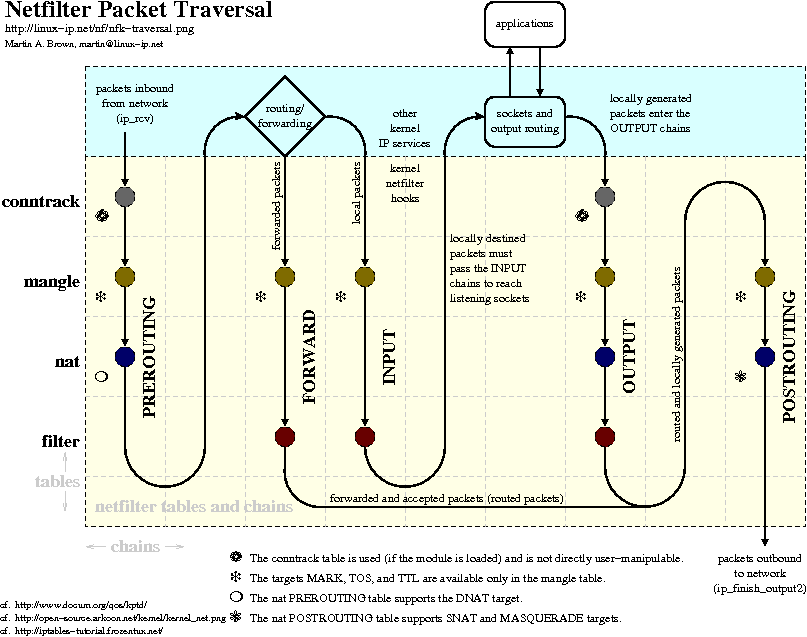

- [eBPF/Ftrace 双剑合璧：no space left on device 无处遁形](https://mp.weixin.qq.com/s/VuD20JgMQlbf-RIeCGniaA)
- [eBPF 经典入门指南](https://mp.weixin.qq.com/s/d6lOxtiEheegCduTpHXQew)
- [From XDP to Socket: Routing of packets beyond XDP with BPF](https://mp.weixin.qq.com/s/a8OAnprwxggnMEGRHodmMA)
- [eBPF and XDP](https://mp.weixin.qq.com/s/VmDfYDVlz7PVN6sz6HrIgg)
  - 新技术出现的历史原因
    - [iptables/netfilter](https://mp.weixin.qq.com/s?__biz=MzkyMTIzMTkzNA==&mid=2247506496&idx=1&sn=c629e22f0de944c0940ffb3a665b726f&chksm=c1842d11f6f3a407e2200d28da9033c23a411bdc64f85ddb756c0ff36d660eed38338e611d1f&scene=21#wechat_redirect)
      - iptables/netfilter 是上个时代Linux网络提供的优秀的防火墙技术，扩展性强，能够满足当时大部分网络应用需求
      - 存在很多明显问题
        - 路径太长
          - netfilter 框架在IP层，报文需要经过链路层，IP层才能被处理，如果是需要丢弃报文，会白白浪费很多CPU资源，影响整体性能；
        - O(N)匹配
          - 
        - 规则太多
          - netfilter 框架类似一套可以自由添加策略规则专家系统，并没有对添加规则进行合并优化，这些都严重依赖操作人员技术水平，随着规模的增大，规则数量n成指数级增长，而报文处理又是0（n）复杂度，最终性能会直线下降。
    - 内核协议栈
      - 随着互联网流量越来愈大, 网卡性能越来越强，Linux内核协议栈在10Mbps/100Mbps网卡的慢速时代是没有任何问题的，那个时候应用程序大部分时间在等网卡送上来数据。
      - 现在到了1000Mbps/10Gbps/40Gbps网卡的时代，数据被很快地收入，协议栈复杂处理逻辑，效率捉襟见肘，把大量报文堵在内核里。
        - 各类链表在多CPU环境下的同步开销。
        - 不可睡眠的软中断路径过长。
        - sk_buff的分配和释放。
        - 内存拷贝的开销。
        - 上下文切换造成的cache miss。
      - 内核协议栈各种优化措施应着需求而来
        - 网卡RSS，多队列。
        - 中断线程化。
        - 分割锁粒度。
    - 重构的思路很显然有两个：
      - upload方法：别让应用程序等内核了，让应用程序自己去网卡直接拉数据。
      - offload方法：别让内核处理网络逻辑了，让网卡自己处理。
    - 绕过内核就对了，内核协议栈背负太多历史包袱。
      - DPDK让用户态程序直接处理网络流，bypass掉内核，使用独立的CPU专门干这个事。
      - XDP让灌入网卡的eBPF程序直接处理网络流，bypass掉内核，使用网卡NPU专门干这个事。
  - eBPF到底是什么
    - 历史
      - 

