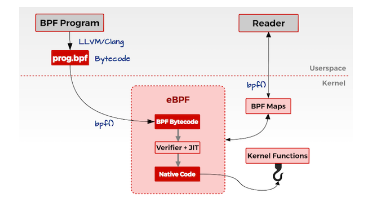
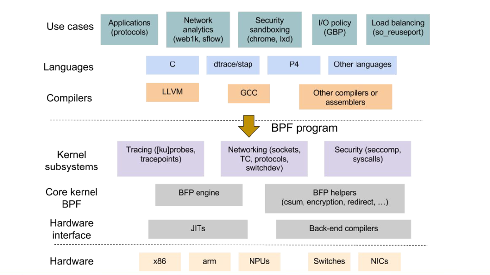
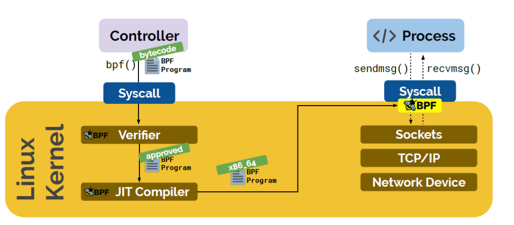
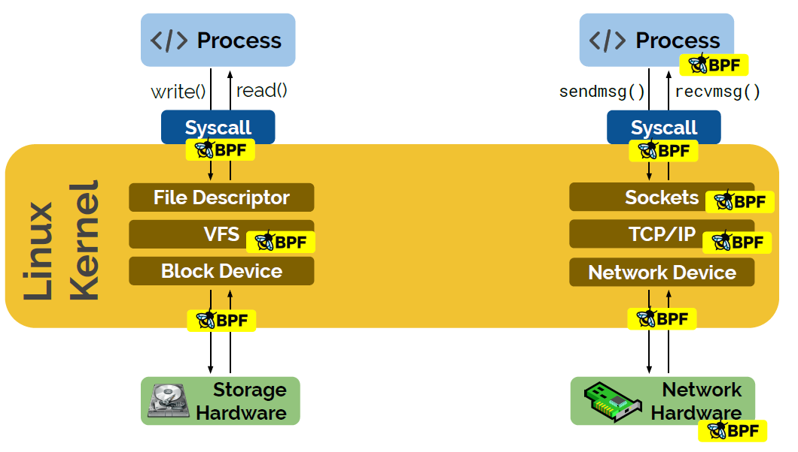
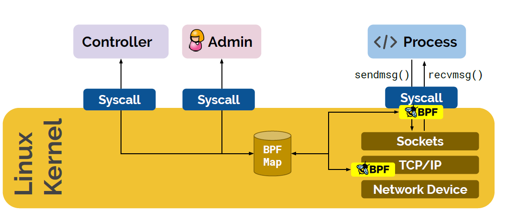

- [eBPF/Ftrace 双剑合璧：no space left on device 无处遁形](https://mp.weixin.qq.com/s/VuD20JgMQlbf-RIeCGniaA)
- [eBPF 经典入门指南](https://mp.weixin.qq.com/s/d6lOxtiEheegCduTpHXQew)
- [From XDP to Socket: Routing of packets beyond XDP with BPF](https://mp.weixin.qq.com/s/a8OAnprwxggnMEGRHodmMA)
- [eBPF and XDP](https://mp.weixin.qq.com/s/VmDfYDVlz7PVN6sz6HrIgg)
  - 新技术出现的历史原因
    - [iptables/netfilter](https://mp.weixin.qq.com/s?__biz=MzkyMTIzMTkzNA==&mid=2247506496&idx=1&sn=c629e22f0de944c0940ffb3a665b726f&chksm=c1842d11f6f3a407e2200d28da9033c23a411bdc64f85ddb756c0ff36d660eed38338e611d1f&scene=21#wechat_redirect)
      - iptables/netfilter 是上个时代Linux网络提供的优秀的防火墙技术，扩展性强，能够满足当时大部分网络应用需求
      - 存在很多明显问题
        - 路径太长
          - netfilter 框架在IP层，报文需要经过链路层，IP层才能被处理，如果是需要丢弃报文，会白白浪费很多CPU资源，影响整体性能；
        - O(N)匹配
          - 
        - 规则太多
          - netfilter 框架类似一套可以自由添加策略规则专家系统，并没有对添加规则进行合并优化，这些都严重依赖操作人员技术水平，随着规模的增大，规则数量n成指数级增长，而报文处理又是0（n）复杂度，最终性能会直线下降。
    - 内核协议栈
      - 随着互联网流量越来愈大, 网卡性能越来越强，Linux内核协议栈在10Mbps/100Mbps网卡的慢速时代是没有任何问题的，那个时候应用程序大部分时间在等网卡送上来数据。
      - 现在到了1000Mbps/10Gbps/40Gbps网卡的时代，数据被很快地收入，协议栈复杂处理逻辑，效率捉襟见肘，把大量报文堵在内核里。
        - 各类链表在多CPU环境下的同步开销。
        - 不可睡眠的软中断路径过长。
        - sk_buff的分配和释放。
        - 内存拷贝的开销。
        - 上下文切换造成的cache miss。
      - 内核协议栈各种优化措施应着需求而来
        - 网卡RSS，多队列。
        - 中断线程化。
        - 分割锁粒度。
    - 重构的思路很显然有两个：
      - upload方法：别让应用程序等内核了，让应用程序自己去网卡直接拉数据。
      - offload方法：别让内核处理网络逻辑了，让网卡自己处理。
    - 绕过内核就对了，内核协议栈背负太多历史包袱。
      - DPDK让用户态程序直接处理网络流，bypass掉内核，使用独立的CPU专门干这个事。
      - XDP让灌入网卡的eBPF程序直接处理网络流，bypass掉内核，使用网卡NPU专门干这个事。
  - eBPF到底是什么
    - 历史
      - BPF 是 Linux 内核中高度灵活和高效的类似虚拟机的技术，允许以安全的方式在各个挂钩点执行字节码。它用于许多 Linux 内核子系统，最突出的是网络、跟踪和安全
      - BPF 是一个通用目的 RISC 指令集，其最初的设计目标是：用 C 语言的一个子集编 写程序，然后用一个编译器后端（例如 LLVM）将其编译成 BPF 指令，稍后内核再通 过一个位于内核中的（in-kernel）即时编译器（JIT Compiler）将 BPF 指令映射成处理器的原生指令（opcode ），以取得在内核中的最佳执行性能。
      - 尽管 BPF 自 1992 年就存在，扩展的 Berkeley Packet Filter (eBPF) 版本首次出现在 Kernel3.18中，如今被称为“经典”BPF (cBPF) 的版本已过时。许多人都知道 cBPF是tcpdump使用的数据包过滤语言。现在Linux内核只运行 eBPF，并且加载的 cBPF 字节码在程序执行之前被透明地转换为内核中的eBPF表示
      - 
    - eBPF总体设计
      - BPF 不仅通过提供其指令集来定义自己，而且还通过提供围绕它的进一步基础设施，例如充当高效键/值存储的映射、与内核功能交互并利用内核功能的辅助函数、调用其他 BPF 程序的尾调用、安全加固原语、用于固定对象（地图、程序）的伪文件系统，以及允许将 BPF 卸载到网卡的基础设施。
      - LLVM 提供了一个 BPF后端，因此可以使用像 clang 这样的工具将 C 编译成 BPF 目标文件，然后可以将其加载到内核中。BPF与Linux 内核紧密相连，允许在不牺牲本机内核性能的情况下实现完全可编程。
      - 
    - 几个部分
      - ebpf Runtime
        - 
        - 安全保障 ： eBPF的verifier 将拒绝任何不安全的程序并提供沙箱运行环境
        - 持续交付： 程序可以更新在不中断工作负载的情况下
        - 高性能：JIT编译器可以保证运行性能
      - ebpf Hook
        - 
        - 内核函数 (kprobes)、用户空间函数 (uprobes)、系统调用、fentry/fexit、跟踪点、网络设备 (tc/xdp)、网络路由、TCP 拥塞算法、套接字（数据面）
      - ebpf Maps
        - 
        - 程序配置
        - 程序间共享数据
        - 和用户空间共享状态、指标和统计
      - ebpf Helper
  - Cilium
    - Cilium 是位于 Linux kernel 与容器编排系统的中间层。向上可以为容器配置网络，向下可以向 Linux 内核生成 BPF 程序来控制容器的安全性和转发行为。
    - 利用 Linux BPF，Cilium 保留了透明地插入安全可视性 + 强制执行的能力，但这种方式基于服务 /pod/ 容器标识（与传统系统中的 IP 地址识别相反），并且可以根据应用层进行过滤 （例如 HTTP）。因此，通过将安全性与寻址分离，Cilium 不仅可以在高度动态的环境中应用安全策略，而且除了提供传统的第 3 层和第 4 层分割之外，还可以通过在 HTTP 层运行来提供更强的安全隔离。
    - 对比传统容器网络（采用iptables/netfilter）
      - 
      - eBPF主机路由允许绕过主机命名空间中所有的 iptables 和上层网络栈，以及穿过Veth对时的一些上下文切换，以节省资源开销。网络数据包到达网络接口设备时就被尽早捕获，并直接传送到Kubernetes Pod的网络命名空间中。在流量出口侧，数据包同样穿过Veth对，被eBPF捕获后，直接被传送到外部网络接口上。eBPF直接查询路由表，因此这种优化完全透明。
      - 基于eBPF中的kube-proxy网络技术正在替换基于iptables的kube-proxy技术，与Kubernetes中的原始kube-proxy相比，eBPF中的kuber-proxy替代方案具有一系列重要优势，例如更出色的性能、可靠性以及可调试性等等。
  - BCC
    - BCC 是一个框架，它使用户能够编写嵌入其中的 eBPF 程序的 Python 程序。该框架主要针对涉及应用程序和系统分析/跟踪的用例，其中 eBPF 程序用于收集统计信息或生成事件，用户空间中的对应部分收集数据并以人类可读的形式显示。
  - XDP
    - XDP的全称是： eXpress Data Path -  是Linux 内核中提供高性能、可编程的网络数据包处理框架。
    - 
    - 直接接管网卡的RX数据包（类似DPDK用户态驱动）处理；
    - 通过运行BPF指令快速处理报文；
    - 和Linux协议栈无缝对接；
  - Ex
    - 下面是一个最小的完整 XDP 程序，实现丢弃包的功能（xdp-example.c）：
    ```c
    #include <linux/bpf.h>
    
    #ifndef __section
    # define __section(NAME)                  \
    __attribute__((section(NAME), used))
    #endif
    
    __section("prog")
    int xdp_drop(struct xdp_md *ctx)
    {
    return XDP_DROP;
    }
    
    char __license[] __section("license") = "GPL";
    ```
    - 用下面的命令编译并加载到内核：
    ```shell
    $ clang -O2 -Wall -target bpf -c xdp-example.c -o xdp-example.o
    $ ip link set dev em1 xdp obj xdp-example.o
    ```
- [AF_XDP](https://mp.weixin.qq.com/s/uPHVo-4rGZNvPXLKHPq9QQ)
  - AF_XDP的核心组件主要分为两个部分：AF_XDP socket和UMEM
    - 其中AF_XDP socket（xsk）的使用方法和传统的socket类似，AF_XDP支持用户通过socket()来创建一个xsk。每个xsk包含一个RX ring和TX ring，其中收包是在RX ring上进行的，发包则是在TX ring上面执行。用户也是通过操作RX ring和TX ring来实现网络数据帧的收发
    - UMEM是由一组大小相等的数据内存块所组成的。UMEM中每个数据块的地址可以用一个地址描述符来表述。地址描述符被定义为这些数据块在UMEM中的相对偏移。用户空间负责为UMEM分配内存，常用的方式是通过mmap进行分配。UMEM也包含两个ring，分别叫做FILL ring和COMPLETION ring。这些ring中保存着前面所说的地址描述符
    - 在收包前，用户将收包的地址描述符填充到FILL ring，然后内核会消费FILL ring开始收包，完成收包的地址描述符会被放置到xsk的RX ring中，用户程序消费RX ring即可获取接收到的数据帧。在发包时，用户程序向UMEM的地址描述符所引用的内存地址写入数据帧，然后填充到TX ring中，接下来内核开始执行发包。完成发包的地址描述符将被填充到COMPLETION ring中。
    - 为了让xsk成功地从网卡中收到网络数据帧，需要将xsk绑定到确定的网卡和队列。这样，从特定网卡队列接收到的数据帧，通过XDP_REDIRECT即可重定向到对应已绑定的xsk。
- [From XDP to Socket: Routing of packets beyond XDP with BPF](https://mp.weixin.qq.com/s/a8OAnprwxggnMEGRHodmMA)
- [基于eBPF的恶意利用与检测机制](https://tech.meituan.com/2022/04/07/how-to-detect-bad-ebpf-used-in-linux.html)
- [perf trace](https://mp.weixin.qq.com/s/dlyx-jUJ-CnL5efcWW9PXQ)
- [eBPF技术实战：加速容器网络转发](https://cloud.tencent.com/developer/article/2177278)
  - 利用 eBPF，略过 bridge、netfilter 等子系统，加速报文转发
  - 利用 bridge + veth 的转发模式，会多次经历netfilter、路由等子系统，过程非常冗长，导致了转发性能的下降
  - 优化
    - TC redirect
      - 内核协议栈主要支持的 eBPF hook 点 XDP（eXpress Data Path）、TC（Traffic Control）、LWT（Light Weight Tunnel）
      - 针对于容器网络转发的场景，比较合适的 hook 点是 TC。因为 TC hook 点是协议栈的入口和出口，比较底层，eBPF 程序能够获取非常全面的上下文
      - 利用 eBPF 在 TC 子系统注入转发逻辑，可以跳过内核协议栈非必须的流程，实现加速转发。收发两个方向的耗时分别减少40%左右，性能提升非常可观
      - 我们在收包路径上面仍然需要消耗 2 个软中断，才能将报文送往目的地。接下来我们看，如何利用 redirect peer 技术来优化这个流程
    - TC redirect peer - 加速收包路径
      - bpf_redirect_peer 会直接将数据包转发到 Pod 网络 namespace 中，避免了enqueue_to_backlog 操作，节省了一次软中断，性能理论上会有提升
- [eBPF 实现 OFF CPU Time 记录并生成火焰图](https://mp.weixin.qq.com/s/kPi78YnQkKkR0aShwjVViw)
- [Tracing a packet journey using Linux tracepoints, perf and eBPF](https://blog.yadutaf.fr/2017/07/28/tracing-a-packet-journey-using-linux-tracepoints-perf-ebpf/)


