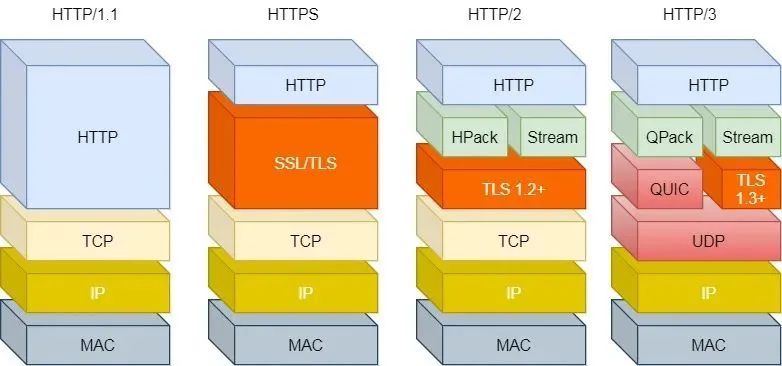
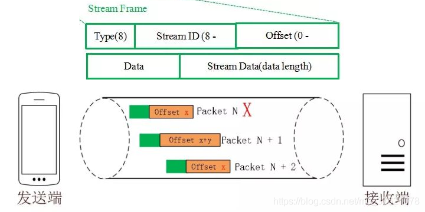
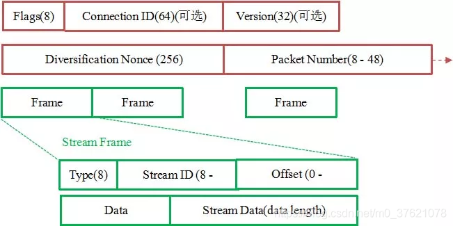
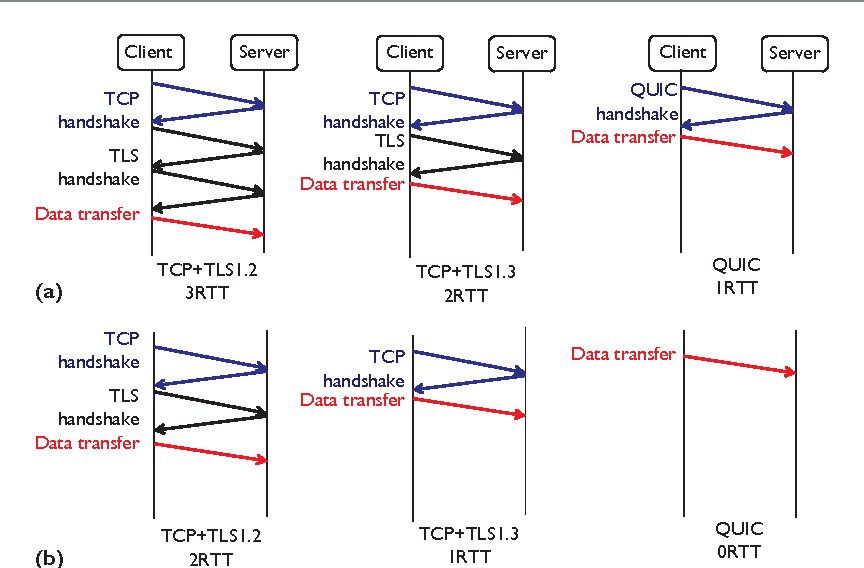
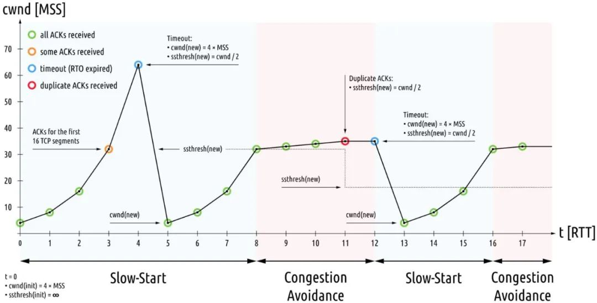
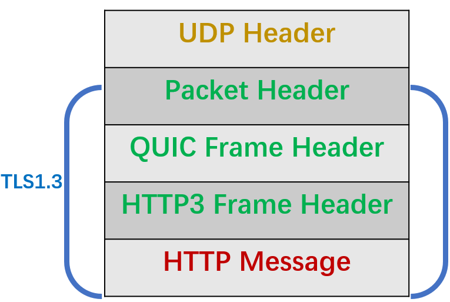
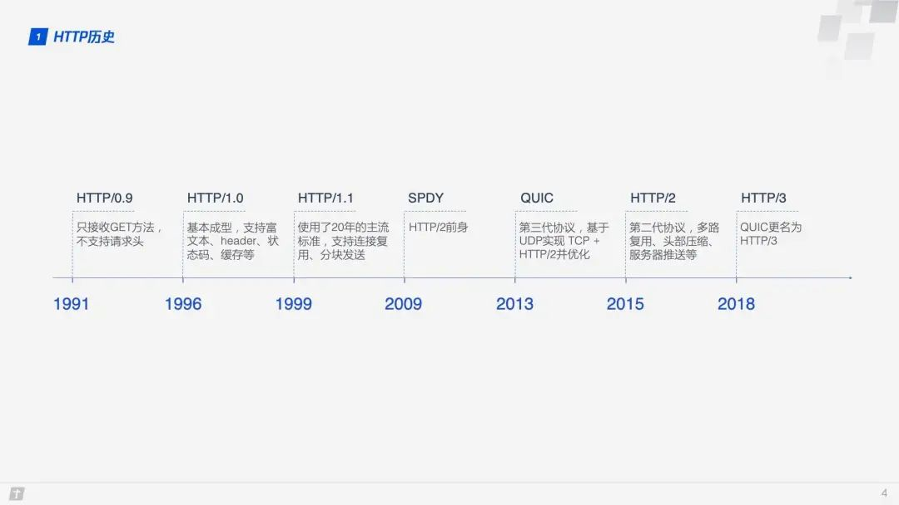

- [RSA 握手的过程](https://mp.weixin.qq.com/s?__biz=MzUxODAzNDg4NQ==&mid=2247487650&idx=1&sn=dfee83f6773a589c775ccd6f40491289&scene=21#wechat_redirect)
- [ECDHE 算法](https://www.cnblogs.com/xiaolincoding/p/14318338.html)
- [网络知识汇总](https://mp.weixin.qq.com/s?__biz=MzkyMTIzMTkzNA==&mid=2247563566&idx=1&sn=26156d79dffb3f0f10b6a26931f993cc&chksm=c1850e7ff6f28769b6ff3358366e917d3d54fc0f0563131422da4bed201768c958262b5d5a99&scene=21#wechat_redirect)
- [C10K到C10M高性能网络的探索与实践](https://mp.weixin.qq.com/s/Jap26lIutqpYSwbFfhb8eQ)
  - 优化
    - IO模型的优化 
      - epoll、kqueue、iocp，[io_ring](https://mp.weixin.qq.com/s?__biz=MzkyMTIzMTkzNA==&mid=2247562787&idx=1&sn=471a0956249ca789afad774978522717&chksm=c1850172f6f28864474f9832bfc61f723b5f54e174417d570a6b1e3f9f04bda7b539662c0bed&scene=21#wechat_redirect) 就是IO模型优化的一些最佳实践
      - 以epoll为例，在它的基础上抽象了一些开发框架和库. libevent、libev
    - CPU亲和性&内存局域性
      - 当前x86服务器以NUMA架构为主，这种平台架构下，每个CPU有属于自己的内存，如果当前CPU需要的数据需要到另外一颗CPU管理的内存获取，必然增加一些延时。
      - Linux提供了sched_set_affinity函数，我们可以在代码中，将我们的任务绑定在指定的CPU核心上。
      - 一些Linux发行版也在用户态中提供了numactl和taskset工具，通过它们也很容易让我们的程序运行在指定的节点上。
    - [RSS、RPS、RFS、XPS](https://mp.weixin.qq.com/s?__biz=MzkyMTIzMTkzNA==&mid=2247561718&idx=1&sn=f93ad69bff3ab80665e4b9d67265e6bd&chksm=c18506a7f6f28fb12341c3e439f998d09c4b1d93f8bf59af6b1c6f4427cea0c48b51244a3e53&scene=21#wechat_redirect)
      - RSS需要硬件的支持，目前主流的网卡都已支持，即俗称的多队列网卡，充分利用多个CPU核心，让数据处理的压力分布到多个CPU核心上去。
      - RPS和RFS在linux2.6.35的版本被加入，一般是成对使用的，在不支持RSS特性的网卡上，用软件来模拟类似的功能，并且将相同的数据流绑定到指定的核心上，尽可能提升网络方面处理的性能。
      - XPS特性在linux2.6.38的版本中被加入，主要针对多队列网卡在发送数据时的优化，当你发送数据包时，可以根据CPU MAP来选择对应的网卡队列，低于指定的kernel版本可能无法使用相关的特性，但是发行版已经backport这些特性。
    - IRQ 优化
      - 中断合并. 一次中断触发后，接下来用轮循的方式读取后续的数据包，以降低中断产生的数量，进而也提升了处理的效率
      - IRQ亲和性. 将不同的网卡队列中断处理绑定到指定的CPU核心上去，适用于拥有RSS特性的网卡。
    - 网络卸载的优化
      - TSO，以太网MTU一般为1500，减掉TCP/IP的包头，TCP的MaxSegment Size为1460，通常情况下协议栈会对超过1460的TCP Payload进行分段，保证最后生成的IP包不超过MTU的大小，对于支持TSO/GSO的网卡来说，协议栈就不再需要这样了，可以将更大的TCPPayload发送给网卡驱动，然后由网卡进行封包操作。通过这个手段，将需要在CPU上的计算offload到网卡上，进一步提升整体的性能
      - GSO为TSO的升级版，不在局限于TCP协议。
      - LRO和TSO的工作路径正好相反，在频繁收到小包时，每次一个小包都要向协议栈传递，对多个TCPPayload包进行合并，然后再传递给协议栈，以此来提升协议栈处理的效率。
      - GRO为LRO的升级版本，解决了LRO存在的一些问题。
    - Kernel 优化
      - 内核网络参数的调整在以下两处：`net.ipv4.*`参数和`net.core.*`参数
    - cache 优化
      - 对于在一条网络连接上的数据处理，尽可能保持在一个CPU核心上，以此换取CPUCache的利用率
      - 无锁数据结构，其是更多的都是编程上的一些技巧。
      - 保证你的数据结构尽可能在相同的CPU核心上进行处理，对于一个数据包相关的数据结构或者哈希表，在相同的类型实例上都保存一份，虽然增加了一些内存占用，但降低了资源冲突的概率
    - 内存优化
      - 尽可能的不要使用多级的指针嵌套
        - 多级的指针检索，有很大的机率触发你的CacheMiss。对于网络数据处理，尽可能将你的数据结构以及数据业务层面尽可能抽象更加扁平化一些，这是一个取舍的问题，也是在高性能面前寻求一个平衡点
      - Hugepage主要解决的问题就是TLB Miss的问题
        - 我们的内存几十G，上百G都已经是常态了。这种不对称的存在，造成了大内存在4k页面的时候产生了大量的TLB Miss
      - 内存预分配的问题
        - 对内存进行更精细化的管理，避免在内存分配上引入一些性能损失或容量损失
  - 探索和实践
    - 内核协议栈问题
      - 全局的队列，在我们在写用户态网络程序中，对同一个网络端口，仅允许一个监听实例，接收的数据包由一个队列来维护，并发的短连接请求较大时，会对这个队列造成较大的竞争压力，成为一个很大瓶颈点
        - 3.9的版本合并了一个很关键的特性SO_REUSEPORT，支持多个进程或线程监听相同的端口，每个实例分配一个独立的队列，一定程度上缓解这个问题。用更容易理解的角度来描述，就是支持了我们在用户态上对一个网络端口，可以有多个进程或线程去监听它。正是因为有这样一个特性，我们可以根据CPU的核心数量来进行端口监听实例的选择，进一步优化网络连接处理的性能。
      - 在linux kernel中有一个全局的连接表，用于维护TCP连接状态，这个表在维护大量的TCP连接时，会造成相当严重的资源竞争。总的来说，有锁的地方，有资源占用的地方都可能会成为瓶颈点。
    - 内核协议栈优化 - 网络数据包处理
      - 在收到数据包之后不进协议栈，把数据包的内存直接映射到用户态，让我们的程序在用户态直接可以看到这些数据。这样就绕过了kernel的处理
      - 利用了linuxUIO，这个特性叫UIO，比如当前流行的DPDK，通过这个模块框架我们可以在驱动程序收到数据包之后，直接放到用户态的内存空间中，也同样达到了绕过协议栈的目的。
- [Http协议各版本的对比](https://mp.weixin.qq.com/s/1TWisgy0wdN2dFMFSRZMUg)
  - http 1.1 - 增加长连接, 管道化, host字段: Host字段用来指定服务器的域名，这样就可以将多种请求发往同一台服务器上的不同网站，提高了机器的复用
  - http 2.0 - 服务端推送, 头部压缩, 多路复用, 二进制格式
    - 二进制分帧层binary framing layer
      - 二进制编码机制使得通信可以在单个TCP连接上进行
      - 二进制协议将通信数据分解为更小的帧，数据帧充斥在C/S之间的双向数据流中
      - 链接Link: 就是指一条C/S之间的TCP链接，这是个基础的链路数据的高速公路
      - 数据流Stream: 已建立的TCP连接内的双向字节流，TCP链接中可以承载一条或多条消息
      - 消息Message: 消息属于一个数据流，消息就是逻辑请求或响应消息对应的完整的一系列帧，也就是帧组成了消息
      - 帧Frame: 帧是通信的最小单位，每个帧都包含帧头和消息体，标识出当前帧所属的数据流
    - 多路复用
      - 由于2.0版本中使用新的二进制分帧协议突破了1.0的诸多限制，从根本上实现了真正的请求和响应多路复用
    - 首部压缩: HPACK算法
    - 服务端推送
    - HTTP2.0虽然性能已经不错了，还有什么不足吗？
      - 建立连接时间长(本质上是TCP的问题)
      - 队头阻塞问题
      - 移动互联网领域表现不佳(弱网环境
  - HTTP3.0又称为HTTP Over QUIC基于UDP协议的QUIC协
    - QUIC 
      - 队头阻塞问题可能存在于HTTP层和TCP层，在HTTP1.x时两个层次都存在该问题。
      - HTTP2.0协议的多路复用机制解决了HTTP层的队头阻塞问题，但是在TCP层仍然存在队头阻塞问题
      - TCP协议如果其中某个包丢失了，就必须等待重传，从而出现某个丢包数据阻塞整个连接的数据使用。
    - 0RTT 建链
      - RTT包括三部分：往返传播时延、网络设备内排队时延、应用程序数据处理时延。
      - 一般来说HTTPS协议要建立完整链接包括:TCP握手和TLS握手，总计需要至少2-3个RTT，普通的HTTP协议也需要至少1个RTT才可以完成握手。
      - QUIC协议可以实现在第一个包就可以包含有效的应用数据，从而实现0RTT0RTT也是需要条件的，对于第一次交互的客户端和服务端0RTT也是做不到的，毕竟双方完全陌生。
      - 连接迁移
        - QUIC协议基于UDP实现摒弃了五元组的概念，使用64位的随机数作为连接的ID，并使用该ID表示连接
- [体验 http3: 基于 nginx quic 分支](https://mp.weixin.qq.com/s/ynqqlSOIOSyp6USynEtrEg)
- [HTTP服务优雅关闭中出现的小插曲](https://mp.weixin.qq.com/s/HY82uS2eYzt7cHqvdHKF-Q)
  - ListenAndServe 总是返回一个非空错误，在调用Shutdown或者Close方法后，返回的错误是ErrServerClosed。
    ```go
    go func() {
      if err := h.server.ListenAndServe(); nil != err {
       if err == http.ErrServerClosed {
        h.logger.Infof("[HTTPServer] http server has been close, cause:[%v]", err)
       }else {
        h.logger.Fatalf("[HTTPServer] http server start fail, cause:[%v]", err)
       }
      }
    }()
    ```
- [QUIC 是如何解决TCP性能瓶颈的](https://mp.weixin.qq.com/s?__biz=MzkyMTIzMTkzNA==&mid=2247541229&idx=1&sn=1179980ab7817614ebd57a741b2326d2&chksm=c184d6bcf6f35faa7d4682f7e69c55e5bec603b3f2d2fa0dd3f0ce932019f7b3d336a7ddb6a4&scene=178&cur_album_id=1843108380194750466#rd)
  - 
  - 一、QUIC 如何解决TCP的队头阻塞问题？
    
    - 1.1 TCP 为何会有队头阻塞问题
      - TCP 采用ACK确认和超时重传机制来保证数据包的可靠交付
      - 逐个发送数据包，等待确认应答到来后再发送下一个数据包，效率太低了，TCP 采用滑动窗口机制来提高数据传输效率
      - TCP 因为超时确认或丢包引起的滑动窗口阻塞问题
      - HTTP/2 在应用协议层通过多路复用解决了队头阻塞问题(使用Stream ID 来标识当前数据流属于哪个资源请求，这同时也是数据包多路复用传输到接收端后能正常组装的依据)，但TCP 在传输层依然存在队头阻塞问题，这是TCP 协议的一个主要性能瓶颈
    - 1.2 QUIC 如何解决队头阻塞问题
      - TCP 队头阻塞的主要原因是数据包超时确认或丢失阻塞了当前窗口向右滑动，我们最容易想到的解决队头阻塞的方案是不让超时确认或丢失的数据包将当前窗口阻塞在原地
      - QUIC 同样是一个可靠的协议，它使用 Packet Number 代替了 TCP 的 Sequence Number，并且每个 Packet Number 都严格递增，也就是说就算 Packet N 丢失了，重传的 Packet N 的 Packet Number 已经不是 N，而是一个比 N 大的值，比如Packet N+
      - QUIC 支持乱序确认，当数据包Packet N 丢失后，只要有新的已接收数据包确认，当前窗口就会继续向右滑动
      - 重传的数据包Packet N+M 和丢失的数据包Packet N 单靠Stream ID 的比对一致仍然不能判断两个数据包内容一致，还需要再新增一个字段Stream Offset，标识当前数据包在当前Stream ID 中的字节偏移量。有了Stream Offset 字段信息，属于同一个Stream ID 的数据包也可以乱序传输了
      - 
      - QUIC 通过单向递增的Packet Number，配合Stream ID 与 Offset 字段信息，可以支持非连续确认应答Ack而不影响数据包的正确组装，摆脱了TCP 必须按顺序确认应答Ack 的限制（也即不能出现非连续的空位），解决了TCP 因某个数据包重传而阻塞后续所有待发送数据包的问题（也即队头阻塞问题）
    - 1.3 QUIC 没有队头阻塞的多路复用
      - 
      - 同一个Connection ID 可以同时传输多个Stream ID，由于QUIC 支持非连续的Packet Number 确认，某个Packet N 超时确认或丢失，不会影响其它未包含在该数据包中的Stream Frame 的正常传输。
      - HTTP/2 中如果TCP 出现丢包，TLS 也会因接收到的数据不完整而无法对其进行处理，也即HTTP/2 中的TLS 协议层也存在队头阻塞问题，该问题如何解决呢？
      - 既然TLS 协议是因为接收数据不完整引起的阻塞，我们只需要让TLS 加密认证过程基于一个独立的Packet，不对多个Packet 同时进行加密认证，就能解决TLS 协议层出现的队头阻塞问题
  - 二、QUIC 如何优化TCP 的连接管理机制？
    - 2.1 TCP连接的本质是什么
      - TCP 连接主要是双方记录并同步维护的状态组成的。一般来说，建立连接是为了维护前后分组数据的承继关系，维护前后承继关系最常用的方法就是对其进行状态记录和管理。
      - TCP 的状态管理可以分为连接状态管理和分组数据状态管理两种，连接状态管理用于双方同步数据发送与接收状态，分组数据状态管理用于保证数据的可靠传输。
    - 2.2 QUIC 如何减少TCP 建立连接的开销
      - 
      - TCP 建立连接需要三次握手过程，第三次握手报文发出后不需要等待应答回复就可以发送数据报文了，所以TCP 建立连接的开销为 1-RTT
      - TLS 简短握手过程是将之前完整握手过程协商的信息记录下来，以Session Ticket 的形式传输给客户端，如果想恢复之前的会话连接，可以将Session Ticket 发送给服务器，就能通过简短的握手过程重建或者恢复之前的连接，通过复用之前的握手信息可以节省 1-RTT 的连接建立开销
      - TCP 也提供了快速建立连接的方案 TFO (TCP Fast Open)，原理跟TLS 类似，也是将首次建立连接的状态信息记录下来，以Cookie 的形式传输给客户端，如果想复用之前的连接，可以将Cookie 发送给服务器，如果服务器通过验证就能快速恢复之前的连接，TFO 技术可以通过复用之前的连接将连接建立开销缩短为 0-RTT
      - QUIC 可以理解为”TCP + TLS 1.3“（QUIC 是基于UDP的，可能使用的是DTLS 1.3），QUIC 自然也实现了首次建立连接的开销为 1-RTT，快速恢复先前连接的开销为 0-RTT 的效率。
    - 2.3 QUIC 如何实现连接的无感迁移
      - 每个网络连接都应该有一个唯一的标识，用来辨识并区分特定的连接。TCP 连接使用<Source IP, Source Port, Target IP, Target Port> 这四个信息共同标识
      - QUIC 数据包结构中有一个Connection ID 字段专门标识连接，Connection ID 是一个64位的通用唯一标识UUID (Universally Unique IDentifier)。借助Connection ID，QUIC 的连接不再绑定IP 与 Port 信息，即便因为网络迁移或切换导致Source IP 和Source Port 发生变化，只要Connection ID 不变就仍是同一个连接
  - 三、QUIC 如何改进TCP 的拥塞控制机制？
    - 3.1 TCP 拥塞控制机制的瓶颈在哪？
      - 
      - 一个是目前接收窗口的大小，通过接收端的实际接收能力来控制发送速率的机制称为流量控制机制；
      - 另一个是目前拥塞窗口的大小，通过慢启动和拥塞避免算法来控制发送速率的机制称为拥塞控制机制，TCP 发送窗口大小被限制为不超过接收窗口和拥塞窗口的较小值。
    - 3.2 QUIC 如何降低重传概率
      - QUIC 采用单向递增的Packet Number 来标识数据包，原始请求的数据包与重传请求的数据包编号并不一样，自然也就不会引起重传的歧义性，采样RTT 的测量更准确
      - 
      - QUIC 计算RTT 时除去了接收端的应答延迟时间，更准确的反映了网络往返时间，进一步提高了RTT 测量的准确性，降低了数据包超时重传的概率
      - QUIC 引入了前向冗余纠错码（FEC: Fowrard Error Correcting），如果接收端出现少量（不超过FEC的纠错能力）的丢包或错包，可以借助冗余纠错码恢复丢失或损坏的数据包，这就不需要再重传该数据包了，降低了丢包重传概率，自然就减少了拥塞控制机制的触发次数，可以维持较高的网络利用效率。
    - 3.3 QUIC 如何改进拥塞控制机制
      - TCP 的拥塞控制实际上包含了四个算法：慢启动、拥塞避免、快速重传、快速恢复. 由于TCP 内置于操作系统，拥塞控制算法的更新速度太过缓慢，跟不上网络环境改善速度，TCP 落后的拥塞控制算法自然会降低网络利用效率
      - QUIC 协议当前默认使用了 TCP 的 Cubic 拥塞控制算法，同时也支持 CubicBytes、Reno、RenoBytes、[BBR](https://mp.weixin.qq.com/s?__biz=MzkyMTIzMTkzNA==&mid=2247540557&idx=1&sn=958c13feee4aa384cdac8435eff55c5e&chksm=c184a81cf6f3210a7c3f309d054592e99a2845e9cf93f58aeefa58001304c7c0268283da684d&scene=21#wechat_redirect)、PCC 等拥塞控制算法
      - QUIC 是处于应用层的，可以随浏览器更新，QUIC 的拥塞控制算法就可以有较快的迭代速度，在TCP 的拥塞控制算法基础上快速迭代，可以跟上网络环境改善的速度，尽快提高拥塞恢复的效率。
- [如何用 UDP 实现可靠传输 QUIC](https://mp.weixin.qq.com/s/7sv34Vtueo-dvzjDimP_ZQ)
  - TCP 协议四个方面的缺陷：
    - 升级 TCP 的工作很困难；
    - TCP 建立连接的延迟；
    - TCP 存在队头阻塞问题；
    - 网络迁移需要重新建立 TCP 连接
  - QUIC 是如何实现可靠传输的？
    - Header Overview
      - 
    - Packet Header
      - 
      - Packet Header 首次建立连接时和日常传输数据时使用的 Header 是不同的
        - Long Packet Header 用于首次建立连接。
          - QUIC 也是需要三次握手来建立连接的，主要目的是为了确定连接 ID
          - 建立连接时，连接 ID 是由服务器根据客户端的 Source Connection ID 字段生成的，这样后续传输时，双方只需要固定住 Destination Connection ID（连接 ID ），从而实现连接迁移功能。
        - Short Packet Header 用于日常传输数据。
          - Short Packet Header 中的 Packet Number 是每个报文独一无二的编号，它是严格递增的，也就是说就算 Packet N 丢失了，重传的 Packet N 的 Packet Number 已经不是 N，而是一个比 N 大的值。
          - 为什么要这么设计呢？
            - TCP 在重传报文时的序列号和原始报文的序列号是一样的，也正是由于这个特性，引入了 TCP 重传的歧义问题. 导致RTT 计算不精确，那么 RTO （超时时间）也就不精确
              - 可以更加精确计算 RTT，没有 TCP 重传的歧义性问题
            - QUIC 使用的 Packet Number 单调递增的设计，可以让数据包不再像TCP 那样必须有序确认，QUIC 支持乱序确认，当数据包Packet N 丢失后，只要有新的已接收数据包确认，当前窗口就会继续向右滑动
              - 可以支持乱序确认，防止因为丢包重传将当前窗口阻塞在原地，而 TCP 必须是顺序确认的，丢包时会导致窗口不滑动；就不会因为丢包重传将当前窗口阻塞在原地，从而解决了队头阻塞问题。
    - QUIC Frame Header
      - 一个 Packet 报文中可以存放多个 QUIC Frame。
      - 每一个 Frame 都有明确的类型，针对类型的不同，功能也不同
        - 举例  Stream 类型的 Frame 格式，Stream 可以认为就是一条 HTTP 请求
        - Stream ID 作用：多个并发传输的 HTTP 消息，通过不同的 Stream ID 加以区别；
        - Offset 作用：类似于 TCP 协议中的 Seq 序号，保证数据的顺序性和可靠性；
      - Packet Number 是严格递增，即使重传报文的 Packet Number 也是递增的，既然重传数据包的 Packet N+M 与丢失数据包的 Packet N 编号并不一致，我们怎么确定这两个数据包的内容一样呢？
        - 所以引入 Frame Header 这一层，通过 Stream ID + Offset 字段信息实现数据的有序性，通过比较两个数据包的 Stream ID 与 Stream Offset ，如果都是一致，就说明这两个数据包的内容一致。
      - QUIC 通过单向递增的 Packet Number，配合 Stream ID 与 Offset 字段信息，可以支持乱序确认而不影响数据包的正确组装，摆脱了TCP 必须按顺序确认应答 ACK 的限制，解决了 TCP 因某个数据包重传而阻塞后续所有待发送数据包的问题。
  - QUIC 是如何解决 TCP 队头阻塞问题的
    - 什么是 TCP 队头阻塞问题
      - TCP 队头阻塞的问题要从两个角度看，一个是发送窗口的队头阻塞，另外一个是接收窗口的队头阻塞。
      - TCP 层为了保证数据的有序性，只有在处理完有序的数据后，滑动窗口才能往前滑动，否则就停留。
    - HTTP/2 的队头阻塞
      - HTTP/2 通过抽象出 Stream 的概念，实现了 HTTP 并发传输，一个 Stream 就代表 HTTP/1.1 里的请求和响应。
      - 在 HTTP/2 连接上，不同 Stream 的帧是可以乱序发送的（因此可以并发不同的 Stream ），因为每个帧的头部会携带 Stream ID 信息，所以接收端可以通过 Stream ID 有序组装成 HTTP 消息，而同一 Stream 内部的帧必须是严格有序的
      - 但是 HTTP/2 多个 Stream 请求都是在一条 TCP 连接上传输，这意味着多个 Stream 共用同一个 TCP 滑动窗口，那么当发生数据丢失，滑动窗口是无法往前移动的，此时就会阻塞住所有的 HTTP 请求，这属于 TCP 层队头阻塞。
    - 没有队头阻塞的 QUIC
      - QUIC 也借鉴 HTTP/2 里的 Stream 的概念，在一条 QUIC 连接上可以并发发送多个 HTTP 请求 (Stream)
      - QUIC 给每一个 Stream 都分配了一个独立的滑动窗口，这样使得一个连接上的多个 Stream 之间没有依赖关系，都是相互独立的，各自控制的滑动窗口
  - QUIC 是如何做流量控制的
    - TCP 流量控制
      - 通过让「接收方」告诉「发送方」，它（接收方）的接收窗口有多大，从而让「发送方」根据「接收方」的实际接收能力控制发送的数据量
      - TCP 的接收窗口在收到有序的数据后，接收窗口才能往前滑动，否则停止滑动；TCP 的发送窗口在收到对已发送数据的顺序确认 ACK后，发送窗口才能往前滑动，否则停止滑动。
    - QUIC 实现了两种级别的流量控制，分别为 Stream 和 Connection 两种级别：
      - Stream 级别的流量控制：每个 Stream 都有独立的滑动窗口，所以每个 Stream 都可以做流量控制，防止单个 Stream 消耗连接（Connection）的全部接收缓冲。
        - QUIC 协议中同一个 Stream 内，滑动窗口的移动仅取决于接收到的最大字节偏移（尽管期间可能有部分数据未被接收），而对于 TCP 而言，窗口滑动必须保证此前的 packet 都有序的接收到了，其中一个 packet 丢失就会导致窗口等待。
      - Connection 流量控制：限制连接中所有 Stream 相加起来的总字节数，防止发送方超过连接的缓冲容量。
  - QUIC 对拥塞控制改进
    - QUIC 协议当前默认使用了 TCP 的 Cubic 拥塞控制算法（我们熟知的慢开始、拥塞避免、快重传、快恢复策略），同时也支持 CubicBytes、Reno、RenoBytes、BBR、PCC 等拥塞控制算法，相当于将 TCP 的拥塞控制算法照搬过来了
    - QUIC 是处于应用层的，应用程序层面就能实现不同的拥塞控制算法，不需要操作系统，不需要内核支持. QUIC 可以随浏览器更新，QUIC 的拥塞控制算法就可以有较快的迭代速度。
    - QUIC 处于应用层，所以就可以针对不同的应用设置不同的拥塞控制算法，这样灵活性就很高了
  - QUIC 更快的连接建立
    - 对于 HTTP/1 和 HTTP/2 协议，TCP 和 TLS 是分层的，分别属于内核实现的传输层、openssl 库实现的表示层，因此它们难以合并在一起，需要分批次来握手，先 TCP 握手（1RTT），再 TLS 握手（2RTT），所以需要 3RTT 的延迟才能传输数据，就算 Session 会话服用，也需要至少 2 个 RTT。
    - HTTP/3 在传输数据前虽然需要 QUIC 协议握手，这个握手过程只需要 1 RTT，握手的目的是为确认双方的「连接 ID」，连接迁移就是基于连接 ID 实现的
    - 但是 HTTP/3 的 QUIC 协议并不是与 TLS 分层，而是QUIC 内部包含了 TLS，它在自己的帧会携带 TLS 里的“记录”，再加上 QUIC 使用的是 TLS1.3，因此仅需 1 个 RTT 就可以「同时」完成建立连接与密钥协商，甚至在第二次连接的时候，应用数据包可以和 QUIC 握手信息（连接信息 + TLS 信息）一起发送，达到 0-RTT 的效果。
  - QUIC 是如何迁移连接的
    - 基于 TCP 传输协议的 HTTP 协议，由于是通过四元组（源 IP、源端口、目的 IP、目的端口）确定一条 TCP 连接
    - QUIC 协议没有用四元组的方式来“绑定”连接，而是通过连接 ID来标记通信的两个端点，客户端和服务器可以各自选择一组 ID 来标记自己，因此即使移动设备的网络变化后，导致 IP 地址变化了，只要仍保有上下文信息（比如连接 ID、TLS 密钥等），就可以“无缝”地复用原连接，消除重连的成本，没有丝毫卡顿感，达到了连接迁移的功能。
- [服务端不想接收 http 的 body 的时候，该怎么优雅的拒绝呢](https://mp.weixin.qq.com/s/J1vcjMdnbFY-jPP5KoiwLw)
  - 为什么会出现服务端不想接收客户端的 body
    - S3 服务的鉴权可以放在 header 里，数据放在 body 里。如果客户端的参数鉴权不过，或者参数非法。这种的请求服务端根本不想多看 body 一眼
  - 什么叫做优雅的拒绝
    - 优雅指的是，客户端发请求数据的过程不会有任何异常，服务端回响应的过程也不会有任何异常
    - 最常见的异常：
      - 客户端发数据的时候，发现连接已经不在，那么就会导致服务端发送 Reset 包给客户端。客户端的感知就会出现 write broken，connection close by peer 等等异常。
      - 服务端收数据的时候，还没收够呢，就读到 EOF，这种体现的就是 Unexpected EOF ；
  - 怎么解决呢
    - TCP 层（ socket ）能解决 ：使用 linger close 的特性
      - `setsockopt(fd, SOL_SOCKET, SO_LINGER, (void *)&st_linger, &sizeof(st_linger));`
      - Linux 操作系统就提供了一个叫做延迟关闭的特性。当调用 close() 来关闭一个 TCP 连接的时候，如果 socket fd 设置了 linger close 的特性，那么这条 TCP 连接并不会立即关闭连接，内核会延迟一段时间。会继续读 TCP 连接里的数据，直到读完或者超时时间到了之后。
    - http 协议层解决：使用 100 continue 特性
      - 就是在发送 body 之前，再加一个协商的确认，服务端确认会处理这个 body，客户端才发送。这样就不存在 body 发送了又被拒绝的问题了
      - 100-continue 有两个局限性：
        - 小请求会带来很大的开销，之前只需要交互 1 次即可。加入了 100-continue 机制，那么一定会放大成 2 次。开销翻倍。
        - 并不是所有的 server 支持 100-continue 协议，这个对服务端来说是非强制的。
    - 业务层自己解决：比如 S3 服务端，自己掏空 body ，再断开连接
      - 原理很简单：数据你可以不存，但是不能不读 `_, err := io.CopyN(ioutil.Discard, w.reqBody, maxPostHandlerReadBytes+1)`
      - 但要考量几个因素：
        - 难道客户端发 10G 的数据在路上，我也要读完？ - 读的数据量有约束，比如不超过 1M
        - 难道客户端发 24 个小时都发不完的数据，我也要读完？ - 读的时间有约束，比如不超过 30 秒 
  - 来看看 nginx 的实现
    - 不是使用操作系统 socket 的 linger close ，而是 nginx 自己实现的，nginx 自己掏的数据。lingering_close 有三个选项。
      ```shell
      // 默认行为。试着读完剩余的数据。
      lingering_close on
      // 不管三七二十一，总是要掏空连接的数据
      lingering_close always
      // 关闭延迟关闭的特性
      lingering_close off
      ```
    - 还有另外两个跟时间相关的开关：
      - lingering_time ：请求关闭的时间超过一个阈值，那么无论还有没有数据，都要关闭；
      - lingering_timeout ：一段时间内，一点数据都没有？那关闭连接
- [剖析HTTP3协议](https://zhuanlan.zhihu.com/p/431672713?utm_source=wechat_session&utm_medium=social&utm_oi=33332939194368&utm_campaign=shareopn&wechatShare=2&s_r=0)
  - HTTP3协议解决了HTTP2问题
    - 基于TCP实现的HTTP2遗留下3个问题
      - 有序字节流引出的队头阻塞（Head-of-line blocking），使得HTTP2的多路复用能力大打折扣；
      - TCP与TLS叠加了握手时延，建链时长还有1倍的下降空间；
      - 基于TCP四元组确定一个连接，这种诞生于有线网络的设计，并不适合移动状态下的无线网络，这意味着IP地址的频繁变动会导致TCP连接、TLS会话反复握手，成本高昂
    - HTTP3协议解决了这些问题
      - HTTP3基于UDP协议重新定义了连接，在QUIC层实现了无序、并发字节流的传输，解决了队头阻塞问题（包括基于QPACK解决了动态表的队头阻塞）；
      - HTTP3重新定义了TLS协议加密QUIC头部的方式，既提高了网络攻击成本，又降低了建立连接的速度（仅需1个RTT就可以同时完成建链与密钥协商）；
      - HTTP3 将Packet、QUIC Frame、HTTP3 Frame分离，实现了连接迁移功能，降低了5G环境下高速移动设备的连接维护成本。
  - HTTP3协议到底是什么
    - QUIC层由 https://tools.ietf.org/html/draft-ietf-quic-transport-29描述，它定义了连接、报文的可靠传输、有序字节流的实现；
    - TLS协议会将QUIC层的部分报文头部暴露在明文中，方便代理服务器进行路由。https://tools.ietf.org/html/draft-ietf-quic-tls-29规范定义了QUIC与TLS的结合方式；
    - 丢包检测、RTO重传定时器预估等功能由 https://tools.ietf.org/html/draft-ietf-quic-recovery-29定义，目前拥塞控制使用了类似TCP New RENO的算法，未来有可能更换为基于带宽检测的算法（例如BBR）；
    - 在HTTP2中，由HPACK规范定义HTTP头部的压缩算法。由于HPACK动态表的更新具有时序性，无法满足HTTP3的要求。在HTTP3中，QPACK定义HTTP头部的编码：https://tools.ietf.org/html/draft-ietf-quic-qpack-16。
  - 连接迁移功能是怎样实现的
    - 对于当下的HTTP1和HTTP2协议，传输请求前需要先完成耗时1个RTT的TCP三次握手、耗时1个RTT的TLS握手（TLS1.3），由于它们分属内核实现的传输层、openssl库实现的表示层，所以难以合并在一起
    - 
      - Packet Header实现了可靠的连接。当UDP报文丢失后，通过Packet Header中的Packet Number实现报文重传。连接也是通过其中的Connection ID字段定义的；
        - 为了进一步提升网络传输效率，Packet Header又可以细分为两种：
        - Long Packet Header用于首次建立连接；
          - 建立连接时，连接是由服务器通过Source Connection ID字段分配的，这样，后续传输时，双方只需要固定住Destination Connection ID，就可以在客户端IP地址、端口变化后，绕过UDP四元组（与TCP四元组相同），实现连接迁移功能。
        - Short Packet Header用于日常传输数据
          - 不再需要传输Source Connection ID字段了
          - Packet Number是每个报文独一无二的序号，基于它可以实现丢失报文的精准重发。如果你通过抓包观察Packet Header，会发现Packet Number被TLS层加密保护了，这是为了防范各类网络攻击的一种设计
      - QUIC Frame Header在无序的Packet报文中，基于QUIC Stream概念实现了有序的字节流，这允许HTTP消息可以像在TCP连接上一样传输；
      - HTTP3 Frame Header定义了HTTP Header、Body的格式，以及服务器推送、QPACK编解码流等功能。
  - Stream多路复用时的队头阻塞是怎样解决的
    - 解决队头阻塞的方案，就是允许微观上有序发出的Packet报文，在接收端无序到达后也可以应用于并发请求中
    - 在Packet Header之上的QUIC Frame Header，定义了有序字节流Stream，而且Stream之间可以实现真正的并发。每个Stream就像HTTP1中的TCP连接，它保证了承载的HEADERS frame（存放HTTP Header）、DATA frame（存放HTTP Body）是有序到达的，多个Stream之间可以并行传输
    - 一个Packet报文中可以存放多个QUIC Frame，当然所有Frame的长度之和不能大于PMTUD（Path Maximum Transmission Unit Discovery，这是大于1200字节的值
    - Stream Frame头部的3个字段，完成了多路复用、有序字节流以及报文段层面的二进制分隔功能，包括：
      - Stream ID标识了一个有序字节流。当HTTP Body非常大，需要跨越多个Packet时，只要在每个Stream Frame中含有同样的Stream ID，就可以传输任意长度的消息。多个并发传输的HTTP消息，通过不同的Stream ID加以区别；
      - 消息序列化后的“有序”特性，是通过Offset字段完成的，它类似于TCP协议中的Sequence序号，用于实现Stream内多个Frame间的累计确认功能；
      - Length指明了Frame数据的长度。
  - QPACK编码是如何解决队头阻塞问题的
    - 与HTTP2中的HPACK编码方式相似，HTTP3中的QPACK也采用了静态表、动态表及Huffman编码
    - 动态表，就是将未包含在静态表中的Header项，在其首次出现时加入动态表，这样后续传输时仅用1个数字表示，大大提升了编码效率。因此，动态表是天然具备时序性的，如果首次出现的请求出现了丢包，后续请求解码HPACK头部时，一定会被阻塞！
    - QPACK是如何解决队头阻塞问题的呢？事实上，QPACK将动态表的编码、解码独立在单向Stream中传输，仅当单向Stream中的动态表编码成功后，接收端才能解码双向Stream上HTTP消息里的动态表索引。
    - 当Stream ID是0、4、8、12时，这就是客户端发起的双向Stream（HTTP3不支持服务器发起双向Stream），它用于传输HTTP请求与响应
    - 由于HTTP3的STREAM之间是乱序传输的，因此，若先发送的编码Stream后到达，双向Stream中的QPACK头部就无法解码，此时传输HTTP消息的双向Stream就会进入Block阻塞状态（两端可以通过控制帧定义阻塞Stream的处理方式）。
- [深入理解HTTP/3协议](https://mp.weixin.qq.com/s/RX_dMXMfv7NMZMroCz49tA)
  - HTTP History
    - 
    - HTTP2协议虽然大幅提升了HTTP/1.1的性能，然而，基于TCP实现的HTTP2遗留下3个问题：
      - 有序字节流引出的队头阻塞（Head-of-line blocking），使得HTTP2的多路复用能力大打折扣；
      - TCP与TLS叠加了握手时延，建链时长还有1倍的下降空间；
      - 基于TCP四元组确定一个连接，这种诞生于有线网络的设计，并不适合移动状态下的无线网络，这意味着IP地址的频繁变动会导致TCP连接、TLS会话反复握手，成本高昂。
    - HTTP3协议解决了这些问题：
      - HTTP3基于UDP协议重新定义了连接，在QUIC层实现了无序、并发字节流的传输，解决了队头阻塞问题（包括基于QPACK解决了动态表的队头阻塞）；
      - HTTP3重新定义了TLS协议加密QUIC头部的方式，既提高了网络攻击成本，又降低了建立连接的速度（仅需1个RTT就可以同时完成建链与密钥协商）；
      - HTTP3 将Packet、QUIC Frame、HTTP3 Frame分离，实现了连接迁移功能，降低了5G环境下高速移动设备的连接维护成本。
  - QUIC 协议
    - 
    - QUIC是用来替代TCP, SSL/TLS的传输层协议. HTTP over QUIC即HTTP/3的含义
    - 0 RTT建立连接
      - HTTP/2的连接
        - HTTP/2的连接建立需要3 RTT, 如果考虑会话复用, 即把第一次握手计算出来的对称密钥缓存起来, 那也需要2 RTT. 
        - 更进一步的, 如果TLS升级到1.3, 那么HTTP/2连接需要2RTT, 考虑会话复用需要1RTT. 
      - HTTP/3首次连接只需要1RTT, 后面的链接只需要0RTT
    - 连接迁移
      - QUIC不以四元素作为表示, 而是使用一个64位的随机数, 这个随机数被称为Connection ID, 即使IP或者端口发生变化, 只要Connection ID没有变化, 那么连接依然可以维持.
    - 队头阻塞/多路复用
      - HTTP/1.1和HTTP/2都存在队头阻塞的问题(Head Of Line blocking)
        - 一个TCP连接同时传输10个请求, 其中1,2,3个请求给客户端接收, 但是第四个请求丢失, 那么后面第5-10个请求都被阻塞. 需要等第四个请求处理完毕后才能被处理. 这样就浪费了带宽资源.
      - HTTP/2
        - HTTP/2的多路复用解决了上述的队头阻塞问题. 在HTTP/2中, 每个请求都被拆分为多个Frame通过一条TCP连接同时被传输, 这样即使一个请求被阻塞, 也不会影响其他的请求.
        - 但HTTP/2的基础TCP协议本身却也存在队头阻塞的问题.
          - HTTP/2的每个请求都会被拆分成多个Frame, 不同请求的Frame组合成Stream, Stream是TCP上的逻辑传输单元, 这样HTTP/2就达到了一条连接同时发送多个请求的目标, 其中Stram1已经正确送达, Stram2中的第三个Frame丢失, TCP处理数据是有严格的前后顺序, 先发送的Frame要先被处理, 这样就会要求发送方重新发送第三个Frame, Steam3和Steam4虽然已到达但却不能被处理, 那么这时整条链路都会被阻塞.
        - 由于HTTP/2必须使用HTTPS, 而HTTPS使用TLS协议也存在队头阻塞问题. 
          - TLS基于Record组织数据, 将一对数据放在一起加密, 加密完成后又拆分成多个TCP包传输. 一般每个Record 16K, 包含12个TCP包, 这样如果12个TCP包中有任何一个包丢失, 那么整个Record都无法解密.
        - 队头阻塞会导致HTTP/2在更容易丢包的弱网络环境下比HTTP/1.1更慢.
      - QUIC
        - QUIC是如何解决队头阻塞的问题的? 主要有两点:
          - QUIC的传输单位是Packet, 加密单元也是Packet, 整个加密, 传输, 解密都基于Packet, 这就能避免TLS的阻塞问题.
          - QUIC基于UDP, UDP的数据包在接收端没有处理顺序, 即使中间丢失一个包, 也不会阻塞整条连接. 其他的资源会被正常处理.
    - 拥塞控制
      - QUIC重新实现了TCP协议中的Cubic算法进行拥塞控制
        - 热插拔
          - QUIC修改拥塞控制策略只需要在应用层操作, 并且QUIC会根据不同的网络环境, 用户来动态选择拥塞控制算法.
        - 前向纠错 FEC
          - 一段数据被切分为10个包后, 一次对每个包进行异或运算, 运算结果会作为FEC包与数据包一起被传输, 如果传输过程中有一个数据包丢失, 那么就可以根据剩余9个包以及FEC包推算出丢失的那个包的数据, 这样就大大增加了协议的容错性.
        - 单调递增的Packer Number
          - TCP为了保证可靠性, 使用Sequence Number和ACK来确认消息是否有序到达, 但这样的设计存在缺陷.
            - 超时发生后客户端发起重传, 后来接受到了ACK确认消息, 但因为原始请求和重传请求接受到的ACK消息一样, 所以客户端就不知道这个ACK对应的是原始请求还是重传请求. 这就会造成歧义. RTT and RTO
          - Packet Number严格单调递增, 如果Packet N丢失了, 那么重传时Packet的标识就不会是N, 而是比N大的数字, 比如N+M, 这样发送方接收到确认消息时, 就能方便的知道ACK对应的原始请求还是重传请求.
        - ACK Delay
          - TCP计算RTT时没有考虑接收方接受到数据发发送方确认消息之间的延迟, 如下图所示, 这段延迟即ACK Delay. 
          - QUIC考虑了这段延迟, 使得RTT的计算更加准确.
    - 流量控制
      - TCP 会对每个TCP连接进行流量控制, 流量控制的意思是让发送方不要发送太快, 要让接收方来得及接受, 不然会导致数据溢出而丢失, TCP的流量控制主要通过滑动窗口来实现的. 
        - 拥塞控制主要是控制发送方的发送策略, 但没有考虑接收方的接收能力, 流量控制是对部分能力的不起.
      - QUIC的流量控制有两个级别: 连接级别(Connection Level)和Stream 级别(Stream Level).
        - stream 接收窗口=最大接受窗口 - 已接收数据
        - connection
          接收窗口 = Stream1 接收窗口 + Stream2 接收窗口 + ... + StreamN 接收窗口
- [X.509 Encodings and Conversions](https://www.ssl.com/guide/pem-der-crt-and-cer-x-509-encodings-and-conversions/)
  - You may have seen digital certificate files with a variety of filename extensions, such as .crt, .cer, .pem, or .der. These extensions generally map to two major encoding schemes for X.509 certificates and keys: PEM (Base64 ASCII), and DER (binary).
  - PEM
    - PEM (originally “Privacy Enhanced Mail”) is the most common format for X.509 certificates, CSRs, and cryptographic keys. A PEM file is a text file containing one or more items in Base64 ASCII encoding, each with plain-text headers and footers (e.g. -----BEGIN CERTIFICATE----- and -----END CERTIFICATE-----)
    - PEM Filename Extensions - .crt, .pem, .cer, .key (for private keys), and .ca-bundle
    - View contents of PEM certificate file `openssl x509 -in CERTIFICATE.pem -text -noout `
    - Convert PEM certificate to DER `openssl x509 -outform der -in CERTIFICATE.pem -out CERTIFICATE.der`
    - Convert PEM certificate with chain of trust to PKCS#7
      - PKCS#7 (also known as P7B) is a container format for digital certificates that is most often found in Windows and Java server contexts, and usually has the extension .p7b. PKCS#7 files are not used to store private keys. In the example below, -certfile MORE.pem represents a file with chained intermediate and root certificates (such as a .ca-bundle file downloaded from SSL.com).
      - `openssl crl2pkcs7 -nocrl -certfile CERTIFICATE.pem -certfile MORE.pem -out CERTIFICATE.p7b`
    - Convert PEM certificate with chain of trust and private key to PKCS#12
      - PKCS#12 (also known as PKCS12 or PFX) is a common binary format for storing a certificate chain and private key in a single, encryptable file, and usually have the filename extensions .p12 or .pfx. In the example below, -certfile MORE.pem adds a file with chained intermediate and root certificates (such as a .ca-bundle file downloaded from SSL.com), and -inkey PRIVATEKEY.key adds the private key for CERTIFICATE.crt(the end-entity certificate). Please see this how-to for a more detailed explanation of the command shown.
      - `openssl pkcs12 -export -out CERTIFICATE.pfx -inkey PRIVATEKEY.key -in CERTIFICATE.crt -certfile MORE.crt`
  - DER
    - DER (Distinguished Encoding Rules) is a binary encoding for X.509 certificates and private keys. Unlike PEM, DER-encoded files do not contain plain text statements such as -----BEGIN CERTIFICATE-----.
    - DER Filename Extensions - .der and .cer.
    - View contents of DER-encoded certificate file  `openssl x509 -inform der -in CERTIFICATE.der -text -noout`
    - Convert DER-encoded certificate to PEM `openssl x509 -inform der -in CERTIFICATE.der -out CERTIFICATE.pem`
- [TLS 单向和双向认证](https://mp.weixin.qq.com/s/JOpega3ud9P7NDNsGAwCCg)
  - SSL 证书 （也称为 TLS 或 SSL /TLS 证书）是将网站的身份绑定到由公共密钥和私有密钥组成的加密密钥对的数字文档。 证书中包含的公钥允许 Web 浏览器执行以下操作： 通过 TLS 和 HTTPS 协议。 私钥在服务器上保持安全，并用于对网页和其他文档（例如图像和 JavaScript 文件）进行数字签名。
  - 双向 TLS（mTLS)
    - TLS 服务器端提供一个授信证书，当我们使用 https 协议访问服务器端时，客户端会向服务器端索取证书并认证（浏览器会与自己的授信域匹配或弹出不安全的页面）。
    - mTLS 则是由同一个 Root CA 生成两套证书，即客户端证书和服务端证书。客户端使用 https 访问服务端时，双方会交换证书，并进行认证，认证通过方可通信。
  - 证书格式类型
    - .DER .CER，文件是二进制格式，只保存证书，不保存私钥。
    - .PEM，一般是文本格式(Base64 ASCII），可保存证书，可保存私钥。
    - .CRT，可以是二进制格式，可以是文本格式，与 .DER 格式相同，不保存私钥。
    - .PFX .P12，二进制格式，同时包含证书和私钥，一般有密码保护。
    - .JKS，二进制格式，同时包含证书和私钥，一般有密码保护。
  - 证书生成
    ```shell
    # 生成CA的私钥和证书
    echo Generate the ca certificate
    openssl genrsa -out ../certs/ca.key 4096
    openssl req -x509 -sha256 -new -nodes -key ../certs/ca.key -days 3650 -subj "/C=IN/ST=UK/L=Dehradun/O=VMware/CN=Hemant Root CA" -extensions v3_ca -out ../certs/ca.crt
    
    # 生成服务端的私钥和证书
    echo generating server certificate
    openssl genrsa -out ../certs/server.key 2048
    openssl req -new -subj "/C=IN/ST=UK/L=Dehradun/O=VMware/CN=localhost" -key ../certs/server.key -out server_signing_req.csr
    openssl x509 -req -days 365 -in server_signing_req.csr -CA ../certs/ca.crt -CAkey ../certs/ca.key -CAcreateserial -out ../certs/server.crt
    del server_signing_req.csr
    
    # 生成客户端的私钥和证书
    echo generating client certificate
    openssl genrsa -out ../certs/client.key 2048
    openssl req -new -subj "/C=IN/ST=UK/L=Dehradun/O=VMware/CN=localhost" -key ../certs/client.key -out client_signing_req.csr
    openssl x509 -req -days 365 -in client_signing_req.csr -CA ../certs/ca.crt -CAkey ../certs/ca.key -CAcreateserial -out ../certs/client.crt
    rm client_signing_req.csr
    
    # 验证证书
    openssl verify -CAfile ../certs/ca.crt ../certs/server.crt
    openssl verify -CAfile ../certs/ca.crt ../certs/client.crt
    ```
  - 测试证书
    - 连接到远程服务器 `openssl s_client -connect host.docker.internal:8000 -showcerts`
    - 带 CA 证书连接远程服务器 `openssl s_client -connect host.docker.internal:8000 -CAfile ca.crt`
    - 调试远程服务器的 SSL/TLS `openssl s_client -connect host.docker.internal:8000 -tlsextdebug`
    - 模拟的 HTTPS 服务，可以返回 Openssl 相关信息 `openssl s_server -accept 443 -cert server.crt -key server.key -www`


