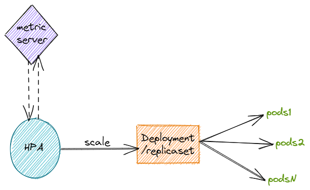
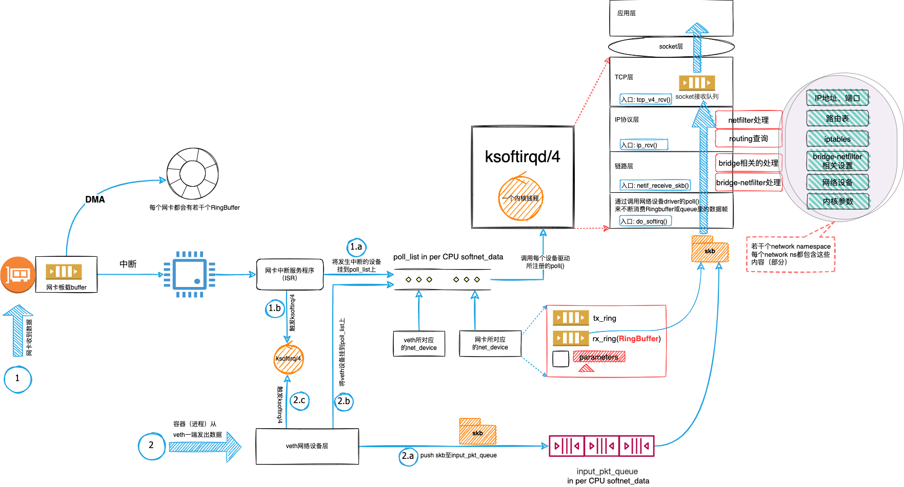
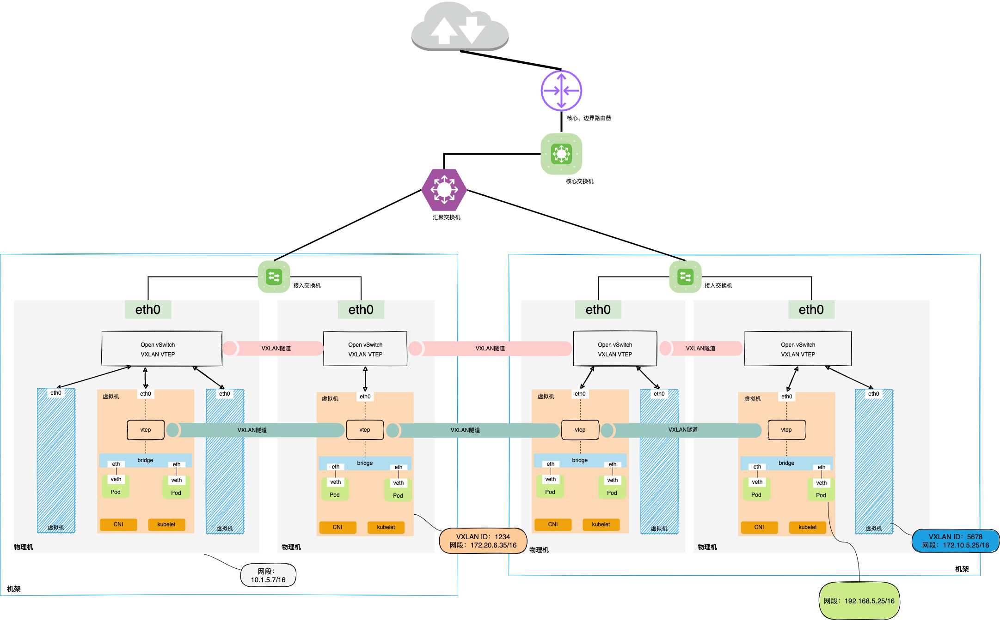

- HPA
  
- [VPC与三种K8s网络模型](https://mp.weixin.qq.com/s/W04uff4sHrPM_VtjzHPoJA)
  - 物理网卡和虚拟网卡数据接收完整数据处理流程
    - ksoftirqd扛起了网络包处理的重担。它从pull_list里找到要处理的网卡并从该网卡的queue里面拿到skb，然后沿着网络设备子系统 -> IP协议层 -> TCP层一路调用内核里面的函数来分析和处理这个skb，最终将其放置到位于TCP层的socket接收队列里。
    
    [Source](https://github.com/LanceHBZhang/LanceAndCloudnative/blob/master/%E9%AB%98%E6%B8%85%E5%A4%A7%E5%9B%BE/%E7%89%A9%E7%90%86%E7%BD%91%E5%8D%A1%E5%92%8C%E8%99%9A%E6%8B%9F%E7%BD%91%E5%8D%A1%E6%95%B0%E6%8D%AE%E6%8E%A5%E6%94%B6%E5%AE%8C%E6%95%B4%E6%95%B0%E6%8D%AE%E5%A4%84%E7%90%86%E6%B5%81%E7%A8%8B.png)
  - K8s“扁平网络”的三种典型实现方式是：Overlay、主机间路由（host-gw）以及Underlay
    - VPC and Overlay
      - K8s Overlay网络模型的实现有一个重要的技术点：veth pair。我们暂时将位于容器内的veth叫veth1，而插在bridge端口的那个对端veth称为veth-peer。当网络包从veth1流出时，其实是在图1的2.a处把skb所属的设备修改为veth-peer，先暂时放到了input_pkt_queue里，但这个时候skb还没有到设备veth-peer处
      - 在每台VM上，K8s CNI都会创建一个bridge和vtep。veth pair的一端安装在了Pod内部，而另一端则插到了网桥上
      - VTEP（VXLAN Tunnel Endpoints）是VXLAN网络中绝对的主角，它既可以是物理设备，也可以是虚拟化设备，主要负责 VXLAN 协议报文的封包和解包。
      - 
    - VPC and UnderLay
      - 网络包从Pod流出后，像VM的eth0一样，直接进入了Open vSwith上
      - 
    - VPC与host-gw
      - Host-gw简单来讲就是将每个Node当成Pod的网关。所谓网关就像城门，是网络包离开当前局部区域的卡口。
      - [VPC与host-gw（Flannel](https://github.com/LanceHBZhang/LanceAndCloudnative/blob/master/%E9%AB%98%E6%B8%85%E5%A4%A7%E5%9B%BE/vpc%E5%92%8CK8s%20host-gw%E7%BD%91%E7%BB%9C%E6%A8%A1%E5%9E%8B%EF%BC%88Flannel%E5%AE%9E%E7%8E%B0%E6%96%B9%E6%A1%88%EF%BC%89.png)
        - Flannel的实现方案里，由bridge来将离开Pod的网络包丢进宿主机TCP/IP协议栈进行路由的查询。最终网络包经由宿主机的eth0离开并进入对方宿主机的eth。当然这个过程中离不开OVS基于VXLAN所架设的隧道。
      - [VPC与host-gw（Calico](https://github.com/LanceHBZhang/LanceAndCloudnative/blob/master/%E9%AB%98%E6%B8%85%E5%A4%A7%E5%9B%BE/vpc%E5%92%8CK8s%20host-gw%E7%BD%91%E7%BB%9C%E6%A8%A1%E5%9E%8B%EF%BC%88Flannel%E5%AE%9E%E7%8E%B0%E6%96%B9%E6%A1%88%EF%BC%89.png)
        - BGP Client用于在集群里分发路由规则信息，而Felix则负责更新宿主机的路由表。
- [What Happen when K8S run](https://github.com/jamiehannaford/what-happens-when-k8s)

