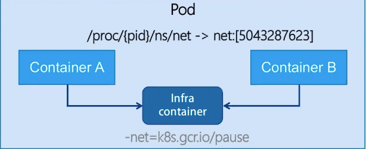

- K8S network 101
  - Summary
    
    - K8S network requirement
      - all pods can communicate with all other pods without using network address translation (NAT)
      - all Nodes can communicate with all Pods without NAT
      - the IP that a Pod sees itself as is the same IP that others see it as
  - Container to Container network
    
    - Containers in a pod has the same network namespace
      - they have same network configuration
      - sharing the same Pod IP address
    - network accessing via loopback or eth0 interface
    - package are always handled in the network namespace
  - Pod to Pod network
|  | L2 | Route | Overlay | Cloud |
| --- | --- | --- | --- | --- |
| Summary | Pods Communicate using L2 | Pods traffic is routed in underlay network | Pod traffic is encapsulated and use underlay for reachability | Pod traffic is routed in cloud virtual network |
| Underlying Tech | L2 ARP, broadcast | - Routing protocoal - BGP | VxLan, UDP encapluation in user space | Pre-programmed fabric using controller |
| Ex. | Pod 2 Pod on the same node | - Calico - Flannel(HostGW) | - Flannel - Weave | - GKE - EKS |
  - Pod to Server network
    - Pod IP address - are mutable and will appear and disappear due to scaling up or down
    - Service assign a single VIP for loadbalance between a group of pods
    - Kube-Proxy
      - a network proxy that runs on each node in your cluster
      - User Model
        - userland TCP/UDP proxy
      - IPtables
        - User IPtables to load-balance traffic
      - IPVS
        - User kernel LVS
        - Faster than IPtables
  - Internet to Server network
    - Layer 4
      - NodePort
        - Node IP is used for external communication
        - Service is exposed using a reserved port in all nodes of cluster
      - Loadbalance
        - Each service needs to have own external IP
        - Typically implemented as NLB
    - Layer 7

