- [K8S network 101](https://sookocheff.com/post/kubernetes/understanding-kubernetes-networking-model/)
  - K8S Basic
    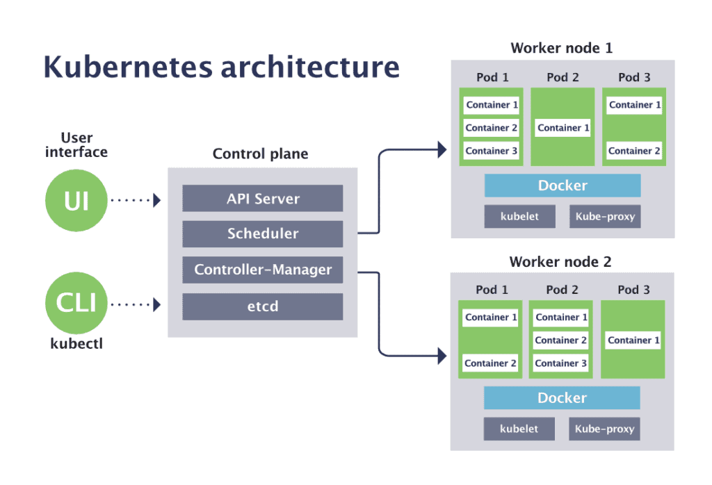
    - API Server
      - everything is an API call served by the Kubernetes API server (kube-apiserver). 
      - The API server is a gateway to an etcd datastore that maintains the desired state of your application cluster.
    - Controllers
      - Once you’ve declared the desired state of your cluster using the API server, controllers ensure that the cluster’s current state matches the desired state by continuously watching the state of the API server and reacting to any changes.
      - Ex. when you create a new Pod using the API server, the Kubernetes scheduler (a controller) notices the change and makes a decision about where to place the Pod in the cluster. It then writes that state change using the API server (backed by etcd). 
      - The kubelet (a controller) then notices that new change and sets up the required networking functionality to make the Pod reachable within the cluster.
    - Scheduler
      - 调度程序是一个控制平面进程，它将 pod 分配给节点。它监视没有分配节点的新创建的 pod，并且对于调度程序发现的每个 pod，调度程序负责为该 pod 找到运行的最佳节点。
      - 调度程序不会指示所选节点运行 pod。Scheduler 所做的只是通过 API Server 更新 pod 定义。API server 通过 watch 机制通知 Kubelet pod 已经被调度。然后目标节点上的 kubelet 服务看到 pod 已被调度到它的节点，它创建并运行 pod 的容器。
    - Pod
      - A Pod is the atom of Kubernetes — the smallest deployable object for building applications.
      - A single Pod represents a running workload in your cluster and encapsulates one or more Docker containers, any required storage, and a unique IP address.
    - [Container](https://www.docker.com/resources/what-container/)
      - A container is a standard unit of software that packages up code and all its dependencies so the application runs quickly and reliably from one computing environment to another.
      - Cgroups - Limits and accounting of CPU memory network - configured by container runtime
      - Namespace - Isolation of process, CPU mount user network .. - configured by container runtime
      - 
    - Node
      - Nodes are the machines running the Kubernetes cluster. These can be bare metal, virtual machines, or anything else.
    - CNI
      - Some CNI plugins do a lot more than just ensuring Pods have IP addresses and that they can talk to each other
      
      - [AWS CNI](https://github.com/aws/amazon-vpc-cni-k8s/blob/master/docs/cni-proposal.md)
      
    - Services
      - because of the ephemeral nature of Pods, it is almost never a good idea to directly use Pod IP addresses. Pod IP addresses are not persisted across restarts and can change without warning, in response to events that cause Pod restarts (such as application failures, rollouts, rollbacks, scale-up/down, etc.).
      - Kubernetes Service objects allow you to assign a single virtual IP address to a set of Pods. Used to build service discovery. It works by keeping track of the state and IP addresses for a group of Pods and proxying / load-balancing traffic to them
      - Pods can also use internally available DNS names instead of Service IP addresses. This DNS system is powered by CoreDNS
      - Service的type类型
        - ClusterIP： 默认方式。根据是否生成ClusterIP又可分为普通Service和Headless Service两类：
          - 普通Service：通过为Kubernetes的Service分配一个集群内部可访问的固定虚拟IP（Cluster IP），实现集群内的访问。为最常见的方式。
          - Headless Service：该服务不会分配Cluster IP，也不通过kube-proxy做反向代理和负载均衡。而是通过DNS提供稳定的网络ID来访问，DNS会将headless service的后端直接解析为podIP列表。主要供StatefulSet中对应POD的序列用。
        - NodePort：除了使用Cluster IP之外，还通过将service的port映射到集群内每个节点的相同一个端口，实现通过nodeIP:nodePort从集群外访问服务。
        - LoadBalancer：和nodePort类似，不过除了使用一个Cluster IP和nodePort之外，还会向所使用的公有云申请一个负载均衡器，实现从集群外通过LB访问服务。在公有云提供的 Kubernetes 服务里，都使用了一个叫作 CloudProvider 的转接层，来跟公有云本身的 API 进行对接。所以，在上述 LoadBalancer 类型的 Service 被提交后，Kubernetes 就会调用 CloudProvider 在公有云上为你创建一个负载均衡服务，并且把被代理的 Pod 的 IP 地址配置给负载均衡服务做后端。
        - 
    - Endpoints
      - how do Services know which Pods to track, and which Pods are ready to accept traffic? The answer is Endpoints
      - 
      - Represent the list of IPs behind a Service
      - Recall that service had port and targetPort fields
    - DNS
      - Run as a pod in the cluster
      - Exposed by a Service VIP
      - Containers are configured by kubelet to use kube-dns
      - Default implementation is CoreDNS
      - 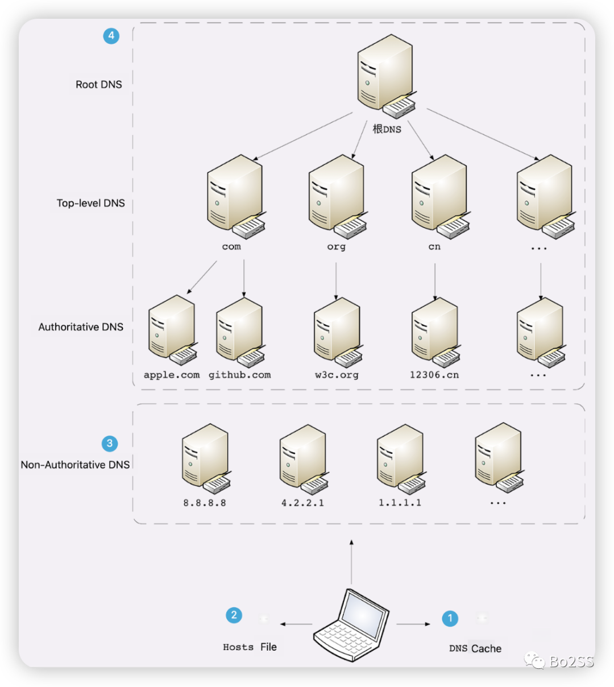
        - DNS类型。DNS分为根DNS、顶级DNS、权威DNS和非权威DNS。根DNS共有13组，遍布全球，它可以根据请求的顶级域名将DNS解析指定给下面对应的顶级DNS。顶级DNS又根据二级域名指定权威DNS，直到解析出域名对应的IP。而一些大公司还会自建DNS，又叫非权威DNS，它们的分布更广，比较知名的有Google的8.8.8.8，Microsoft的4.2.2.1，还有CloudFlare的1.1.1.1等等。
        - DNS解析域名步骤。实际的解析过程分为4步：系统首先会找DNS缓存，可能是浏览器里的，也可能是系统里的；如果找不到，再去查看hosts文件，里面有我们自定义的域名-IP对应规则，Mac下的hosts文件路径为/etc/hosts；如果匹配不到，再去问非权威DNS，一般默认是走我们网络运营商指定的；如果还是没解析出来，就要走根DNS的解析流程
    - Kubelet
      - Kubelet 是在集群中的每个节点上运行的代理，是负责在工作节点上运行的所有内容的组件。它确保容器在 Pod 中运行。
      - 通过在 API Server 中创建节点资源来注册它正在运行的节点。
      - 持续监控 API Server 上已调度到节点的 Pod。
      - 使用配置的容器运行时启动 pod 的容器。
      - 持续监控正在运行的容器并将其状态、事件和资源消耗报告给 API Server。
      - 运行容器活性探测，在探测失败时重新启动容器，在容器的 Pod 从 API Server 中删除时终止容器，并通知服务器 Pod 已终止。
    - Kube-proxy
      - Run on every Node in the cluster
      - 它负责监视 API Server 以了解Service和 pod 定义的更改，以保持整个网络配置的最新状态。当一个Service由多个 pod 时，proxy会在这些 pod 之间负载平衡。
      - kube-proxy 之所以得名，是因为它是一个实际的代理服务器，用于接受连接并将它们代理到 Pod，当前的实现使用 iptables 或 ipvs 规则将数据包重定向到随机选择的后端 Pod，而不通过实际的代理服务器传递它们。
        - Kubernetes v1.1 添加了 iptables 模式代理，在 Kubernetes v1.2 中，kube-proxy 的 iptables 模式成为默认设置。 Kubernetes v1.8 添加了 ipvs 代理模式。
        - ipvs是工作在内核态的4层负载均衡，基于内核底层netfilter实现，netfilter主要通过各个链的钩子实现包处理和转发
        - 由于ipvs工作在内核态，只处理四层协议，因此只能基于路由或者NAT进行数据转发，可以把ipvs当作一个特殊的路由器网关，这个网关可以根据一定的算法自动选择下一跳。
        - IPVS vs IPTABLES
          - iptables 使用链表，ipvs 使用哈希表；
          - iptables 只支持随机、轮询两种负载均衡算法而 ipvs 支持的多达 8 种；
          - ipvs 还支持 realserver 运行状况检查、连接重试、端口映射、会话保持等功能。
      - Watch Service and Endpoints, link Endpoints(backends) with Service(frontends)
  - K8S network requirement
    - Every Pod gets its own IP address.
    - Containers within a Pod share their network namespace ( IP and MAC address ) and therefore can communicate with each other using the loopback address.
    - all pods can communicate with all other pods without using network address translation (NAT)
    - all Nodes can communicate with all Pods without NAT
    - the IP that a Pod sees itself as is the same IP that others see it as
  - Container to Container network
    - 
    - Containers in a pod has the same network namespace
      - they have same network configuration
      - sharing the same Pod IP address
    - network accessing via loopback or eth0 interface
    - package are always handled in the network namespace
    - 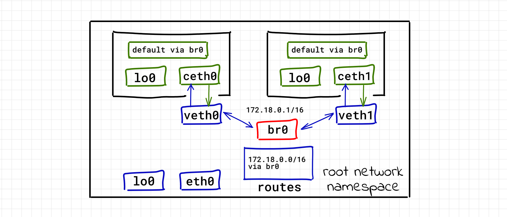
  - Pod to Pod network
    - every Pod has a real IP address and each Pod communicates with other Pods using that IP address.
    - namespaces can be connected using a Linux `Virtual Ethernet Device` or `veth pair` consisting of two virtual interfaces that can be spread over multiple namespaces.
    - A Linux Ethernet bridge is a virtual Layer 2 networking device used to unite two or more network segments, working transparently to connect two networks together.
    - Bridges implement the ARP protocol to discover the link-layer MAC address associated with a given IP address.
    - 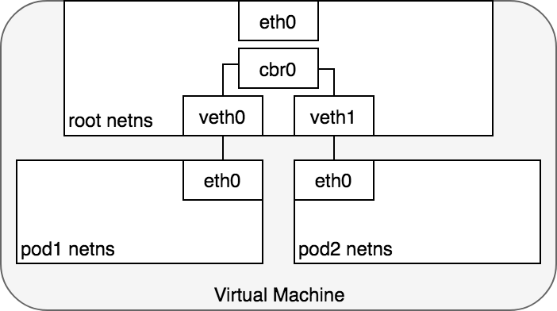
    - 
    - 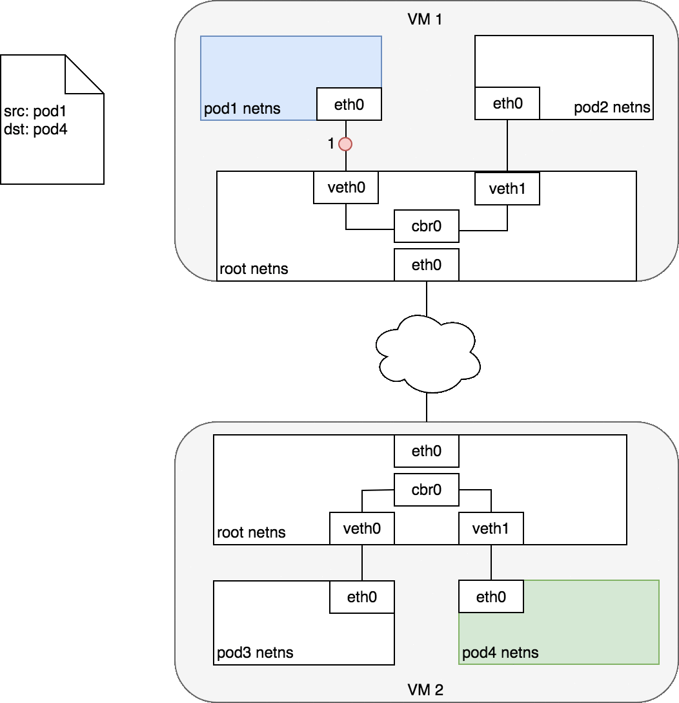

    |  | L2 | Route | Overlay | Cloud |
    | --- | --- | --- | --- | --- |
    | Summary | Pods Communicate using L2 | Pods traffic is routed in underlay network | Pod traffic is encapsulated and use underlay for reachability | Pod traffic is routed in cloud virtual network |
    | Underlying Tech | L2 ARP, broadcast | - Routing protocoal - BGP | VxLan, UDP encapluation in user space | Pre-programmed fabric using controller |
    | Ex. | Pod 2 Pod on the same node | - Calico - Flannel(HostGW) | - Flannel - Weave | - GKE - EKS |
    - Overlay network
      - 它是指构建在另一个网络上的计算机网络，这是一种网络虚拟化技术的形式. Overlay 底层依赖的网络就是 Underlay 网络，这两个概念也经常成对出现
      - Underlay 网络是专门用来承载用户 IP 流量的基础架构层，它与 Overlay 网络之间的关系有点类似物理机和虚拟机
      - 在实践中我们一般会使用虚拟局域网扩展技术（Virtual Extensible LAN，VxLAN）组建 Overlay 网络。在下图中，两个物理机可以通过三层的 IP 网络互相访问
      - 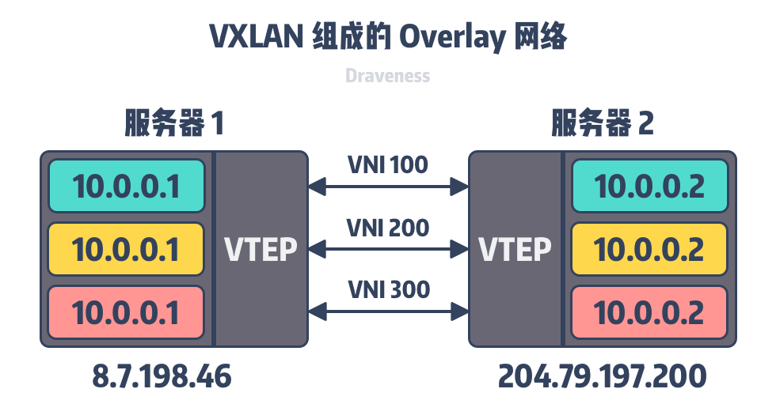
      - VxLAN 使用虚拟隧道端点（Virtual Tunnel End Point、VTEP）设备对服务器发出和收到的数据包进行二次封装和解封。
      - 虚拟网络标识符（VxLAN Network Identifier、VNI）, VxLAN 会使用 24 比特的 VNI 表示虚拟网络个数，总共可以表示 16,777,216 个虚拟网络，这也就能满足数据中心多租户网络隔离的需求了。
      - 
      - 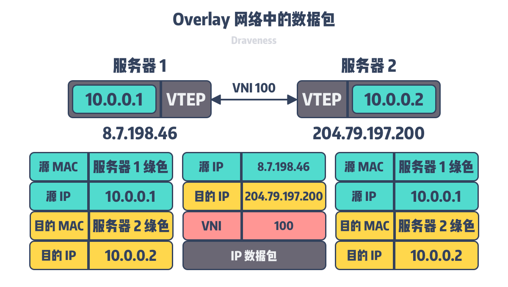
    - Inside Pod
      ```shell
      IP address
      
      # ip addr show
      1: lo: <LOOPBACK,UP,LOWER_UP> mtu 65536 qdisc noqueue state UNKNOWN qlen 1
         link/loopback 00:00:00:00:00:00 brd 00:00:00:00:00:00
         inet 127.0.0.1/8 scope host lo
            valid_lft forever preferred_lft forever
         inet6 ::1/128 scope host 
            valid_lft forever preferred_lft forever
      3: eth0@if231: <BROADCAST,MULTICAST,UP,LOWER_UP,M-DOWN> mtu 1500 qdisc noqueue state UP 
         link/ether 56:41:95:26:17:41 brd ff:ff:ff:ff:ff:ff
         inet 10.0.97.30/32 brd 10.0.97.226 scope global eth0 <<<<<<< ENI's secondary IP address
            valid_lft forever preferred_lft forever
         inet6 fe80::5441:95ff:fe26:1741/64 scope link 
            valid_lft forever preferred_lft forever
      routes
      
      # ip route show
      default via 169.254.1.1 dev eth0 
      169.254.1.1 dev eth0 
      static arp
      
      # arp -a
      ? (169.254.1.1) at 2a:09:74:cd:c4:62 [ether] PERM on eth0
      ```
    - On the Node
      ```shell
      - There are multiple routing tables used to route incoming/outgoing Pod's traffic.
      
      - main (toPod) route table is used to route to Pod traffic
      # ip route show
      default via 10.0.96.1 dev eth0 
      10.0.96.0/19 dev eth0  proto kernel  scope link  src 10.0.104.183 
      10.0.97.30 dev aws8db0408c9a8  scope link  <------------------------Pod's IP
      10.0.97.159 dev awsbcd978401eb  scope link 
      10.0.97.226 dev awsc2f87dc4cdd  scope link 
      10.0.102.98 dev aws4914061689b  scope link 
      ...
      - Each ENI has its own route table which is used to route pod's outgoing traffic, where pod is allocated with one of the ENI's secondary IP address
      # ip route show table eni-1
      default via 10.0.96.1 dev eth1 
      10.0.96.1 dev eth1  scope link 
      - Here is the routing rules to enforce policy routing
      # ip rule list
      0:	from all lookup local 
      512:	from all to 10.0.97.30 lookup main <---------- to Pod's traffic
      1025:	not from all to 10.0.0.0/16 lookup main 
      1536:	from 10.0.97.30 lookup eni-1 <-------------- from Pod's traffic
      ```
  - Pod to Service network
    - Pod IP address - are mutable and will appear and disappear due to scaling up or down
    - Service assign a single VIP for load balance between a group of Pods
    - [Kube-Proxy](https://mayankshah.dev/blog/demystifying-kube-proxy/)
      - a network proxy that runs on each node in your cluster. It watches Service and Endpoints objects and accordingly updates the routing rules on its host nodes to allow communicating over Services.
      - User Model
        - userland TCP/UDP proxy
      - IPtables
        - User IPtables to load-balance traffic
      - IPVS - IPVS (IP Virtual Server) implements transport-layer load balancing, usually called Layer 4 LAN switching, as part of Linux kernel.
        - User kernel LVS
        - Faster than IPtables
      - [IPVS vs IPTABLES](https://github.com/kubernetes/kubernetes/blob/master/pkg/proxy/ipvs/README.md)
        - Both IPVS and IPTABLES are based on netfilter. 
        - Differences between IPVS mode and IPTABLES mode are as follows:
          - IPVS provides better scalability and performance for large clusters.
          - IPVS supports more sophisticated load balancing algorithms than IPTABLES (least load, least connections, locality, weighted, etc.).
          - IPVS supports server health checking and connection retries, etc.
    - 
    - Using DNS
      - Kubernetes can optionally use DNS to avoid having to hard-code a Service’s cluster IP address into your application.
      - It configures the kubelets running on each Node so that containers use the DNS Service’s IP to resolve DNS names.
      - A DNS Pod consists of three separate containers:
        - kubedns: watches the Kubernetes master for changes in Services and Endpoints, and maintains in-memory lookup structures to serve DNS requests.
        - dnsmasq: adds DNS caching to improve performance.
        - sidecar: provides a single health check endpoint to perform healthchecks for dnsmasq and kubedns.
    - Service
        ```shell
        > kc get svc -n kube-system
        NAME                                TYPE        CLUSTER-IP       EXTERNAL-IP   PORT(S)                        AGE
        kube-dns                            ClusterIP   10.100.0.10      <none>        53/UDP,53/TCP                  25d
        
        > kc get ep -n beta
        NAME                               ENDPOINTS                                                                 AGE
        guild-beta-home-design             172.20.250.219:8080,172.20.251.121:8080                                   21d
        guild-beta-home-design-local       172.20.250.219:9420,172.20.251.121:9420                                   21d
        
        >  kc exec -it commgame-beta-word-connect-6cdbbc8486-qww9v -n beta -- sh
        / # nslookup 172.20.250.219 10.100.0.10
        Server:    10.100.0.10
        Address 1: 10.100.0.10 kube-dns.kube-system.svc.cluster.local
        
        Name:      172.20.250.219
        Address 1: 172.20.250.219 172-20-250-219.guild-beta-home-design.beta.svc.cluster.local
        / # nslookup idgenerator-local.beta.svc.cluster.local
        nslookup: can't resolve '(null)': Name does not resolve
        
        Name:      idgenerator-local.beta.svc.cluster.local
        Address 1: 172.20.250.157 172-20-250-157.idgenerator-local.beta.svc.cluster.local
        ```
  - Internet to Service network
    - Layer 4
      - NodePort
        - Node IP is used for external communication
        - Service is exposed using a reserved port in all nodes of cluster
      - Loadbalance
        - Each service needs to have own external IP
        - Typically implemented as NLB
    - 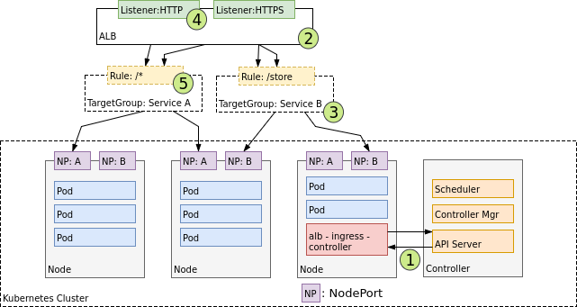
    - 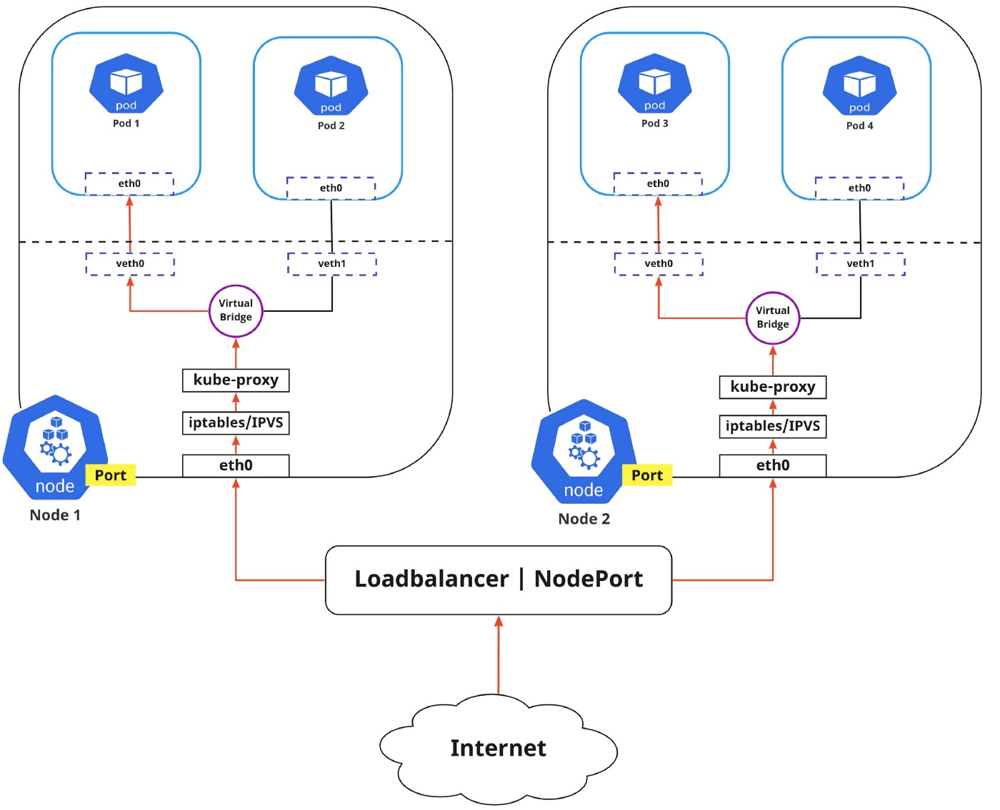
    - Layer 7
      ```shell
      > kc get svc -n beta -o wide
      NAME             TYPE        CLUSTER-IP       EXTERNAL-IP   PORT(S)        AGE    SELECTOR
      word-v5-beta     NodePort    10.100.68.182    <none>        80:32723/TCP   283d   app=word-v5,env=be
      
      > kc get endpoints -n beta -o wide
      NAME             ENDPOINTS                                AGE
      word-v5-beta     172.20.254.146:3021                      283d
      
      > kc get po -n beta -o wide
      NAME                                  READY   STATUS    RESTARTS   AGE     IP               NODE                             NOMINATED NODE   READINESS GATES
      word-v5-beta-8555cc6dcd-7vbkl         1/1     Running   0          7d4h    172.20.254.146   ip-172-20-254-241.ec2.internal   <none>           <none>
      ```
      ```shell
      > iptables -t nat -nL
      
      Chain KUBE-NODEPORTS (1 references)
      target     prot opt source               destination
      KUBE-MARK-MASQ  tcp  --  0.0.0.0/0            0.0.0.0/0            /* beta/word-v5-beta:http */ tcp dpt:32723
      KUBE-SVC-7EUSQI7QIASQWEEM  tcp  --  0.0.0.0/0            0.0.0.0/0            /* beta/word-v5-beta:http */ tcp dpt:32723
      
      Chain KUBE-SERVICES (2 references)
      target     prot opt source               destination
      KUBE-SVC-7EUSQI7QIASQWEEM  tcp  --  0.0.0.0/0            10.100.68.182        /* beta/word-v5-beta:http cluster IP */ tcp dpt:80
      
      Chain KUBE-SVC-7EUSQI7QIASQWEEM (2 references)
      target     prot opt source               destination
      KUBE-SEP-W5KHKXQHUD4WIQCU  all  --  0.0.0.0/0            0.0.0.0/0            /* beta/word-v5-beta:http */
      
      Chain KUBE-SEP-W5KHKXQHUD4WIQCU (1 references)
      target     prot opt source               destination
      KUBE-MARK-MASQ  all  --  172.20.254.146       0.0.0.0/0            /* beta/word-v5-beta:http */
      DNAT       tcp  --  0.0.0.0/0            0.0.0.0/0            /* beta/word-v5-beta:http */ tcp to:172.20.254.146:3021
      ```
      - KUBE-SERVICES is the entry point for service packets. What it does is to match the destination IP:port and dispatch the packet to the corresponding KUBE-SVC-* chain.
      - KUBE-SVC-* chain acts as a load balancer, and distributes the packet to KUBE-SEP-* chain equally. Every KUBE-SVC-* has the same number of KUBE-SEP-* chains as the number of endpoints behind it.
      - KUBE-SEP-* chain represents a Service EndPoint. It simply does DNAT, replacing service IP:port with pod's endpoint IP:Port.
  - Source: https://medium.com/techbeatly/kubernetes-networking-fundamentals-d30baf8a28c8

- [HTTP](https://mp.weixin.qq.com/s/Hx5utPuUF4GO3Nb3xwD7Sg)
  - HTTP
    - 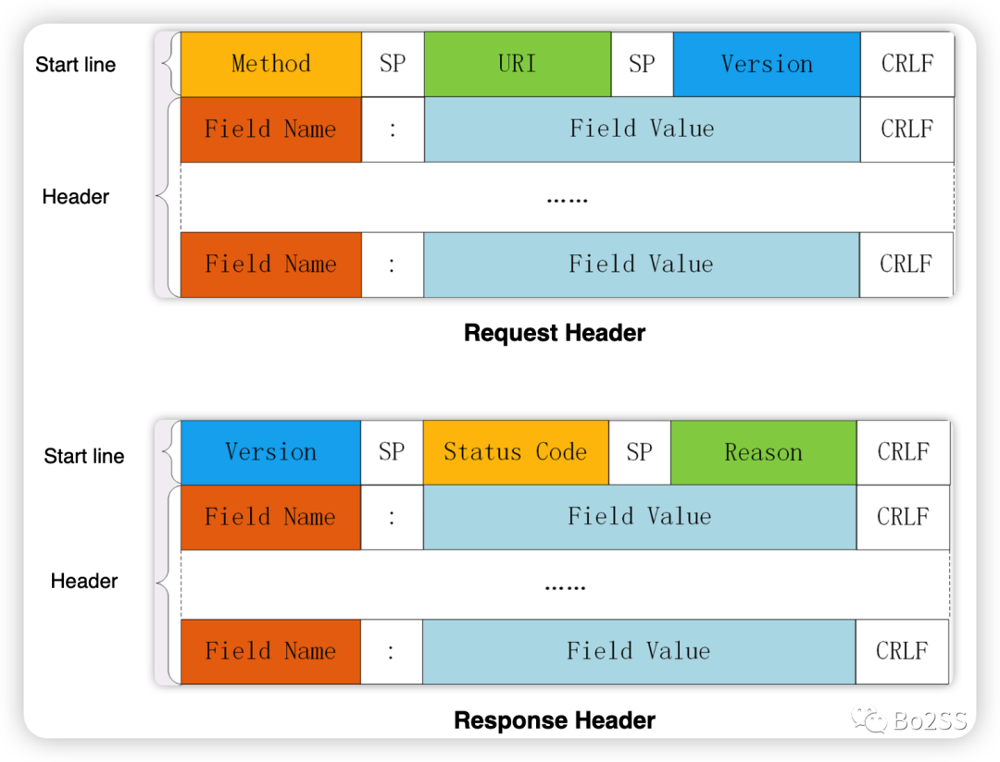
    - Body 属性
      - Accept-Encoding表示的是请求方可以支持的压缩格式，可能不止一个。
      - Content-Encoding表示的是传输的body实际采用的压缩格式。
      - Transfer-Encoding: chunked：这表示数据是被分块传输的。
      - Accept-Ranges: bytes：我们一般会通过HEAD请求先问问服务端是否支持范围请求，如果支持通过字节范围请求，服务端就会返回这个。
      - Range: bytes=x-y：在服务端支持的情况下，请求方就可以明确要请求第x~y字节的内容。
      - Content-Range: bytes x-y/length：这表示服务端返回的body是第x~y字节的内容，内容总长度为length。
    - Connection：长连接相关
      - Connection: keep-alive：即表示使用长连接，在HTTP/1.1中默认开启。
      - Connection: close：主动关闭长连接，一般是由客户端发出的。
    - Cookie：解决HTTP无状态特点带来的问题。
      - Set-Cookie: a=xxx，Set-Cookie: b=yyy：这是服务端返回的，一个Cookie本质上就是一个键值对，并且每个Cookie是分开的。
      - Cookie: a=xxx; b=yyy：这是客户端在发送请求时带上的，也就是之前服务端返回的Cookie们，它们是合在一起的。
    - Cache：缓存相关。
      - Cache-Control
        - max-age的单位是秒，从返回那一刻就开始计算；
        - no-store代表客户端不允许缓存；
        - no-cache代表客户端使用缓存前必须先来服务端验证；
        - must-revalidate代表缓存失效后必须验证。
        - 服务端可以返回的属性有：max-age=10/no-store/no-cache/must-revalidate。
          - Last-Modified代表文件的最后修改时间。
          - ETag全称是Entity Tag，代表资源的唯一标识，它是为了解决修改时间无法准确区分文件变化的问题。比如一个文件在一秒内修改了很多次，而修改时间的最小单位是秒；又或者一个文件修改了时间属性，但内容没有变化。Etag还分为强Etag、弱Etag：
        - 客户端可以发送的属性有：max-age=0；no-cache
          - If-Modified-Since里放的就是上次请求服务端返回的Last-Modified，如果服务端资源没有比这个时间更新的话，服务端就会返回304，表示客户端用缓存就行。
          - If-None-Match里放的就是上次请求服务端返回的ETag了，如果服务端资源的Etag没变，服务端也是返回304。
    - Proxy：代理相关
      - Via：代理服务器会在发送请求时，把自己的主机名加端口信息追加到该字段的末尾。
      - X-Forwarded-For：类似Via的追加方式，但追加的内容是请求方的IP地址。
      - X-Real-IP：只记录客户端的IP地址，它更简洁一点。
    - Proxy Cache：代理缓存相关
      - 客户端可以缓存，中间商代理服务器当然也可以缓存。但因为代理的双重身份性，所以Cache-Control针对代理缓存还增加了一些定制化的属性
      - 从服务端到代理服务器
        - private代表数据只能在客户端保存，不能缓存在代理上与别人共享，比如用户的私人数据。
        - public代表数据完全开放，谁都可以缓存。
        - s-maxage代表缓存在代理服务器上的生存时间。
        - no-transform代表禁止代理服务器对数据做一些转换操作，因为有的代理会提前对数据做一些格式转换，方便后面的请求处理。
      - 从客户端到代理服务器
        - max-stale代表接受缓存过期一段时间。
        - min-fresh则与上面相反，代表缓存必须还有一段时间的保质期。
        - only-if-cached代表客户端只接受代理缓存。如果代理上没有符合条件的缓存，客户端也不要代理再去请求服务端了。
    - 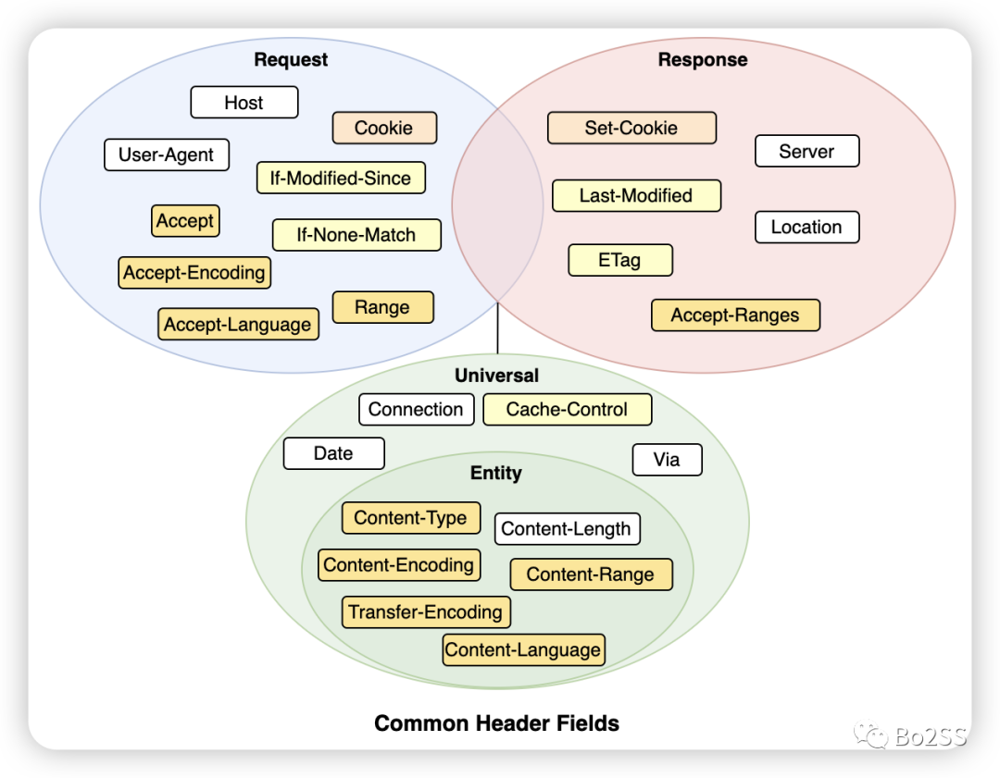
  - HTTPS
    - [SSL/TLS](https://mp.weixin.qq.com/s?__biz=Mzg3MjcxNzUxOQ==&mid=2247484972&idx=1&sn=4f0d819e8ab9456bd2ee81942abb3f22&chksm=ceea4b8cf99dc29ad27798c860c9db89621d81497fb6a5d206ed0602d75cffbb1bfdbec5809a&scene=21&cur_album_id=2417135412986380288#wechat_redirect)
      - 信息安全
        - 信息安全的三要素（简称CIA）
        - 机密性（ Confidentiality）：指信息在存储、传输、使用的过程中，不会被泄漏给非授权用户或实体。
        - 完整性（Integrity）：指信息在存储、传输、使用的过程中，不会被非授权用户篡改，或防止授权用户对信息进行不恰当的篡改。
        - 认证性（Authentication）：也可以理解为不可否认性（Non-Repudiation），指网络通信双方在信息交互过程中，确信参与者本身和所提供的信息真实同一性，即所有参与者不可否认或抵赖本人的真实身份，以及提供信息的原样性和完成的操作与承诺。
      - 常见的密码学算法
        - 对称加密算法
          - 
          - DES、3DES、AES、IDEA、SM1、SM4、RC2、RC4
          - 在真实世界中，我们可以通过暗中碰头交接密钥，但在互联网世界，黑客可以轻易的劫获你的通信，所以对称加密算法最大的难点就是密钥分发问题
        - 非对称加密算法
          - 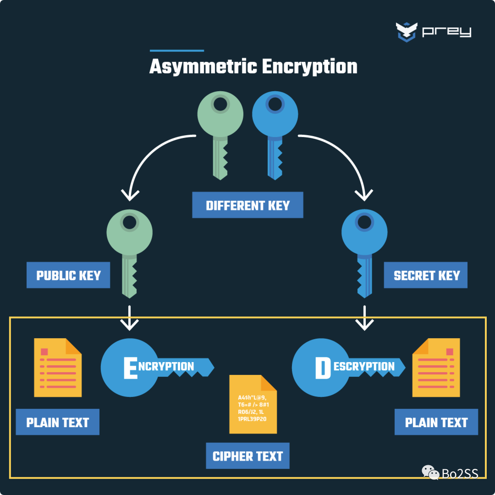
          - 非对称加密里的私钥（Secret Key / Private Key）也是非常隐私、非常重要的，不能随便给别人，而公钥（Public Key）就可以随意分发了
          - RSA、ECC、DSA、ECDSA
          - 缺点就是加密速度远慢于对称加密（对称加密的本质是位运算，非对称加密的本质是幂运算和模运算）
        - 哈希算法
          - 哈希算法可以将任意数据，转换成一串固定长度的编码，我们一般把这串编码叫做哈希值或者摘要
            - “唯一”标识性：相同的输入，输出一定相同；不同的输入，输出大概率不同。（因为大概率，所以唯一加了双引号）
            - 不可逆：不能通过输出推导出输入
          - 哈希算法一般有2个用途
            - 验证数据是否被修改 
              - 我们在下载某些软件时，会看到下载链接附近还附加了一个哈希值MD5
              - 数字签名技术里也会用到哈希函数
            - 存储用户隐私
              - 数据库里存储的是密码的哈希值，在用户输入密码登陆时，只需要比对原始密码和输入密码的哈希值即可。
              - 存在一些风险，那就是🌈彩虹攻击
              - 哈希加盐、HMAC。前者是在明文的基础上添加一个随机数（盐）后，再计算哈希值；后者则更加安全，在明文的基础上结合密钥（提前共享的对称密钥），再计算哈希值。
          - MD5、SHA-1、SHA-2、SHA-3、HMAC
      - 信息传输的加密方式
        - 实现需求1：机密性
        - 信息传输一般使用对称加密➕非对称加密
        - 关于密钥交换方式，除了上面基于非对称加密的方式外 专门的密钥交换算法，如DH(E)、ECDH(E) + 预部署方式，如PSK
      - 数字签名
        - 实现需求2：完整性
        - 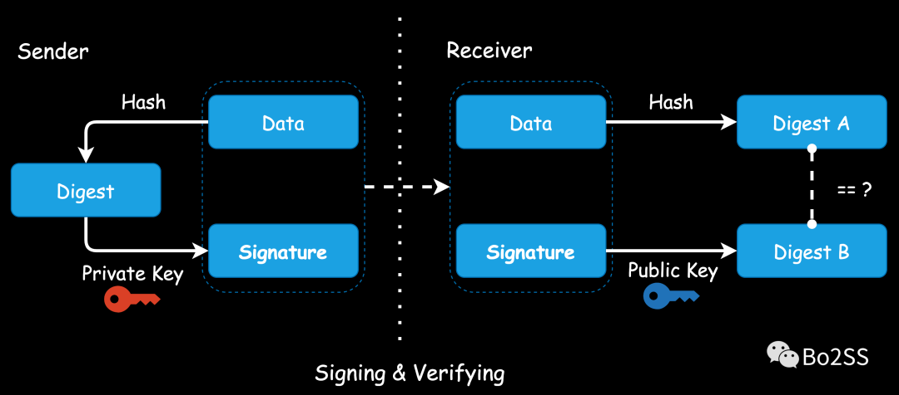
      - 数字证书
        - 实现需求3：认证性
        - 接收方如何确认公钥没有被其他人恶意替换呢？也就是公钥的身份不明。
        - 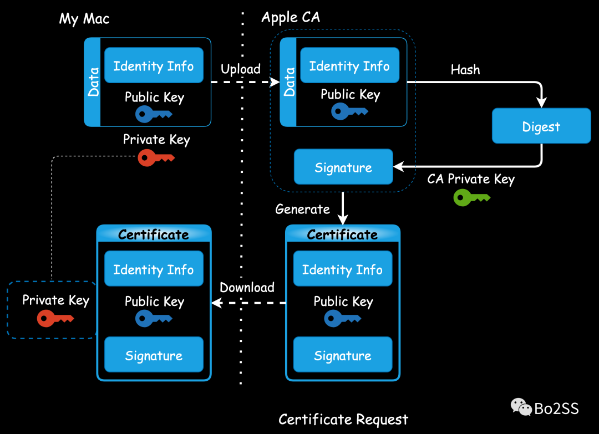
        - 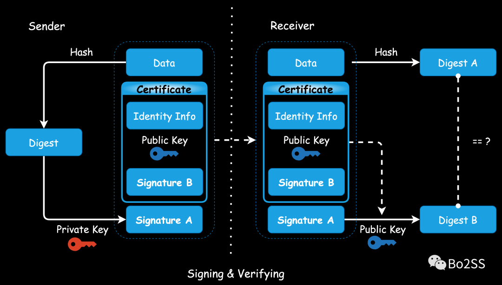
        - 原来发送的数据+签名+公钥，变成了数据+签名+证书
    - SSL/TLS
      - 
    - 基于ECDHE的TLS主流握手方式 VS. 基于RSA的TLS传统握手方式。 两者的关键区别在于通信密钥生成过程中，第三个随机数Pre-Master的生成方式：
      - 前者：两端先随机生成公私钥，同时公钥（加签名）作为参数传给对方，然后两端基于双方的参数，使用ECDHE算法生成Pre-Master；
      - 后者：客户端直接生成随机数Pre-Master，然后用服务器证书的公钥加密后发给服务器。
    - 因为前者的公私钥是随机生成的，即使某次私钥泄漏了或者被破解了，也只影响一次通信过程；而后者的公私钥是固定的，只要私钥泄漏或者被破解，那之前所有的通信记录密文都会被破解，因为耐心的黑客一直在长期收集报文，等的就是这一天（据说斯诺登的棱镜门事件就是利用了这一点）。
    - 也就是说，前者“一次一密”，具备前向安全；而后者存在“今日截获，明日破解”的隐患，不具备前向安全。
    - 
  - HTTP2
    - HTTP/2基于Chrome的SPDY协议
    - 传输数据格式从文本转成了二进制，大大方便了计算机的解析。
    - 基于虚拟流的概念，实现了多路复用能力，同时替代了HTTP/1.1里的管道功能。
    - 利用HPACK算法进行头部压缩，在之前都只针对body做压缩。
    - 允许服务端新建“流”主动推送消息。比如在浏览器刚请求HTML的时候就提前把可能会用到的JS、CSS文件发给客户端。
    - 在安全方面，其实也做了一些强化，加密版本的HTTP/2规定其下层的通信协议必须在TLS1.2以上（因为之前的版本有很多漏洞），需要支持前向安全和SNI（Server Name Indication，它是TLS的一个扩展协议，在该协议下，在握手过程开始时通过客户端告诉它正在连接的服务器的主机名称），并把几百个弱密码套件给列入“黑名单”了。
  - HTTP3
    - HTTP/3基于Chrome的QUIC协议
    - 它最大的改变就是把下层的传输层协议从TCP换成了QUIC，完全解决了TCP的队头阻塞问题（注意，是TCP的，不是HTTP的），在弱网环境下表现更好。因为 QUIC 本身就已经支持了加密、流和多路复用等能力，所以 HTTP/3 的工作减轻了很多。
    - 头部压缩算法从HPACK升级为QPACK。
    - 基于UDP实现了可靠传输，引入了类似HTTP/2的流概念。
    - 内含了TLS1.3，加快了建连速度。
    - 连接使用“不透明”的连接ID来标记两端，而不再通过IP地址和端口绑定，从而支持用户无感的连接迁移。
    - HOL
      - 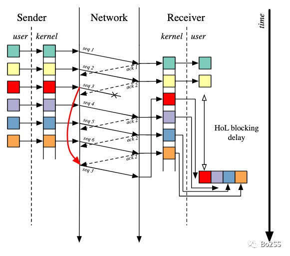

- [CNI](https://platform9.com/blog/the-ultimate-guide-to-using-calico-flannel-weave-and-cilium/)
  - flannel
    - Flannel runs a simple overlay network across all the nodes of the Kubernetes cluster. 
    - It provides networking at Layer 3, the Network Layer of the OSI networking model. 
    - Flannel supports [VXLAN](https://support.huawei.com/enterprise/zh/doc/EDOC1100087027) as its default backend, although you can also configure it to use UDP and host-gw. 
    - Some experimental backends like AWS VPC, AliVPC, IPIP, and IPSec are also available, but not officially supported at present.
    - One of the drawbacks of Flannel is its lack of advanced features, such as the ability to configure network policies and firewalls.
  - Calico
    - Calico operates on Layer 3 of the OSI model and uses the BGP protocol to move network packets between nodes in its default configuration with IP in IP for encapsulation. 
    - Using BGP, Calico directs packets natively, without needing to wrap them in additional layers of encapsulation. 
    - This approach improves performance and simplifies troubleshooting network problems compared with more complex backends, like VXLAN.
    - Calico’s most valuable feature is its support for network policies. By defining and enforcing network policies, you can prescribe which pods can send and receive traffic and manage security within the network.
  - Weave
    - Weave creates a mesh overlay between all nodes of a Kubernetes cluster and uses this in combination with a routing component on each node to dynamically route traffic throughout the cluster. By default, Weave routes packets using the fast datapath method, which attempts to send traffic between nodes along the shortest path.
    - Weave includes features such as creating and enforcing network policies and allows you to configure encryption for your entire network. If configured, Weave uses NaCl encryption for sleeve traffic and IPsec ESP encryption for fast datapath traffic.
  - Cilium
    - A relative newcomer to the land of Kubernetes CNI plugins is Cilium. Cilium and its observability tool, Hubble, take advantage of eBPF.


- [LVS](https://new.qq.com/omn/20200718/20200718A05H2H00.html)： 
  - LVS是Linux Virtual Server的简写，也就是Linux 虚拟服务器，是一个虚拟的服务器集群系统.
    通过 LVS 达到的负载均衡技术和 Linux 操作系统实现一个高性能高可用的 Linux 服务器集群，具有良好的可靠性、可扩展性和可操作性
  - LVS 与 Nginx 功能对比
    - LVS 比 Nginx 具有更强的抗负载能力，性能高，对内存和 CPU 资源消耗较低；
    - LVS 工作在网络层，具体流量由操作系统内核进行处理，Nginx 工作在应用层，可针对 HTTP 应用实施一些分流策略；
    - LVS 安装配置较复杂，网络依赖性大，稳定性高。Nginx 安装配置较简单，网络依赖性小；
    - LVS 不支持正则匹配处理，无法实现动静分离效果。
    - LVS 适用的协议范围广。Nginx 仅支持 HTTP、HTTPS、Email 协议，适用范围小；
  - LVS 由两部分程序组成，包括 ipvs 和 ipvsadm
    - ipvs(ip virtual server)：LVS 是基于内核态的 netfilter 框架实现的 IPVS 功能，工作在内核态。用户配置 VIP 等相关信息并传递到 IPVS 就需要用到 ipvsadm 工具。
      - iptables 是位于用户空间，而 Netfilter 是位于内核空间。iptables 只是用户空间编写和传递规则的工具而已，真正工作的还是 netfilter
      - LVS 基于 netfilter 框架，工作在 INPUT 链上，在 INPUT 链上注册 ip_vs_in HOOK 函数，进行 IPVS 相关主流程
    - ipvsadm：ipvsadm 是 LVS 用户态的配套工具，可以实现 VIP 和 RS 的增删改查功能，是基于 netlink 或 raw socket 方式与内核 LVS 进行通信的，如果 LVS 类比于 netfilter，那 ipvsadm 就是类似 iptables 工具的地位。
  - LVS 负载均衡的三种工作模式
    - 地址转换（NAT）
      - 类似于防火墙的私有网络结构，负载调度器作为所有服务器节点的网关，作为客户机的访问入口，也是各节点回应客户机的访问出口，服务器节点使用私有 IP 地址，与负载调度器位于同一个物理网络，安全性要优于其他两种方式。
      - 优点：
      - 支持 Windows 操作系统；
      - 支持端口映射，如 RS 服务器 PORT 与 VPORT 不一致的话，LVS 会修改目的 IP 地址和 DPORT 以支持端口映射；
      - 缺点：
      - RS 服务器需配置网关；
      - 双向流量对 LVS 会产生较大的负载压力；
    - IP 隧道（TUN）
      - 采用开放式的网络结构，负载调度器作为客户机的访问入口，各节点通过各自的 Internet 连接直接回应给客户机，而不经过负载调度器，服务器节点分散在互联网中的不同位置，有独立的公网 IP 地址，通过专用 IP 隧道与负载调度器相互通信。
      - 优点：
        - 单臂模式，LVS 负载压力小；
        - 数据包修改小，信息完整性高；
        - 可跨机房；
      - 缺点：
        - 不支持端口映射；
        - 需在 RS 后端服务器安装模块及配置 VIP；
        - 隧道头部 IP 地址固定，RS 后端服务器网卡可能会不均匀；
        - 隧道头部的加入可能会导致分片，最终会影响服务器性能；
    - 直接路由（DR）
      - 采用半开放式的网络结构，与 TUN 模式的结构类似，但各节点并不是分散在各个地方，而是与调度器位于同一个物理网络，负载调度器与各节点服务器通过本地网络连接，不需要建立专用的 IP 隧道。它是最常用的工作模式，因为它的功能性强大。
      - 优点：
        - 响应数据不经过 LVS，性能高；
        - 对数据包修改小，信息完整性好；
      - 缺点：
        - LVS 与 RS 必须在同一个物理网络；
        - RS 上必须配置 lo 和其他内核参数；
        - 不支持端口映射；
  - LVS 的十种负载调度算法
    - 轮询：Round Robin，将收到的访问请求按顺序轮流分配给群集中的各节点真实服务器中，不管服务器实际的连接数和系统负载。
    - 加权轮询：Weighted Round Robin，根据真实服务器的处理能力轮流分配收到的访问请求，调度器可自动查询各节点的负载情况，并动态跳转其权重，保证处理能力强的服务器承担更多的访问量。
    - 最少连接：Least Connections，根据真实服务器已建立的连接数进行分配，将收到的访问请求优先分配给连接数少的节点，如所有服务器节点性能都均衡，可采用这种方式更好的均衡负载。
    - 加权最少连接：Weighted Least Connections，服务器节点的性能差异较大的情况下，可以为真实服务器自动调整权重，权重较高的节点将承担更大的活动连接负载。
    - 基于局部性的最少连接：LBLC，基于局部性的最少连接调度算法用于目标 IP 负载平衡，通常在高速缓存群集中使用。如服务器处于活动状态且处于负载状态，此算法通常会将发往 IP
         地址的数据包定向到其服务器。如果服务器超载（其活动连接数大于其权重），并且服务器处于半负载状态，则将加权最少连接服务器分配给该 IP 地址。
    - 复杂的基于局部性的最少连接：LBLCR，具有复杂调度算法的基于位置的最少连接也用于目标IP负载平衡，通常在高速缓存群集中使用。与 LBLC 调度有以下不同：负载平衡器维护从目标到可以
         目标提供服务的一组服务器节点的映射。对目标的请求将分配给目标服务器集中的最少连接节点。如果服务器集中的所有节点都超载，则它将拾取群集中的最少连接节点，并将其添加到目标服务
         群中。如果在指定时间内未修改服务器集群，则从服务器集群中删除负载最大的节点，以避免高度负载。
    - 目标地址散列调度算法：DH，该算法是根据目标 IP 地址通过散列函数将目标 IP 与服务器建立映射关系，出现服务器不可用或负载过高的情况下，发往该目标 IP 的请求会固定发给该服务器。
    - 源地址散列调度算法：SH，与目标地址散列调度算法类似，但它是根据源地址散列算法进行静态分配固定的服务器资源。
    - 最短延迟调度：SED，最短的预期延迟调度算法将网络连接分配给具有最短的预期延迟的服务器。如果将请求发送到第 i 个服务器，则预期的延迟时间为（Ci +1）/ Ui，其中 Ci 是第 i 个服务器上的连接数，而 Ui 是第 i 个服务器的固定服务速率（权重） 。
    - 永不排队调度：NQ，从不队列调度算法采用两速模型。当有空闲服务器可用时，请求会发送到空闲服务器，而不是等待快速响应的服务器。如果没有可用的空闲服务器，则请求将被发送到服务器，以使其预期延迟最小化（最短预期延迟调度算法）

- [Tunneling](https://wiki.linuxfoundation.org/networking/tunneling)
  - Tunneling is a way to transform data frames to allow them pass networks with incompatible address spaces or even incompatible protocols.
  - Linux kernel supports 3 tunnel types: 
    - IPIP (IPv4 in IPv4)
      - It has the lowest overhead, but can incapsulate only IPv4 unicast traffic, so you will not be able to setup OSPF, RIP or any other multicast-based protocol.
      - You can setup only one tunnel for unique tunnel endpoints pair
    - GRE (IPv4/IPv6 over IPv4) 
      - GRE tunnels can incapsulate IPv4/IPv6 unicast/multicast traffic, so it is de-facto tunnel standard for dynamic routed networks.
      - You can setup up to 64K tunnels for an unique tunnel endpoints pair
    - SIT (IPv6 over IPv4)
      - SIT stands for Simple Internet Transition. Its main purpose is to interconnect isolated IPv6 networks, located in global IPv4 Internet.
      - SIT works like IPIP. Once loaded, ipv6 module can't be unloaded.
      - You can get your own IPv6 prefix and a SIT tunnel from a tunnel broker.

- [A Deep Dive into Iptables and Netfilter Architecture](https://www.digitalocean.com/community/tutorials/a-deep-dive-into-iptables-and-netfilter-architecture)
  - What Are IPTables and Netfilter
    - The basic firewall software most commonly used in Linux is called iptables. The iptables firewall works by interacting with the packet filtering hooks in the Linux kernel’s networking stack. These kernel hooks are known as the netfilter framework.
  - Netfilter Hooks
    - There are five netfilter hooks that programs can register with.
    - NF_IP_PRE_ROUTING: This hook will be triggered by any incoming traffic very soon after entering the network stack. This hook is processed before any routing decisions have been made regarding where to send the packet.
    - NF_IP_LOCAL_IN: This hook is triggered after an incoming packet has been routed if the packet is destined for the local system.
    - NF_IP_FORWARD: This hook is triggered after an incoming packet has been routed if the packet is to be forwarded to another host.
    - NF_IP_LOCAL_OUT: This hook is triggered by any locally created outbound traffic as soon it hits the network stack.
    - NF_IP_POST_ROUTING: This hook is triggered by any outgoing or forwarded traffic after routing has taken place and just before being put out on the wire.
  - IPTable tables and chains
    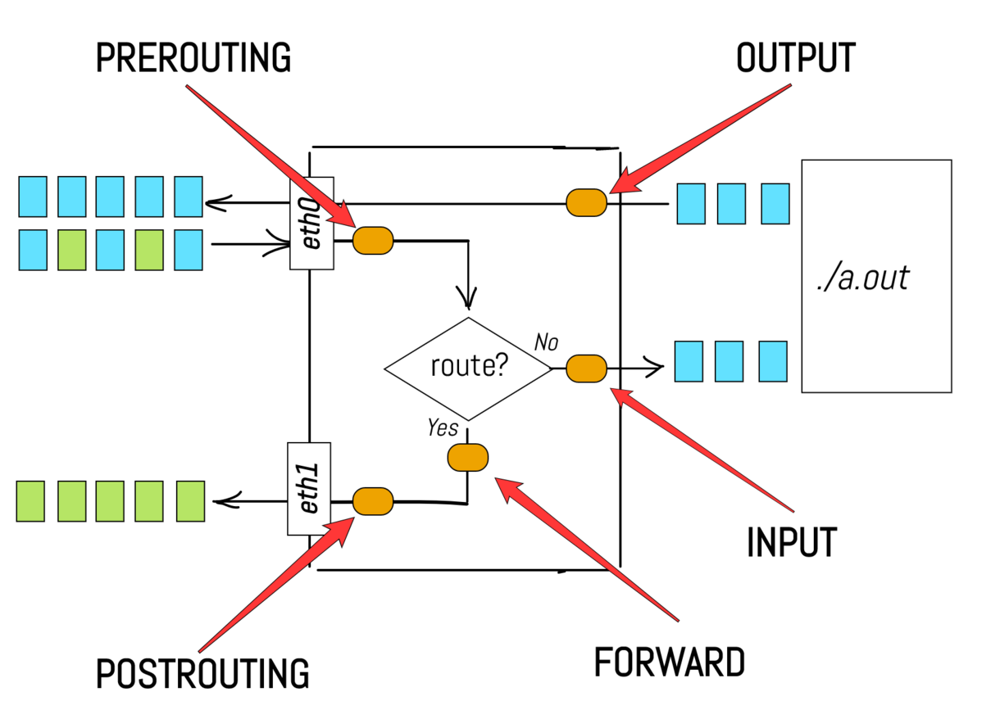
    - The iptables firewall uses tables to organize its rules
    - Within each iptables table, rules are further organized within separate “chains”. 
    - the built-in chains represent the netfilter hooks which trigger them. Chains basically determine when rules will be evaluated.
  - Which Tables are Available
    - The filter table is one of the most widely used tables in iptables. The filter table is used to make decisions about whether to let a packet continue to its intended destination or to deny its request.
    - The nat table is used to implement network address translation rules.
    - The mangle table is used to alter the IP headers of the packet in various ways.
    - The raw table has a very narrowly defined function. Its only purpose is to provide a mechanism for marking packets in order to opt-out of connection tracking.
  - Which Chains are Implemented in Each Table
    

- [Node Proxy](https://cloudnative.to/blog/k8s-node-proxy/)
  - Netfilter
    - 主机上的所有数据包都将通过 netfilter 框架
    - 在 netfilter 框架中有 5 个钩子点：PRE_ROUTING, INPUT, FORWARD, OUTPUT, POST_ROUTING
    - 命令行工具 iptables 可用于动态地将规则插入到钩子点中
    - 可以通过组合各种 iptables 规则来操作数据包
      - filter：做正常的过滤，如接受，拒绝/删，跳
      - nat：网络地址转换，包括 SNAT（源 nat) 和 DNAT（目的 nat)
      - mangle：修改包属性，例如 TTL
      - raw：最早的处理点，连接跟踪前的特殊处理 (conntrack 或 CT，也包含在上图中，但这不是链）
      - security
  - Cross-host 网络模型
    - 主机 A 上的实例（容器、VM 等）如何与主机 B 上的另一个实例通信？有很多解决方案：
      - 直接路由：BGP 等
      - 隧道：VxLAN, IPIP, GRE 等
      - NAT：例如 docker 的桥接网络模式
  - Service
    - Service 是一种抽象，它定义了一组 pod 的逻辑集和访问它们的策略。
      - ClusterIP：通过 VIP 访问 Service，但该 VIP 只能在此集群内访问
        - 对 ClusterIP 的一个常见误解是，ClusterIP 是可访问的——它们不是通过定义访问的。如果 ping 一个 ClusterIP，可能会发现它不可访问。
        - 根据定义，<Protocol,ClusterIP,Port> 元组独特地定义了一个服务（因此也定义了一个拦截规则）。例如，如果一个服务被定义为 <tcp,10.7.0.100,80>，那么代理只处理 tcp:10.7.0.100:80 的流量，其他流量，例如。tcp:10.7.0.100:8080, udp:10.7.0.100:80 将不会被代理。因此，也无法访问 ClusterIP（ICMP 流量）。
        - 但是，如果你使用的是带有 IPVS 模式的 kube-proxy，那么确实可以通过 ping 访问 ClusterIP。这是因为 IPVS 模式实现比定义所需要的做得更多。
      - NodePort：通过 NodeIP:NodePort 访问 Service，这意味着该端口将暴露在集群内的所有节点上
      - ExternalIP：与 ClusterIP 相同，但是这个 VIP 可以从这个集群之外访问
      - LoadBalancer
    - 一个 Service 有一个 VIP（本文中的 ClusterIP）和多个端点（后端 pod）。每个 pod 或节点都可以通过 VIP 直接访问应用程序。要做到这一点，节点代理程序需要在每个节点上运行，它应该能够透明地拦截到任何 ClusterIP:Port的流量，并将它们重定向到一个或多个后端 pod。

- [Docker网络原理](https://mp.weixin.qq.com/s/jJiX47kRTfX-3UnbN8cvtQ)
  - Linux veth pair
    - veth pair 是成对出现的一种虚拟网络设备接口，一端连着网络协议栈，一端彼此相连
  - Docker0
    - lo和eth0在我们的虚拟机启动的时候就会创建，但是docker0在我们安装了docker的时候就会创建。docker0用来和虚拟机之间通信
    - 我们每启动一个容器，就会多出一对网卡，同时他们被连接到docker0上，而docker0又和虚拟机之间连通。
  - 
- [NAT](https://arthurchiao.art/blog/nat-zh/)
  - Netfilter
    - Linux 内核中有一个数据包过滤框架（packet filter framework），叫做 netfilter（ 项目地址 netfilter.org）。这个框架使得 Linux 机器可以像路由器一 样工作。
    - 和 NAT 相关的最重要的规则，都在 nat 这个（iptables）table 里。这个表有三个预置的 chain：PREROUTING, OUTPUT 和 POSTROUTING
  - 如何设置规则
    - 从本地网络发出的、目的是因特网的包，将发送方地址修改为路由器 的地址。 `iptables -t nat -A POSTROUTING -o eth1 -j MASQUERADE`
  - iptable
    ```shell
    $> iptables -t nat -A chain [...]
    
    # list rules:
    $> iptables -t nat -L
    
    # remove user-defined chain with index 'myindex':
    $> iptables -t nat -D chain myindex
    
    # Remove all rules in chain 'chain':
    $> iptables -t nat -F chain
    # TCP packets from 192.168.1.2:
    $> iptables -t nat -A POSTROUTING -p tcp -s 192.168.1.2 [...]
    
    # UDP packets to 192.168.1.2:
    $> iptables -t nat -A POSTROUTING -p udp -d 192.168.1.2 [...]
    
    # all packets from 192.168.x.x arriving at eth0:
    $> iptables -t nat -A PREROUTING -s 192.168.0.0/16 -i eth0 [...]
    
    # all packets except TCP packets and except packets from 192.168.1.2:
    $> iptables -t nat -A PREROUTING -p ! tcp -s ! 192.168.1.2 [...]
    
    # packets leaving at eth1:
    $> iptables -t nat -A POSTROUTING -o eth1 [...]
    
    # TCP packets from 192.168.1.2, port 12345 to 12356
    # to 123.123.123.123, Port 22
    # (a backslash indicates contination at the next line)
    $> iptables -t nat -A POSTROUTING -p tcp -s 192.168.1.2 \
       --sport 12345:12356 -d 123.123.123.123 --dport 22 [...]
    
    #对于 nat table，有如下几种动作：SNAT, MASQUERADE, DNAT, REDIRECT，都需要通过 -j 指定
    # Source-NAT: Change sender to 123.123.123.123
    $> iptables [...] -j SNAT --to-source 123.123.123.123
    
    # Mask: Change sender to outgoing network interface
    $> iptables [...] -j MASQUERADE
    
    # Destination-NAT: Change receipient to 123.123.123.123, port 22
    $> iptables [...] -j DNAT --to-destination 123.123.123.123:22
    
    # Redirect to local port 8080
    $> iptables [...] -j REDIRECT --to-ports 8080
    ```
    - SNAT - 修改源 IP 为固定新 IP 
    - MASQUERADE - 修改源 IP 为动态新 IP
    - DNAT - 修改目的 IP - DNAT 可以用于运行在防火墙后面的服务器。
    - REDIRECT - 将包重定向到本机另一个端口 - REDIRECT 是 DNAT 的一个特殊场景。包被重定向到路由器的另一个本地端口，可以实现， 例如透明代理的功能。和 DNAT 一样，REDIRECT 适用于 PREROUTING 和 OUTPUT chain 。
  - NAT 应用 
    - 透明代理 `iptables -t nat -A PREROUTING -i eth0 -p tcp --dport 80 -j REDIRECT --to-ports 8080 `
    - 绕过防火墙 
    - 通过 NAT 从外网访问内网服务 
      - 假设我 们有一个 HTTP 服务运行在内网机器 192.168.1.2，NAT 路由器的地址是 192.168.1.1 ，并通过另一张有公网 IP 123.123.123.123 的网卡连接到了外部网络。 要使得外网机器可以访问 192.168.1.2 的服务
      - `iptables -t nat -A PREROUTING -p tcp -i eth1 --dport 80 -j DNAT --to 192.168.1.2`
- [NAT 穿透是如何工作的](https://arthurchiao.art/blog/how-nat-traversal-works-zh/#77-%E5%85%A8-ipv6-%E7%BD%91%E7%BB%9C%E7%90%86%E6%83%B3%E4%B9%8B%E5%9C%B0%E4%BD%86%E5%B9%B6%E9%9D%9E%E9%97%AE%E9%A2%98%E5%85%A8%E6%97%A0)
  - NAT 设备是一个增强版的有状态防火墙
  - SNAT 的意义：解决 IPv4 地址短缺问题 - 将很多设备连接到公网，而只使用少数几个公网 IP
  - 穿透 “NAT+防火墙”：STUN (Session Traversal Utilities for NAT) 协议
    - STUN 基于一个简单的观察：从一个会被 NAT 的客户端访问公网服务器时， 服务器看到的是 NAT 设备的公网 ip:port 地址，而非该 客户端的局域网 ip:port 地址。
- [nslookup-OK-but-ping-fail](https://plantegg.github.io/2019/01/09/nslookup-OK-but-ping-fail/)
  - 域名解析流程
    - DNS域名解析的时候先根据 /etc/nsswitch.conf 配置的顺序进行dns解析（name service switch），一般是这样配置：hosts: files dns 【files代表 /etc/hosts ； dns 代表 /etc/resolv.conf】(ping是这个流程，但是nslookup和dig不是)
    - 如果本地有DNS Client Cache，先走Cache查询，所以有时候看不到DNS网络包。Linux下nscd可以做这个cache，Windows下有 ipconfig /displaydns ipconfig /flushdns
    - 如果 /etc/resolv.conf 中配置了多个nameserver，默认使用第一个，只有第一个失败【如53端口不响应、查不到域名后再用后面的nameserver顶上】
    - 如果 /etc/resolv.conf 中配置了rotate，那么多个nameserver轮流使用. 但是因为glibc库的原因用了rotate 会触发nameserver排序的时候第二个总是排在第一位
- [理解 netfilter 和 iptables](https://mp.weixin.qq.com/s/e8pyVJZ4CBf0xy3OGVr3LA)
  - Netfilter 的设计与实现
    - 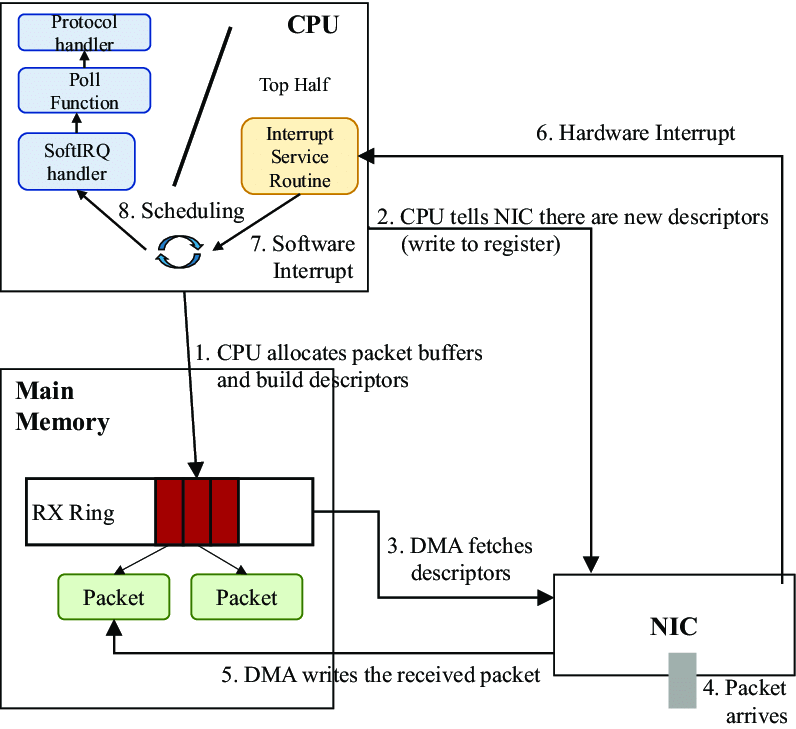
    - netfilter hooks
      - 所谓的 hook 实质上是代码中的枚举对象（值为从 0 开始递增的整型）每个 hook 在内核网络栈中对应特定的触发点位置，以 IPv4 协议栈为例，有以下 netfilter hooks 定义：
      - 所有的触发点位置统一调用 NF_HOOK 这个宏来触发 hook
    - 回调函数与优先级
      - netfilter 的另一组成部分是 hook 的回调函数。内核网络栈既使用 hook 来代表特定触发位置，也使用 hook （的整数值）作为数据索引来访问触发点对应的回调函数。
      - 内核的其他模块可以通过 netfilter 提供的 api 向指定的 hook 注册回调函数，同一 hook 可以注册多个回调函数，通过注册时指定的 priority 参数可指定回调函数在执行时的优先级。
  - iptables
    - 基于内核 netfilter 提供的 hook 回调函数机制，netfilter 作者 Rusty Russell 还开发了 iptables，实现在用户空间管理应用于数据包的自定义规则。
      - 用户空间的 iptables 命令向用户提供访问内核 iptables 模块的管理界面。
      - 内核空间的 iptables 模块在内存中维护规则表，实现表的创建及注册。
      - iptables 主要操作以下几种对象：
        - table：对应内核空间的 xt_table 结构，iptable 的所有操作都对指定的 table 执行，默认为 filter。
        - chain：对应指定 table 通过特定 netfilter hook 调用的规则集，此外还可以自定义规则集，然后从 hook 规则集中跳转过去。
        - rule：对应上文中 ipt_entry、ipt_entry_match 和 ipt_entry_target，定义了对数据包的匹配规则以及匹配后执行的行为。
        - match：具有很强扩展性的自定义匹配规则。
        - target：具有很强扩展性的自定义匹配后行为。
  - conntrack
    - 仅仅通过 3、4 层的首部信息对数据包进行过滤是不够的，有时候还需要进一步考虑连接的状态。netfilter 通过另一内置模块 conntrack 进行连接跟踪（connection tracking），以提供根据连接过滤、地址转换（NAT）等更进阶的网络过滤功能。由于需要对连接状态进行判断，conntrack 在整体机制相同的基础上，又针对协议特点有单独的实现。
- [云原生虚拟网络 tun/tap & veth-pair](https://www.luozhiyun.com/archives/684)
  - 主流的虚拟网卡方案有tun/tap和veth两种
  - tun/tap 出现得更早
    - tun 和 tap 是两个相对独立的虚拟网络设备，它们作为虚拟网卡，除了不具备物理网卡的硬件功能外，它们和物理网卡的功能是一样的，此外tun/tap负责在内核网络协议栈和用户空间之间传输数据。
      - tun 设备是一个三层网络层设备，从 /dev/net/tun 字符设备上读取的是 IP 数据包，写入的也只能是 IP 数据包，因此常用于一些点对点IP隧道，例如OpenVPN，IPSec等；
      - tap 设备是二层链路层设备，等同于一个以太网设备，从 /dev/tap0 字符设备上读取 MAC 层数据帧，写入的也只能是 MAC 层数据帧，因此常用来作为虚拟机模拟网卡使用；
      - tap设备是一个二层设备所以通常接入到 Bridge上作为局域网的一个节点，tun设备是一个三层设备通常用来实现 vpn。
    - 功能
      - 一个是连接其它设备（虚拟网卡或物理网卡）和 Bridge 这是 tap 设备的作用；
      - 另一个是提供用户空间程序去收发虚拟网卡上的数据，这是 tun 设备的作用。
    - 云原生虚拟网络中， flannel 的 UDP 模式中的 flannel0 就是一个 tun 设备
      - 发现 tun/tap 设备是一个虚拟网络设备，负责数据转发，但是它需要通过文件作为传输通道，这样不可避免的引申出 tun/tap 设备为什么要转发两次，这也是为什么 flannel 设备 UDP 模式下性能不好的原因，导致了后面这种模式被废弃掉。
    - OpenVPN 也利用到了 tun/tap 进行数据的转发
  - veth 实际上不是一个设备，而是一对设备，因而也常被称作 Veth-Pair。
    - Docker 中的 Bridge 模式就是依靠 veth-pair 连接到 docker0 网桥上与宿主机乃至外界的其他机器通信的
    - veth 作为一个二层设备，可以让两个隔离的网络名称空间之间可以互相通信，不需要反复多次经过网络协议栈， 
    - veth pair 是一端连着协议栈，另一端彼此相连的，数据之间的传输变得十分简单，这也让 veth 比起 tap/tun 具有更好的性能。
     ```shell
     # 创建两个namespace
     ip netns add ns1
     ip netns add ns2
     
     # 通过ip link命令添加vethDemo0和vethDemo1
     ip link add vethDemo0 type veth peer name vethDemo1
     
     # 将 vethDemo0 vethDemo1 分别加入两个 ns
     ip link set vethDemo0 netns ns1
     ip link set vethDemo1 netns ns2
     
     # 给两个 vethDemo0 vethDemo1  配上 IP 并启用
     ip netns exec ns1 ip addr add 10.1.1.2/24 dev vethDemo0
     ip netns exec ns1 ip link set vethDemo0 up
     
     ip netns exec ns2 ip addr add 10.1.1.3/24 dev vethDemo1
     ip netns exec ns2 ip link set vethDemo1 up
     
     #我们可以看到 namespace 里面设置好了各自的虚拟网卡以及对应的ip：
     ip netns exec ns1 ip addr  
     #我们 ping vethDemo1 设备的 ip：
     ip netns exec ns1 ping 10.1.1.3
     
     ip netns exec ns1 tcpdump -n -i vethDemo0 
     ```
- [云原生虚拟网络之 VXLAN 协议](https://www.luozhiyun.com/archives/687)
  - VLAN
    - VLAN 的全称是“虚拟局域网”（Virtual Local Area Network），它是一个二层（数据链路层）的网络，用来分割广播域，因为随着计算机的增多，如果仅有一个广播域，会有大量的广播帧（如 ARP 请求、DHCP、RIP 都会产生广播帧）转发到同一网络中的所有客户机上。
    - 这种技术可以把一个 LAN 划分成多个逻辑的 VLAN ，每个 VLAN 是一个广播域，VLAN 内的主机间通信就和在一个 LAN 内一样，而 VLAN 间则不能直接互通，广播报文就被限制在一个 VLAN 内。
      - 第一个缺陷在于 VLAN Tag 的设计，定义 VLAN 的 802.1Q规范是在 1998 年提出的，只给 VLAN Tag 预留了 32 Bits 的存储空间，其中只有12 Bits 才能用来存储 VLAN ID。
      - VLAN 第二个缺陷在于它本身是一个二层网络技术，但是在两个独立数据中心之间信息只能够通过三层网络传递，云计算的发展普及很多业务有跨数据中心运作的需求，所以数据中心间传递 VLAN Tag 又是一件比较麻烦的事情；
  - VXLAN 
    - 协议报文
      - VXLAN（Virtual eXtensible LAN）虚拟可扩展局域网采用 L2 over L4 （MAC in UDP）的报文封装模式，把原本在二层传输的以太帧放到四层 UDP 协议的报文体内，同时加入了自己定义的 VXLAN Header。
      - 
    - 工作模型
      - VTEP（VXLAN Tunnel Endpoints，VXLAN隧道端点）：VXLAN 网络的边缘设备，是 VXLAN 隧道的起点和终点，负责 VXLAN 协议报文的封包和解包，也就是在虚拟报文上封装 VTEP 通信的报文头部。
      - VNI（VXLAN Network Identifier）一般每个 VNI 对应一个租户，并且它是个 24 位整数，也就是说使用 VXLAN 搭建的公有云可以理论上可以支撑最多1677万级别的租户；
      - 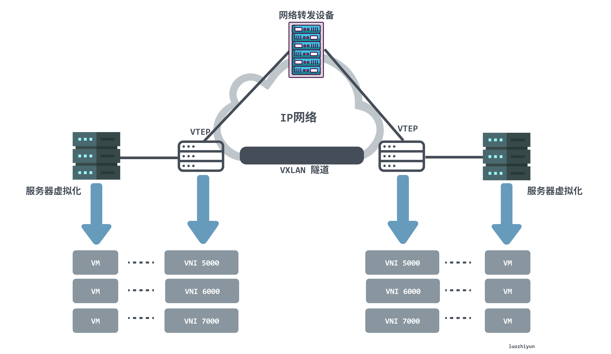
    - 通信过程
      - Flannel 的 VXLAN 模式网络中的 VTEP 的 MAC 地址并不是通过多播学习的，而是通过 apiserver 去做的同步（或者是etcd）
      - 每个节点在创建 Flannel 的时候，各个节点会将自己的VTEP信息上报给 apiserver，而apiserver 会再同步给各节点上正在 watch node api 的 listener(Flanneld)，Flanneld 拿到了更新消息后，再通过netlink下发到内核，更新 FDB（查询转发表） 表项，从而达到了整个集群的同步。
- [云原生虚拟网络之 Flannel 工作原理](https://mp.weixin.qq.com/s/qqVcOkifm8xRSRk7ZSBMKA)
  - 概述
    - Docker 的网络模式。在默认情况，Docker 使用 bridge 网络模式
    - 
    - 在 Docker 的默认配置下，一台宿主机上的 docker0 网桥，和其他宿主机上的 docker0 网桥，没有任何关联，它们互相之间也没办法连通。所以，连接在这些网桥上的容器，自然也没办法进行通信了。
    - 这个时候 Flannel 就来了，它是 CoreOS 公司主推的容器网络方案。实现原理其实相当于在原来的网络上加了一层 Overlay 网络，该网络中的结点可以看作通过虚拟或逻辑链路而连接起来的。
    - Flannel 会在每一个宿主机上运行名为 flanneld 代理，其负责为宿主机预先分配一个Subnet 子网，并为 Pod 分配ip地址。Flannel 使用 Kubernetes 或 etcd 来存储网络配置、分配的子网和主机公共 ip 等信息，数据包则通过 VXLAN、UDP 或 host-gw 这些类型的后端机制进行转发。
  - Subnet 子网
    - Flannel 要建立一个集群的覆盖网络（overlay network），首先就是要规划每台主机容器的 ip 地址。
      ```shell
      [root@localhost ~]# cat /run/flannel/subnet.env
      FLANNEL_NETWORK=172.20.0.0/16
      FLANNEL_SUBNET=172.20.0.1/24
      FLANNEL_MTU=1450
      FLANNEL_ipMASQ=true
      ```
  - Flannel backend
    - udp
      - udp 是 Flannel 最早支持的模式，在这个模式中主要有两个主件：flanneld 、flannel0 。
        - flanneld 进程负责监听 etcd 上面的网络变化，以及用来收发包
        - flannel0 则是一个三层的 tun 设备，用作在操作系统内核和用户应用程序之间传递 ip 包。(tun 设备是一个三层网络层设备，它用来模拟虚拟网卡，可以直接通过其虚拟 IP 实现相互访问。tun 设备会从 /dev/net/tun 字符设备文件上读写数据包，应用进程 A 会监听某个端口传过来的数据包，负责封包和解包数据。)
      - 
      - ip 为 172.20.0.8 的容器想要给另一个节点的 172.20.1.8 容器发送数据，这个数据包根据 ip 路由会先交给 flannel0 设备，然后 flannel0 就会把这个 ip 包，交给创建这个设备的应用程序，也就是 flanneld 进程，flanneld 进程是一个 udp 进程，负责处理 flannel0 发送过来的数据包。
      - flanneld 进程会监听 etcd 的网络信息，然后根据目的 ip 的地址匹配到对应的子网，从 etcd 中找到这个子网对应的宿主机 node 的 ip 地址，然后将这个数据包直接封装在 udp 包里面，然后发送给 node 2。
      - 由于每台宿主机上的 flanneld 都监听着一个 8285 端口，所以 node 2 机器上 flanneld 进程会从 8285 端口获取到传过来的数据，解析出封装在里面的发给源 ip 地址。
      - udp 模式现在已经废弃，原因就是因为它经过三次用户态与内核态之间的数据拷贝。
        - 容器发送数据包经过 cni0 网桥进入内核态一次；
        - 数据包由 flannel0 设备进入到 flanneld 进程又一次；
        - 第三次是 flanneld 进行 udp 封包之后重新进入内核态，将 UDP 包通过宿主机的 eth0 发出去。
    - VXLAN
      - VXLAN（虚拟可扩展局域网），它是 Linux 内核本身就支持的一种网络虚似化技术。
      - VXLAN 采用 L2 over L4 （MAC in UDP）的报文封装模式，把原本在二层传输的以太帧放到四层 UDP 协议的报文体内，同时加入了自己定义的 VXLAN Header。在 VXLAN Header 里直接就有 24 Bits 的 VLAN ID，可以存储 1677 万个不同的取值，VXLAN 让二层网络得以在三层范围内进行扩展，不再受数据中心间传输的限制。VXLAN 工作在二层网络（ ip 网络层），只要是三层可达（能够通过 ip 互相通信）的网络就能部署 VXLAN 。
      - 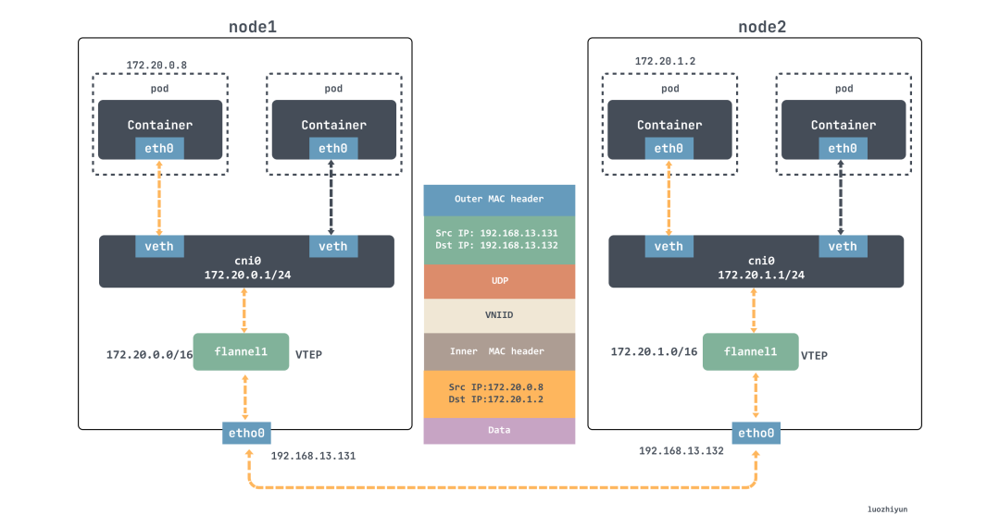
      - 发送端：在 node1 中发起 ping 172.20.1.2 ，ICMP 报文经过 cni0 网桥后交由 flannel.1 设备处理。 flannel.1 设备是 VXLAN 的 VTEP 设备，负责 VXLAN 封包解包。因此，在发送端，flannel.1 将原始L2报文封装成 VXLAN UDP 报文，然后从 eth0 发送；
      - 接收端：node2 收到 UDP 报文，发现是一个 VXLAN 类型报文，交由 flannel.1 进行解包。根据解包后得到的原始报文中的目的 ip，将原始报文经由 cni0 网桥发送给相应容器；
    - host-gw
      - host-gw模式通信十分简单，它是通过 ip 路由直连的方式进行通信，flanneld 负责为各节点设置路由 ，将对应节点Pod子网的下一跳地址指向对应的节点的 ip ：
      - 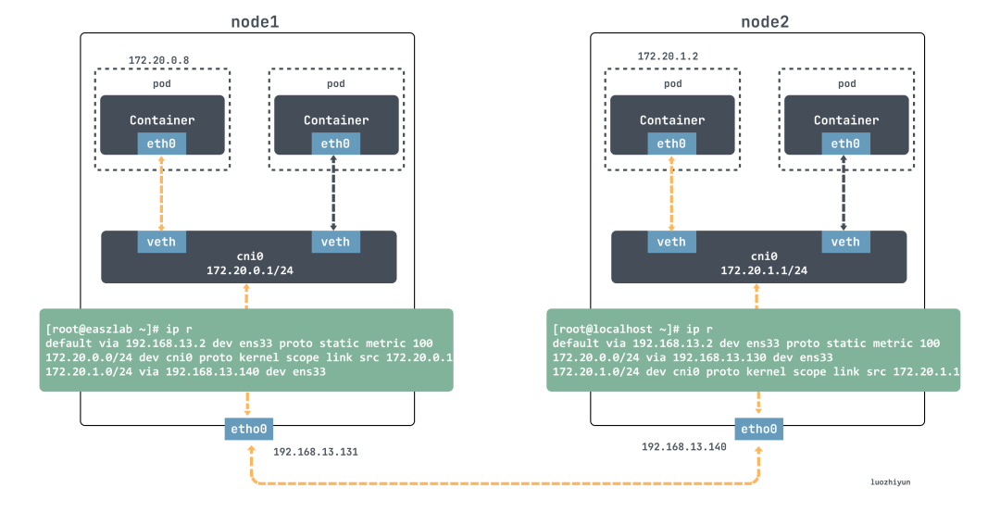
  - Summary
    - 对比三种网络，udp 主要是利用 tun 设备来模拟一个虚拟网络进行通信；vxlan 模式主要是利用 vxlan 实现一个三层的覆盖网络，利用 flannel1 这个 vtep 设备来进行封拆包，然后进行路由转发实现通信；而 host-gw 网络则更为直接，直接改变二层网络的路由信息，实现数据包的转发，从而省去中间层，通信效率更高
- [Containerd 的使用](https://mp.weixin.qq.com/s/--t74RuFGMmTGl2IT-TFrg)
  - Docker
    - CS 架构，守护进程负责和 Docker Client 端交互，并管理 Docker 镜像和容器。现在的架构中组件 containerd 就会负责集群节点上容器的生命周期管理，并向上为 Docker Daemon 提供 gRPC 接口。
    - 创建一个容器
      - Docker Daemon 并不能直接帮我们创建了，而是请求 containerd 来创建一个容器
      - containerd 收到请求后，也并不会直接去操作容器，而是创建一个叫做 containerd-shim 的进程 (让这个进程去操作容器，我们指定容器进程是需要一个父进程来做状态收集、维持 stdin 等 fd 打开等工作的，假如这个父进程就是 containerd，那如果 containerd 挂掉的话，整个宿主机上所有的容器都得退出了，而引入 containerd-shim 这个垫片就可以来规避这个问题了)
      - 真正启动容器是通过 containerd-shim 去调用 runc 来启动容器的，runc 启动完容器后本身会直接退出，containerd-shim 则会成为容器进程的父进程, 负责收集容器进程的状态, 上报给 containerd, 并在容器中 pid 为 1 的进程退出后接管容器中的子进程进行清理, 确保不会出现僵尸进程。
        - 创建容器需要做一些 namespaces 和 cgroups 的配置，以及挂载 root 文件系统等操作，这些操作其实已经有了标准的规范，那就是 OCI（开放容器标准），runc 就是它的一个参考实现
  - CRI
    - CRI（Container Runtime Interface 容器运行时接口）本质上就是 Kubernetes 定义的一组与容器运行时进行交互的接口，所以只要实现了这套接口的容器运行时都可以对接到 Kubernetes 平台上来。
    - 有一些容器运行时可能不会自身就去实现 CRI 接口，于是就有了 shim（垫片）， 一个 shim 的职责就是作为适配器将各种容器运行时本身的接口适配到 Kubernetes 的 CRI 接口上，其中 dockershim 就是 Kubernetes 对接 Docker 到 CRI 接口上的一个垫片实现。
    - Kubelet 通过 gRPC 框架与容器运行时或 shim 进行通信，其中 kubelet 作为客户端，CRI shim（也可能是容器运行时本身）作为服务器。
    - 由于 Docker 当时的江湖地位很高，Kubernetes 是直接内置了 dockershim 在 kubelet 中的，所以如果你使用的是 Docker 这种容器运行时的话是不需要单独去安装配置适配器之类的
    - 
      - 当我们在 Kubernetes 中创建一个 Pod 的时候，首先就是 kubelet 通过 CRI 接口调用 dockershim，请求创建一个容器，kubelet 可以视作一个简单的 CRI Client, 而 dockershim 就是接收请求的 Server，不过他们都是在 kubelet 内置的。
      - dockershim 收到请求后, 转化成 Docker Daemon 能识别的请求, 发到 Docker Daemon 上请求创建一个容器，请求到了 Docker Daemon 后续就是 Docker 创建容器的流程了，去调用 containerd，然后创建 containerd-shim 进程，通过该进程去调用 runc 去真正创建容器。
    - 
      - 到了 containerd 1.1 版本后就去掉了 CRI-Containerd 这个 shim，直接把适配逻辑作为插件的方式集成到了 containerd 主进程中，现在这样的调用就更加简洁了
- [Kubernetes 网络排错](https://mp.weixin.qq.com/s/yX6haXz05F4Spu0_3rvJYw)
  - 网络异常大概分为如下几类
    - 网络不可达，主要现象为 ping 不通，其可能原因为：
      - 源端和目的端防火墙（iptables, selinux）限制
      - 网络路由配置不正确
      - 源端和目的端的系统负载过高，网络连接数满，网卡队列满
      - 网络链路故障
    - 端口不可达：主要现象为可以 ping 通，但 telnet 端口不通，其可能原因为：
       - 源端和目的端防火墙限制
       - 源端和目的端的系统负载过高，网络连接数满，网卡队列满，端口耗尽
       - 目的端应用未正常监听导致（应用未启动，或监听为 127.0.0.1 等）
    - DNS 解析异常：主要现象为基础网络可以连通，访问域名报错无法解析，访问 IP 可以正常连通。其可能原因为
      - Pod 的 DNS 配置不正确
      - DNS 服务异常
      - pod 与 DNS 服务通讯异常
    - 大数据包丢包：主要现象为基础网络和端口均可以连通，小数据包收发无异常，大数据包丢包。可能原因为：
      - 可使用 ping -s 指定数据包大小进行测试
      - 数据包的大小超过了 docker、CNI 插件、或者宿主机网卡的 MTU 值。
    - CNI 异常：主要现象为 Node 可以通，但 Pod 无法访问集群地址，可能原因有：
      - kube-proxy 服务异常，没有生成 iptables 策略或者 ipvs 规则导致无法访问
      - CIDR 耗尽，无法为 Node 注入 PodCIDR 导致 CNI 插件异常
      - 其他 CNI 插件问题
  - Tools
    - tcpdump
      - 捕获所有网络接口 `tcpdump -D`
      - 按 IP 查找流量 `tcpdump host 1.1.1.1`
      - 按源 / 目的 地址过滤 `tcpdump src|dst 1.1.1.1`
      - 通过网络查找数据包 `tcpdump net 1.2.3.0/24`
      - 使用十六进制输出数据包内容 `tcpdump -c 1 -X icmp`
      - 查看特定端口的流量 `tcpdump src port 1025`
      - 查找端口范围的流量 `tcpdump portrange 21-23`
      - 过滤包的大小 `tcpdump greater 64`
      - 原始输出 `tcpdump -ttnnvvS -i eth0`
      - 查找从某个 IP 到端口任何主机的某个端口所有流量 `tcpdump -nnvvS src 10.5.2.3 and dst port 3389`
      - 可以将指定的流量排除，如这显示所有到 192.168.0.2 的 非 ICMP 的流量。 `tcpdump dst 192.168.0.2 and src net and not icmp`
      - `tcpdump 'src 10.0.2.4 and (dst port 3389 or 22)'`
      - 过滤 TCP 标记位
        - TCP RST `tcpdump 'tcp[tcpflags] == tcp-rst'`
        - TCP SYN `tcpdump 'tcp[tcpflags] == tcp-syn'`
      - 查找 http 包
        - 查找只是 GET 请求的流量 `tcpdump -vvAls0 | grep 'GET'`
        - 查找 http 客户端 IP `tcpdump -vvAls0 | grep 'Host:'`
      - `tcpdump -i eth0 -nn -s0 -v port 80`
        - -nn : 单个 n 表示不解析域名，直接显示 IP；两个 n 表示不解析域名和端口。这样不仅方便查看 IP 和端口号，而且在抓取大量数据时非常高效，因为域名解析会降低抓取速度。
        - -s0 : tcpdump 默认只会截取前 96 字节的内容，要想截取所有的报文内容，可以使用 -s number， number 就是你要截取的报文字节数，如果是 0 的话，表示截取报文全部内容。
        - -v : 使用 -v，-vv 和 -vvv 来显示更多的详细信息，通常会显示更多与特定协议相关的信息。
        - -p : 不让网络接口进入混杂模式。当网卡工作在混杂模式下时，网卡将来自接口的所有数据都捕获并交给相应的驱动程序。
        - -e : 显示数据链路层信息。默认情况下 tcpdump 不会显示数据链路层信息，使用 -e 选项可以显示源和目的 MAC 地址，以及 VLAN tag 信息。
        - -A 表示使用 ASCII 字符串打印报文的全部数据，这样可以使读取更加简单，方便使用 grep 等工具解析输出内容。
        - -l : 如果想实时将抓取到的数据通过管道传递给其他工具来处理，需要使用 -l 选项来开启行缓冲模式
      -  抓取所有发往网段 192.168.1.x 或从网段 192.168.1.x 发出的流量 `tcpdump net 192.168.1`
      - [More Samples](https://icloudnative.io/posts/tcpdump-examples/)
  - Pod抓包
    - 对于 Kubernetes 集群中的 Pod，由于容器内不便于抓包，通常视情况在 Pod 数据包经过的 veth 设备，docker0 网桥，CNI 插件设备（如 cni0，flannel.1 etc..）及 Pod 所在节点的网卡设备上指定 Pod IP 进行抓包。
    - 需要注意在不同设备上抓包时指定的源目 IP 地址需要转换，如抓取某 Pod 时，ping {host} 的包，在 veth 和 cni0 上可以指定 Pod IP 抓包，而在宿主机网卡上如果仍然指定 Pod IP 会发现抓不到包，因为此时 Pod IP 已被转换为宿主机网卡 IP
    - nsenter
      - 如果一个容器以非 root 用户身份运行，而使用 docker exec 进入其中后，但该容器没有安装 sudo 或未 netstat ，并且您想查看其当前的网络属性，如开放端口，这种场景下将如何做到这一点？nsenter 就是用来解决这个问题的。
      - `nsenter -t pid -n <commond>`
      - `docker inspect --format "{{ .State.Pid }}" 6f8c58377aae`
    - paping
      - paping 命令可对目标地址指定端口以 TCP 协议进行连续 ping，通过这种特性可以弥补 ping ICMP 协议，以及 nmap , telnet 只能进行一次操作的的不足；通常情况下会用于测试端口连通性和丢包率
    - mtr
  - Cases
    - 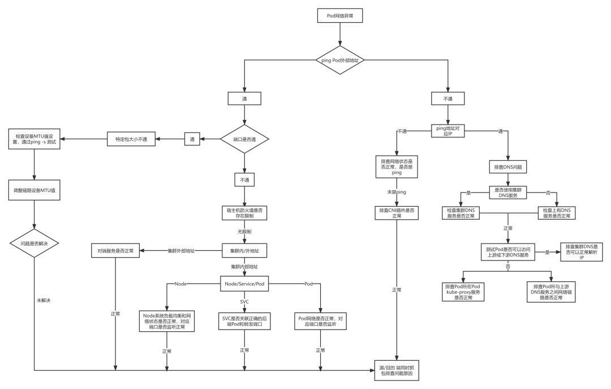
    - 扩容节点访问 service 地址不通
      - 现象：
        - 所有节点之间的 pod 通信正常
        - 任意节点和 Pod curl registry 的 Pod 的 IP:5000 均可以连通
        - 新扩容节点 10.153.204.15 curl registry 服务的 Cluster lP 10.233.0.100:5000 不通，其他节点 curl 均可以连通
      - 分析思路：
        - 根据现象 1 可以初步判断 CNI 插件无异常
        - 根据现象 2 可以判断 registry 的 Pod 无异常
        - 根据现象 3 可以判断 registry 的 service 异常的可能性不大，可能是新扩容节点访问 registry 的 service 存在异常
      - 怀疑方向：
        - 问题节点的 kube-proxy 存在异常
        - 问题节点的 iptables 规则存在异常
        - 问题节点到 service 的网络层面存在异常
      - 排查过程：
        - 排查问题节点的 kube-proxy
        - 执行 kubectl get pod -owide -nkube-system l grep kube-proxy 查看 kube-proxy Pod 的状态，问题节点上的 kube-proxy Pod 为 running 状态
        - 执行 kubecti logs <nodename> <kube-proxy pod name> -nkube-system 查看问题节点 kube-proxy 的 Pod 日志，没有异常报错
        - 在问题节点操作系统上执行 iptables -S -t nat 查看 iptables 规则
      - 解决方法：修改网卡配置文件 /etc/sysconfig/network-scripts/ifcfg-enp26s0f0 里 BOOTPROTO="dhcp"为 BOOTPROTO="none"；重启 docker 和 kubelet 问题解决。
    - 集群外云主机调用集群内应用超时
      - 在云主机 telnet 应用接口地址和端口，可以连通，证明网络连通正常，如图所示
      - 云主机上调用接口不通，在云主机和 Pod 所在 Kubernetes 节点同时抓包，使用 wireshark 分析数据包
      - 通过抓包结果分析结果为 TCP 链接建立没有问题，但是在传输大数据的时候会一直重传 1514 大小的第一个数据包直至超时。怀疑是链路两端 MTU 大小不一致导致（现象：某一个固定大小的包一直超时的情况）
      - 在云主机上使用 ping -s 指定数据包大小，发现超过 1400 大小的数据包无法正常发送。结合以上情况，定位是云主机网卡配置的 MTU 是 1500，tunl0 配置的 MTU 是 1440，导致大数据包无法发送至 tunl0 ，因此 Pod 没有收到报文，接口调用失败。
- [Misc]
  - kubelet 启动时需要之前说的一个随机端口完成exec的功能。
    - 正常情况下k8s nodePort 的端口在localhost 访问时： iptables模式下使用localhost:nodePort 是可以正常访问nodePort 服务的。
    - 但是ipvs 模式下是不能使用localhost:nodePort  这种形式访问的: 相关issue：https://github.com/kubernetes/kubernetes/issues/67730
      - 在ipvs模式下conntrack 表项会表现成这样（类似回环问题）：
      - tcp      6 119 SYN_SENT src=127.0.0.1 dst=127.0.0.1 sport=38770 dport=42515 [UNREPLIED] src=127.0.0.1 dst=10.133.38.54 sport=42515 dport=17038 mark=0 use=1 会显示timeout。
   - 所以当k8s nodePort和kubelet启动的随机端口一致时:
     - iptables 模式下会被转发到nodeport svc
     - ipvs 下会导致回环不通。
   - 综上：kubelet 启动时监听到port 和nodePort 不能一样。
- [Underlay vs Overlay Network Model](https://mp.weixin.qq.com/s/UOO75q8Ij-Ywl62pLqD2MA)
  - Underlay Network Model
    - Underlay Network 顾名思义是指网络设备基础设施，如交换机，路由器, DWDM 使用网络介质将其链接成的物理网络拓扑，负责网络之间的数据包传输。
    - underlay network 可以是二层，也可以是三层；二层的典型例子是以太网 Ethernet，三层是的典型例子是互联网 Internet。
    - 而工作于二层的技术是 vlan，工作在三层的技术是由 OSPF, BGP 等协议组成。
    - k8s 中的 underlay network
      - 模型下典型的有 flannel 的 host-gw 模式与 calico BGP 模式。
      - flannel host-gw 模式中每个 Node 需要在同一个二层网络中，并将 Node 作为一个路由器，跨节点通讯将通过路由表方式进行，这样方式下将网络模拟成一个underlay network。
      - Calico 提供了的 BGP 网络解决方案，在网络模型上，Calico 与 Flannel host-gw 是近似的，但在软件架构的实现上，flannel 使用 flanneld 进程来维护路由信息；而 Calico 是包含多个守护进程的，其中 Brid 进程是一个 BGP 客户端与路由反射器(Router Reflector)，BGP 客户端负责从 Felix 中获取路由并分发到其他 BGP Peer，而反射器在 BGP 中起了优化的作用。
    - IPVLAN & MACVLAN
      - IPVLAN 允许一个物理网卡拥有多个 IP 地址，并且所有的虚拟接口用同一个 MAC 地址；
      - MACVLAN 则是相反的，其允许同一个网卡拥有多个 MAC 地址，而虚拟出的网卡可以没有 IP 地址
  - Overlay Network Model
    - Overlay
      - overlay network 使用的是一种或多种隧道协议 (tunneling)，通过将数据包封装，实现一个网络到另一个网络中的传输，具体来说隧道协议关注的是数据包（帧）。
    - 常见的网络隧道技术
      - 通用路由封装 ( Generic Routing Encapsulation ) 用于将来自 IPv4/IPv6 的数据包封装为另一个协议的数据包中，通常工作与 L3 网络层中。
      - VxLAN (Virtual Extensible LAN)，是一个简单的隧道协议，本质上是将 L2 的以太网帧封装为 L4 中 UDP 数据包的方法，使用 4789 作为默认端口。
    - 这种工作在 overlay 模型下典型的有 flannel 与 calico 中的的 VxLAN, IPIP 模式。
- [Pod 是如何获取 IP ]
  - Pod 的 IP 是由 kube-proxy 通过 iptables 规则设置的，kube-proxy 通过监听 apiserver 的 Endpoint 和 Service 的变化，然后根据 Service 的类型，创建相应的 iptables 规则，将请求转发到后端的 Pod 上。
  - Kube-controller-manager 为每个节点分配一个 podCIDR。从 podCIDR 中的子网值为节点上的 Pod 分配了 IP 地址。由于所有节点上的 podCIDR 是不相交的子网，因此它允许为每个 pod 分配唯一的IP地址。 
  - Kubernetes 集群管理员可配置和安装 kubelet、container runtime、network provider，并在每个节点上分发 CNI 插件。
  - Network provider agent 启动时，将生成 CNI 配置。
  - 在节点上调度 Pod 后，kubelet 会调用 CRI 插件来创建 Pod。
  - 在容器情况下，容器的 CRI 插件调用 CNI 配置中指定的 CNI 插件来配置 Pod 网络。
- [Linux网络新技术]
  - 新技术出现的历史原因
    - iptables/netfilter
      - 早期的 Linux 内核中，网络功能是通过 netfilter 模块来实现的，netfilter 模块是一个内核模块，它可以在数据包进入或者离开网络协议栈的时候，对数据包进行处理，比如修改数据包的源地址、目标地址、端口等等。
      - iptables 是 netfilter 模块的用户态工具，它可以用来配置 netfilter 模块的规则，比如允许或者禁止某个 IP 地址的数据包通过，或者修改数据包的源地址等等。
      - 明显问题
        - 由于 iptables 是一个用户态工具，所以它的性能并不是很好，而且 iptables 的配置也比较复杂，所以在早期的 Linux 内核中，iptables 的性能和配置复杂性是一个比较大的问题。
        - 路径太长 - netfilter 框架在IP层，报文需要经过链路层，IP层才能被处理，如果是需要丢弃报文，会白白浪费很多CPU资源，影响整体性能
        - O(N)匹配
        - 规则太多 - netfilter 框架类似一套可以自由添加策略规则专家系统，并没有对添加规则进行合并优化，这些都严重依赖操作人员技术水平，随着规模的增大，规则数量n成指数级增长，而报文处理又是0（n）复杂度，最终性能会直线下降
    - 内核协议栈
      - 现在到了1000Mbps/10Gbps/40Gbps网卡的时代，数据被很快地收入，协议栈复杂处理逻辑，效率捉襟见肘，把大量报文堵在内核里
        - 各类链表在多CPU环境下的同步开销。
        - 不可睡眠的软中断路径过长。
        - sk_buff的分配和释放。
        - 内存拷贝的开销。
        - 上下文切换造成的cache miss。
      - 重构的思路很显然有两个：
        - upload方法：别让应用程序等内核了，让应用程序自己去网卡直接拉数据。
        - offload方法：别让内核处理网络逻辑了，让网卡自己处理
      - DPDK让用户态程序直接处理网络流，bypass掉内核，使用独立的CPU专门干这个事。
      - XDP是Linux内核4.8引入的一个新的功能，它可以让用户态程序直接处理网络流，bypass掉内核，使用独立的CPU专门干这个事。
  - eBPF
    - BPF 是 Linux 内核中高度灵活和高效的类似虚拟机的技术，允许以安全的方式在各个挂钩点执行字节码。它用于许多 Linux 内核子系统，最突出的是网络、跟踪和安全
    - BPF 是一个通用目的 RISC 指令集，其最初的设计目标是：用 C 语言的一个子集编 写程序，然后用一个编译器后端（例如 LLVM）将其编译成 BPF 指令，稍后内核再通 过一个位于内核中的（in-kernel）即时编译器（JIT Compiler）将 BPF 指令映射成处理器的原生指令（opcode ），以取得在内核中的最佳执行性能。
    - 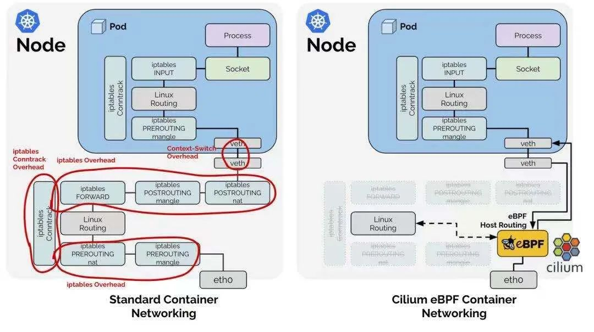
      - eBPF主机路由允许绕过主机命名空间中所有的 iptables 和上层网络栈，以及穿过Veth对时的一些上下文切换，以节省资源开销。网络数据包到达网络接口设备时就被尽早捕获，并直接传送到Kubernetes Pod的网络命名空间中。在流量出口侧，数据包同样穿过Veth对，被eBPF捕获后，直接被传送到外部网络接口上。eBPF直接查询路由表，因此这种优化完全透明。
      - 基于eBPF中的kube-proxy网络技术正在替换基于iptables的kube-proxy技术，与Kubernetes中的原始kube-proxy相比，eBPF中的kuber-proxy替代方案具有一系列重要优势，例如更出色的性能、可靠性以及可调试性等等
  - BCC(BPF Compiler Collection)
    - BCC 是一个框架，它使用户能够编写嵌入其中的 eBPF 程序的 Python 程序。该框架主要针对涉及应用程序和系统分析/跟踪的用例，其中 eBPF 程序用于收集统计信息或生成事件，用户空间中的对应部分收集数据并以人类可读的形式显示。运行 python 程序将生成 eBPF 字节码并将其加载到内核中。
  - bpftrace
    - bpftrace 是一种用于 Linux eBPF 的高级跟踪语言，可在最近的 Linux 内核 (4.x) 中使用。bpftrace 使用 LLVM 作为后端将脚本编译为 eBPF 字节码，并利用 BCC 与 Linux eBPF 子系统以及现有的 Linux 跟踪功能进行交互：内核动态跟踪 (kprobes)、用户级动态跟踪 (uprobes) 和跟踪点. bpftrace 语言的灵感来自 awk、C 和前身跟踪器，例如 DTrace 和 SystemTap。
  - XDP的全称是： eXpress Data Path
    - XDP 是Linux 内核中提供高性能、可编程的网络数据包处理框架。
    - 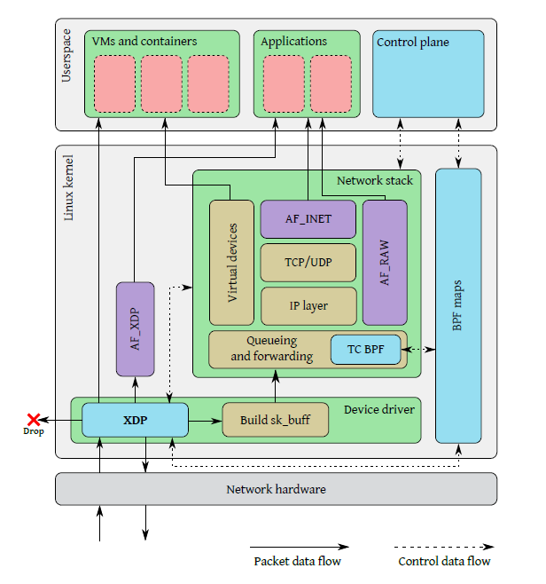
    - XDP 的主要目标是在数据包到达网络协议栈之前，就能够对数据包进行处理，从而提高网络数据包的处理性能。XDP 的处理过程如下：
      - 网络数据包到达网卡，网卡将数据包放入内存中的环形缓冲区中。
      - 内核中的驱动程序将数据包从环形缓冲区中取出，然后将数据包放入内核中的一个内存映射区域中。
      - XDP 程序从内存映射区域中取出数据包，对数据包进行处理，然后将数据包放入内核中的另一个内存映射区域中。
      - 内核中的驱动程序将数据包从内存映射区域中取出，然后将数据包放入环形缓冲区中。
      - 网卡将数据包从环形缓冲区中取出，然后将数据包发送到网络协议栈中。
    - AF_XDP 是为高性能数据包处理而优化的地址族，AF_XDP 套接字使 XDP 程序可以将帧重定向到用户空间应用程序中的内存缓冲区
    - XDP技术优势
      - 及时处理 - 在网络协议栈前处理，由于 XDP 位于整个 Linux 内核网络软件栈的底部，能够非常早地识别并丢弃攻击报文，具有很高的性能。可以改善 iptables 协议栈丢包的性能瓶颈
      - 高性能优化 - 无锁设计,批量I/O操作 不需要分配skbuff 支持网络卸载 支持网卡RSS
      - 可扩展模型 - 支持将BPF程序卸载到网卡 支持热更新，可以动态扩展内核功能
    - XDP 有三种工作模式，默认是 native（原生）模式，当讨论 XDP 时通常隐含的都是指这 种模式。
      - Native XDP
        - 默认模式，在这种模式中，XDP BPF 程序直接运行在网络驱动的早期接收路径上（ early receive path）。
      - Offloaded XDP
        - 在这种模式中，XDP BPF程序直接 offload 到网卡。
      - Generic XDP
        - 对于还没有实现 native 或 offloaded XDP 的驱动，内核提供了一个 generic XDP 选 项，这种设置主要面向的是用内核的 XDP API 来编写和测试程序的开发者，对于在生产环境使用XDP，推荐要么选择native要么选择offloaded模式。
    - 注意XDP的性能提升是有代价的，它牺牲了通用型和公平性
      - XDP不提供缓存队列（qdisc），TX设备太慢时直接丢包，因而不要在RX比TX快的设备上使用XDP
      - XDP程序是专用的，不具备网络协议栈的通用性


