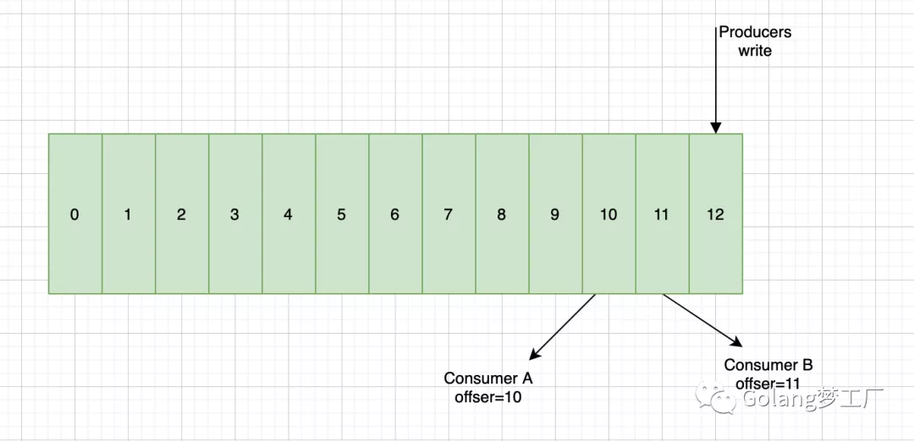
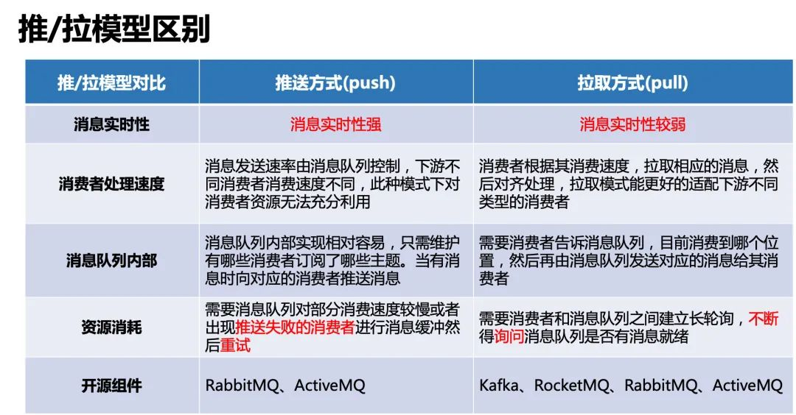

- [Kafka保证无消息丢失](https://mp.weixin.qq.com/s/XoSi3Cgp7ij-n9t4pvBoXQ)

  基于：https://github.com/Shopify/sarama

  有些概念我们也介绍一下：
  - **Producer**：数据的生产者，可以将数据发布到所选择的topic中。
  - **Consumer**：数据的消费者，使用Consumer Group进行标识，在topic中的每条记录都会被分配给订阅消费组中的一个消费者实例，消费者实例可以分布在多个进程中或者多个机器上。
  - **Broker**：消息中间件处理节点（服务器），一个节点就是一个broker，一个Kafka集群由一个或多个broker组成。
  - **topic**：可以理解为一个消息的集合，topic存储在broker中，一个topic可以有多个partition分区，一个topic可以有多个Producer来push消息，一个topic可以有多个消费者向其pull消息，一个topic可以存在一个或多个broker中。
  - **partition**：其是topic的子集，不同分区分配在不同的broker上进行水平扩展从而增加kafka并行处理能力，同topic下的不同分区信息是不同的，同一分区信息是有序的；每一个分区都有一个或者多个副本，其中会选举一个leader，fowller从leader拉取数据更新自己的log（每个分区逻辑上对应一个log文件夹），消费者向leader中pull信息。

  丢消息的三个点
  - 生产者push消息
  
    流程：
    
    通过这个流程我们可以看到kafka最终会返回一个ack来确认推送消息结果，这里kafka提供了三种模式：
    - NoResponse RequiredAcks = 0：这个代表的就是数据推出的成功与否都与我无关了
    - WaitForLocal RequiredAcks = 1：当local(leader)确认接收成功后，就可以返回了
    - WaitForAll RequiredAcks = -1：当所有的leader和follower都接收成功时，才会返回

  - kafka集群自身故障造成
    kafka集群接收到数据后会将数据进行持久化存储，最终数据会被写入到磁盘中，在写入磁盘这一步也是有可能会造成数据损失的
  - 消费者pull消息节点

    push消息时会把数据追加到Partition并且分配一个偏移量，这个偏移量代表当前消费者消费到的位置，通过这个Partition也可以保证消息的顺序性，消费者在pull到某个消息后，可以设置自动提交或者手动提交commit，提交commit成功，offset就会发生偏移:
    
    自动提交会带来数据丢失的问题，手动提交会带来数据重复的问题，分析如下：
    - 在设置自动提交的时候，当我们拉取到一个消息后，此时offset已经提交了，但是我们在处理消费逻辑的时候失败了，这就会导致数据丢失了
    - 在设置手动提交时，如果我们是在处理完消息后提交commit，那么在commit这一步发生了失败，就会导致重复消费的问题。

  方案：
  - 解决push消息丢失问题
    - 通过设置RequiredAcks模式来解决，选用WaitForAll可以保证数据推送成功，不过会影响时延时
    - 引入重试机制，设置重试次数和重试间隔
     ```go
      cfg.Producer.RequiredAcks = sarama.WaitForAll // 三种模式任君选择
      cfg.Producer.Partitioner = sarama.NewHashPartitioner
      cfg.Producer.Return.Successes = true
      cfg.Producer.Return.Errors = true
      cfg.Producer.Retry.Max = 3 // 设置重试3次
      cfg.Producer.Retry.Backoff = 100 * time.Millisecond
     ```
  - 解决pull消息丢失问题
    - 直接使用自动提交的模式，使用幂等性操作应对产生重复消费的问题
    - 手动提交与自动提交结合 TODO
    
     ```go
      cfg.Consumer.Group.Rebalance.Strategy = sarama.BalanceStrategyRange
      cfg.Consumer.Offsets.Initial = sarama.OffsetOldest
      cfg.Consumer.Offsets.Retry.Max = 3
      cfg.Consumer.Offsets.AutoCommit.Enable = true // 开启自动提交，需要手动调用MarkMessage才有效
      cfg.Consumer.Offsets.AutoCommit.Interval = 1 * time.Second // 间隔
     ```
- 如何保证 MQ消息是有序的
  - 如何保证一个队列，只有一个线程在处理消息呢
  - 如果扩容了怎么办
  - 顺序消息，如果某条失败了怎么办？会不会一直阻塞？
- [Kafka、RocketMQ 、RabbitMQ 和 ActiveMQ](https://mp.weixin.qq.com/s/GsOcoX9nP12Wzov0V9mezQ)
  - [Kafka](https://mp.weixin.qq.com/s?__biz=Mzg3OTU5NzQ1Mw==&mid=2247484210&idx=1&sn=37029e17a8505df40153dea14b18cb45&chksm=cf0341d0f874c8c63496b59984cfeb4bc338f51c58f39cddb3135a6b6dfa1db512d0824be2a9&token=1692695155&lang=zh_CN&scene=21#wechat_redirect)
    - 它是一个分布式的，支持多分区、多副本，基于 Zookeeper 的分布式消息流平台，它同时也是一款开源的基于发布订阅模式的消息引擎系统。
    - Concept
      - 主题（Topic）：消息的种类称为主题，可以说一个主题代表了一类消息，相当于是对消息进行分类，主题就像是数据库中的表。
      - 分区（partition）：主题可以被分为若干个分区，同一个主题中的分区可以不在一个机器上，有可能会部署在多个机器上，由此来实现 kafka 的伸缩性。
      - 批次：为了提高效率， 消息会分批次写入 Kafka，批次就代指的是一组消息。
      - 消费者群组（Consumer Group）：消费者群组指的就是由一个或多个消费者组成的群体。
      - Broker: 一个独立的 Kafka 服务器就被称为 broker，broker 接收来自生产者的消息，为消息设置偏移量，并提交消息到磁盘保存。
      - Broker 集群：broker 集群由一个或多个 broker 组成。
      - 重平衡（Rebalance）：消费者组内某个消费者实例挂掉后，其他消费者实例自动重新分配订阅主题分区的过程。
  - [RocketMQ](https://mp.weixin.qq.com/s?__biz=Mzg3OTU5NzQ1Mw==&mid=2247484233&idx=1&sn=8f565a54d62c9817fd99bc972e0e75b9&chksm=cf0341abf874c8bd45d2587a0f26cb9a1852a27509478e1e101785ad2dd4222d9c8252340b45&token=1692695155&lang=zh_CN&scene=21#wechat_redirect)
    - RocketMQ 是阿里开源的消息中间件，它是纯 Java 开发，具有高性能、高可靠、高实时、适合大规模分布式系统应用的特点
    - Concept
      - Name 服务器（NameServer）：充当注册中心，类似 Kafka 中的 Zookeeper。
      - Broker: 一个独立的 RocketMQ 服务器就被称为 broker，broker 接收来自生产者的消息，为消息设置偏移量。
      - 主题（Topic）：消息的第一级类型，一条消息必须有一个 Topic。
      - 子主题（Tag）：消息的第二级类型，同一业务模块不同目的的消息就可以用相同 Topic 和不同的 Tag 来标识。
      - 分组（Group）：一个组可以订阅多个 Topic，包括生产者组（Producer Group）和消费者组（Consumer Group）。
      - 队列（Queue）：可以类比 Kafka 的分区 Partition。
  - RabbitMQ
    - 基于 AMQP 协议来实现。 AMQP 的主要特征是面向消息、队列、路由、可靠性、安全。AMQP 协议更多用在企业系统内，对数据一致性、稳定性和可靠性要求很高的场景，对性能和吞吐量的要求还在其次。
    - 概念
      - 信道（Channel）：消息读写等操作在信道中进行，客户端可以建立多个信道，每个信道代表一个会话任务。
      - 交换器（Exchange）：接收消息，按照路由规则将消息路由到一个或者多个队列；如果路由不到，或者返回给生产者，或者直接丢弃。
      - 路由键（RoutingKey）：生产者将消息发送给交换器的时候，会发送一个 RoutingKey，用来指定路由规则，这样交换器就知道把消息发送到哪个队列。
      - 绑定（Binding）：交换器和消息队列之间的虚拟连接，绑定中可以包含一个或者多个 RoutingKey。
  - 消息队列对比
    - Kafka
      - 优点：
        - 高吞吐、低延迟：Kafka 最大的特点就是收发消息非常快，Kafka 每秒可以处理几十万条消息，它的最低延迟只有几毫秒；
        - 高伸缩性：每个主题（topic）包含多个分区（partition），主题中的分区可以分布在不同的主机（broker）中；
        - 高稳定性：Kafka 是分布式的，一个数据多个副本，某个节点宕机，Kafka 集群能够正常工作；
        - 持久性、可靠性、可回溯：Kafka 能够允许数据的持久化存储，消息被持久化到磁盘，并支持数据备份防止数据丢失，支持消息回溯；
        - 消息有序：通过控制能够保证所有消息被消费且仅被消费一次；
        - 有优秀的第三方 Kafka Web 管理界面 Kafka-Manager，在日志领域比较成熟，被多家公司和多个开源项目使用。
      - 缺点：
        - Kafka 单机超过 64 个队列/分区，Load 会发生明显的飙高现象，队列越多，load 越高，发送消息响应时间变长；
        - 不支持消息路由，不支持延迟发送，不支持消息重试；
        - 社区更新较慢。
    - RocketMQ
      - 优点： 
        - 高吞吐：借鉴 Kafka 的设计，单一队列百万消息的堆积能力；
        - 高伸缩性：灵活的分布式横向扩展部署架构，整体架构其实和 kafka 很像；
        - 高容错性：通过ACK机制，保证消息一定能正常消费；
        - 持久化、可回溯：消息可以持久化到磁盘中，支持消息回溯；
        - 消息有序：在一个队列中可靠的先进先出（FIFO）和严格的顺序传递；
        - 支持发布/订阅和点对点消息模型，支持拉、推两种消息模式；
        - 提供 docker 镜像用于隔离测试和云集群部署，提供配置、指标和监控等功能丰富的 Dashboard。
      - 缺点：
        - 不支持消息路由，支持的客户端语言不多，目前是 java 及 c++，其中 c++ 不成熟；
        - 部分支持消息有序：需要将同一类的消息 hash 到同一个队列 Queue 中，才能支持消息的顺序，如果同一类消息散落到不同的 Queue中，就不能支持消息的顺序。
        - 社区活跃度一般。
    - RabbitMQ
      - 优点：
        - 支持几乎所有最受欢迎的编程语言：Java，C，C ++，C＃，Ruby，Perl，Python，PHP等等；
        - 支持消息路由：RabbitMQ 可以通过不同的交换器支持不同种类的消息路由；
        - 消息时序：通过延时队列，可以指定消息的延时时间，过期时间TTL等；
        - 支持容错处理：通过交付重试和死信交换器（DLX）来处理消息处理故障；
        - 提供了一个易用的用户界面，使得用户可以监控和管理消息 Broker；
        - 社区活跃度高。
      - 缺点：
        - Erlang 开发，很难去看懂源码，不利于做二次开发和维护，基本只能依赖于开源社区的快速维护和修复 bug；
        - RabbitMQ 吞吐量会低一些，这是因为他做的实现机制比较重；
        - 不支持消息有序、持久化不好、不支持消息回溯、伸缩性一般。
  - 消息队列选型
    - Kafka：追求高吞吐量，一开始的目的就是用于日志收集和传输，适合产生大量数据的互联网服务的数据收集业务，大型公司建议可以选用，如果有日志采集功能，肯定是首选 kafka。
    - RocketMQ：天生为金融互联网领域而生，对于可靠性要求很高的场景，尤其是电商里面的订单扣款，以及业务削峰，在大量交易涌入时，后端可能无法及时处理的情况。RocketMQ 在稳定性上可能更值得信赖，这些业务场景在阿里双 11 已经经历了多次考验，如果你的业务有上述并发场景，建议可以选择 RocketMQ。
    - RabbitMQ：结合 erlang 语言本身的并发优势，性能较好，社区活跃度也比较高，但是不利于做二次开发和维护，不过 RabbitMQ 的社区十分活跃，可以解决开发过程中遇到的 bug。如果你的数据量没有那么大，小公司优先选择功能比较完备的 RabbitMQ。
- [消息队列背后的设计思想](https://mp.weixin.qq.com/s/eitRBEhuunhS0bSl7JDksA)
  - 消息队列核心模型
    - 
  - 消息队列数据组织方式
    - 
  - 获取数据的推、拉两种方案对比
    - 
    - 在 IO 多路复用中，以 epoll 为例，当内核检测到监听的描述符有数据到来时，epoll_wait() 阻塞会返回，上层用户态程序就知道有数据就绪了，然后可以通过 read() 系统调用函数读取数据。这个过程就绪通知，类似于推送，但推送的不是数据，而是数据就绪的信号。具体的数据获取方式还是需要通过拉取的方式来主动读。
    - feeds 流系统用户时间线后台实现方案（读扩散、写扩散）： 读扩散和写扩散更是这样一个 case。对于读扩散而言，主要采用拉取的方式获取数据。而对于写扩散而言，它是典型的数据推送的方式。当然在系统实现中，更复杂的场景往往会选择读写结合的思路来实现
  - 消息队列消费模型
    - 


