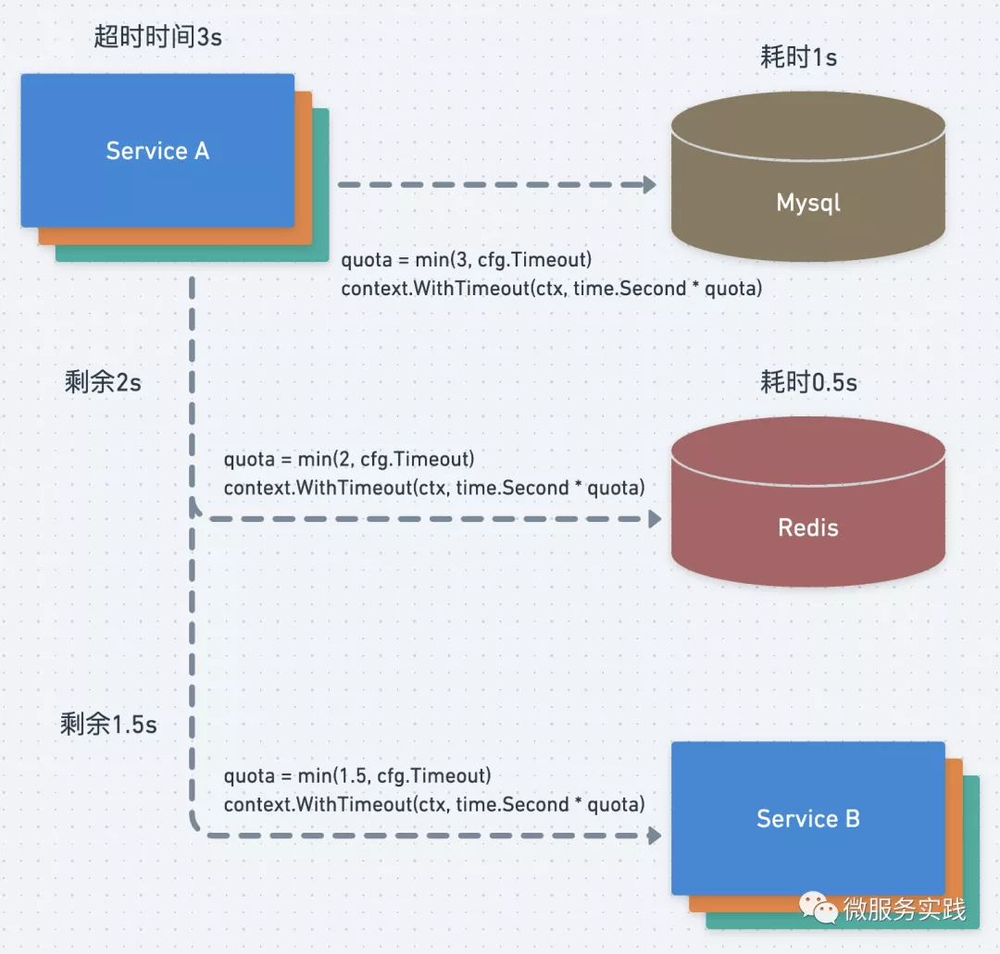
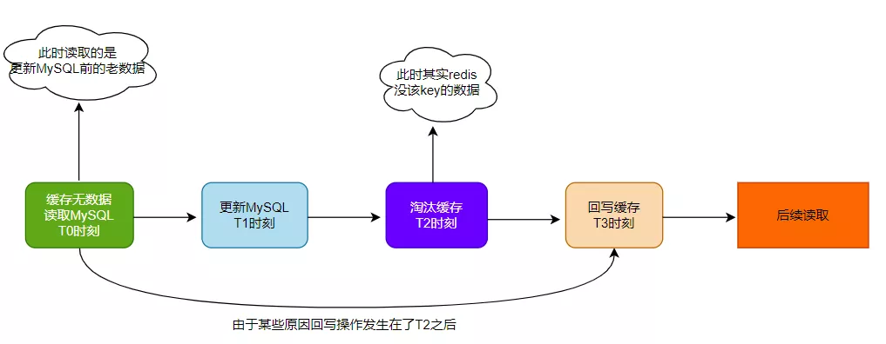
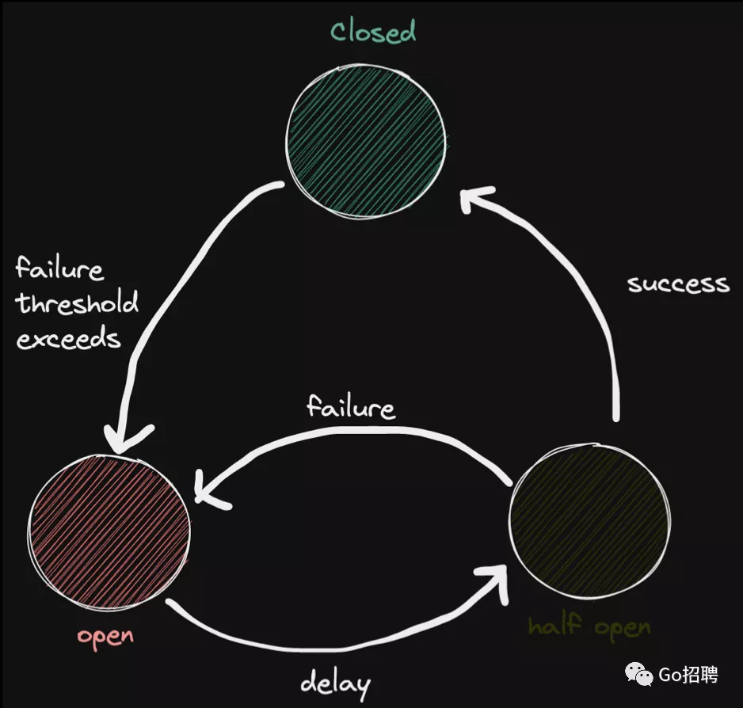
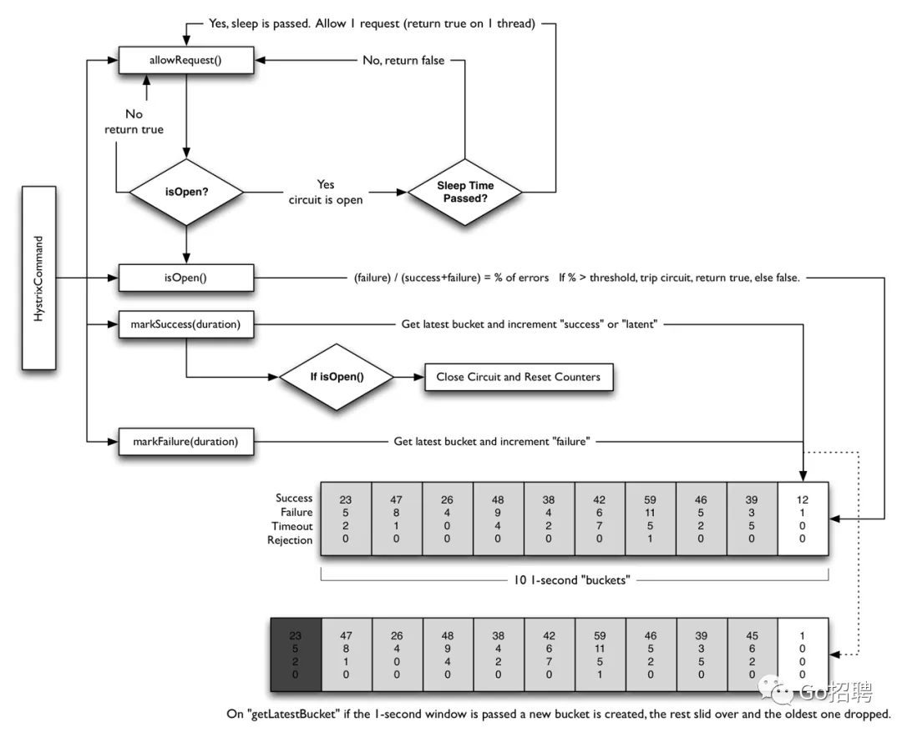
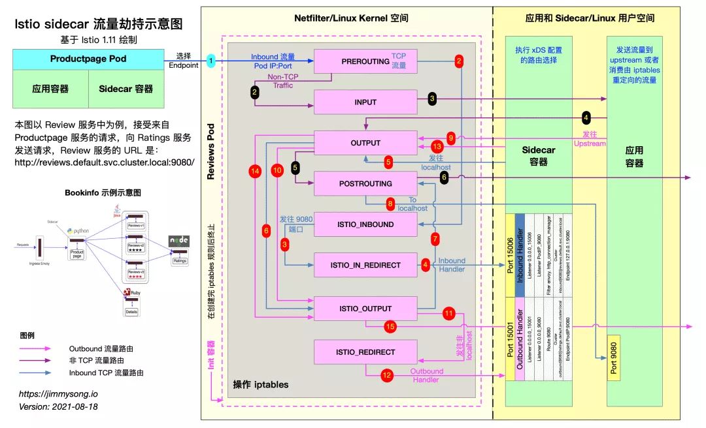
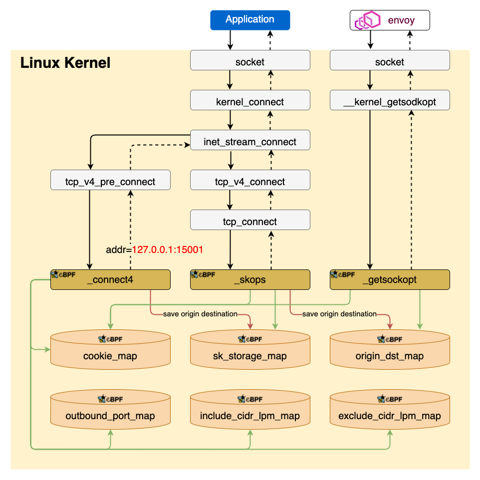
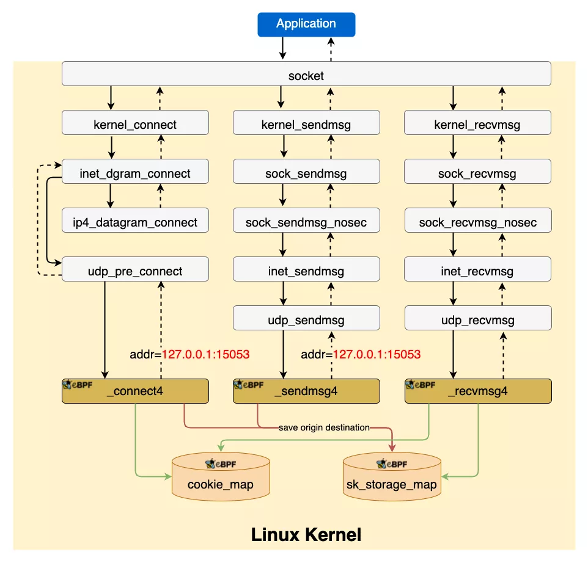
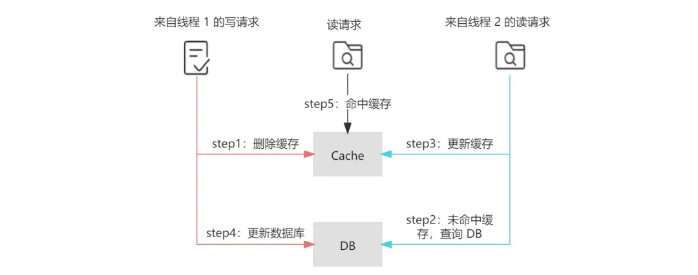
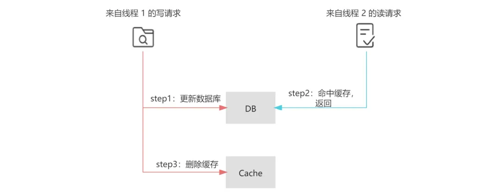
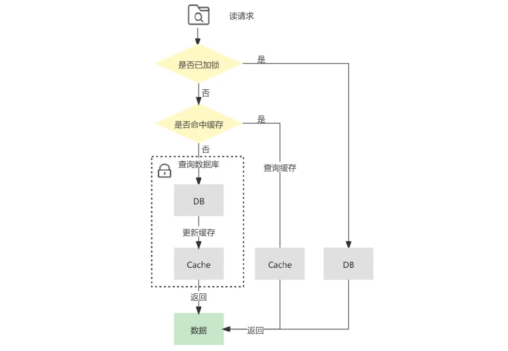

- 服务发现
    - 服务注册是针对服务端的，服务启动后需要注册，分为几个部分：
        - 启动注册
        - 定时续期
        - 退出撤销
    - 服务发现是针对调用端的，一般分为两类问题：
        - 存量获取
        - 增量侦听
        - 还有一个常见的工程问题是： 应对服务发现故障

- [Fail at Scale, Reliability in the face of rapid change](https://mp.weixin.qq.com/s/BNOr5e92atc2RZstv_afwQ) 
  - 如果大规模请求都慢了，会引起 Go GC 压力增加，最终导致服务不可用。Facebook 采了两种方法解决
    - Controlled Delay: 算法根据不同负载处理排队的请求，解决入队速率与处理请求速率不匹配问题
      ```go
      onNewRequest(req, queue):
      
        if (queue.lastEmptyTime() < (now - N seconds)) {
           timeout = M ms
        } else {
           timeout = N seconds;
        }
        queue.enqueue(req, timeout)
      ```
      如果过去 N 秒内队列不为空，说明处理不过来了，那么超时时间设短一些 M 毫秒，否则超时时间可以设长一些。Facebook 线上 M 设置为 5ms, N 是 100ms
    - Adaptive LIFO: 正常队列是 First In First Out 的，但是当业务请理慢，请求堆积时，超时的请求，用户可能己经重试了，还不如处理后入队的请求
      
    - Concurreny Control: 并发控制, 论文描述的其实就是 circuit breaker, 如果 inflight 请求过多，或是错误过多，会触发 Client 熔断

- [Go 官方限流器](https://mp.weixin.qq.com/s/qAKQm9CVNxk-ltUxHql1nw)

  [常见的限流算法](https://mp.weixin.qq.com/s?__biz=MzUzNTY5MzU2MA==&mid=2247486937&idx=1&sn=d4ea6ebb38c52e8004e73f235bde9848&scene=21#wechat_redirect) 有固定窗口、滑动窗口、漏桶、令牌桶
  - 计数器是一种比较简单粗暴的限流算法，其思想是在固定时间窗口内对请求进行计数，与阀值进行比较判断是否需要限流，一旦到了时间临界点，将计数器清零
    - 计数器算法存在“时间临界点”缺陷, 计数器算法实现限流的问题是没有办法应对突发流量
    ```go
    type LimitRate struct {
       rate  int           //阀值
       begin time.Time     //计数开始时间
       cycle time.Duration //计数周期
       count int           //收到的请求数
       lock  sync.Mutex    //锁
    }
    
    func (limit *LimitRate) Allow() bool {
       limit.lock.Lock()
       defer limit.lock.Unlock()
    
       // 判断收到请求数是否达到阀值
       if limit.count == limit.rate-1 {
          now := time.Now()
          // 达到阀值后，判断是否是请求周期内
          if now.Sub(limit.begin) >= limit.cycle {
             limit.Reset(now)
             return true
          }
          return false
       } else {
          limit.count++
          return true
       }
    }
    
    func (limit *LimitRate) Set(rate int, cycle time.Duration) {
       limit.rate = rate
       limit.begin = time.Now()
       limit.cycle = cycle
       limit.count = 0
    }
    
    func (limit *LimitRate) Reset(begin time.Time) {
       limit.begin = begin
       limit.count = 0
    }
    ```
  - 滑动窗口算法将一个大的时间窗口分成多个小窗口，每次大窗口向后滑动一个小窗口，并保证大的窗口内流量不会超出最大值，这种实现比固定窗口的流量曲线更加平滑。
    - 滑动窗口算法是固定窗口的一种改进，但从根本上并没有真正解决固定窗口算法的临界突发流量问题
    - kratos框架里circuit breaker用循环列表保存timeSlot对象的实现，他们这个实现的好处是不用频繁的创建和销毁timeslot对象
     ```go
     type timeSlot struct {
      timestamp time.Time // 这个timeSlot的时间起点
      count     int       // 落在这个timeSlot内的请求数
     }
     
     // 统计整个时间窗口中已经发生的请求次数
     func countReq(win []*timeSlot) int {
      var count int
      for _, ts := range win {
       count += ts.count
      }
      return count
     }
     
     type SlidingWindowLimiter struct {
      mu           sync.Mutex    // 互斥锁保护其他字段
      SlotDuration time.Duration // time slot的长度
      WinDuration  time.Duration // sliding window的长度
      numSlots     int           // window内最多有多少个slot
      windows      []*timeSlot
      maxReq       int // 大窗口时间内允许的最大请求数
     }
     
     func NewSliding(slotDuration time.Duration, winDuration time.Duration, maxReq int) *SlidingWindowLimiter {
      return &SlidingWindowLimiter{
       SlotDuration: slotDuration,
       WinDuration:  winDuration,
       numSlots:     int(winDuration / slotDuration),
       maxReq:       maxReq,
      }
     }
     
     
     func (l *SlidingWindowLimiter) validate() bool {
      l.mu.Lock()
      defer l.mu.Unlock()
     
     
      now := time.Now()
      // 已经过期的time slot移出时间窗
      timeoutOffset := -1
      for i, ts := range l.windows {
       if ts.timestamp.Add(l.WinDuration).After(now) {
        break
       }
       timeoutOffset = i
      }
      if timeoutOffset > -1 {
       l.windows = l.windows[timeoutOffset+1:]
      }
     
      // 判断请求是否超限
      var result bool
      if countReq(l.windows) < l.maxReq {
       result = true
      }
     
      // 记录这次的请求数
      var lastSlot *timeSlot
      if len(l.windows) > 0 {
       lastSlot = l.windows[len(l.windows)-1]
       if lastSlot.timestamp.Add(l.SlotDuration).Before(now) {
        // 如果当前时间已经超过这个时间插槽的跨度，那么新建一个时间插槽
        lastSlot = &timeSlot{timestamp: now, count: 1}
        l.windows = append(l.windows, lastSlot)
       } else {
        lastSlot.count++
       }
      } else {
       lastSlot = &timeSlot{timestamp: now, count: 1}
       l.windows = append(l.windows, lastSlot)
      }
     
     
      return result
     }
     ```
  - 漏桶算法是首先想象有一个木桶，桶的容量是固定的。当有请求到来时先放到木桶中，处理请求的worker以固定的速度从木桶中取出请求进行相应。如果木桶已经满了，直接返回请求频率超限的错误码或者页面。
    - [漏桶算法](https://github.com/kevinyan815/gocookbook/issues/28) 是流量最均匀的限流实现方式，一般用于流量“整形”。例如保护数据库的限流，先把对数据库的访问加入到木桶中，worker再以db能够承受的qps从木桶中取出请求，去访问数据库。
    - 木桶流入请求的速率是不固定的，但是流出的速率是恒定的。这样的话能保护系统资源不被打满，但是面对突发流量时会有大量请求失败，不适合电商抢购和微博出现热点事件等场景的限流。
     ```go
     type LeakyBucket struct {
        rate       float64    // 每秒固定流出速率
        capacity   float64    // 桶的容量
        water      float64    // 当前桶中请求量
        lastLeakMs int64      // 桶上次漏水微秒数
        lock       sync.Mutex // 锁
     }
     
     func (leaky *LeakyBucket) Allow() bool {
        leaky.lock.Lock()
        defer leaky.lock.Unlock()
     
        now := time.Now().UnixNano() / 1e6
        // 计算剩余水量,两次执行时间中需要漏掉的水
        leakyWater := leaky.water - (float64(now-leaky.lastLeakMs) * leaky.rate / 1000)
        leaky.water = math.Max(0, leakyWater)
        leaky.lastLeakMs = now
        if leaky.water+1 <= leaky.capacity {
           leaky.water++
           return true
        } else {
           return false
        }
     }
     
     func (leaky *LeakyBucket) Set(rate, capacity float64) {
        leaky.rate = rate
        leaky.capacity = capacity
        leaky.water = 0
        leaky.lastLeakMs = time.Now().UnixNano() / 1e6
     }
     ```
  - 令牌桶是反向的"漏桶"，它是以恒定的速度往木桶里加入令牌，木桶满了则不再加入令牌。服务收到请求时尝试从木桶中取出一个令牌，如果能够得到令牌则继续执行后续的业务逻辑。如果没有得到令牌，直接返回访问频率超限的错误码或页面等，不继续执行后续的业务逻辑
    - 适合电商抢购或者微博出现热点事件这种场景，因为在限流的同时可以应对一定的突发流量。如果采用漏桶那样的均匀速度处理请求的算法，在发生热点时间的时候，会造成大量的用户无法访问，对用户体验的损害比较大。
     ```go
     type TokenBucket struct {
        rate         int64 //固定的token放入速率, r/s
        capacity     int64 //桶的容量
        tokens       int64 //桶中当前token数量
        lastTokenSec int64 //上次向桶中放令牌的时间的时间戳，单位为秒
     
        lock sync.Mutex
     }
     
     func (bucket *TokenBucket) Take() bool {
        bucket.lock.Lock()
        defer bucket.lock.Unlock()
     
        now := time.Now().Unix()
        bucket.tokens = bucket.tokens + (now-bucket.lastTokenSec)*bucket.rate // 先添加令牌
        if bucket.tokens > bucket.capacity {
           bucket.tokens = bucket.capacity
        }
        bucket.lastTokenSec = now
        if bucket.tokens > 0 {
           // 还有令牌，领取令牌
           bucket.tokens--
           return true
        } else {
           // 没有令牌,则拒绝
           return false
        }
     }
     
     func (bucket *TokenBucket) Init(rate, cap int64) {
        bucket.rate = rate
        bucket.capacity = cap
        bucket.tokens = 0
        bucket.lastTokenSec = time.Now().Unix()
     }
     ```

  `golang.org/x/time/rate`。该限流器也是基于 Token Bucket(令牌桶) 实现的。
  `uber-go/ratelimit`也是一个很好的选择，与Golang官方限流器不同的是Uber的限流器是通过漏桶算法实现的
  [Ref](https://mp.weixin.qq.com/s/dJ3hiuA-8BdNF_ENL-WIUg)
  ```go
    type Limiter struct {
    mu     sync.Mutex
    limit  Limit
    burst  int // 令牌桶的大小
    tokens float64
    last time.Time // 上次更新tokens的时间
    lastEvent time.Time // 上次发生限速器事件的时间（通过或者限制都是限速器事件）
    }
  ```
  其主要字段的作用是：

  - limit：limit字段表示往桶里放Token的速率，它的类型是Limit，是int64的类型别名。设置limit时既可以用数字指定每秒向桶中放多少个Token，也可以指定向桶中放Token的时间间隔，其实指定了每秒放Token的个数后就能计算出放每个Token的时间间隔了。
  - burst: 令牌桶的大小。
  - tokens: 桶中的令牌。
  - last: 上次往桶中放 Token 的时间。
  - lastEvent：上次发生限速器事件的时间（通过或者限制都是限速器事件）

  可以看到在 timer/rate 的限流器实现中，并没有单独维护一个 Timer 和队列去真的每隔一段时间向桶中放令牌，而是仅仅通过计数的方式表示桶中剩余的令牌。每次消费取 Token 之前会先根据上次更新令牌数的时间差更新桶中Token数。

- [如何获取客户端真实 IP](https://mp.weixin.qq.com/s/C-Xf6haLrOWkmBm2lRTdEQ)
  - background
    - 通常我们可以通过 HTTP 协议 Request Headers 中 X-Forwarded-For 头来获取真实 IP。然而通过 X-Forwarded-For 头获取真实 IP 的方式真的可靠么？
  - 方案
    ```go
    // ClientIP 方法可以获取到请求客户端的IP
    func (c *Context) ClientIP() string {
       // 1. ForwardedByClientIP 默认为 true，此处会优先取 X-Forwarded-For 值，
       // 如果 X-Forwarded-For 为空，则会再尝试取 X-Real-Ip
       if c.engine.ForwardedByClientIP {
          clientIP := c.requestHeader("X-Forwarded-For")
          clientIP = strings.TrimSpace(strings.Split(clientIP, ",")[0])
          if clientIP == "" {
             clientIP = strings.TrimSpace(c.requestHeader("X-Real-Ip"))
          }
          if clientIP != "" {
             return clientIP
          }
       }
       // 2. 如果我们手动配置 ForwardedByClientIP 为 false 且 X-Appengine-Remote-Addr 不为空，则取 X-Appengine-Remote-Addr 作为客户端IP
       if c.engine.AppEngine {
          if addr := c.requestHeader("X-Appengine-Remote-Addr"); addr != "" {
             return addr
          }
       }
       // 3. 最终才考虑取对端 IP 兜底
       if ip, _, err := net.SplitHostPort(strings.TrimSpace(c.Request.RemoteAddr)); err == nil {
          return ip
    }
       return ""
    }
    ```
    Gin 框架到 1.7.2 后突然发现一个 『Bug』，升级后服务端无法获正确的客户端 IP，取而代之的是 Kubernetes 集群中 Nginx Ingress IP
    https://github.com/gin-gonic/gin/issues/2697
    
  - X Forward For 伪造？
    - 客户端是否能伪造 IP，取决于边缘节点（Edge Node）是如何处理 X-Forwarded-For 字段。客户端直接连接的首个 Proxy 节点都叫做边缘节点（Edge Node），无论是网关、CDN、LB 等，只要这一层是直接接入客户端访问的，那么它就是一个边缘节点。
    - 不重写 X-Forwarded-For 的边缘节点 边缘节点如果是透传 HTTP 的 X-Forwarded-For 头，那么它就是不安全的，客户端可以在 HTTP 请求中伪造 X-Forwarded-For 值，且这个值会被向后透传。
    - 重写 X-Forwarded-For 的边缘节点 边缘节点如果重写 $remote_addr 到 X-Forwarded-For ，那么这就是安全的。
  - 继续尝试通过 X-Forwarded-For 获取客户端真实 IP
    - 业务中需配置基础设施所有前置代理到 TrustedProxies 中，包含 CDN 地址池、WAF 地址池、Kunernetest Nginx Ingress 地址池，这种方案基本无法落地：
    - 配置太过复杂，一旦获取 IP 不准，很难排查。
    - 导致业务配置和基础设施耦合，基础设施如果对 CDN、WAF、Ingress 做变动，业务代码必须同步变更。
    - 部分可信代理 IP 根本没法配置，比如 CDN 地址池
  - 尝试通过自定义 Header 获取客户端真实 IP
    - 基础设施团队提供自定义 Header 来获取客户端真实 IP，如 X-Client-Real-IP 或 X-Appengine-Remote-Addr 。这种方案需要基础设施团队在云厂商 CDN 或 WAF 终端上做好相应的配置。这种方案：
    - 配置简单可靠，维护成本低，仅需在 CDN、WAF 终端配置自定义 Header 即可。
    - 如果使用 X-Appengine-Remote-Addr，对于使用 Google Cloud 的 App Engine 的服务不需做任何修改。对于使用的国内云厂商的服务，则需要显式的配置 engine. AppEngine = true，然后继续通过 ctx.ClientIP() 方法即可。 
    - 如果使用其他自定义 Header，如 X-Client-Real-IP 来获取客户端真实 IP，建议可以考虑自行封装 ClientIP(*gin.Context) string 函数，从 X-Client-Real-IP 中获取客户端 IP。

- [CDC](https://mp.weixin.qq.com/s/kzRf6zMDfElrN-VKXfo_Cw)
  - Change Data Capture[1] 简称 CDC, 用于异构数据同步，将 database 的数据同步到第三方，这里的 DB 可以是 MySQL, PG, Mongo 等等一切数据源，英文技术圈称之为 Single Source OF True (SSOT), 目标称为 Derived Data Systems。
    
    - alibaba canal
    - go-mysql
  - CDC 旁路模式做同步，主要有三种旁路原理：
    - 触发器 trigger 将更新通过触发器写到专用表 table, 缺点非常多，性能不好，不能异构写 
    - 增加 time 字段，数据惰性删除标记 NULL，CDC 服务定期扫该表。缺点实时无法保证，而且对业务有侵入，要求业务适配 
    - 解析 log, 当前主流实现，Mongodb 读取 oplog, MySQL 读取 binlog

    red hat 出品的 Debezium[6] 开源软件，数据源支持 MySQL,MongoDB,PostgreSQL,SQL Server,Oracle,Db2,Cassandra, 通过 kafka connect 获得增量数据写到 kafka, 供后续业务订阅与消费
  - 事务
    - 基于 binlog 解析实现的 CDC 要求 MySQL 开启 row 模式，并且建义 full image 记录全量字段，这点保证了数据更新的 order 顺序，但是没有保证事务的原子性
    - 解决方案，ringbuffer 等待接收事务所有数据，然后一起提交到消费端
  - 那么如何同步全部基量数据呢
    - Full State Capturue 简称 [FSC](https://netflixtechblog.com/dblog-a-generic-change-data-capture-framework-69351fb9099b)
    - 不做全量备份，开通时间窗口，在窗口期内通过主键 pk 按 chunk (比如 10 条记录一批)扫表，混合扫表和 binlog 解析出来的数据，去掉冲突的部份，不断重复这个过程，直接全部扫完
  - 高可用
    - 可以定期将消费的 binlog pos 同步到 zk/etcd 等外部存储，多个 CDC 服务竞争任务
  - Chore
    - CQRS Command and Query Responsibility Segregation命令查询分离走进视野， [CQRS](https://docs.microsoft.com/en-us/azure/architecture/patterns/cqrs), Event Sourcing

- [负载均衡](https://mp.weixin.qq.com/s/RFjTDNsGiqkMNnkjVus5Zw)
  - 负载均衡的主要作用
    - 高并发：负载均衡通过算法调整负载，尽力均匀的分配应用集群中各节点的工作量，以此提高应用集群的并发处理能力（吞吐量）。
    - 伸缩性：添加或减少服务器数量，然后由负载均衡进行分发控制。这使得应用集群具备伸缩性。
    - 高可用：负载均衡器可以监控候选服务器，当服务器不可用时，自动跳过，将请求分发给可用的服务器。这使得应用集群具备高可用的特性。
    - 安全防护：
  - 软件负载均衡的 主流产品 有：Nginx、HAProxy、LVS。
    - LVS 可以作为四层负载均衡器。其负载均衡的性能要优于 Nginx。
    - HAProxy 可以作为 HTTP 和 TCP 负载均衡器。
    - Nginx、HAProxy 可以作为四层或七层负载均衡器
  - 软件负载均衡从通信层面来看，又可以分为四层和七层负载均衡。
    - 七层负载均衡：就是可以根据访问用户的 HTTP 请求头、URL 信息将请求转发到特定的主机。
      - DNS 重定向
      - HTTP 重定向
      - 反向代理
    - 四层负载均衡：基于 IP 地址和端口进行请求的转发。
      - 修改 IP 地址
      - 修改 MAC 地址
    - DNS 负载均衡
      - 工作原理就是：基于 DNS 查询缓存，按照负载情况返回不同服务器的 IP 地址。
      - 优点：负载均衡工作，交给 DNS 服务器处理，省掉了负载均衡服务器维护的麻烦
      - 缺点：
        - 可用性差 DNS 解析是多级解析，新增/修改 DNS 后，解析时间较长；解析过程中，用户访问网站将失败
        - 扩展性低：DNS 负载均衡的控制权在域名商那里，无法对其做更多的改善和扩展；
        - 维护性差：也不能反映服务器的当前运行状态；支持的算法少；
    - HTTP 负载均衡
    - 反向代理负载均衡
    - IP 负载均衡是在网络层通过修改请求目的地址进行负载均衡
    - 数据链路层负载均衡是指在通信协议的数据链路层修改 mac 地址进行负载均衡
      - 在 Linux 平台上最好的链路层负载均衡开源产品是 LVS (Linux Virtual Server)。LVS 是基于 Linux 内核中 netfilter 框架实现的负载均衡系统。netfilter 是内核态的 Linux 防火墙机制，可以在数据包流经过程中，根据规则设置若干个关卡（hook 函数）来执行相关的操作
      - 进入 PREROUTING 后经过路由查找，确定访问的目的 VIP 是本机 IP 地址，所以数据包进入到 INPUT 链上
      - IPVS 是工作在 INPUT 链上，会根据访问的 vip+port 判断请求是否 IPVS 服务，如果是则调用注册的 IPVS HOOK 函数，进行 IPVS 相关主流程，强行修改数据包的相关数据，并将数据包发往 POSTROUTING 链上。
      - POSTROUTING 上收到数据包后，根据目标 IP 地址（后端服务器），通过路由选路，将数据包最终发往后端的服务器上。
      
- [微服务的超时传递](https://mp.weixin.qq.com/s/vZlFS7lkKplil5cyHirSmA)
  
  当进行context传递的时候，比如上图中请求Redis，那么通过如下方式获取剩余时间，然后对比Redis设置的超时时间取较小的时间
    ```go
    dl, ok := ctx.Deadline()
    timeout := time.Now().Add(time.Second * 3)
    if ok := dl.Before(timeout); ok {
        timeout = dl
    }
    ```
  服务间超时传递主要是指 RPC 调用时候的超时传递，对于 gRPC 来说并不需要要我们做额外的处理，gRPC 本身就支持超时传递，原理和上面差不多，是通过 metadata 进行传递，最终会被转化为 grpc-timeout 的值，如下代码所示 grpc-go/internal/transport/handler_server.go:79
    ```go
    if v := r.Header.Get("grpc-timeout"); v != "" {
      to, err := decodeTimeout(v)
      if err != nil {
       return nil, status.Errorf(codes.Internal, "malformed time-out: %v", err)
      }
      st.timeoutSet = true
      st.timeout = to
    }
    ```
- HTTP 鉴权
  - 鉴权的本质：用户 (user / service) 是否有以及如何获得权限 (Authority) 去操作 (Operate) 哪些资源 (Resource)
    - 认证（Authentication）：系统如何正确分辨出操作用户的真实身份？认证方式有很多种，后面会讲解
    - 授权（Authorization）：系统如何控制一个用户该看到哪些数据、能操作哪些功能？授权与认证是硬币的两面
    - 凭证（Credential）：系统如何保证它与用户之间的承诺是双方当时真实意图的体现，是准确、完整且不可抵赖的？我们一般把凭证代称为 TOKEN
    - 保密（Confidentiality）：系统如何保证敏感数据无法被包括系统管理员在内的内外部人员所窃取、滥用？这里要求我们不能存储明文到 DB 中，不能将密码写到 http url 中，同时要求 id 服务仅有少部分人能够访问，并且有审计
    - 传输（Transport Security）：系统如何保证通过网络传输的信息无法被第三方窃听、篡改和冒充？内网无所谓了，外网一般我们都用 https
    - 验证（Verification）：系统如何确保提交到每项服务中的数据是合乎规则的，不会对系统稳定性、数据一致性、正确性产生风险
  - 验证方式
    - 需要将凭证 Credential 放到 header Authorization 里，凭证可是是用户名密码，也可以是自定义生成的 TOKEN
      - Basic/Digest
      - HMAC 
      - Oauth2
- [缓存更新的套路](https://coolshell.cn/articles/17416.html)
  - Cache aside - Why does Facebook use delete to remove the key-value pair in Memcached instead of updating the Memcached during write request to the backend?
    - 失效：应用程序先从cache取数据，没有得到，则从数据库中取数据，成功后，放到缓存中。
    - 命中：应用程序从cache中取数据，取到后返回。
    - 更新：先把数据存到数据库中，成功后，再让缓存失效。
    - 是不是Cache Aside这个就不会有并发问题了？
      - 不是的，比如，一个是读操作，但是没有命中缓存，然后就到数据库中取数据，此时来了一个写操作，写完数据库后，让缓存失效，然后，之前的那个读操作再把老的数据放进去，所以，会造成脏数据。
      - 但，这个case理论上会出现，不过，实际上出现的概率可能非常低，因为这个条件需要发生在读缓存时缓存失效，而且并发着有一个写操作。而实际上数据库的写操作会比读操作慢得多，而且还要锁表，而读操作必需在写操作前进入数据库操作，而又要晚于写操作更新缓存，所有的这些条件都具备的概率基本并不大。
      - 最好还是为缓存设置上过期时间
  - Read through
    - Read Through 套路就是在查询操作中更新缓存，也就是说，当缓存失效的时候（过期或LRU换出），Cache Aside是由调用方负责把数据加载入缓存，而Read Through则用缓存服务自己来加载，从而对应用方是透明的。
  - Write through
    - Write Through 套路和Read Through相仿，不过是在更新数据时发生。当有数据更新的时候，如果没有命中缓存，直接更新数据库，然后返回。如果命中了缓存，则更新缓存，然后再由Cache自己更新数据库（这是一个同步操作）
  - Write behind caching
    - Write Behind 又叫 Write Back。一些了解Linux操作系统内核的同学对write back应该非常熟悉，这不就是Linux文件系统的Page Cache的算法
    - 在更新数据的时候，只更新缓存，不更新数据库，而我们的缓存会异步地批量更新数据库。
    - 其带来的问题是，数据不是强一致性的，而且可能会丢失
    

  - 缓存系统更新过程之所以会出现数据不一致问题，有内外两大原因：
    - 内部原因：Redis和MySQL的更新不是天然的原子操作，非事务性的组合拳。
    - 外部原因：实际中的读写请求是并发且无序的，可预测性很差，完全不可控。
  - 先淘汰缓存&再更新主存
    - 为了防止其他线程读到缓存中的旧数据，干脆淘汰掉，然后把数据更新到主存储，后续的请求再次读取时触发Cache Miss，从而读取MySQL再将新数据更新到Redis。
    - 明显的漏洞：在淘汰Redis的数据完成后，更新MySQL完成之前，这个时间段内如果有新的读请求过来，发现Cache Miss了，就会把旧数据重新写到Redis中，再次造成不一致，并且毫无察觉后续读的都是旧数据。
  - 先更新主存&再淘汰缓存
    - 先更新MySQL，成功之后淘汰缓存，后续读取请求时触发Cache Miss再将新数据回写Redis
    - 问题：
      
      - 事件A：更新MySQL前出现一个读请求，且缓存中无数据出现cache miss
      - 事件B：T3时刻回写Redis的操作才完成，在此之前T2时刻清除了缓存
      - 从实际考虑这种综合事件发生的概率非常低，因为写操作远慢于读操作。
  - 延时双删策略
    
  - 异步更新缓存
    - 把MySQL的更新操作完成后不直接操作Redis，而是把这个操作命令(消息)扔到一个中间层，然后由Redis自己来消费更新数据，这是一种解耦的异步方案
- [微服务熔断器](https://mp.weixin.qq.com/s/ik_Dnjzmdm_tDbWBbJ_LDg)
  - 初始状态下熔断器是关闭的，当故障超过配置的阈值，则会打开
  - 熔断器是打开状态，在经过一段熔断时间后，部分会打开
  - 如果熔断器是半开的，它可以
    - 再次打开，如果允许通过的请求也失败了
    - 关闭，如果允许通过的请求成功响应
  
  - Hystrix 
  
- [Raft 分布式共识算法讲义](https://mp.weixin.qq.com/s/JOzK15Y85FFwIuMwJifIAw)
  - [Source](https://www.youtube.com/watch?v=vYp4LYbnnW8)
- [eBPF 代替 iptables 优化服务网格数据面性能](https://mp.weixin.qq.com/s/U6-wcBsBC-Khffb7kTBtjA)
  - iptables 实现流量劫持
    - 一个 Pod 的创建过程，sidecar injector 会向 Pod 中注入两个容器，istio-init 和 istio-proxy
    - istio-init 是一个 init container，负责创建流量劫持相关的 iptables 规则，在创建完成后会退出
    - istio-proxy 中运行着 envoy，负责代理 Pod 的网络流量，iptables 会将请求劫持到 istio-proxy 处理
    
  - eBPF
    - eBPF(extended Berkeley Packet Filter) 是一种可以在 Linux 内核中运行用户编写的程序，而不需要修改内核代码或加载内核模块的技术
    - Inbound
      - eBPF 程序会劫持 bind 系统调用并修改地址，例如应用程序 bind 0.0.0.0:80 会被修改为 127.0.0.1:80，应用程序还有可能 bind ipv6 的地址，所以这里有两个 eBPF 程序分别处理 ipv4 和 ipv6 的 bind。
      - 和 iptables 不同，iptables 可以针对每个 netns 单独设置规则，eBPF 程序 attach 到指定 hook 点后，会对整个系统都生效，例如 attach 到 bind 系统调用后，所有 Pod 内以及节点上进程调用 bind 都会触发 eBPF 程序，我们需要区分哪些调用是来自需要由 eBPF 完成流量劫持的 Pod。
      
    - Outbound
      - TCP
        - _coonect4 通过劫持 connect 系统调用将目的地址修改为127.0.0.1:15001，也就是 envoy 的 VirtualOutboundListerer，同时将连接的原始目的地址保存在 sk_storage_map
        - 在 TCP 连接建立完成后，sockops 会读取 sk_storage_map 中的数据，并以四元组（源IP、目的IP、源端口、目的端口）为 key 将原始目的地址保存在 origin_dst_map
        - _getsockopt通过劫持 getsockopt 系统调用，读取 origin_dst_map 中的数据将原始目的地址返回给 envoy
        
      - UDP
        - _connect4 和 _sendmsg4 都是负责修改 UDP 的目的地址为 127.0.0.1:15053 并保存原始的目的地址到 sk_storage_map，因为 Linux 提供两种发送 UDP 数据的方式
        - 先调用 connect 再调用 send，这种情况由 _connect4 处理
        - 直接调用 sendto，这种情况由 _sendmsg4 处理
        - recvmsg4 通过读取 sk_storage_map 将回包的源地址改为原始的目的地址，这是因为有些应用程序，例如 nslookup 会校验回包的源地址。
        
- [定时任务系统](https://mp.weixin.qq.com/s/poRF-xFgBHT-AYpBMnQCoA)
  - 操作系统的时间系统
    - PC 机中有两个时钟源，他们分别叫做 RTC（Real Time Clock，实时时钟） 和 OS（操作系统）时钟。
      - RTC（Real Time Clock，实时时钟）也叫做 CMOS 时钟，它是 PC 主机板上的一块芯片（或者叫做时钟电路），它靠电池供电，即使系统断电也可以维持日期和时间. 也被称为硬件时钟
      - OS 时钟产生于 PC 主板上的定时/计数芯片（8253/8254），由操作系统控制这个芯片的工作，OS 时钟的基本单位就是该芯片的计数周期。OS 时钟并不是本质意义上的时钟，它更应该被称为一个计数器. OS 时钟只在开机时才有效，而且完全由操作系统控制，所以也被称为软时钟或系统时钟
    - 时钟中断
      - Linux 的 OS 时钟的物理产生原因是可编程定时/计数器产生的输出脉冲，这个脉冲送入 CPU，就可以引发一个中断请求信号，我们就把它叫做时钟中断
      - 时钟中断执行的频率很高：100 次/秒（Linux 设计者将一个时钟滴答（tick）定义为 10ms），时钟中断的主要工作是处理和时间有关的所有信息、决定是否执行调度程序。
      - 在多处理器系统下，时钟中断实际上是分成两个部分：
        - 局时钟中断，系统中每个 tick 只发生一次。对应的中断处理程序用于更新系统时间和统计系统负载。
        - 本地时钟中断，系统中每个 tick 在每个 CPU 上发生一次。对应的中断处理程序用于统计对应 CPU 和运行于该CPU上的进程的时间，以及触发对应 CPU 上的定时器
    - 时钟中断的应用
      - 更新系统时间：在 Linux 内核中，全局变量 jiffies_64 用于记录系统启动以来所经历的 tick 数
        - 而时钟中断存在丢失的可能。内核中的某些临界区是不能被中断的，所以进入临界区前需要屏蔽中断。
        - 当中断屏蔽取消的时候，硬件只能告诉内核是否曾经发生了时钟中断、却不知道已经发生过多少次。
        - 内核中的全局变量 xtime 用于记录当前时间（自 1970-01-01 起经历的秒数、本秒中经历的纳秒数）。xtime 的初始值就是内核启动时从 RTC 读出的。
        - 在时钟中断处理程序更新 jiffies_64 的值后，便更新 xtime 的值。通过比较 jiffies_64 的当前值与上一次的值（上面说到，差值可能大于 1），决定 xtime 应该更新多少。
        - 系统调用 gettimeofday（对应库函数 time 和 gettimeofday）就是用来读 xtime 变量的，从而让用户程序获取系统时间。
      - 实现定时器：既然已知每个 tick 是 10ms，用 tick 来做定时任务统计再好不过。无论是内核还是应用系统其实都有大量的定时任务需求，这些定时任务类型不一，但是都是依赖于 tick。
    - 操作系统实现定时任务的方式有哪些呢
      - 维护一个带过期时间的任务链表
        - 在一个全局链表中维护一个定时任务链。每次 tick 中断来临，遍历该链表找到 expire 到期的任务
      - 时间轮（Timing-Wheel）算法
        - 时间轮很容易理解，上图有 n 个 bucket，每一个 bucket 表示一秒，当前 bucket 表示当前这一秒到来之后要触发的事件。 每个 bucket 会对应着一个链表，链表中存储的就是当前时刻到来要处理的事件。
        - 扩展算法，即 Hierarchy 时间轮
      - 维护一个基于小根堆算法的定时任务
  - 开箱即用的定时器
    - cron/crontab
    - Netty 封装的时间轮：HashedWheelTimer - 采用了单轮+round 的模式
    - Kafka 中的时间轮：TimingWheel - 多轮的模式
- [Redis分布式锁使用不当](https://mp.weixin.qq.com/s?__biz=MzA5OTAyNzQ2OA==&mid=2649742999&idx=1&sn=dd34f34d916297023c1ab338b2d0d989&chksm=8893e1f4bfe468e27e49c2204b77218d56e34c417820581849ca1d5083c85977c9b6e04ab671&scene=21#wechat_redirect)
  - 案例
     ```java
     public SeckillActivityRequestVO seckillHandle(SeckillActivityRequestVO request) {
     SeckillActivityRequestVO response;
         String key = "key:" + request.getSeckillId;
         try {
             Boolean lockFlag = redisTemplate.opsForValue().setIfAbsent(key, "val", 10, TimeUnit.SECONDS);
             if (lockFlag) {
                 // HTTP请求用户服务进行用户相关的校验
                 // 用户活动校验
                 
                 // 库存校验
                 Object stock = redisTemplate.opsForHash().get(key+":info", "stock");
                 assert stock != null;
                 if (Integer.parseInt(stock.toString()) <= 0) {
                     // 业务异常
                 } else {
                     redisTemplate.opsForHash().increment(key+":info", "stock", -1);
                     // 生成订单
                     // 发布订单创建成功事件
                     // 构建响应VO
                 }
             }
         } finally {
             // 释放锁
             stringRedisTemplate.delete("key");
             // 构建响应VO
         }
         return response;
     }
     ```
    抢购活动开始的一瞬间，大量的用户校验请求打到了用户服务。导致用户服务网关出现了短暂的响应延迟，有些请求的响应时长超过了10s，但由于HTTP请求的响应超时我们设置的是30s，这就导致接口一直阻塞在用户校验那里，10s后，分布式锁已经失效了，此时有新的请求进来是可以拿到锁的，也就是说锁被覆盖了。这些阻塞的接口执行完之后，又会执行释放锁的逻辑，这就把其他线程的锁释放了，导致新的请求也可以竞争到锁~这真是一个极其恶劣的循环。 这个时候只能依赖库存校验，但是偏偏库存校验不是非原子性的，采用的是get and compare的方式，超卖的悲剧就这样发生了
  - 事故分析
    - 没有其他系统风险容错处理 ，由于用户服务吃紧，网关响应延迟，但没有任何应对方式，这是超卖的导火索。
    - 看似安全的分布式锁其实一点都不安全，虽然采用了set key value [EX seconds] [PX milliseconds] [NX|XX]的方式，但是如果线程A执行的时间较长没有来得及释放，锁就过期了，此时线程B是可以获取到锁的。当线程A执行完成之后，释放锁，实际上就把线程B的锁释放掉了。这个时候，线程C又是可以获取到锁的，而此时如果线程B执行完释放锁实际上就是释放的线程C设置的锁。这是超卖的直接原因。
    - 非原子性的库存校验，非原子性的库存校验导致在并发场景下，库存校验的结果不准确。这是超卖的根本原因。
  - 解决方案
    - 实现相对安全的分布式锁
      - 实现相对安全的分布式锁，必须依赖key的value值。在释放锁的时候，通过value值的唯一性来保证不会勿删。
    - 实现安全的库存校验
      - 可以不用基于LUA脚本实现而是基于redis本身的原子性
    - 改进之后的代码
     ```java
     public SeckillActivityRequestVO seckillHandle(SeckillActivityRequestVO request) {
     SeckillActivityRequestVO response;
         String key = "key:" + request.getSeckillId();
         String val = UUID.randomUUID().toString();
         try {
             Boolean lockFlag = distributedLocker.lock(key, val, 10, TimeUnit.SECONDS);
             if (!lockFlag) {
                 // 业务异常
             }
     
             // 用户活动校验
             // 库存校验，基于Redis本身的原子性来保证
             Long currStock = stringRedisTemplate.opsForHash().increment(key + ":info", "stock", -1);
             if (currStock < 0) { // 说明库存已经扣减完了。
                 // 业务异常。
                 log.error("[抢购下单] 无库存");
             } else {
                 // 生成订单
                 // 发布订单创建成功事件
                 // 构建响应
             }
         } finally {
             distributedLocker.safedUnLock(key, val);
             // 构建响应
         }
         return response;
     }
     ```
    - 深度思考
      - 分布式锁有必要么
      - 分布式锁的选型，有人提出用RedLock来实现分布式锁。RedLock的可靠性更高
      - 网关层基于用户ID做hash算法来决定请求到哪一台服务器。这样就可以基于应用缓存来实现库存的扣减和判断
      ```java
      // 通过消息提前初始化好，借助ConcurrentHashMap实现高效线程安全
      private static ConcurrentHashMap<Long, Boolean> SECKILL_FLAG_MAP = new ConcurrentHashMap<>();
      // 通过消息提前设置好。由于AtomicInteger本身具备原子性，因此这里可以直接使用HashMap
      private static Map<Long, AtomicInteger> SECKILL_STOCK_MAP = new HashMap<>();
      
      ...
      
      public SeckillActivityRequestVO seckillHandle(SeckillActivityRequestVO request) {
      SeckillActivityRequestVO response;
      
          Long seckillId = request.getSeckillId();
          if(!SECKILL_FLAG_MAP.get(requestseckillId)) {
              // 业务异常
          }
           // 用户活动校验
           // 库存校验
          if(SECKILL_STOCK_MAP.get(seckillId).decrementAndGet() < 0) {
              SECKILL_FLAG_MAP.put(seckillId, false);
              // 业务异常
          }
          // 生成订单
          // 发布订单创建成功事件
          // 构建响应
          return response;
      }
      ```
      此方案没有考虑到机器的动态扩容、缩容等复杂场景，如果还要考虑这些话，则不如直接考虑分布式锁的解决方案
- [缓存最终一致性的解决方案](https://mp.weixin.qq.com/s/Y9S89MT0uAobzRKgYVrI9Q)
  - Cache-Aside
    - 在读请求中，首先请求缓存，若缓存命中（ cache hit ），则直接返回缓存中的数据；若缓存未命中（ cache miss ），则查询数据库并将查询结果更新至缓存，然后返回查询出的数据（ demand-filled look-aside ）。在写请求中，先更新数据库，再删除缓存（write-invalidate）。
    - 为什么删除缓存，而不是更新缓存？
      - 首先是性能，当该缓存对应的结果需要消耗大量的计算过程才能得到时，比如需要访问多张数据库表并联合计算，那么在写操作中更新缓存的动作将会是一笔不小的开销。同时，当写操作较多时，可能也会存在刚更新的缓存还没有被读取到，又再次被更新的情况（这常被称为缓存扰动），显然，这样的更新是白白消耗机器性能的，会导致缓存利用率不高。而等到读请求未命中缓存时再去更新，也符合懒加载的思路，需要时再进行计算。删除缓存的操作不仅是幂等的，可以在发生异常时重试，而且写-删除和读-更新在语义上更加对称。
      - 其次是安全，在并发场景下，在写请求中更新缓存可能会引发数据的不一致问题。参考下面的图示，若存在两个来自不同线程的写请求，首先来自线程 1 的写请求更新了数据库（ step 1 ），接着来自线程 2 的写请求再次更新了数据库（ step 3 ），但由于网络延迟等原因，线程 1 可能会晚于线程 2 更新缓存（ step 4 晚于 step 3 ），那么这样便会导致最终写入数据库的结果是来自线程 2 的新值，写入缓存的结果是来自线程 1 的旧值，即缓存落后于数据库，此时再有读请求命中缓存（ step 5 ），读取到的便是旧值。
      - 
    - 为什么先更新数据库，而不是先删除缓存？
      - 问题仍然出现在并发场景下，首先来自线程 1 的写请求删除了缓存（ step 1 ），接着来自线程 2 的读请求由于缓存的删除导致缓存未命中，根据 Cache-Aside 模式，线程 2 继而查询数据库（ step 2 ），但由于写请求通常慢于读请求，线程 1 更新数据库的操作可能会晚于线程 2 查询数据库后更新缓存的操作（ step 4 晚于 step 3 ），那么这样便会导致最终写入缓存的结果是来自线程 2 中查询到的旧值，而写入数据库的结果是来自线程 1 的新值，即缓存落后于数据库，此时再有读请求命中缓存（ step 5 ），读取到的便是旧值。
      - 
      - 另外，先删除缓存，由于缓存中数据缺失，加剧数据库的请求压力，可能会增大缓存穿透出现的概率
    - 如果选择先删除缓存，再更新数据库，那如何解决一致性问题呢？
      - 为了避免“先删除缓存，再更新数据库”这一方案在读写并发时可能带来的缓存脏数据，业界又提出了延时双删的策略，即在更新数据库之后，延迟一段时间再次删除缓存，为了保证第二次删除缓存的时间点在读请求更新缓存之后，这个延迟时间的经验值通常应稍大于业务中读请求的耗时。延迟的实现可以在代码中 sleep 或采用延迟队列。显而易见的是，无论这个值如何预估，都很难和读请求的完成时间点准确衔接，这也是延时双删被诟病的主要原因。
    - 那么 Cache-Aside 存在数据不一致的可能吗？
      - 在 Cache-Aside 中，也存在数据不一致的可能性。在下面的读写并发场景下，首先来自线程 1 的读请求在未命中缓存的情况下查询数据库（ step 1 ），接着来自线程 2 的写请求更新数据库（ step 2 ），但由于一些极端原因，线程 1 中读请求的更新缓存操作晚于线程 2 中写请求的删除缓存的操作（ step 4 晚于 step 3 ），那么这样便会导致最终写入缓存中的是来自线程 1 的旧值，而写入数据库中的是来自线程 2 的新值，即缓存落后于数据库，此时再有读请求命中缓存（ step 5 ），读取到的便是旧值。
      - 这种场景的出现，不仅需要缓存失效且读写并发执行，而且还需要读请求查询数据库的执行早于写请求更新数据库，同时读请求的执行完成晚于写请求。足以见得，这种不一致场景产生的条件非常严格，在实际的生产中出现的可能性较小。
      - 
      - 在并发环境下，Cache-Aside 中也存在读请求命中缓存的时间点在写请求更新数据库之后，删除缓存之前，这样也会导致读请求查询到的缓存落后于数据库的情况。
      - 
      - 虽然在下一次读请求中，缓存会被更新，但如果业务层面对这种情况的容忍度较低，那么可以采用加锁在写请求中保证“更新数据库&删除缓存”的串行执行为原子性操作（同理也可对读请求中缓存的更新加锁）。加锁势必会导致吞吐量的下降，故采取加锁的方案应该对性能的损耗有所预期。
      - 
  - 补偿机制
    - 删除重试机制
      - 由于同步重试删除在性能上会影响吞吐量，所以常通过引入消息队列，将删除失败的缓存对应的 key 放入消息队列中，在对应的消费者中获取删除失败的 key ，异步重试删除。这种方法在实现上相对简单，但由于删除失败后的逻辑需要基于业务代码的 trigger 来触发 ，对业务代码具有一定入侵性。
    - 基于数据库日志（ MySQL binlog ）增量解析、订阅和消费
    - 数据传输服务 DTS
  - Read-Through
    - Read-Through 意为读穿透模式，它的流程和 Cache-Aside 类似，不同点在于 Read-Through 中多了一个访问控制层，读请求只和该访问控制层进行交互，而背后缓存命中与否的逻辑则由访问控制层与数据源进行交互，业务层的实现会更加简洁，并且对于缓存层及持久化层交互的封装程度更高，更易于移植。
  - Write-Through
    - Write-Through 意为直写模式，对于 Write-Through 直写模式来说，它也增加了访问控制层来提供更高程度的封装。不同于 Cache-Aside 的是，Write-Through 直写模式在写请求更新数据库之后，并不会删除缓存，而是更新缓存
    - Write-Through 直写模式适合写操作较多，并且对一致性要求较高的场景，在应用 Write-Through 模式时，也需要通过一定的补偿机制来解决它的问题。首先，在并发环境下，我们前面提到了先更新数据库，再更新缓存会导致缓存和数据库的不一致，那么先更新缓存，再更新数据库呢？这样的操作时序仍然会导致下面这样线程 1 先更新缓存，最后更新数据库的情况，即由于线程 1 和 线程 2 的执行不确定性导致数据库和缓存的不一致。这种由于线程竞争导致的缓存不一致，可以通过分布式锁解决，保证对缓存和数据库的操作仅能由同一个线程完成。对于没有拿到锁的线程，一是通过锁的 timeout 时间进行控制，二是将请求暂存在消息队列中顺序消费。
    - 在下面这种并发执行场景下，来自线程 1 的写请求更新了数据库，接着来自线程 2 的读请求命中缓存，接着线程 1 才更新缓存，这样便会导致线程 2 读取到的缓存落后于数据库。同理，先更新缓存后更新数据库在写请求和读请求并发时，也会出现类似的问题。面对这种场景，我们也可以加锁解决。
    - 在 Write-Through 模式下，不管是先更新缓存还是先更新数据库，都存在更新缓存或者更新数据库失败的情况，上面提到的重试机制和补偿机制在这里也是奏效的。
  - Write-Behind
    - Write behind 意为异步回写模式，它也具有类似 Read-Through/Write-Through 的访问控制层，不同的是，Write behind 在处理写请求时，只更新缓存而不更新数据库，对于数据库的更新，则是通过批量异步更新的方式进行的，批量写入的时间点可以选在数据库负载较低的时间进行。
    - 在 Write-Behind 模式下，写请求延迟较低，减轻了数据库的压力，具有较好的吞吐性。但数据库和缓存的一致性较弱，比如当更新的数据还未被写入数据库时，直接从数据库中查询数据是落后于缓存的。同时，缓存的负载较大，如果缓存宕机会导致数据丢失，所以需要做好缓存的高可用。显然，Write behind 模式下适合大量写操作的场景，常用于电商秒杀场景中库存的扣减。
  - Summary
    - 读多写少的场景下，可以选择采用 Cache-Aside 结合消费数据库日志做补偿”的方案
    - 写多的场景下，可以选择采用 Write-Through 结合分布式锁”的方案
    - 写多的极端场景下，可以选择采用 Write-Behind 的方案
- [分布式锁](https://mp.weixin.qq.com/s/35aCS_5GqLyzZS3VobL6fg)
  - 分布式锁
    - 属于分布式互斥问题(distributed mutual exclusion)，实际上 Lamport 在那篇经典论文 "Time, clocks, and the ordering of events in a distributed system" 中早就证明了使用状态机能够去中心化解决多进程互斥问题，而共识算法就能实现这样的状态机。但大多时候我们还是会使用一个分布式锁而不是构建一个共识库
  - 分布式锁服务有三个必备的性质
    - 互斥（Mutual Exclusion），这是锁最基本的功能，同一时刻只能有一个客户端持有锁
    - 避免死锁（Dead lock free）. 最常见的是通过设置一个 TTL(Time To Live，存活时间) 来避免死锁
    - 容错（Fault tolerance）. 为避免单点故障，锁服务需要具有一定容错性
      - 一种是锁服务本身是一个集群，能够自动故障切换(ZooKeeper、etcd)
      - 另一种是客户端向多个独立的锁服务发起请求，其中某个锁服务故障时仍然可以从其他锁服务读取到锁信息(Redlock).代价是一个客户端要获取多把锁，并且要求每台机器的时钟都是一样的
  - 分布式锁分为两大类：自旋类和监听类。
    - 自旋类包括基于数据库的实现和基于 Redis 的实现，这类实现需要客户端不停反复请求锁服务查看是否能够获取到锁；
    - 监听类主要包括基于 ZooKeeper 或 etcd 实现的分布式锁，这类实现客户端只需监听(watch) 某个 key，当锁可用时锁服务会通知客户端，无需客户端不停请求锁服务。
  - 基于数据库的实现
    | 字段  | 作用 |
    | ---- | ---- |
    | id	| 自增 id，唯一标识锁 |
    | key	| 锁名称 |
    | value	 | 自定义字段 |
    | ttl	| 存活时间，定时清理，避免死锁 |
  - 基于 Redis 的实现
    - 基于单节点 Redis 的分布式锁 `set key value nx px 10000`
    - 基于多节点 Redis 的分布式锁 Redlock
  - 基于 ZooKeeper 实现
    - 基于 ZooKeeper 实现的分布式锁依赖以下两个节点属性：
      - sequence：顺序节点，ZooKeeper 会将一个10位带有0填充的序列号附加到客户端设置的 znode 路径之后。例如 locknode/guid-lock- 会返回 locknode/guid-lock-0000000001；
      - ephemeral：临时节点，当客户端和 ZooKeeper 连接断开时，临时节点会被删除，能够避免死锁。但这个断开检测依然有一定心跳延迟，所以仍然需要自增 id 来避免互斥性被破坏。
    - ZooKeeper 官方文档有提供现成的分布式锁实现方法：
      - 首先调用 create()，锁路径例如 locknode/guid-lock-，并设置 sequence 和 ephemeral 标志。guid 是客户端的唯一标识，如果 create() 创建失败可以通过 guid 来进行检查，下面会提到；
      - 调用 getChildren() 获取子节点列表，不要设置 watch 标志（很重要，可以避免 Herd Effect，即惊群效应）；
      - 检查 2 中的子节点列表，如果步骤 1 中创建成功并且返回的序列号后缀是最小的，则客户端持有该分布式锁，到此结束；
      - 如果发现序列不是最小的，则从子节点列表中选择比当前序列号小一位的节点记为 p，客户端调用 exist(p, watch=true)，即监听 p，当 p 被删除时收到通知（该节点只有比自己小一位的节点释放时才能获得锁）；
      - 如果 exist() 返回 null，即前一个分布式锁被释放了，转到步骤 2；否则需要一直等待步骤 4 中 watch 的通知。
  - etcd
    - 我们来看下 etcd 是如何解决分布式锁“三大问题”的：
      - 互斥：etcd 支持事务，通过事务创建 key 和检查 key 是否存在，可以保证互斥性；
      - 容错：etcd 基于 Raft 共识算法，写 key 成功至少需要超过半数节点确认，这就保证了容错性；
      - 死锁：etcd 支持租约(Lease)机制，可以对 key 设置租约存活时间(TTL)，到期后该 key 将失效删除，避免死锁；etc 也支持租约续期，如果客户端还未处理完可以继续续约；同时 etcd 也有自增 id，在下文介绍。
- [Go Micro, Go Kit, Gizmo, Kite 对比](https://mp.weixin.qq.com/s/KQ_qWBrW9MY0a3IL_Bv2kw)
- [微服务架构设计模式](https://mp.weixin.qq.com/s/NpQIgh2VWVXqA6ab_Bo3TA)


