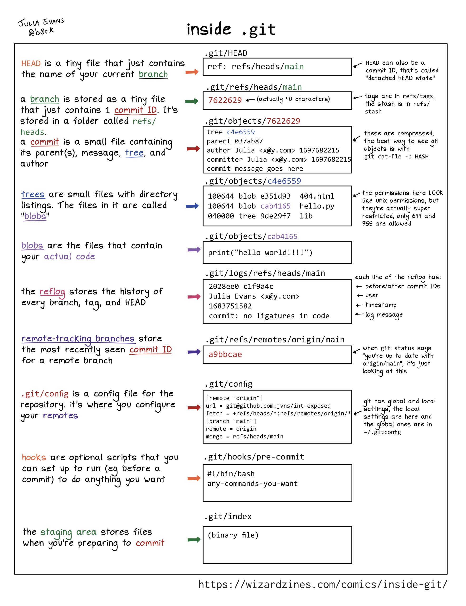

- [手机居然可以这么偷听你的秘密](https://mp.weixin.qq.com/s/U8fZbVgEHmKSZmt62XFEkw)
  - https://www.ndss-symposium.org/wp-content/uploads/2020/02/24076-paper.pdf
  - 可以采集内置加速传感器的信号，然后通过深度学习算法来解析出语音文字
  - 智能手机加速度传感器的采样频率在持续提升，足以覆盖人的语音的频段
- 37% rule 和 Optimal Stop Theory
  - 选择一种策略，总计N个选项，拒绝前K个选项，从K+1个选项开始只要看到比前K个选项优的选项则选择；K为多少时我们的策略能选到最优解的概率最大？
- copilot-explorer
  - https://thakkarparth007.github.io/copilot-explorer/posts/copilot-internals
  - https://mp.weixin.qq.com/s/dtfLeEfcwbz3fb4mLROVYQ
- Google Tools
  - [Market Finder](https://marketfinder.thinkwithgoogle.com/intl/en)
  - [Google Trends](https://trends.google.com/trends?)
  - [Tools](https://www.thinkwithgoogle.com/tools/)
    - Find my audience
- [Node.js Addon](https://mp.weixin.qq.com/s/6Qm5DpNWEyCBkI9Fh_Z0CA)
- [搜索引擎]
  - 多模态语义理解技术在用户意图分析、向量召回、倒排召回以及相关性排序四个方面的业务实践。
  - 短文本理解是用户意图分析的主要手段
    - 对于长尾流量，利用知识库、实体链接方法，将实体的附加信息引入到判别模型，提高长尾 Query 预测准确性；
    - 对于头部流量，采用日志挖掘、系统模拟的方式引入后验数据，提高头部 Query 的预测准确率。
  - 向量检索
    - 跨模态对齐：通过“笔记中的图片和文字“的对比学习、“ Query 和图片“的对比学习，将文本和图像表示到同一个语义空间中。
    - 多模态融合：尝试多种模态融合模型结构，引入多模态 Mask Language Modeling（MLM） 和 Mask Image Modeling (MIM) ，以实现更好的多模态信息融合。
    - 负样本的构造：通过对 Query 和图像进行 Masking、改写和替换，来构造困难的负样本
  -  倒排索引
    - 第一，为笔记生成 Query。针对曝光量较小的笔记，使用生成式模型生成 Query，从而有效提高长尾笔记的召回率。
    - 第二，将多模态内容转化成文本。团队通过视频全文生成技术，生成视频的转写文本，此类语料用于倒排索引中，能在不影响相关性指标的前提下，显著提高视频的召回率。
    - 第三，对笔记进行篇章级的标签提取。团队通过笔记内容与标签的相关性算法剔除无关的 Hashtag（用户上传标签），获取的 Hashtag 语料可以通过弱监督训练来增强多模态内容理解模型能力
  -  相关性排序
    - 多阶段的语言模型训练范式、推理效率问题以及多模态相关性。在相关性训练中，语言模型训练可分为三个阶段：
      - 预训练阶段使用站内文本语料进行无监督预训练；
      - 连续预训练阶段在预训练模型基础上使用搜索日志进行监督训练；
      - 微调阶段在连续训练模型基础上使用人工标注语料进行监督训练。
- [Protobuf编码](https://mp.weixin.qq.com/s/hAfrPlPD2KBCWxpIuGkQTQ)
  - 基本类型
    - int32、int64、uint32、uint64会直接使用varint编码，
    - bool类型会直接使用一个字节存储，
    - enum可以看成是一个int32类型。
    - 对于sint32、sint64类型会先进行zigzag编码，再进行varint编码
    - varint编码：变长编码，对于小正整数有较好的压缩效果，对于大整数或负数编码后字节流长度会变大。
    - zigzag编码：定长编码，将小正整数和小负整数转换到小正整数再进行varint编码，对绝对值较小的整数有良好的压缩效果。
  -  复合类型
    - map的底层存储key-value键值对，采用和数组类型一样的存储方法，数组中每个元素是kv键值对
    - 结构体类型 typeid、length、data三部分长度会根据实际情况发生改变
  - protobuf既然有了int32 为什么还要用sint32 和 fixed32 ？
    - int32使用varint编码，对于小正数有较好的压缩效果，对于大整数和负数会导致额外的字节开销。因此引入fixed32，该类型不会对数值进行任何编码，对大于2^28-1的整数比int32占用更少的字节。而对于负数使用zigzag编码，这样绝对值较小的负数都能被有效压缩。
- [Protobuf 动态反射 - Dynamicgo](https://mp.weixin.qq.com/s/OeQwlgZJtYOGTHnN50IdOA)
- [优秀程序员的共性特征](https://mp.weixin.qq.com/s/FKRedldguFVPred7johg8A)
  - 偏执 - 当所有人都真的在给你找麻烦的时候，偏执就是一个好主意
  - 控制软件的熵 
  - 为测试做设计 - 在编码时就考虑怎么测试。不然，你永远没有机会考虑了 
  - 不要面向需求编程 - 应该面向业务模型编程
- [C++的So热更新](https://mp.weixin.qq.com/s/H5vfiuIFW7Qe0r0TsW6BeA)
- [统计方法]
  - SeedFinder: SeedFinder 是一种用于数据挖掘的方法，主要用于在大量数据中找出有价值的信息。它通过一种称为种子的概念，来寻找数据中的模式。种子可以是一个值，一个范围，或者一个条件。这种方法的应用场景包括：用户行为分析，异常检测，推荐系统等。  
  - PreAA 校验: PreAA 校验是一种在实验开始前进行的数据校验方法，主要用于检查实验组和对照组在实验开始前是否存在显著差异。如果存在显著差异，那么实验结果可能会受到这些差异的影响，从而影响实验的有效性。这种方法的应用场景包括：A/B 测试，临床试验，市场研究等。  
  - 双重差分法(Diff in Diff): 双重差分法是一种用于处理观察数据的统计技术，主要用于估计处理效应。它通过比较处理组和对照组在处理前后的变化，来估计处理的效应。这种方法的应用场景包括：政策评估，经济研究，社会科学研究等。  
  - CUPED (Controlled-experiment Using Pre-Experiment Data): CUPED 是一种用于处理实验数据的统计技术，主要用于减少实验结果的方差，从而提高实验的效力。它通过使用实验前的数据来调整实验后的数据，从而减少实验结果的方差。这种方法的应用场景包括：A/B 测试，临床试验，市场研究等。
- [AB测试资料](https://www.volcengine.com/docs/6287/1175850)
  - 实验系统中三个最关键的环节是：干预、测量和分析
  - [未来AB测试系统](https://mp.weixin.qq.com/s/Z54PYpN2NTeKGwjKW16jSg)
  - [A/B测试12问](https://mp.weixin.qq.com/s/o0Chnfs4Rsu93ZQqDGvcNw)
- [AB测试中的流量互斥与流量正交]()
  - [Overlapping Experiment Infrastructure: More, Better, Faster Experimentation](https://static.googleusercontent.com/media/research.google.com/zh-CN//pubs/archive/36500.pdf)
- [常用的压缩库](https://mp.weixin.qq.com/s/bl1HbC6ti6Pw2FGxgstfBw)
  - zlib的高性能分支，基于cloudflare优化 比 1.2.11的官方分支性能好，压缩CPU开销约为后者的37.5% - 采用SIMD指令加速计算
  - zstd能够在压缩率低于zlib的情况下，获得更低的cpu开销，因此如果希望获得比当前更好的压缩率，可以考虑zstd算法
  - 若不考虑压缩率的影响，追求极致低的cpu开销，那么snappy是更好的选择
- [向量化代码SIMD](https://mp.weixin.qq.com/s/Lih7tWv9tZvuTevdHgVC0Q)
  - SIMD(Single Instruction Multiple Data) 单指令多数据流，是一种并行计算技术，它可以在一个时钟周期内对多个数据进行相同的操作，从而提高计算效率。SIMD 通常用于向量化代码，以提高代码的执行效率。
  - SIMD(Single Instruction Multiple Data)指令是一类特殊的CPU指令类型，这种指令可以在一条指令中同时操作多个数据
- [放弃使用UUID，ULID](https://mp.weixin.qq.com/s/cvQvvNIB2lzpXg73hREekw)
  - ULID：Universally Unique Lexicographically Sortable Identifier（通用唯一词典分类标识符
    - 结构
      - 时间戳
        - 48位整数
        - UNIX时间（以毫秒为单位）
        - 直到公元10889年，空间都不会耗尽。
      - 随机性
        - 80位随机数
        - 如果可能的话，采用加密技术保证随机性
      - 排序
        - 最左边的字符必须排在最前面，最右边的字符必须排在最后（词汇顺序）。必须使用默认的ASCII字符集。在同一毫秒内，不能保证排序顺序
    - 与UUID的128位兼容性
    - 每毫秒1.21e + 24个唯一ULID
    - 按字典顺序(也就是字母顺序)排序！
    - 规范地编码为26个字符串，而不是UUID的36个字符
    - 使用Crockford的base32获得更好的效率和可读性（每个字符5位）
    - 不区分大小写
    - 没有特殊字符（URL安全）
    - 单调排序顺序（正确检测并处理相同的毫秒）
    - 应用场景
      - 替换数据库自增id，无需DB参与主键生成
      - 分布式环境下，替换UUID，全局唯一且毫秒精度有序
      - 比如要按日期对数据库进行分区分表，可以使用ULID中嵌入的时间戳来选择正确的分区分表
      - 如果毫秒精度是可以接受的（毫秒内无序），可以按照ULID排序，而不是单独的created_at字段
      - ULID 是既基于时间戳又基于随机数，时间戳精确到毫秒，毫秒内有1.21e + 24个随机数，不存在冲突的风险，而且转换成字符串比 UUID 更加友好。
  - 为什么不选择UUID
    - 通过 SHA-1 哈希算法生成，生成随机分布的ID需要唯一的种子，这可能导致许多数据结构碎片化；
- [Generate Unique IDs in Distributed Systems: 6 Key Strategies](https://blog.devtrovert.com/p/how-to-generate-unique-ids-in-distributed)
  - UUID
    - Pros
      - It’s simple, there’s no need for initial setups or a centralized system to manage the ID.
      - Every service in your distributed system can roll out its own unique ID, no chit-chat needed.
    - Cons
      - With 128 bits, it’s a long ID and it’s not something you’d easily write down or remember.
      - It doesn’t reveal much information about itself. UUIDs aren’t sortable (except for versions 1 and 2).
  - NanoID
    - NanoID uses characters (A-Za-z0–9_-) which is friendly with URLs.
    - At just 21 characters, it’s more compact than UUID, shaving off 15 characters to be precise (though it’s 126 bits versus UUID’s 128)
  - ObjectID (96 bits)
  - Twitter Snowflake (64 bits)
  - Sonyflake (64 bits)
- [minimum number of steps to reduce number to 1](https://stackoverflow.com/questions/39588554/minimum-number-of-steps-to-reduce-number-to-1/39589499#39589499)
  - If you look at the binary representation of n, and its least significant bits, you can make some conclusions about which operation is leading to the solution. In short:
    - if the least significant bit is zero, then divide by 2
    - if n is 3, or the 2 least significant bits are 01, then subtract
    - otherwise, add 1
- [Web 终极拦截技巧](https://mp.weixin.qq.com/s/qQbPkrov3wcCjDbGtPQSMA)
- [DiDi Summary](https://book.yunzhan365.com/mvfub/tbvv/mobile/index.html)
- git
  - git rebase vs git merge vs git merge --squash
    - 
- tools
  - obsidian 免费的笔记工具
  - excalidraw
- [魔术的模拟程序](https://mp.weixin.qq.com/s/hPes8WbwNX0SitPBxb_GKw)
  - 考虑最简单的情况 假设牌是2张，编号分别是1 2
  - 稍微复杂一点的情况，牌的张数是2的n次方
  - 考虑任意的情况，牌的张数是2^n+m
- [QPS 的计算](https://mp.weixin.qq.com/s/m4HbCbkqZul-o-R5mxdVng)
  - 比较合理的 QPS 范围
    - 带了数据库的服务一般写性能在 5k 以下，读性能一般在 10k 以下，能到 10k 以上的话，那很可能是在数据库前面加了层缓存
- [C++常见避坑指南](https://mp.weixin.qq.com/s/ivmOl-qGALnHEVbwKANiug)
- [Clickhouse 构建新一代日志存储系统](https://mp.weixin.qq.com/s/7zUYmQ2jjPNTjTKqnPcRcg)
  - 大数据量：CK 的分布式架构支持动态扩缩容，可支撑海量数据存储。
  - 写入性能：CK 的 MergeTree 表的写入速度在200MB/s，具有很高吞吐，写入基本没有瓶颈。
  - 查询性能：CK 支持分区索引和排序索引，具有很高的检索效率，单机每秒可扫描数百万行的数据。
  - 存储成本：CK 基于列式存储，数据压缩比很高，同时基于HDFS做冷热分离，能够进一步地降低存储成本。
- WebAssembly
  - WebAssembly 体积更小，JavaScript 通过 gzip 压缩后已经可以节约很大一部分空间，但 WebAssembly 的二进制格式在被精心设计之后可以比 gzip 压缩后的 JavaScript 代码小10-20%左右。
  - WebAssembly 解析更快，WebAssembly 解析速度比 JavaScript 快了一个数量级，这也是得益于其二进制的格式。除此之外，WebAssembly 还可以在多核CPU上进行并行解析。
  - WebAssembly 可以更好利用 CPU 特性， WebAssembly 可以完全自由发挥，使得其可以利用更多 CPU 特性，其中例如：64位整数、加载/存储偏移量以及各种 CPU 指令。在这一部分，WebAssembly 能比 asm.js 平均提速5%左右。
  - 编译工具链的优化，WebAssembly 的运行效率同时取决于两部分，第一个是生成代码的编译器，第二个是运行它的虚拟机。WebAssembly 对其编译器进行了更多的优化，使用 Binaryen 编译器代替了 Emscripten，这部分所带来的的速度提升大约在5%-7%。
- [ANR 问题治理](https://mp.weixin.qq.com/s/ZMkj-VvG5sFfTCfIcFa4mg)
- Shell
  - sh 跟bash的区别，实际上是bash有没开启POSIX模式的区别。 简单说，sh是bash的一种特殊的模式，sh就是开启了POSIX标准的bash， /bin/sh 相当于/bin/bash --posix
  - login shell加载环境变量的顺序是：
    - ① /etc/profile
    - ② ~/.bash_profile
    - ③ ~/.bashrc
    - ④ /etc/bashrc
  - non-login shell加载环境变量的顺序是： ① ~/.bashrc ② /etc/bashrc
- [假设检验（Hypothesis Testing)](https://mp.weixin.qq.com/s/c476-QYoX6OgexG0SJdyCA)
  - 假设检验是一种统计方法，用于判断样本数据是否足够支持对总体参数的一个特定假设。
    - 这个过程涉及到对两个相互对立的假设进行评估：零假设（H0）和备择假设（H1）。
    - 零假设通常表示没有效应或者没有差异，而备择假设则表示有显著效应或者差异。
  - 零假设（H0）通常表示没有效应、没有差异或者没有关联。换句话说，它通常假定观察结果是偶然发生的，或者两个比较组之间没有本质的区别
  - 备择假设（H1）是与零假设相对的假设，它表示有显著效应、有差异或者有关联。备择假设基于研究者的研究假设，通常是研究的目的所在
  - 统计显著性通常通过P值来评估，P值表示在零假设成立的条件下，观察到的数据或更极端情况发生的概率。
    - 如果这个概率低于预定的显著性水平（α），通常是0.05或5%，则认为结果具有统计显著性
    - P值越低，意味着在零假设为真的情况下观察到这样的数据（或更极端）的概率越小 我们有足够的证据拒绝零假设，认为观察到的结果不太可能仅由随机变异所引起，从而支持备择假设。
  - 显著性水平（α）是在进行假设检验时事先设定的阈值，用于确定观察到的数据在多大程度上可以反驳零假设。
    - 显著性水平定义了拒绝零假设的标准，通常设定为0.05（或5%），意味着研究者愿意接受5%的错误拒绝零假设的风险，即犯类型I错误的概率。
- [加密数据如何进行模糊查询](https://ningyu1.github.io/20201230/encrypted-data-fuzzy-query.html)
  - 在数据库实现加密算法函数，在模糊查询的时候使用decode(key) like '%partial%
  - 对密文数据进行分词组合，将分词组合的结果集分别进行加密，然后存储到扩展列，查询时通过key like '%partial%'
  - 算法支持：Hill密码处理和模糊匹配加密方法FMES
  - 可搜索加密（Searchable Encryption）或同态加密（Homomorphic Encryption）
- [GC垃圾回收算法](https://mp.weixin.qq.com/s/M8R4QPidlCrr6vix4JUWmg)
  - GC 标记-清除法、引用计数法、GC 标记-复制算法、GC 标记-压缩算法、保守式 GC、分代垃圾回收、增量式垃圾回收(三色标记法)
- [认知偏差知识手册](https://s75w5y7vut.feishu.cn/docs/doccn3BatnScBJe7wD7K3S5poFf)
  - https://alanhg.github.io/cognitive-bias/
- inside .git
  - 
- [vim cheat sheet](https://michael.peopleofhonoronly.com/vim/)

