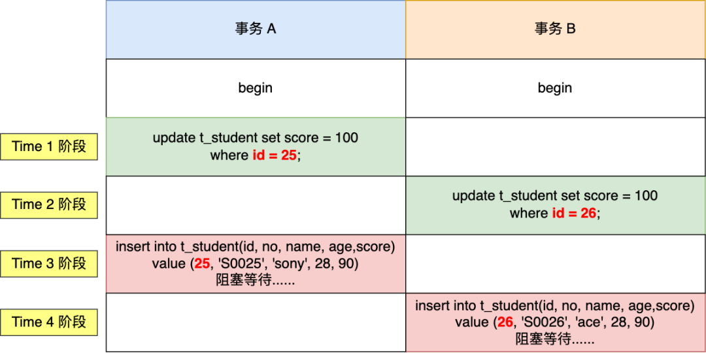

- order by
  - 常规排序
    - explain结果  using index condition; using filesort
    - 
    - 上述流程只对原表的数据读了一遍，剩下的操作都是在 sort_buffer 和临时文件中执行的
  - rowid排序
    - max_length_for_sort_data，是 MySQL 中专门控制用于排序的行数据的长度的一个参数。它的意思是，如果单行的长度超过这个值，MySQL 就认为单行太大，要换一个算法
    - 
    - rowid排序多了一步回表操作
  - order by都需要排序？
    - explain结果 using index condition
    - 
    - 这个查询过程不需要临时表，也不需要排序
  - 覆盖索引
    - explain结果 using index
    - Extra 字段里面多了“Using index”，表示的就是使用了覆盖索引，性能上会快很多
- [SQL 优化大全](https://mp.weixin.qq.com/s/Uvm_p5YuH3E8snDGnE8QLQ)
  - MySQL的基本架构
    - 查询数据库的引擎
      ```sql
      show engines;
      show variables like “%storage_engine%”;
      ```
  - SQL优化
    - SQL优化—主要就是优化索引
      - 索引的弊端
        - 当数据量很大的时候，索引也会很大(当然相比于源表来说，还是相当小的)，也需要存放在内存/硬盘中(通常存放在硬盘中)，占据一定的内存空间/物理空间。
        - 索引并不适用于所有情况：a.少量数据；b.频繁进行改动的字段，不适合做索引；c.很少使用的字段，不需要加索引；
        - a索引会提高数据查询效率，但是会降低“增、删、改”的效率。当不使用索引的时候，我们进行数据的增删改，只需要操作源表即可，但是当我们添加索引后，不仅需要修改源表，也需要再次修改索引，很麻烦。尽管是这样，添加索引还是很划算的，因为我们大多数使用的就是查询，“查询”对于程序的性能影响是很大的。
      - 索引的优势
        - 提高查询效率(降低了IO使用率)。当创建了索引后，查询次数减少了。
        - 降低CPU使用率。比如说【…order by age desc】这样一个操作，当不加索引，会把源表加载到内存中做一个排序操作，极大的消耗了资源。但是使用了索引以后，第一索引本身就小一些，第二索引本身就是排好序的，左边数据最小，右边数据最大。
    - explain执行计划常用关键字详解
      - id
        - id值相同，从上往下顺序执行。表的执行顺序因表数量的改变而改变。
        - id值不同，id值越大越优先查询。这是由于在进行嵌套子查询时，先查内层，再查外层。
      - select_type关键字的使用说明：查询类型
        - simple：简单查询 不包含子查询，不包含union查询。
        - primary：包含子查询的主查询(最外层)
        - subquery：包含子查询的主查询(非最外层)
        - derived：衍生查询(用到了临时表)
        - union：union之后的表称之为union表，如上例
        - union result：告诉我们，哪些表之间使用了union查询
      - type关键字的使用说明：索引类型
        - system、const只是理想状况，实际上只能优化到index --> range --> ref这个级别。要对type进行优化的前提是，你得创建索引。
        - system - 源表只有一条数据(实际中，基本不可能)； 衍生表只有一条数据的主查询(偶尔可以达到)
        - const - 仅仅能查到一条数据的SQL ,仅针对Primary key或unique索引类型有效。
        - eq_ref - 唯一性索引，对于每个索引键的查询，返回匹配唯一行数据（有且只有1个，不能多 、不能0），并且查询结果和数据条数必须一致。此种情况常见于唯一索引和主键索引。
        - ref - 非唯一性索引，对于每个索引键的查询，返回匹配的所有行（可以0，可以1，可以多）
        - range - 检索指定范围的行 ,where后面是一个范围查询(between, >, <, >=, in) in有时候会失效，从而转为无索引时候的ALL
        - index - 查询全部索引中的数据(扫描整个索引)
        - ALL - 查询全部源表中的数据(暴力扫描全表)
      - possible_keys和key
        - possible_keys可能用到的索引。是一种预测，不准。了解一下就好。
        - key指的是实际使用的索引。
      - key_len: 索引的长度，用于判断复合索引是否被完全使用(a,b,c)。
      - ref - 这里的ref的作用，指明当前表所参照的字段。
        - 注意与type中的ref值区分。在type中，ref只是type类型的一种选项值。
      - rows: 被索引优化查询的数据个数
      - extra
        - using filesort：针对单索引的情况 - 表示你当前的SQL性能消耗较大。表示进行了一次“额外”的排序。常见于order by语句中。
          - 对于单索引，如果排序和查找是同一个字段，则不会出现using filesort；如果排序和查找不是同一个字段，则会出现using filesort；因此where哪些字段，就order by哪些些字段。
        - using temporary: 当出现了这个词，也表示你当前的SQL性能消耗较大。这是由于当前SQL用到了临时表。一般出现在group by中。
        - using index: “索引覆盖”就表示不用读取源表，而只利用索引获取数据，不需要回源表查询
        - using where: 表示需要【回表查询】，表示既在索引中进行了查询，又回到了源表进行了查询。
        - impossible where: 当where子句永远为False的时候，会出现impossible where
    - 优化示例
      - 复合索引顺序和使用顺序一致。对于复合索引，不要跨列使用
      - 索引需要逐步优化(每次创建新索引，根据情况需要删除以前的废弃索引)
      - 使用了in有时候会导致索引失效，将含In的范围查询，放到where条件的最后，防止失效。
      - 对于两张表，索引往哪里加？答：对于表连接，小表驱动大表。索引建立在经常使用的字段上。
      - 一般情况下，左连接给左表加索引。右连接给右表加索引。其他表需不需要加索引，我们逐步尝试。
      - 不要在索引上进行任何操作(计算、函数、类型转换)，否则索引失效
      - 索引不能使用不等于（!= <>）或is null (is not null)，否则自身以及右侧所有全部失效(针对大多数情况)。复合索引中如果有>，则自身和右侧索引全部失效。
      - exists和in的优化
        - 如果主查询的数据集大，则使用in关键字，效率高。
        - 如果子查询的数据集大，则使用exist关键字,效率高。
- [事务会发生死锁?](https://mp.weixin.qq.com/s/DnCc5NIrMzvJuTF_xN6RYQ)
  - 
  - 
  - 为什么会发生死锁
    - 我们可以通过 select * from performance_schema.data_locks\G; 这条语句，查看事务执行 SQL 过程中加了什么锁
    - Time 1 阶段加锁分析
      - 可以看到，共加了两个锁，分别是：
        - 表锁：X 类型的意向锁；
        - 行锁：X 类型的间隙锁；
      - LOCK_TYPE 中的 RECORD 表示行级锁，而不是记录锁的意思，通过 LOCK_MODE 可以确认是 next-key 锁，还是间隙锁，还是记录锁：
        - 如果 LOCK_MODE 为 X，说明是 next-key 锁；
        - 如果 LOCK_MODE 为 X, REC_NOT_GAP，说明是记录锁；
        - 如果 LOCK_MODE 为 X, GAP，说明是间隙锁；
      - 此时事务 A 在主键索引（INDEX_NAME : PRIMARY）上加的是间隙锁，锁范围是(20, 30)。
    - Time 2 阶段加锁分析
      - 事务 B 在主键索引（INDEX_NAME : PRIMARY）上加的是间隙锁，锁范围是(20, 30)。
    - 事务 A 和 事务 B 的间隙锁范围都是一样的，为什么不会冲突？
      - 两个事务的间隙锁之间是相互兼容的，不会产生冲突
      - 间隙锁的意义只在于阻止区间被插入，因此是可以共存的。一个事务获取的间隙锁不会阻止另一个事务获取同一个间隙范围的间隙锁，共享和排他的间隙锁是没有区别的，他们相互不冲突，且功能相同。
    - Time 3 阶段加锁分析
      - 事务 A 的状态为等待状态（LOCK_STATUS: WAITING），因为向事务 B 生成的间隙锁（范围 (20, 30)）中插入了一条记录，所以事务 A 的插入操作生成了一个插入意向锁（LOCK_MODE:INSERT_INTENTION）
      - 插入意向锁是什么？
        - 插入意向锁名字里虽然有意向锁这三个字，但是它并不是意向锁，它属于行级锁，是一种特殊的间隙锁。但不同于间隙锁的是，该锁只用于并发插入操作。
        - 如果说间隙锁锁住的是一个区间，那么「插入意向锁」锁住的就是一个点。因而从这个角度来说，插入意向锁确实是一种特殊的间隙锁。
        - 尽管「插入意向锁」也属于间隙锁，但两个事务却不能在同一时间内，一个拥有间隙锁，另一个拥有该间隙区间内的插入意向锁（当然，插入意向锁如果不在间隙锁区间内则是可以的）。所以，插入意向锁和间隙锁之间是冲突的。
        - 插入意向锁的生成时机：
          - 每插入一条新记录，都需要看一下待插入记录的下一条记录上是否已经被加了间隙锁，如果已加间隙锁，那 Insert 语句会被阻塞，并生成一个插入意向锁 
    - Time 4 阶段加锁分析
      - 事务 B 在生成插入意向锁时而导致被阻塞，这是因为事务 B 向事务 A 生成的间隙锁（范围 (20, 30)）中插入了一条记录，而插入意向锁和间隙锁是冲突的，所以事务  B 在获取插入意向锁时就陷入了等待状态。
  - 本次案例中，事务 A 和事务 B 在执行完后 update 语句后都持有范围为(20, 30）的间隙锁，而接下来的插入操作为了获取到插入意向锁，都在等待对方事务的间隙锁释放，于是就造成了循环等待，满足了死锁的四个条件：互斥、占有且等待、不可强占用、循环等待，因此发生了死锁。


