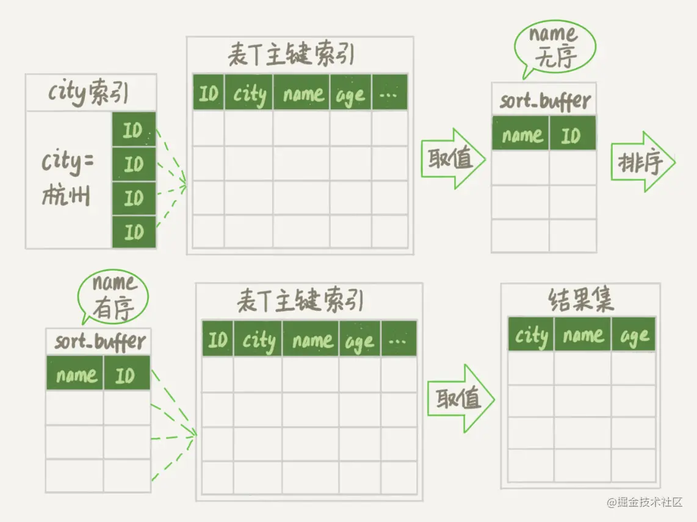

- order by
  - 常规排序
    - explain结果  using index condition; using filesort
    - 
    - 上述流程只对原表的数据读了一遍，剩下的操作都是在 sort_buffer 和临时文件中执行的
  - rowid排序
    - max_length_for_sort_data，是 MySQL 中专门控制用于排序的行数据的长度的一个参数。它的意思是，如果单行的长度超过这个值，MySQL 就认为单行太大，要换一个算法
    - 
    - rowid排序多了一步回表操作
  - order by都需要排序？
    - explain结果 using index condition
    - 
    - 这个查询过程不需要临时表，也不需要排序
  - 覆盖索引
    - explain结果 using index
    - Extra 字段里面多了“Using index”，表示的就是使用了覆盖索引，性能上会快很多
- [SQL 优化大全](https://mp.weixin.qq.com/s/Uvm_p5YuH3E8snDGnE8QLQ)
  - MySQL的基本架构
    - 查询数据库的引擎
      ```sql
      show engines;
      show variables like “%storage_engine%”;
      ```
  - SQL优化
    - SQL优化—主要就是优化索引
      - 索引的弊端
        - 当数据量很大的时候，索引也会很大(当然相比于源表来说，还是相当小的)，也需要存放在内存/硬盘中(通常存放在硬盘中)，占据一定的内存空间/物理空间。
        - 索引并不适用于所有情况：a.少量数据；b.频繁进行改动的字段，不适合做索引；c.很少使用的字段，不需要加索引；
        - a索引会提高数据查询效率，但是会降低“增、删、改”的效率。当不使用索引的时候，我们进行数据的增删改，只需要操作源表即可，但是当我们添加索引后，不仅需要修改源表，也需要再次修改索引，很麻烦。尽管是这样，添加索引还是很划算的，因为我们大多数使用的就是查询，“查询”对于程序的性能影响是很大的。
      - 索引的优势
        - 提高查询效率(降低了IO使用率)。当创建了索引后，查询次数减少了。
        - 降低CPU使用率。比如说【…order by age desc】这样一个操作，当不加索引，会把源表加载到内存中做一个排序操作，极大的消耗了资源。但是使用了索引以后，第一索引本身就小一些，第二索引本身就是排好序的，左边数据最小，右边数据最大。
    - explain执行计划常用关键字详解
      - id
        - id值相同，从上往下顺序执行。表的执行顺序因表数量的改变而改变。
        - id值不同，id值越大越优先查询。这是由于在进行嵌套子查询时，先查内层，再查外层。
      - select_type关键字的使用说明：查询类型
        - simple：简单查询 不包含子查询，不包含union查询。
        - primary：包含子查询的主查询(最外层)
        - subquery：包含子查询的主查询(非最外层)
        - derived：衍生查询(用到了临时表)
        - union：union之后的表称之为union表，如上例
        - union result：告诉我们，哪些表之间使用了union查询
      - type关键字的使用说明：索引类型
        - system、const只是理想状况，实际上只能优化到index --> range --> ref这个级别。要对type进行优化的前提是，你得创建索引。
        - 


