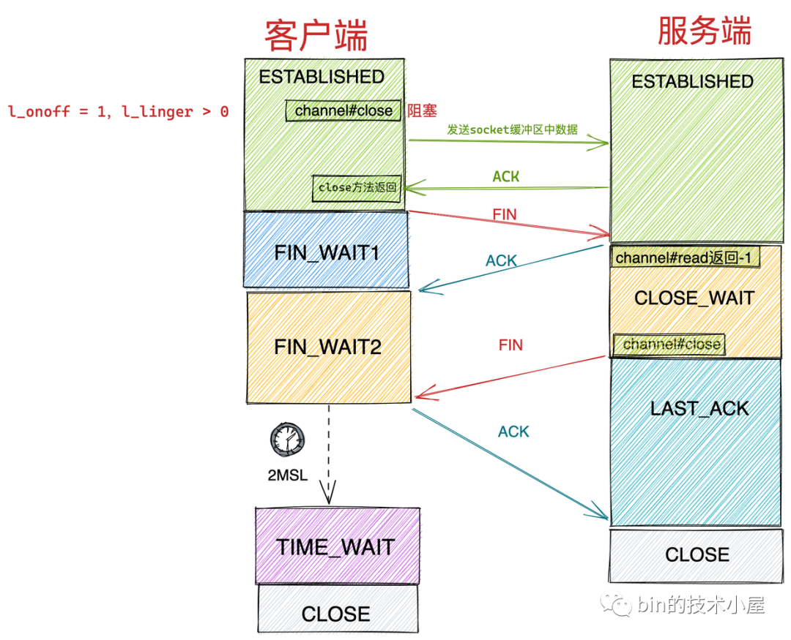
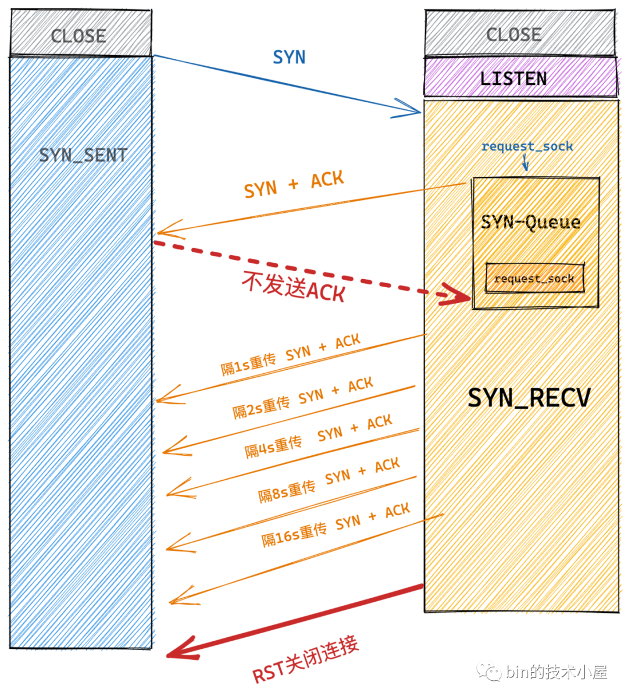

- [Netty 如何应对 TCP 连接的正常关闭，异常关闭，半关闭场景](https://mp.weixin.qq.com/s/2MW5xscY7j9_0byBFN47Vw)
  - 正常 TCP 连接关闭
    - Netty 处理 TCP 正常关闭流程（ Socket 接收缓冲区中只有 EOF ，没有其他正常接收数据）可以看出，这种情况下只会触发 ChannelReadComplete 事件而不会触发 ChannelRead 事件。
  - Netty 对 TCP 连接正常关闭的处理
    - close 方法发起 TCP 连接关闭流程
      - Netty 这里使用一个 boolean closeInitiated 变量来防止 Reactor 线程来重复执行关闭流程，因为 Channel 的关闭操作可以在多个业务线程中发起，这样就会导致多个业务线程向 Reactor 线程提交多个关闭 Channel 的任务。
      - 通过 isActive() 获取 Channel 的状态 boolean wasActive ，由于此时我们还没有关闭 Channel，所以 Channel 现在的状态肯定是 active 的。之所以在关闭流程的一开始就获取 Channel 是否 active 的状态，是因为当我们关闭 Channel 之后，需要通过这个状态来判断 channel 是否是第一次从 active 变为 inactive ，如果是第一次，则会触发 ChannelInactive 事件在 Channel 对应的 pipeline 中传播。
      - 针对 SO_LINGER 选项的处理
        - 默认情况下，当我们调用 Socket 的 close 方法后 ，close 方法会立即返回，剩下的事情会交给内核协议栈帮助我们处理，如果此时 Socket 对应的发送缓冲区还有数据待发送，接下来内核协议栈会将 Socket 发送缓冲区的数据发送出去，随后会向对端发送 FIN 包关闭连接
        - 而 SO_LINGER 选项会控制调用 close 方法关闭 Socket 的行为
          - l_onoff = 0 时 l_linger 的值会被忽略，属于我们上边讲述的默认关闭行为。
          - l_onoff = 1，l_linger > 0：这种情况下，应用程序调用 close 方法后就不会立马返回，无论 Socket 是阻塞模式还是非阻塞模式，应用程序都会阻塞在这里。直到以下两个条件其中之一发生，才会解除阻塞返回。随后进行正常的四次挥手关闭流程。
            - 当 Socket 发送缓冲区的数据全部发送出去，并等到对端 ACK 后，close 方法返回。
            - 应用程序在 close 方法上的阻塞时间到达 l_linger 设置的值后，close 方法返回。
            - 
          - l_onoff = 1，l_linger = 0：这种情况下，当应用程序调用 close 方法后会立即返回，随后内核直接清空 Socket 的发送缓冲区，并向对端发送 RST 包，主动关闭方直接跳过四次挥手进入 CLOSE 状态，注意这种情况下是不会有 TIME_WAIT 状态的。
            - 
        - 当我们设置了 SO_LINGER 选项之后，Channel 的关闭动作会被阻塞并延时关闭，在延时关闭期间，Reactor 线程依然可以响应 OP_READ 事件和 OP_WRITE 事件，这可能会导致 Reactor 线程不断的自旋循环浪费 CPU 资源，所以基于这个原因，netty 这里需要将 Channel 从 Reactor 上注销掉。这样 Reactor 线程就不会在响应 Channel 上的 IO 事件了。
  - TCP 连接的异常关闭
    - RST Packet
      - 通讯方不管是发出或者是收到一个 RST 包 ，都会导致内存，端口等连接资源被释放，并且跳过正常的 TCP 四次挥手关闭流程直接强制关闭，Socket 缓冲区的数据来不及处理直接被丢弃。
      - 通讯端收到一个 RST 包后
        - 如果仍然对 Socket 进行读取，那么就会抛出 connection has been reset by the peer 异常，
        - 如果仍然对 Socket 进行写入，就会抛出 broken pipe 异常。应用程序通过这样的方式来感知内核是否收到 RST 包。
      - 发送 RST 强制关闭连接，这将导致之前已经发送但尚未送达的、或是已经进入对端 Socket 接收缓冲区但还未被对端应用程序处理的数据被无条件丢弃，导致对端应用程序可能会出现异常
    - 哪些场景导致需要发送 RST 来强制关闭连接呢
      - TCP 连接队列已满
        - 半连接队列 SYN-Queue 已满
          - 
          - TCP 内核协议栈需要等待 63s 的时间才能断开这个半连接
          - 内核参数 net.ipv4.tcp_syncookies 可以影响内核处理半连接队列溢出时的行为：
            - net.ipv4.tcp_syncookies = 0 ：服务端直接丢弃客户端发来的 SYN 包。
            - net.ipv4.tcp_syncookies = 1 ：如果此时全连接队列 ACEPT-Queue 也满了，并且 qlen_young(qlen_young 表示目前半连接队列中，没有进行 SYN+ACK 包重传的连接数量) 的值大于 1 ，那么直接丢弃 SYN 包，否则就生成 syncookie（一个特别的 sequence number ）然后作为 SYN + ACK 包中的序列号返回给客户端。并输出 "possible SYN flooding on port . Sending cookies."。
          - tcp_syncookies 不适合用在服务端负载很高的场景，因为在启用 tcp_syncookies 的时候，服务端在发送 SYN+ACK 包之前，会要求客户端在短时间内回复一个序号，这个序号包含客户端之前发送 SYN 包内的信息，比如 IP 和端口。
          - 如果客户端回复的这个序号是正确的，那么服务端就认为这个客户端是正常的，随后就会发送携带 syncookie 的 SYN+ACK 包给客户端。如果客户端不回复这个序号或者序号不正确，那么服务端就认为这个客户端是不正常的，直接丢弃连接不理会。
          - 除此之外，我们还可以调整以下内核参数来防御 SYN Flood 攻击
            - 增大半连接队列容量 tcp_max_syn_backlog 。设置比默认 256 更大的一个数值。
            - 减少 SYN+ACK 重试次数 tcp_synack_retries 。
        - 全连接队列 ACCEPT-Queue 已满
          - 内核参数 net.ipv4.tcp_abort_on_overflow 会影响内核协议栈处理全连接队列溢出的行为。
            - 当 tcp_abort_on_overflow = 0 时，服务端内核协议栈会将该连接标记为 acked 状态，但仍保留在 SYN-Queue 中，并开启 SYN+ACK 重传机制。当 SYN+ACK 包的重传次数超过 net.ipv4.tcp_synack_retries 设置的值时，再将该连接从 SYN queue 中删除。但是此时在客户端的视角来说，连接已经建立成功了。客户端并不知道此时 ACK 包已经被服务端所忽略，如果此时向服务端发送数据的话，服务端会回复 RST 给客户端。
            - 
            - 当 tcp_abort_on_overflow = 1 时， 服务端TCP 协议栈直接回复 RST 包，并直接从 SYN-Queue 中删除该连接信息。
            - 
          - Netty 中全连接队列 ACCEPT-Queue 的长度由 min(backlog, somaxconn) 决定
      - 连接未被监听的端口 - 当客户端 Connect 一个未被监听的远端服务端口，则会收到对端发来的一个 RST 包
      - 服务端程序崩溃
      - 开启 SO_LINGER 选项设置 l_linger = 0
        - 将选项参数设置为 l_onoff = 1，l_linger = 0 时，当客户端调用 close 方法关闭连接的时候，这时内核协议栈会发出 RST 而不是 FIN 。跳过正常的四次挥手关闭流程直接强制关闭，Socket 缓冲区的数据来不及处理直接丢弃。
      - 主动关闭方在关闭时 Socket 接收缓冲区还有未处理数据
        - 主动关闭方在调用 close() 系统调用关闭 Socket 时，内核会检查 Socket 接收缓冲区中是否还有数据未被读取处理，如果有，则直接清空 Socket 接收缓冲区中的未处理数据，并向对端发送 RST 。
        - 如果此时 Socket 接收缓冲区中没有未被处理的数据，内核才会走正常的关闭流程，尝试将 Socket 发送缓冲区中的数据发送出去，然后向对端发送 FIN ，走正常的四次挥手关闭流程。
      - 主动关闭方 close 关闭但在 FIN_WAIT2 状态接收数据
        - 如果客户端调用 close() 方法关闭连接，而服务端在 CLOSE_WAIT 状态下继续向客户端发送数据，客户端在 FIN_WAIT2 状态下直接会丢弃数据，并发送 RST 给服务端，直接强制关闭连接。
  - Netty 对 RST 包的处理
    - 同 TCP 正常关闭收到 FIN 包一样，当服务端收到 RST 包后，OP_READ 事件活跃，Reactor 线程再次来到了 AbstractNioByteChannel#read 方法处理 OP_READ 事件。
  - TCP 连接半关闭 HalfClosure
    - close 方法是同时将读写两个通道全部关闭，也就是说主动关闭方在调用 close 方法以后既不能接收对端的数据也不能向对端发送数据了。
    - shutdown 函数可以控制只关闭连接的某一个方向，或者全部关闭
      - SHUT_RD：表示关闭读通道，如果此时 Socket 接收缓冲区有已接收的数据，则会将这些数据统统丢弃。如果后续再收到新的数据，虽然也会对这些数据进行 ACK 确认，但是会悄悄丢弃掉。所以在这种情况下，对端虽然收到了 ACK 确认，但是这些以发送的数据可能已经被悄悄丢弃了
      - SHUT_WR：关闭写通道，调用该方法发起 TCP 连接的半关闭流程。此时如果 Socket 发送缓冲区还有未发送的数据，则会立即发送出去，并发送一个 FIN 给对端。
      - SHUTRDWR : 同时关闭连接读写两个通道

