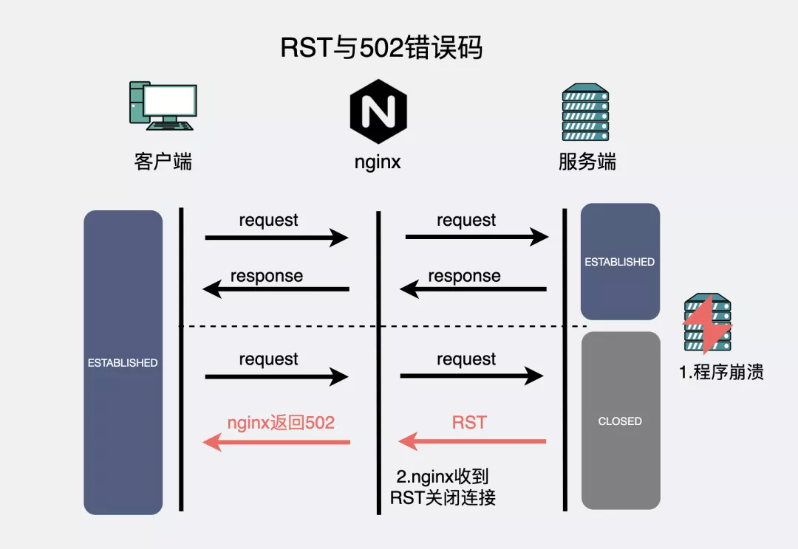
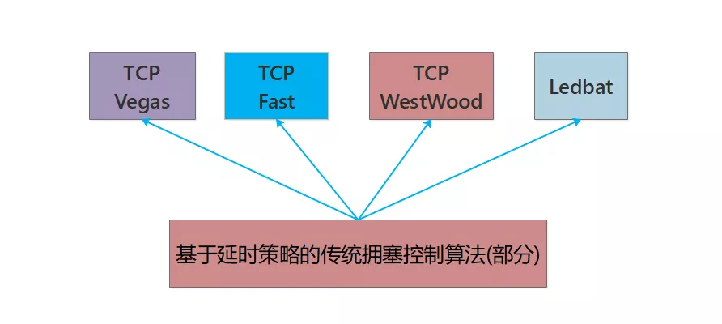
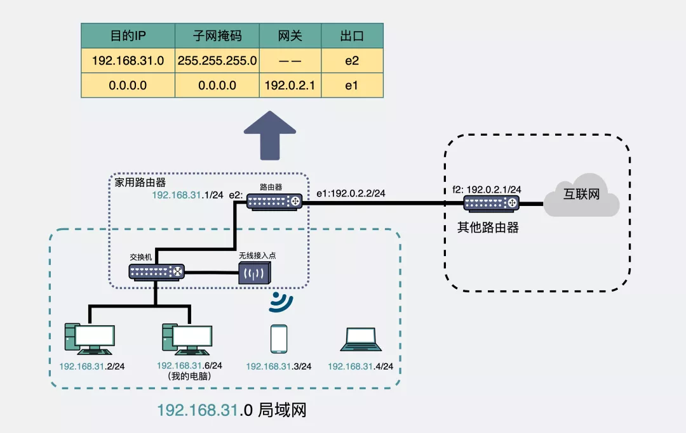
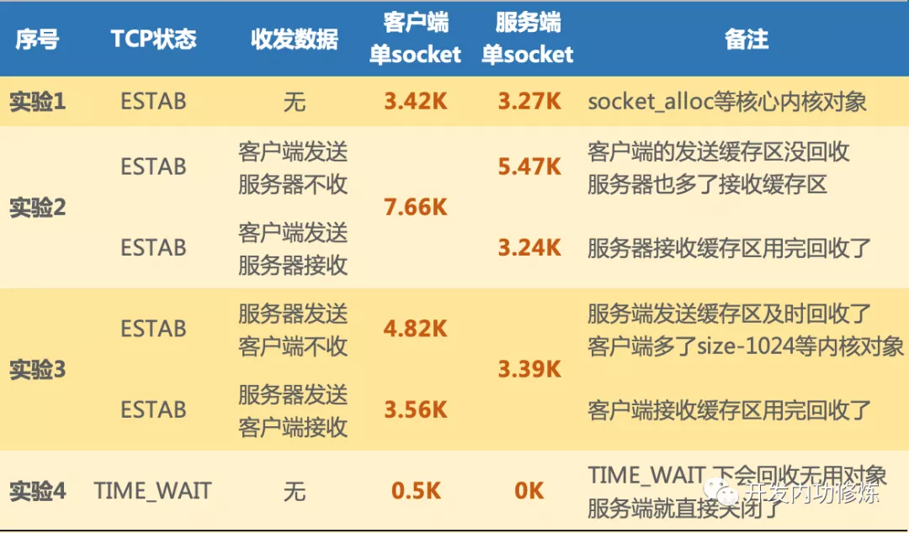
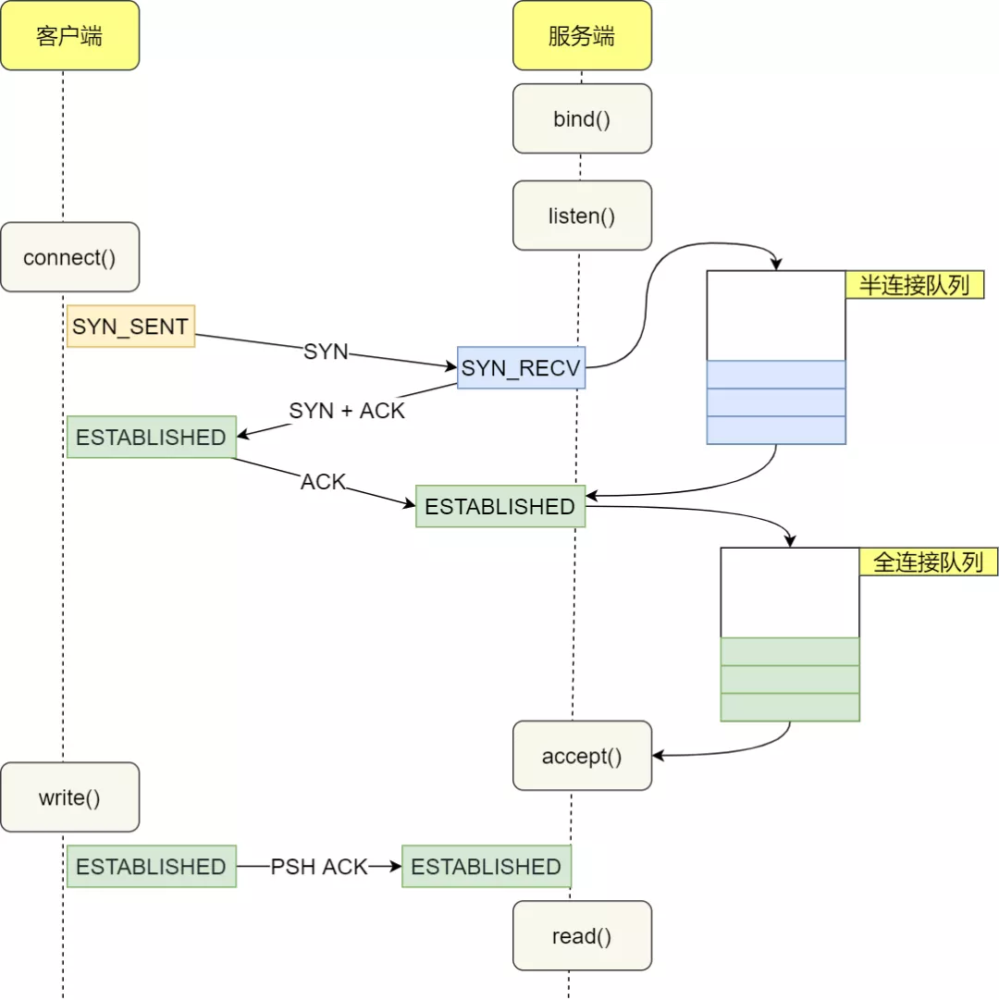

- [在 FIN_WAIT_2 状态下，是如何处理收到的乱序到 FIN 报文，然后 TCP 连接又是什么时候才进入到 TIME_WAIT 状态?](https://mp.weixin.qq.com/s/6euF1TQMP36AEurS44Casg)

  - 在 FIN_WAIT_2 状态时，如果收到乱序的 FIN 报文，那么就被会加入到「乱序队列」，并不会进入到 TIME_WAIT 状态。
  - 等再次收到前面被网络延迟的数据包时，会判断乱序队列有没有数据，然后会检测乱序队列中是否有可用的数据，如果能在乱序队列中找到与当前报文的序列号保持的顺序的报文，就会看该报文是否有 FIN 标志，如果发现有 FIN 标志，这时才会进入 TIME_WAIT 状态。
  
  - 看 Linux 内核代码的在线网站：
    https://elixir.bootlin.com/linux/latest/source
- [TCP 的三次握手、四次挥手](https://cloud.tencent.com/developer/article/1687824)
  
  
  TCP 进行握手初始化一个连接的目标是：分配资源、初始化序列号(通知 peer 对端我的初始序列号是多少)，知道初始化连接的目标
  .有可能出现四次握手来建立连接的
  
  
- 初始化连接的 SYN 超时问题

  这个连接就会一直占用 Server 的 SYN 连接队列中的一个位置，大量这样的连接就会将 Server 的 SYN 连接队列耗尽，让正常的连接无法得到处理。目前，Linux 下默认会进行 5 次重发 SYN-ACK 包，重试的间隔时间从 1s 开始，下次的重试间隔时间是前一次的双倍，5 次的重试时间间隔为 1s,2s, 4s, 8s,16s，总共 31s，第 5 次发出后还要等 32s 都知道第 5 次也超时了，所以，总共需要 1s + 2s +4s+ 8s+ 16s + 32s =63s，TCP 才会把断开这个连接
  . 应对 SYN 过多的问题，linux 提供了几个 TCP 参数：tcp_syncookies、tcp_synack_retries、tcp_max_syn_backlog、tcp_abort_on_overflow 来调整应对

- TCP 的 Peer 两端同时断开连接
  

- 四次挥手能不能变成三次挥手呢
  如果 Server 在收到 Client 的 FIN 包后，在也没数据需要发送给 Client 了，那么对 Client 的 ACK 包和 Server 自己的 FIN 包就可以合并成为一个包发送过去，这样四次挥手就可以变成三次了

- TCP 的头号疼症 TIME_WAIT 状态

  - Peer 两端，哪一端会进入 TIME_WAIT
    TCP 主动关闭连接的那一方会最后进入 TIME_WAIT. 
  - TIME_WAIT 状态是用来解决或避免什么问题
    - 主动关闭方需要进入 TIME_WAIT 以便能够重发丢掉的被动关闭方 FIN 包的 ACK
    
      被动关闭方由于没收到自己 FIN 的 ACK，会进行重传 FIN 包，这个 FIN 包到主动关闭方后，由于这个连接已经不存在于主动关闭方了，这个时候主动关闭方无法识别这个 FIN 包
      于是回复一个 RST 包给被动关闭方，被动关闭方就会收到一个错误connect reset by peer，这里顺便说下 Broken pipe，在收到 RST 包的时候，还往这个连接写数据，就会收到 Broken pipe 错误了
      
      保证 TCP 连接的远程被正确关闭，即等待被动关闭连接的一方收到 FIN 对应的 ACK 消息
    - 防止已经断开的连接 1 中在链路中残留的 FIN 包终止掉新的连接 2
    - 防止链路上已经关闭的连接的残余数据包(a lost duplicate packet or a wandering duplicate packet) 干扰正常的数据包，造成数据流的不正常

      防止延迟的数据段被其他使用相同源地址、源端口、目的地址以及目的端口的 TCP 连接收到
  - TIME_WAIT 会带来哪些问题呢
    - 作为服务器，短时间内关闭了大量的 Client 连接，就会造成服务器上出现大量的 TIME_WAIT 连接，占据大量的 tuple，严重消耗着服务器的资源。
    - 作为客户端，短时间内大量的短连接，会大量消耗的 Client 机器的端口，毕竟端口只有 65535 个，端口被耗尽了，后续就无法在发起新的连接了
  - TIME_WAIT 的快速回收和重用
    - TIME_WAIT 快速回收  **慎用**
    
      linux 下开启 TIME_WAIT 快速回收需要同时打开 tcp_tw_recycle 和 tcp_timestamps(默认打开)两选项。Linux 下快速回收的时间为 3.5* RTO（Retransmission Timeout），而一个 RTO 时间为 200ms 至 120s
      特例：在NAT环境里，各个机器timestamp不一致，在 Server 关闭了与系统时间戳快的 Client 的连接后，在这个连接进入快速回收的时候，同一 NAT 后面的系统时间戳慢的 Client 向 Server 发起连接，这就很有可能同时满足上面的三种情况，造成该连接被 Server 拒绝掉。
      net.ipv4.tcp_tw_recycle 已经在 Linux 4.12 中移除，所以我们不能再通过该配置解决 TIME_WAIT 设计带来的问题
    - TIME_WAIT 重用

      只要满足下面两点中的一点，一个 TW 状态的四元组(即一个 socket 连接)可以重新被新到来的 SYN 连接使用。
        - 新连接 SYN 告知的初始序列号比 TIME_WAIT 老连接的末序列号大；
        - 如果开启了 tcp_timestamps，并且新到来的连接的时间戳比老连接的时间戳大。

      同时开启 tcp_tw_reuse 选项和 tcp_timestamps 选项才可以开启 TIME_WAIT 重用，还有一个条件是：重用 TIME_WAIT 的条件是收到最后一个包后超过 1s
      。时间戳重用 TIME_WAIT 连接的机制的前提是 IP 地址唯一性，得出新请求发起自同一台机器，但是如果是 NAT 环境下就不能这样保证了，于是在 NAT 环境下，TIME_WAIT 重用还是有风险的。

      tcp_tw_reuse vs SO_REUSEADDR
      SO_REUSEADDR 用户态的选项，使用 SO_REUSEADDR 是告诉内核，如果端口忙，但 TCP 状态位于 TIME_WAIT，可以重用端口。如果端口忙，而 TCP 状态位于其他状态，重用端口时依旧得到一个错误信息，指明 Address already in use”。如果你的服务程序停止后想立即重启，而新套接字依旧使用同一端口，此时 SO_REUSEADDR 选项非常有用
  - 清掉 TIME_WAIT 的奇技怪巧
    - 修改 tcp_max_tw_buckets
    
      tcp_max_tw_buckets 控制并发的 TIME_WAIT 的数量，默认值是 180000. 官网文档说这个选项只是为了阻止一些简单的 DoS 攻击，平常不要人为的降低它。
    - 利用 RST 包从外部清掉 TIME_WAIT 链接
    
      TCP 规范，收到任何的发送到未侦听端口、已经关闭的连接的数据包、连接处于任何非同步状态（LISTEN,SYS-SENT,SYN-RECEIVED）并且收到的包的 ACK 在窗口外，或者安全层不匹配，都要回执以 RST 响应(而收到滑动窗口外的序列号的数据包，都要丢弃这个数据包，并回复一个 ACK 包)，内核收到 RST 将会产生一个错误并终止该连接。我们可以利用 RST 包来终止掉处于 TIME_WAIT 状态的连接，其实这就是所谓的 RST 攻击了
      
      假设 Client 和 Server 有个连接 Connect1，Server 主动关闭连接并进入了 TIME_WAIT 状态，我们来描述一下怎么从外部使得 Server 的处于 TIME_WAIT 状态的连接 Connect1 提前终止掉。要实现这个 RST 攻击，首先我们要知道 Client 在 Connect1 中的端口 port1(一般这个端口是随机的，比较难猜到，这也是 RST 攻击较难的一个点)，利用 IP_TRANSPARENT 这个 socket 选项，它可以 bind 不属于本地的地址，因此可以从任意机器绑定 Client 地址以及端口 port1，然后向 Server 发起一个连接，Server 收到了窗口外的包于是响应一个 ACK，这个 ACK 包会路由到 Client 处。

      这个时候 99%的可能 Client 已经释放连接 connect1 了，这个时候 Client 收到这个 ACK 包，会发送一个 RST 包，server 收到 RST 包然后就释放连接 connect1 提前终止 TIME_WAIT 状态了。提前终止 TIME_WAIT 状态是可能会带来(问题二)中说的三点危害，具体的危害情况可以看下 RFC1337。RFC1337 中建议，不要用 RST 过早的结束 TIME_WAIT 状态。
    - 使用 SO_LINGER 选项并设置暂存时间 l_linger 为 0，在这时如果我们关闭 TCP 连接，内核就会直接丢弃缓冲区中的全部数据并向服务端发送 RST 消息直接终止当前的连接[1](https://mp.weixin.qq.com/s?__biz=MzAxMTA4Njc0OQ==&mid=2651439946&idx=3&sn=3ab985e8b213cb8bc1686c8297791ac6&chksm=80bb1db8b7cc94ae123be06fced260f6f235e8d058c5bf145c79225ee48ce270473ec1592ac1&scene=21#wechat_redirect)
    - 修改 net.ipv4.ip_local_port_range 选项中的可用端口范围，增加可同时存在的 TCP 连接数上限
    - 使用 net.ipv4.tcp_tw_reuse 选项，通过 TCP 的时间戳选项允许内核重用处于 TIME_WAIT 状态的 TCP 连接
  - 系统调用 listen() 的 backlog 参数指的是什么
    - Linux 的协议栈维护的 TCP 连接的两个连接队列
      - SYN 半连接队列：Server 端收到 Client 的 SYN 包并回复 SYN,ACK 包后，该连接的信息就会被移到一个队列，这个队列就是 SYN 半连接队列(此时 TCP 连接处于 非同步状态
        
        - 对于 SYN 半连接队列的大小是由（/proc/sys/net/ipv4/tcp_max_syn_backlog）这个内核参数控制的，有些内核似乎也受 listen 的 backlog 参数影响，取得是两个值的最小值。
        - 当这个队列满了，Server 会丢弃新来的 SYN 包，而 Client 端在多次重发 SYN 包得不到响应而返回（connection time out）错误。
        - 但是，当 Server 端开启了 syncookies，那么 SYN 半连接队列就没有逻辑上的最大值了，并且/proc/sys/net/ipv4/tcp_max_syn_backlog 设置的值也会被忽略。
      - accept 连接队列：Server 端收到 SYN,ACK 包的 ACK 包后，就会将连接信息从中的队列移到另外一个队列，这个队列就是 accept 连接队列(这个时候 TCP 连接已经建立，三次握手完成了)

        - accept 连接队列的大小是由 backlog 参数和（/proc/sys/net/core/somaxconn）内核参数共同决定，取值为两个中的最小值。
        - 当 accept 连接队列满了，协议栈的行为根据（/proc/sys/net/ipv4/tcp_abort_on_overflow）内核参数而定。
          - 如果 tcp_abort_on_overflow=1，server 在收到 SYN_ACK 的 ACK 包后，协议栈会丢弃该连接并回复 RST 包给对端，这个是 Client 会出现(connection reset by peer)错误。
          - 如果 tcp_abort_on_overflow=0，server 在收到 SYN_ACK 的 ACK 包后，直接丢弃该 ACK 包。这个时候 Client 认为连接已经建立了，一直在等 Server 的数据，直到超时出现 read timeout 错误。

- [TCP握手丢包处理](https://mp.weixin.qq.com/s?__biz=MzUxODAzNDg4NQ==&mid=2247496848&idx=1&sn=a7bf29e43bf5b97c0022dcbc32e52412&chksm=f98db03acefa392c1b642ade052b23e23eea63d7b319c0ad620fe3fa098c433188bd9c5242cd&scene=178&cur_album_id=1337204681134751744#rd)
  - 第一次握手，如果客户端发送的SYN一直都传不到被服务器，那么客户端是一直重发SYN到永久吗？客户端停止重发SYN的时机是什么？
    - 当客户端想和服务端建立 TCP 连接的时候，首先第一个发的就是 SYN 报文，然后进入到 SYN_SENT 状态
    - 如果客户端迟迟收不到服务端的 SYN-ACK 报文（第二次握手），就会触发超时重传机制。
    - Linux 里，客户端的 SYN 报文最大重传次数由 tcp_syn_retries内核参数控制，这个参数是可以自定义的，默认值一般是 5。
    - 第一次超时重传是在 1 秒后，第二次超时重传是在 2 秒，第三次超时重传是在 4 秒后，第四次超时重传是在 8 秒后，第五次是在超时重传 16 秒后。没错，每次超时的时间是上一次的 2 倍。总耗时是 1+2+4+8+16+32=63 秒，大约 1 分钟左右
  
  - 第二次握手丢失了，会发生什么
    - 当服务端收到客户端的第一次握手后，就会回 SYN-ACK 报文给客户端，这个就是第二次握手，此时服务端会进入 SYN_RCVD 状态
    - 客户端就会触发超时重传机制，重传 SYN 报文。也就是第一次握手，最大重传次数由 tcp_syn_retries内核参数决定
    - 服务端这边会触发超时重传机制，重传 SYN-ACK 报文. SYN-ACK 报文的最大重传次数由 tcp_synack_retries内核参数决定，默认值是 5。
  
  - 第三次握手，如果服务器永远不会收到ACK，服务器就永远都留在 Syn-Recv 状态了吗？退出此状态的时机是什么？
    - 如果服务端那一方迟迟收不到这个确认报文，就会触发超时重传机制，重传 SYN-ACK 报文，直到收到第三次握手，或者达到最大重传次数。
  
  - 第三次挥手，如果客户端永远收不到 FIN,ACK，客户端永远停留在 Fin-Wait-2状态了吗？退出此状态时机是什么时候呢？
  
  - 第四次挥手，如果服务器永远收不到 ACK，服务器永远停留在 Last-Ack 状态了吗？退出此状态的时机是什么呢？
  
  - 如果客户端 在 2SML内依旧没收到 FIN,ACK，会关闭链接吗？服务器那边怎么办呢，是怎么关闭链接的呢？
  
  - 第一次挥手丢失了，会发生什么
    - 如果第一次挥手丢失了，那么客户端迟迟收不到被动方的 ACK 的话，也就会触发超时重传机制，重传 FIN 报文，重发次数由 tcp_orphan_retries 参数控制。
    - 当客户端重传 FIN 报文的次数超过 tcp_orphan_retries 后，就不再发送 FIN 报文，直接进入到 close 状态。
      tcp_abort_on_overflow
  - 第二次挥手丢失了，会发生什么
    - ACK 报文是不会重传的，所以如果服务端的第二次挥手丢失了，客户端就会触发超时重传机制，重传 FIN 报文，直到收到服务端的第二次挥手，或者达到最大的重传次数。
    - 当客户端收到第二次挥手，也就是收到服务端发送的 ACK 报文后，客户端就会处于 FIN_WAIT2 状态，在这个状态需要等服务端发送第三次挥手，也就是服务端的 FIN 报文。
    - 对于 close 函数关闭的连接，由于无法再发送和接收数据，所以FIN_WAIT2 状态不可以持续太久，而 tcp_fin_timeout 控制了这个状态下连接的持续时长，默认值是 60 秒。
    - 意味着对于调用 close 关闭的连接，如果在 60 秒后还没有收到 FIN 报文，客户端（主动关闭方）的连接就会直接关闭。
  
  - 第三次挥手丢失了，会发生什么
    - 当服务端（被动关闭方）收到客户端（主动关闭方）的 FIN 报文后，内核会自动回复 ACK，同时连接处于 CLOSE_WAIT 状态，顾名思义，它表示等待应用进程调用 close 函数关闭连接。
    - 此时，内核是没有权利替代进程关闭连接，必须由进程主动调用 close 函数来触发服务端发送 FIN 报文。
    - 服务端处于 CLOSE_WAIT 状态时，调用了 close 函数，内核就会发出 FIN 报文，同时连接进入 LAST_ACK 状态，等待客户端返回 ACK 来确认连接关闭。
    - 如果迟迟收不到这个 ACK，服务端就会重发 FIN 报文，重发次数仍然由 tcp_orphan_retries 参数控制，这与客户端重发 FIN 报文的重传次数控制方式是一样的。
  - 第四次挥手丢失了，会发生什么
    - 当客户端收到服务端的第三次挥手的 FIN 报文后，就会回 ACK 报文，也就是第四次挥手，此时客户端连接进入 TIME_WAIT 状态。 在 Linux 系统，TIME_WAIT 状态会持续 60 秒后才会进入关闭状态。
    - 服务端（被动关闭方）没有收到 ACK 报文前，还是处于 LAST_ACK 状态。 如果第四次挥手的 ACK 报文没有到达服务端，服务端就会重发 FIN 报文，重发次数仍然由前面介绍过的 tcp_orphan_retries 参数控制。

- tcp 的可靠性指的是什么

  可靠性指的是从网络 IO 缓冲中读出来的数据必须是无损的、无冗余的、有序的、无间隔的。翻译过来说要保证的可靠性的话，就要解决数据中出现的损坏，乱序，丢包，冗余这四个问题
- tcp 的可靠性如何保证
  - 差错控制
    - 保证数据无损。TCP 的传输报文段中使用了校验和 checksum，保证本次传输的报文是无损的
    - 保证有序和不冗余。在传输报文中使用了 seq 字段去解决乱序及冗余问题
    - 保证数据报文们无间隔。在传输报文中使用了 ack 字段，也就是确认应答机制（ACK 延迟确认+累计应答机制） + 超时重传机制（重传机制还细分为快速重传机制（发三个数据包都没有回复））去解决了丢包导致数据出现间隔的问题（流量控制也能够有效的预防丢包的机制之一）
  - 流量控制
    - 流量控制（用于接受者）是为了控制发送端不要一味的发送数据导致网络阻塞，和阻止发送方发送的数据不要超过接收方的最大负载，因为超过最大负载会导致接收方丢弃数据而进一步触发超时重传去加重网络阻塞
    - 流量控制的主要手段是通过窗口去做的.每次接受方应答时，都会带一个 window 的字段（三次握手会确定初始的 window 字段），标识了现在接受方能够接受的最大数据量，发送方会根据这个 window 字段直接发送多个报文直到达到 window 的上限
  - 拥塞控制
    - 拥塞控制（用于网络）主要是为了在发生网络拥堵后不进一步触发 TCP 的超时重传进制导致进一步的网络拥堵和网络性能下降
    - 发送方会自己维护一个拥堵窗口，默认为 1 MSS（最大长度报文段）。控制手段主要有慢启动、拥塞避免、快重传、快恢复。
      - 慢启动。思路是一开始不要传输大量的数据，而是先试探网络中的拥堵程度再去逐渐增加拥塞窗口大小（一般是指数规律增长）
      - 拥塞避免。拥塞避免思路也和慢启动类似，只是按照线性规律去增加拥堵窗口的大小。
      - 快重传。指的是使发送方尽快重传丢失报文，而不是等超时避免去触发慢启动。所以接受方要收到失序报文后马上发送重复确认以及发送方收到三个重复的接受报文要接受重发。快重传成功后，就会执行快恢复算法
      - 快恢复。一般是将慢启动阈值和拥塞窗口都调整为现有窗口的一半，之后进行拥塞避免算法，也有实现是把调整为一半后，在增加3个MSS。
- TCP 如何保证数据包的顺序传输
  - 数据报文自带 seq 序列号作为排序手段。TCP 三次握手成功后，双方会初始化 seq 序列号用于今后的数据传输，并且会作为传输的数据报文们排序的依据
  - 超时重传 + 快重传机制作为辅助。如果出现数据报文的失序或者乱序，就会触发超时重传或者快重传的机制补齐中间缺失的报文来保证整体的数据传输是有序的
  
- TCP 三次握手 四次挥手 图例
  
  
  
  - ISN
    - 三次握手的一个重要功能是客户端和服务端交换ISN(Initial Sequence Number), 以便让对方知道接下来接收数据的时候如何按序列号组装数据。
    - ISN = M + F(localhost, localport, remotehost, remoteport) M是一个计时器，每隔4毫秒加1。 F是一个Hash算法
  - 序列号回绕
    - 因为ISN是随机的，所以序列号容易就会超过2^31-1. 而tcp对于丢包和乱序等问题的判断都是依赖于序列号大小比较的
  - syn flood攻击
    - 如果恶意的向某个服务器端口发送大量的SYN包，则可以使服务器打开大量的半开连接，分配TCB（Transmission Control Block）, 从而消耗大量的服务器资源，同时也使得正常的连接请求无法被相应。
    - 延缓TCB分配方法
      - Syn Cache 系统在收到一个SYN报文时，在一个专用HASH表中保存这种半连接信息，直到收到正确的回应ACK报文再分配TCB
      - Syn Cookie 使用一种特殊的算法生成Sequence Number，这种算法考虑到了对方的IP、端口、己方IP、端口的固定信息
    - 使用SYN Proxy防火墙
  - 连接队列
    - 查看是否有连接溢出 `netstat -s | grep LISTEN`
    - 半连接队列满
      - 在三次握手协议中，服务器维护一个半连接队列，该队列为每个客户端的SYN包开设一个条目(服务端在接收到SYN包的时候，就已经创建了request_sock结构，存储在半连接队列中)，该条目表明服务器已收到SYN包，并向客户发出确认，正在等待客户的确认包。这些条目所标识的连接在服务器处于Syn_RECV状态，当服务器收到客户的确认包时，删除该条目，服务器进入ESTABLISHED状态。
      - 攻击者在短时间内发送大量的SYN包给Server(俗称SYN flood攻击)，用于耗尽Server的SYN队列。对于应对SYN 过多的问题，linux提供了几个TCP参数：tcp_syncookies、tcp_synack_retries、tcp_max_syn_backlog、tcp_abort_on_overflow 来调整应对。
      - 
    - 全连接队列满
      - 当第三次握手时，当server接收到ACK包之后，会进入一个新的叫 accept 的队列
      - 当accept队列满了之后，即使client继续向server发送ACK的包，也会不被响应，此时ListenOverflows+1，同时server通过tcp_abort_on_overflow来决定如何返回，0表示直接丢弃该ACK，1表示发送RST通知client；相应的，client则会分别返回read timeout 或者 connection reset by peer
      - tcp_abort_on_overflow是0的话，server过一段时间再次发送syn+ack给client（也就是重新走握手的第二步），如果client超时等待比较短，就很容易异常了。而客户端收到多个 SYN ACK 包，则会认为之前的 ACK 丢包了。于是促使客户端再次发送 ACK ，在 accept队列有空闲的时候最终完成连接。若 accept队列始终满员，则最终客户端收到 RST 包（此时服务端发送syn+ack的次数超出了tcp_synack_retries）
      - 
    - Command line
      ```shell
      [root@server ~]# netstat -s | egrep "listen|LISTEN"
      667399 times the listen queue of a socket overflowed
      667399 SYNs to LISTEN sockets ignored
      比如上面看到的 667399 times ，表示全连接队列溢出的次数，隔几秒钟执行下，如果这个数字一直在增加的话肯定全连接队列偶尔满了。
      [root@server ~]# netstat -s | grep TCPBacklogDrop 查看 Accept queue 是否有溢出
      ```
      ```shell
      [root@server ~]# ss -lnt
      State Recv-Q Send-Q Local Address:Port Peer Address:Port 
      LISTEN 0     128     :6379 : 
      LISTEN 0     128     :22 :
      如果State是listen状态，Send-Q 表示第三列的listen端口上的全连接队列最大为50，第一列Recv-Q为全连接队列当前使用了多少。
      非 LISTEN 状态中 Recv-Q 表示 receive queue 中的 bytes 数量；Send-Q 表示 send queue 中的 bytes 数值。
      ```

- [一个已经建立的 TCP 连接，客户端中途宕机了，而服务端此时也没有数据要发送，一直处于 establish 状态，客户端恢复后，向服务端建立连接，此时服务端会怎么处理？](https://mp.weixin.qq.com/s?__biz=MzUxODAzNDg4NQ==&mid=2247498170&idx=1&sn=8016a3ae1c7453dfa38062d84af820a9&chksm=f98dbd10cefa3406a5ccfad61c00c4d310d436a1bcfe8d464d94678ab195e013b2296498ac50&scene=21#wechat_redirect)
  - 客户端的 SYN 报文里的**端口号与历史连接不相同**

    如果客户端恢复后发送的 SYN 报文中的源端口号跟上一次连接的源端口号**不一样**，此时服务端会认为是新的连接要建立，于是就会通过三次握手来建立新的连接。那旧连接里处于 establish 状态的服务端最后会怎么样呢？

    - 如果服务端发送了数据包给客户端，由于客户端的连接已经被关闭了，此时客户的内核就会回 RST 报文，服务端收到后就会释放连接。
    - 如果服务端一直没有发送数据包给客户端，在超过一段时间后， TCP 保活机制就会启动，检测到客户端没有存活后，接着服务端就会释放掉该连接。

  - 客户端的 SYN 报文里的**端口号与历史连接相同**
   
    处于 establish 状态的服务端如果收到了客户端的 SYN 报文（注意此时的 SYN 报文其实是乱序的，因为 SYN 报文的初始化序列号其实是一个随机数），会回复一个携带了正确序列号和确认号的 ACK 报文，这个 ACK 被称之为 Challenge ACK。接着，客户端收到这个 Challenge ACK，发现序列号并不是自己期望收到的，于是就会回 RST 报文，服务端收到后，就会释放掉该连接
    . rfc793 文档里的第 34 页里，有说到这个例子 -- Half-Open connection discovery
  - 如何关闭一个 TCP 连接？
    - 杀掉进程?
      - 在客户端杀掉进程的话，就会发送 FIN 报文，来断开这个客户端进程与服务端建立的所有 TCP 连接，这种方式影响范围只有这个客户端进程所建立的连接，而其他客户端或进程不会受影响。
      - 在服务端杀掉进程影响就大了，此时所有的 TCP 连接都会被关闭，服务端无法继续提供访问服务。
    - 伪造一个四元组相同的 RST 报文不就行了？
      - 如果 RST 报文的序列号不能落在对方的滑动窗口内，这个 RST 报文会被对方丢弃的，就达不到关闭的连接的效果
    - 我们可以伪造一个四元组相同的 SYN 报文，来拿到“合法”的序列号！如果处于 establish 状态的服务端，收到四元组相同的 SYN 报文后，会回复一个 Challenge ACK，这个 ACK 报文里的「确认号」，正好是服务端下一次想要接收的序列号. 然后用这个确认号作为 RST 报文的序列号，发送给服务端，此时服务端会认为这个 RST 报文里的序列号是合法的，于是就会释放连接！
      
- [收到RST，就一定会断开TCP连接吗](https://mp.weixin.qq.com/s/wh7YyKIHEdIlMxGaJFbqiw)
  - 什么是RST
    - RST 就是用于这种情况，一般用来异常地关闭一个连接。它是一个TCP包头中的标志位。
    - 正常情况下，不管是发出，还是收到置了这个标志位的数据包，相应的内存、端口等连接资源都会被释放。从效果上来看就是TCP连接被关闭了。
    - 而接收到 RST的一方，一般会看到一个 connection reset 或  connection refused 的报错。
  - 怎么知道收到RST了
    - 如果本端应用层尝试去执行 **读数据**操作，比如recv，应用层就会收到 **Connection reset by peer** 的报错，意思是远端已经关闭连接
    - 如果本端应用层尝试去执行**写数据**操作，比如send，那么应用层就会收到 **Broken pipe** 的报错，意思是发送通道已经坏了
  - 出现RST的场景有哪些
    - 端口不可用
      - 端口未监听 - 这个端口从来就没有"可用"过
        - 如果服务端没有执行过listen，那哈希表里也就不会有对应的sock，结果当然是拿不到。此时，正常情况下服务端会发RST给客户端。
        - 端口未监听就一定会发RST吗？
          - 只有在数据包没问题的情况下，比如校验和没问题，才会发RST包给对端。
      - 服务突然崩 - 曾经"可用"，但现在"不可用"
      - 
    - socket提前关闭
      - 本端提前关闭
        - 如果本端socket接收缓冲区还有数据未读，此时提前close() socket。那么本端会先把接收缓冲区的数据清空，然后给远端发一个RST。
      - 远端提前关闭
        - 远端已经close()了socket，此时本端还尝试发数据给远端。那么远端就会回一个RST。
        - 
        - 客户端执行close()， 正常情况下，会发出第一次挥手FIN，然后服务端回第二次挥手ACK。如果在第二次和第三次挥手之间，如果服务方还尝试传数据给客户端，那么客户端不仅不收这个消息，还会发一个RST消息到服务端。直接结束掉这次连接???
  - 对方没收到RST，会怎么样？
    - RST，不需要ACK确认包。 因为RST本来就是设计来处理异常情况的
  - 收到RST就一定会断开连接吗
    - 不一定会断开。收到RST包，第一步会通过tcp_sequence先看下这个seq是否合法，其实主要是看下这个seq是否在合法接收窗口范围内。如果不在范围内，这个RST包就会被丢弃。
    - RST攻击
      - 有不怀好意的第三方介入，构造了一个RST包，且在TCP和IP等报头都填上客户端的信息，发到服务端，那么服务端就会断开这个连接。
      - 利用challenge ack获取seq
      - 

- [TCP拥塞控制及谷歌的BBR算法](https://mp.weixin.qq.com/s/pmUdUvHgEhZzAhz2EP5Evg)
  - 流量控制 Flow Control - 微观层面点到点的流量控制
    - 在数据通信中，流量控制是管理两个节点之间数据传输速率的过程，以防止快速发送方压倒慢速接收方
    - 它为接收机提供了一种控制传输速度的机制，这样接收节点就不会被来自发送节点的数据淹没
    - 流量控制是通信双方之间约定数据量的一种机制，具体来说是借助于TCP协议的确认ACK机制和窗口协议来完成的。
    
  - 拥塞控制 - 宏观层面的控去避免网络链路的拥堵
    - 端到端流量控制算法也面临丢包、乱序、重传问题
    - TCP拥塞控制算法的目的可以简单概括为：公平竞争、充分利用网络带宽、降低网络延时、优化用户体验
    - TCP 传输层拥塞控制算法并不是简单的计算机网络的概念，也属于控制论范畴
    - TCP连接的发送方一般是基于丢包来判断当前网络是否发生拥塞，丢包可以由重传超时RTO和重复确认来做判断
      - 基于丢包策略的传统拥塞控制算法
       
      - 基于RTT延时策略来进行控制的
       
    - 拥塞窗口cwnd
      - 流量控制可以知道接收方在header中给出了rwnd接收窗口大小，发送方不能自顾自地按照接收方的rwnd限制来发送数据，因为网络链路是复用的，需要考虑当前链路情况来确定数据量，这也是我们要提的另外一个变量cwnd
      - Congestion Window (cwnd) is a TCP state variable that limits the amount of data the TCP can send into the network before receiving an ACK. 
      - The Receiver Window (rwnd) is a variable that advertises the amount of data that the destination side can receive. 
      - Together, the two variables are used to regulate data flow in TCP connections, minimize congestion, and improve network performance.
      - cwnd是在发送方维护的，cwnd和rwnd并不冲突，发送方需要结合rwnd和cwnd两个变量来发送数据
    - 策略
      
  - BBR算法
    - BBR算法是个主动的闭环反馈系统，通俗来说就是根据带宽和RTT延时来不断动态探索寻找合适的发送速率和发送量。
    - 该算法使用网络最近出站数据分组当时的最大带宽和往返时间来创建网络的显式模型。数据包传输的每个累积或选择性确认用于生成记录在数据包传输过程和确认返回期间的时间内所传送数据量的采样率。
    - 分别采样估计极大带宽和极小延时，并用二者乘积作为发送窗口，并且BBR引入了Pacing Rate限制数据发送速率，配合cwnd使用来降低冲击。
- [连接一个 IP 不存在的主机时，握手过程是怎样的](https://mp.weixin.qq.com/s/BSU9j-TIpfFkHlZRLhLoYA)
  - 连一个 IP 不存在的主机时，握手过程是怎样的
    - 局域网内
      
      尝试测试一个不存在的ip
       ```go
           client, err := net.Dial("tcp", "192.168.31.7:8081")
           if err != nil {
               fmt.Println("err:", err)
               return
           }
       
           defer client.Close()
           go func() {
               input := make([]byte, 1024)
               for {
                   n, err := os.Stdin.Read(input)
                   if err != nil {
                       fmt.Println("input err:", err)
                       continue
                   }
                   client.Write([]byte(input[:n]))
               }
           }()
       
           buf := make([]byte, 1024)
           for {
               n, err := client.Read(buf)
               if err != nil {
                   if err == io.EOF {
                       return
                   }
                   fmt.Println("read err:", err)
                   continue
               }
               fmt.Println(string(buf[:n]))
           }
       ```
      尝试抓包，可以发现根本没有三次握手的包，只有一些 ARP 包，在询问“谁是 192.168.31.7，告诉一下 192.168.31.6”
      - 为什么会发ARP请求？
        - 因为目的地址是瞎编的，本地ARP表没有目的机器的MAC地址，因此发出ARP消息。
      - 什么没有TCP握手包？
        - 因为协议栈的数据到了网络层后，在数据链路层前，就因为没有目的MAC地址，没法发出。因此抓包软件抓不到相关数据。
      - ARP本身是没有重试机制的，为什么ARP请求会发那么多遍？
        - 因为 TCP 协议的可靠性，会重发第一次握手的消息，但每一次都因为没有目的 MAC 地址而失败，每次都会发出ARP请求
      
      
      邻居子系统，它在网络层和数据链路层之间。可以通过ARP协议将目的IP转为对应的MAC地址，然后数据链路层就可以用这个MAC地址组装帧头

      先到本地ARP表查一下有没有 192.168.31.7 对应的 mac地址 `arp -a`
      
    - 局域网外
      - 瞎编一个不是  192.168.31.xx 形式的 IP 作为这次要用的局域网外IP， 比如 10.225.31.11。先抓包看一下, 这次的现象是能发出 TCP 第一次握手的 SYN包
      - 这个问题的答案其实在上面 ARP 的流程里已经提到过了，如果目的 IP 跟本机 IP 不在同一个局域网下，那么会去获取默认网关的 MAC 地址，这里就是指获取家用路由器的MAC地址。 此时ARP流程成功返回家用路由器的 MAC 地址，数据链路层加入帧头，消息通过网卡发到了家用路由器上。
  - 连IP 地址存在但端口号不存在的主机的握手过程
    - 目的IP是回环地址
      - 我们可以正常发消息到目的IP，因为对应的MAC地址和IP都是正确的，所以，数据从数据链路层到网络层都很OK。 直到传输层，TCP协议在识别到这个端口号对应的进程根本不存在时，就会把数据丢弃，响应一个RST消息给发送端。
      
    - 目的IP在局域网内
      
    - 目的IP在局域网外
      - 现象却不一致。没有 RST 。而且触发了第一次握手的重试消息。这是为什么？
      - 很多发到 8080端口的消息都在防火墙这一层就被拒绝掉了，根本到不了目的主机里，而RST是在目的主机的TCP/IP协议栈里发出的，都还没到这一层，就更不可能发RST了。
  - Summary
    - 连一个 IP 不存在的主机时
      - 如果IP在局域网内，会发送N次ARP请求获得目的主机的MAC地址，同时不能发出TCP握手消息。
      - 如果IP在局域网外，会将消息通过路由器发出，但因为最终找不到目的地，触发TCP重试流程。
    - 连IP 地址存在但端口号不存在的主机时
      - 不管目的IP是回环地址还是局域网内外的IP地址，目的主机的传输层都会在收到握手消息后，发现端口不正确，发出RST消息断开连接。
      - 当然如果目的机器设置了防火墙策略，限制他人将消息发到不对外暴露的端口，那么这种情况，发送端就会不断重试第一次握手。
- [IP层会分片 TCP层也还要分段](https://mp.weixin.qq.com/s/-r3f90E6CyIDLPq5W6w6ag)
  - 什么是TCP分段和IP分片
    - 传输层（TCP协议）里，叫分段 - MSS
    - 网络层（IP层），叫分片 - MTU
  - MSS
    - Maximum Segment Size 。TCP 提交给 IP 层最大分段大小，不包含 TCP Header 和  TCP Option，只包含 TCP Payload ，MSS 是 TCP 用来限制应用层最大的发送字节数
    - 假设 MTU= 1500 byte，那么 MSS = 1500- 20(IP Header) -20 (TCP Header) = 1460 byte
  - 如何查看MSS
    - TCP三次握手，而MSS会在三次握手的过程中传递给对方，用于通知对端本地最大可以接收的TCP报文数据大小（不包含TCP和IP报文首部）
    - B将自己的MSS发送给A，建议A在发数据给B的时候，采用MSS=1420进行分段。而B在发数据给A的时候，同样会带上MSS=1372。两者在对比后，会采用小的那个值（1372）作为通信的MSS值，这个过程叫MSS协商
  - 三次握手中协商了MSS就不会改变了吗
    - 当然不是，每次执行TCP发送消息的函数时，会重新计算一次MSS，再进行分段操作
  - 对端不传MSS会怎么样
    - TCP的报头, MSS是作为可选项引入的. 如果没有接收到对端TCP的MSS，本端TCP默认采用MSS=536Byte
  - MTU是什么
    - Maximum Transmit Unit，最大传输单元。其实这个是由数据链路层提供，为了告诉上层IP层，自己的传输能力是多大
  - 如何查看MTU - ifconfig
  - 为什么IP层会分片，TCP还要分段
    - 数据在TCP分段，就是为了在IP层不需要分片，同时发生重传的时候只重传分段后的小份数据
    - 但UDP本身不会分段，所以当数据量较大时，只能交给IP层去分片，然后传到底层进行发送。
  - TCP分段了，IP层就一定不会分片了吗
    - 如果链路上还有设备有更小的MTU，那么还会再分片，最后所有的分片都会在接收端处进行组装。
- [TCP 的这些内存开销](https://mp.weixin.qq.com/s?__biz=MjM5Njg5NDgwNA==&mid=2247484398&idx=1&sn=f2b0a9098673dad134a228ecf9a8ac9e&scene=21#wechat_redirect)
  - 
  - 1. 内核会尽量及时回收发送缓存区、接收缓存区，但高版本做的更好
  - 2. 发送接收缓存区最小并一定不是 rmem 内核参数里的最小值，实际可能会更小
  - 3. 其它状态下，例如对于TIME_WAIT还会回收非必要的 socket_alloc 等对象
- [既然打开 net.ipv4.tcp_tw_reuse 参数可以快速复用处于 TIME_WAIT 状态的 TCP 连接，那为什么 Linux 默认是关闭状态呢](https://mp.weixin.qq.com/s/yIXihfy7lFajyeL6mXhU_Q)
  - 在变相问 - 如果 TIME_WAIT 状态持续时间过短或者没有，会有什么问题？因为开启 tcp_tw_reuse 参数可以快速复用处于 TIME_WAIT 状态的 TCP 连接时，相当于缩短了 TIME_WAIT 状态的持续时间
  - TIME_WAIT
    - TIME_WAIT 是「主动关闭方」断开连接时的最后一个状态，该状态会持续 2MSL(Maximum Segment Lifetime) 时长，之后进入CLOSED 状态
    - MSL 指的是 TCP 协议中任何报文在网络上最大的生存时间，任何超过这个时间的数据都将被丢弃. Linux 默认为 30 秒，那么 2MSL 就是 60 秒
    - MSL vs TTL
      - MSL 是由网络层的 IP 包中的 TTL 来保证的，TTL 是 IP 头部的一个字段，用于设置一个数据报可经过的路由器的数量上限。报文每经过一次路由器的转发，IP 头部的 TTL 字段就会减 1，减到 0 时报文就被丢弃
      - MSL 的单位是时间，而 TTL 是经过路由跳数。所以 MSL 应该要大于等于 TTL 消耗为 0 的时间，以确保报文已被自然消亡
      - TTL 的值一般是 64，Linux 将 MSL 设置为 30 秒，意味着 Linux 认为数据报文经过 64 个路由器的时间不会超过 30 秒，如果超过了，就认为报文已经消失在网络中了。
  - Why TIME_WAIT
    - 防止历史连接中的数据，被后面相同四元组的连接错误的接收；
      - 序列号（SEQ）和初始序列号（ISN）
        - 序列号，是 TCP 一个头部字段. 为了保证消息的顺序性和可靠性，TCP 为每个传输方向上的每个字节都赋予了一个编号，以便于传输成功后确认、丢失后重传以及在接收端保证不会乱序。序列号是一个 32 位的无符号数，因此在到达 4G 之后再循环回到 0。
        - 初始序列号，在 TCP 建立连接的时候，客户端和服务端都会各自生成一个初始序列号，它是基于时钟生成的一个随机数，来保证每个连接都拥有不同的初始序列号。初始化序列号可被视为一个 32 位的计数器，该计数器的数值每 4 微秒加 1，循环一次需要 4.55 小时。
      - 序列号和初始化序列号并不是无限递增的，会发生回绕为初始值的情况，这意味着无法根据序列号来判断新老数据。
      
      - 为了防止历史连接中的数据，被后面相同四元组的连接错误的接收，因此 TCP 设计了 TIME_WAIT 状态，状态会持续 2MSL 时长，这个时间足以让两个方向上的数据包都被丢弃，使得原来连接的数据包在网络中都自然消失，再出现的数据包一定都是新建立连接所产生的
    - 保证「被动关闭连接」的一方，能被正确的关闭；
      - 如果客户端（主动关闭方）最后一次 ACK 报文（第四次挥手）在网络中丢失了，那么按照 TCP 可靠性原则，服务端（被动关闭方）会重发 FIN 报文
      - 假设客户端没有 TIME_WAIT 状态，而是在发完最后一次回 ACK 报文就直接进入 CLOSED 状态，如果该  ACK 报文丢失了，服务端则重传的 FIN 报文，而这时客户端已经进入到关闭状态了，在收到服务端重传的 FIN 报文后，就会回 RST 报文。服务端收到这个 RST 并将其解释为一个错误（Connection reset by peer），这对于一个可靠的协议来说不是一个优雅的终止方式
      
  - tcp_tw_reuse
    - Linux 操作系统提供了两个可以系统参数来快速回收处于 TIME_WAIT 状态的连接，这两个参数都是默认关闭的
      - net.ipv4.tcp_tw_reuse，如果开启该选项的话，客户端（连接发起方） 在调用 connect() 函数时，内核会随机找一个 TIME_WAIT 状态超过 1 秒的连接给新的连接复用，所以该选项只适用于连接发起方。
      - net.ipv4.tcp_tw_recycle，如果开启该选项的话，允许处于 TIME_WAIT 状态的连接被快速回收，该参数在 NAT 的网络下是不安全的
      - 要使得上面这两个参数生效，有一个前提条件，就是要打开 TCP 时间戳，即 net.ipv4.tcp_timestamps=1（默认即为 1）
    - 开启了 tcp_timestamps 参数，TCP 头部就会使用时间戳选项，它有两个好处，一个是便于精确计算 RTT ，另一个是能防止序列号回绕（PAWS）
    - PAWS
      - 在一个速度足够快的网络中传输大量数据时，序列号的回绕时间就会变短。如果序列号回绕的时间极短，我们就会再次面临之前延迟的报文抵达后序列号依然有效的问题。
      - 为了解决这个问题，就需要有 TCP 时间戳
      - 防回绕序列号算法要求连接双方维护最近一次收到的数据包的时间戳（Recent TSval），每收到一个新数据包都会读取数据包中的时间戳值跟 Recent TSval 值做比较，如果发现收到的数据包中时间戳不是递增的，则表示该数据包是过期的，就会直接丢弃这个数据包
  - 为什么 tcp_tw_reuse  默认是关闭的
    - 我们知道开启 tcp_tw_reuse 的同时，也需要开启 tcp_timestamps，意味着可以用时间戳的方式有效的判断回绕序列号的历史报文. RST 报文的时间戳即使过期了，只要 RST 报文的序列号在对方的接收窗口内，也是能被接受的
      
      - 因为快速复用 TIME_WAIT 状态的端口，导致新连接可能被回绕序列号的 RST 报文断开了，而如果不跳过 TIME_WAIT 状态，而是停留 2MSL 时长，那么这个 RST 报文就不会出现下一个新的连接。
    - 开启 tcp_tw_reuse 来快速复用 TIME_WAIT 状态的连接，如果第四次挥手的 ACK 报文丢失了，有可能会导致被动关闭连接的一方不能被正常的关闭
      
  - Summary
    - tcp_tw_reuse 的作用是让客户端快速复用处于 TIME_WAIT 状态的端口，相当于跳过了 TIME_WAIT 状态，这可能会出现这样的两个问题：
      - 历史 RST 报文可能会终止后面相同四元组的连接，因为 PAWS 检查到即使 RST 是过期的，也不会丢弃。
      - 如果第四次挥手的 ACK 报文丢失了，有可能被动关闭连接的一方不能被正常的关闭;
- [SYN 报文什么时候情况下会被丢弃](https://mp.weixin.qq.com/s?__biz=MzUxODAzNDg4NQ==&mid=2247502230&idx=1&sn=5fb86772de17ab650088944d4d0adf62&chksm=f98d8d3ccefa042a96f02ad764cf0a70c3ebca18436f0a7cfa0780ff1b160ec9668e27d1bfb4&scene=178&cur_album_id=1337204681134751744#rd)
  - 开启 tcp_tw_recycle 参数，并且在 NAT 环境下，造成 SYN 报文被丢弃
    - tcp_tw_recycle 快速回收处于 TIME_WAIT 状态的连接， 前提条件，就是要打开 TCP 时间戳，即 net.ipv4.tcp_timestamps=1。 tcp_tw_recycle 在使用了 NAT 的网络下是不安全的
    - 对于服务器来说，如果同时开启了 recycle 和 timestamps 选项，则会开启一种称之为 per-host 的 PAWS 机制
      - PAWS 机制
        - tcp_timestamps 选项开启之后， PAWS 机制会自动开启，它的作用是防止 TCP 包中的序列号发生绕回
        - PAWS 就是为了避免这个问题而产生的，在开启 tcp_timestamps 选项情况下，一台机器发的所有 TCP 包都会带上发送时的时间戳，PAWS 要求连接双方维护最近一次收到的数据包的时间戳（Recent TSval），每收到一个新数据包都会读取数据包中的时间戳值跟 Recent TSval 值做比较，如果发现收到的数据包中时间戳不是递增的，则表示该数据包是过期的，就会直接丢弃这个数据包
      - per-host 的 PAWS 机制 - per-host 是对「对端 IP 做 PAWS 检查」，而非对「IP + 端口」四元组做 PAWS 检查。
        - Per-host PAWS 机制利用TCP option里的 timestamp 字段的增长来判断串扰数据，而 timestamp 是根据客户端各自的 CPU tick 得出的值
        - 当客户端 A 通过 NAT 网关和服务器建立 TCP 连接，然后服务器主动关闭并且快速回收 TIME-WAIT 状态的连接后，客户端 B 也通过 NAT 网关和服务器建立 TCP 连接，注意客户端 A  和 客户端 B 因为经过相同的 NAT 网关，所以是用相同的 IP 地址与服务端建立 TCP 连接，如果客户端 B 的 timestamp 比 客户端 A 的 timestamp 小，那么由于服务端的 per-host 的 PAWS 机制的作用，服务端就会丢弃客户端主机 B 发来的 SYN 包
        - tcp_tw_recycle 在使用了 NAT 的网络下是存在问题的，如果它是对 TCP 四元组做 PAWS 检查，而不是对「相同的 IP 做 PAWS 检查」，那么就不会存在这个问题了。
    - tcp_tw_recycle 在 Linux 4.12 版本后，直接取消了这一参数
  - accpet 队列满了，造成 SYN 报文被丢弃
    - TCP 三次握手的时候，Linux 内核会维护两个队列，分别是：
      - 半连接队列，也称 SYN 队列
      - 全连接队列，也称 accepet 队列
    
    - 在服务端并发处理大量请求时，如果 TCP accpet 队列过小，或者应用程序调用 accept() 不及时，就会造成 accpet 队列满了 ，这时后续的连接就会被丢弃，这样就会出现服务端请求数量上不去的现象。
    - ss `ss -lnt` 命令来看 accpet 队列大小，在「LISTEN 状态」时，Recv-Q/Send-Q 
      - Recv-Q：当前 accpet 队列的大小，也就是当前已完成三次握手并等待服务端 accept() 的 TCP 连接个数；
      - Send-Q：当前 accpet 最大队列长度，上面的输出结果说明监听 8088 端口的 TCP 服务进程，accpet 队列的最大长度为 128；
      - 如果 Recv-Q 的大小超过 Send-Q，就说明发生了 accpet 队列满的情况。
    - 要解决这个问题，我们可以：
      - 调大 accpet 队列的最大长度，调大的方式是通过调大 backlog 以及 somaxconn 参数。
      - 检查系统或者代码为什么调用 accept() 不及时
- [Optimizing HTTP/2 prioritization with BBR and tcp_notsent_lowat](https://blog.cloudflare.com/http-2-prioritization-with-nginx/)
  - Adjust the configuration
  - `net.ipv4.tcp_notsent_lowat = 16384`
  - `net.core.default_qdisc = fq net.ipv4.tcp_congestion_control = bbr`
- [Latency Spike](https://blog.cloudflare.com/the-story-of-one-latency-spike/)
  - Scenario
    - We ran thousands of HTTP queries against one server over a couple of hours. Almost all the requests finished in milliseconds, but, as you can clearly see, 5 requests out of thousands took as long as 1000ms to finish
  - Blame the network
    - They may indicate packet loss since the SYN packets are usually retransmitted at times 1s, 3s, 7s, 15, 31s.
    - ping test
      ```shell
      --- ping statistics ---
      114931 packets transmitted, 114805 received, 0% packet loss
      rtt min/avg/max/mdev = 10.434/11.607/1868.110/22.703 ms
      ```
  - tcpdump
      ```shell
      $ tcpdump -ttt -n -i eth2 icmp
      00:00.000000 IP x.x.x.a > x.x.x.b: ICMP echo request, id 19283
      00:01.296841 IP x.x.x.b > x.x.x.a: ICMP echo reply, id 19283
      ```
  - System Trap
    - we chose System Tap (stap). With a help of a flame graph we identified a function of interest: **net_rx_action**.
    - The net_rx_action function is responsible for handling packets in Soft IRQ mode. It will handle up to netdev_budget packets in one go
      ```shell
      sysctl net.core.netdev_budget
      net.core.netdev_budget = 300
      
      $ stap -v histogram-kernel.stp 'kernel.function("net_rx_action)"' 30
      Duration min:0ms avg:0ms max:23ms count:3685271
      ```
  - collapse the TCP
    - the receive buffer size value on a socket is a hint to the operating system of how much total memory it could use to handle the received data.
    - Most importantly, this includes not only the payload bytes that could be delivered to the application, but also the metadata around it.
    - a TCP socket structure contains a doubly-linked list of packets—the sk_buff structures. Each packet contains not only the data, but also the sk_buff metadata (sk_buff is said to take 240 bytes).
  - Tune the rmem
    - There are two ways to control the TCP socket receive buffer on Linux:
      - You can set setsockopt(SO_RCVBUF) explicitly.
      - Or you can leave it to the operating system and allow it to auto-tune it, using the tcp_rmem sysctl as a hint.
    - Since the receive buffer sizes are fairly large, garbage collection could take a long time. To test this we reduced the max rmem size to 2MiB and repeated the latency measurements
      ```shell
      $ sysctl net.ipv4.tcp_rmem
      net.ipv4.tcp_rmem = 4096 1048576 2097152
      
      $ stap -v histogram-kernel.stp 'kernel.function("tcp_collapse")' 300
      Duration min:0ms avg:0ms max:3ms count:592
      
      $ stap -v histogram-kernel.stp 'kernel.function("net_rx_action")'
      Duration min:0ms avg:0ms max:3ms count:3567235
      ```
- [This is strictly a violation of the TCP specification](https://blog.cloudflare.com/this-is-strictly-a-violation-of-the-tcp-specification/)
  - Scenario
    - Apparently every now and then a connection going through CloudFlare would time out with 522 HTTP error
    - 522 error on CloudFlare indicates a connection issue between our edge server and the origin server. Most often the blame is on the origin server side
    - Test script
      ```shell
      $ nc 127.0.0.1 5000  -v
      nc: connect to 127.0.0.1 port 5000 (tcp) failed: Connection timed out
      
      # view from strace:
      socket(PF_INET, SOCK_STREAM, IPPROTO_TCP) = 3
      connect(3, {sa_family=AF_INET, sin_port=htons(5000), sin_addr=inet_addr("127.0.0.1")}, 16) = -110 ETIMEDOUT
      ```
    - netcat calls connect() to establish a connection to localhost. This takes a long time and eventually fails with ETIMEDOUT error. Tcpdump confirms that connect() did send SYN packets over loopback but never received any SYN+ACKs:
    - `$ sudo tcpdump -ni lo port 5000 -ttttt -S`
  - Loopback congestion
    - A little known fact is that it's not possible to have any packet loss or congestion on the loopback interface.
    - when an application sends packets to it, it immediately, still within the send syscall handling, gets delivered to the appropriate target. There is no buffering over loopback. Calling send over loopback triggers iptables, network stack delivery mechanisms and delivers the packet to the appropriate queue of the target application. Assuming the target application has some space in its buffers, packet loss over loopback is not possible.
  - Maybe the listening application misbehaved
    - Under normal circumstances connections to localhost are not supposed to time out. There is one corner case when this may happen though - when the listening application does not call accept() fast enough.
    - When that happens, the default behavior is to drop the new SYN packets. If the listening socket has a full accept queue, then new SYN packets will be dropped. The intention is to cause push-back, to slow down the rate of incoming connections. The peers should eventually re-send SYN packets, and hopefully by that time the accept queue will be freed. This behavior is controlled by the tcp_abort_on_overflow sysctl
    - `ss -n4lt 'sport = :5000'` The Send-Q column shows the backlog / accept queue size given to listen() syscall - 128 in our case. The Recv-Q reports on the number of outstanding connections in the accept queue - zero.
  - The problem
    - `ss -n4t | head` Further investigation revealed something peculiar. We noticed hundreds of CLOSE_WAIT sockets
  - What is CLOSE_WAIT anyway
    - CLOSE_WAIT - Indicates that the server has received the first FIN signal from the client and the connection is in the process of being closed. This means the socket is waiting for the application to execute close(). A socket can be in CLOSE_WAIT state indefinitely until the application closes it. Faulty scenarios would be like a file descriptor leak: server not executing close() on sockets leading to pile up of CLOSE_WAIT sockets.
    - Usually a Linux process can open up to 1,024 file descriptors. If our application did run out of file descriptors the accept syscall would return the EMFILE error. If the application further mishandled this error case, this could result in losing incoming SYN packets. Failed accept calls will not dequeue a socket from accept queue, causing the accept queue to grow. The accept queue will not be drained and will eventually overflow. An overflowing accept queue could result in dropped SYN packets and failing connection attempts.
    - `$ ls /proc/` pidof listener `/fd | wc -l`
  - What really happens
    - When the client application quits, the (127.0.0.1:some-port, 127.0.0.1:5000) socket enters the FIN_WAIT_1 state and then quickly transitions to FIN_WAIT_2. The FIN_WAIT_2 state should move on to TIME_WAIT if the client received FIN packet, but this never happens. The FIN_WAIT_2 eventually times out. On Linux this is 60 seconds, controlled by net.ipv4.tcp_fin_timeout sysctl.
    - This is where the problem starts. The (127.0.0.1:5000, 127.0.0.1:some-port) socket is still in CLOSE_WAIT state, while (127.0.0.1:some-port, 127.0.0.1:5000) has been cleaned up and is ready to be reused. When this happens the result is a total mess. One part of the socket won't be able to advance from the SYN_SENT state, while the other part is stuck in CLOSE_WAIT. The SYN_SENT socket will eventually give up failing with ETIMEDOUT.
- [Sync Packet Handling](https://blog.cloudflare.com/syn-packet-handling-in-the-wild/)
  - 


