- [在 FIN_WAIT_2 状态下，是如何处理收到的乱序到 FIN 报文，然后 TCP 连接又是什么时候才进入到 TIME_WAIT 状态?](https://mp.weixin.qq.com/s/6euF1TQMP36AEurS44Casg)
  - 在 FIN_WAIT_2 状态时，如果收到乱序的 FIN 报文，那么就被会加入到「乱序队列」，并不会进入到 TIME_WAIT 状态。
  - 等再次收到前面被网络延迟的数据包时，会判断乱序队列有没有数据，然后会检测乱序队列中是否有可用的数据，如果能在乱序队列中找到与当前报文的序列号保持的顺序的报文，就会看该报文是否有 FIN 标志，如果发现有 FIN 标志，这时才会进入 TIME_WAIT 状态。
  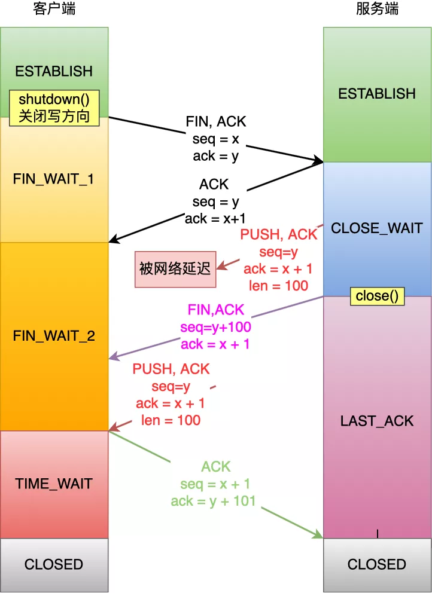
  - 看 Linux 内核代码的在线网站：
    https://elixir.bootlin.com/linux/latest/source
  - [TCP 的三次握手、四次挥手](https://cloud.tencent.com/developer/article/1687824)
    
    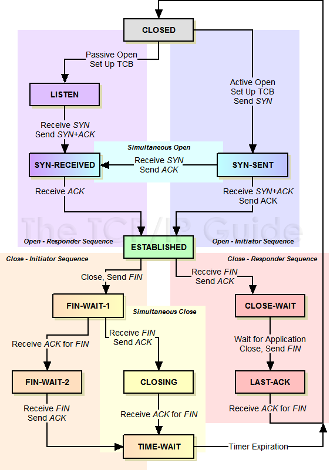
    TCP 进行握手初始化一个连接的目标是：分配资源、初始化序列号(通知 peer 对端我的初始序列号是多少)，知道初始化连接的目标
    .有可能出现四次握手来建立连接的
    
  - 初始化连接的 SYN 超时问题
    - 这个连接就会一直占用 Server 的 SYN 连接队列中的一个位置，大量这样的连接就会将 Server 的 SYN 连接队列耗尽，让正常的连接无法得到处理。目前，Linux 下默认会进行 5 次重发 SYN-ACK 包，重试的间隔时间从 1s 开始，下次的重试间隔时间是前一次的双倍，5 次的重试时间间隔为 1s,2s, 4s, 8s,16s，总共 31s，第 5 次发出后还要等 32s 都知道第 5 次也超时了，所以，总共需要 1s + 2s +4s+ 8s+ 16s + 32s =63s，TCP 才会把断开这个连接
    - 应对 SYN 过多的问题，linux 提供了几个 TCP 参数：tcp_syncookies、tcp_synack_retries、tcp_max_syn_backlog、tcp_abort_on_overflow 来调整应对
  - TCP 的 Peer 两端同时断开连接
    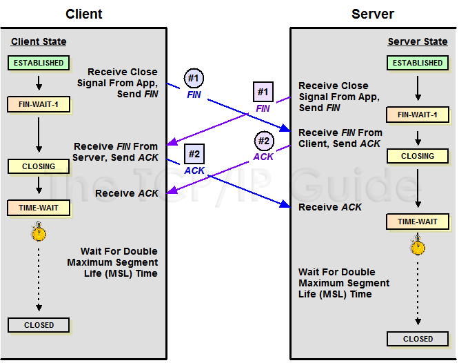
  - 四次挥手能不能变成三次挥手呢
    - 如果 Server 在收到 Client 的 FIN 包后，在也没数据需要发送给 Client 了，那么对 Client 的 ACK 包和 Server 自己的 FIN 包就可以合并成为一个包发送过去，这样四次挥手就可以变成三次了
  - TCP 的头号疼症 TIME_WAIT 状态
    - Peer 两端，哪一端会进入 TIME_WAIT
      TCP 主动关闭连接的那一方会最后进入 TIME_WAIT. 
    - TIME_WAIT 状态是用来解决或避免什么问题
      - 主动关闭方需要进入 TIME_WAIT 以便能够重发丢掉的被动关闭方 FIN 包的 ACK
        - 被动关闭方由于没收到自己 FIN 的 ACK，会进行重传 FIN 包，这个 FIN 包到主动关闭方后，由于这个连接已经不存在于主动关闭方了，这个时候主动关闭方无法识别这个 FIN 包
        - 于是回复一个 RST 包给被动关闭方，被动关闭方就会收到一个错误connect reset by peer，这里顺便说下 Broken pipe，在收到 RST 包的时候，还往这个连接写数据，就会收到 Broken pipe 错误了
        - 保证 TCP 连接的远程被正确关闭，即等待被动关闭连接的一方收到 FIN 对应的 ACK 消息
      - 防止已经断开的连接 1 中在链路中残留的 FIN 包终止掉新的连接 2
      - 防止链路上已经关闭的连接的残余数据包(a lost duplicate packet or a wandering duplicate packet) 干扰正常的数据包，造成数据流的不正常
        - 防止延迟的数据段被其他使用相同源地址、源端口、目的地址以及目的端口的 TCP 连接收到
    - TIME_WAIT 会带来哪些问题呢
      - 作为服务器，短时间内关闭了大量的 Client 连接，就会造成服务器上出现大量的 TIME_WAIT 连接，占据大量的 tuple，严重消耗着服务器的资源。
      - 作为客户端，短时间内大量的短连接，会大量消耗的 Client 机器的端口，毕竟端口只有 65535 个，端口被耗尽了，后续就无法在发起新的连接了
    - TIME_WAIT 的快速回收和重用
      - TIME_WAIT 快速回收  **慎用**
        - linux 下开启 TIME_WAIT 快速回收需要同时打开 tcp_tw_recycle 和 tcp_timestamps(默认打开)两选项。Linux 下快速回收的时间为 3.5* RTO（Retransmission Timeout），而一个 RTO 时间为 200ms 至 120s
        - 特例：在NAT环境里，各个机器timestamp不一致，在 Server 关闭了与系统时间戳快的 Client 的连接后，在这个连接进入快速回收的时候，同一 NAT 后面的系统时间戳慢的 Client 向 Server 发起连接，这就很有可能同时满足上面的三种情况，造成该连接被 Server 拒绝掉。
        - net.ipv4.tcp_tw_recycle 已经在 Linux 4.12 中移除，所以我们不能再通过该配置解决 TIME_WAIT 设计带来的问题
      - TIME_WAIT 重用
        - 只要满足下面两点中的一点，一个 TW 状态的四元组(即一个 socket 连接)可以重新被新到来的 SYN 连接使用。
          - 新连接 SYN 告知的初始序列号比 TIME_WAIT 老连接的末序列号大；
          - 如果开启了 tcp_timestamps，并且新到来的连接的时间戳比老连接的时间戳大。
        - 同时开启 tcp_tw_reuse 选项和 tcp_timestamps 选项才可以开启 TIME_WAIT 重用，还有一个条件是：重用 TIME_WAIT 的条件是收到最后一个包后超过 1s
        - 时间戳重用 TIME_WAIT 连接的机制的前提是 IP 地址唯一性，得出新请求发起自同一台机器，但是如果是 NAT 环境下就不能这样保证了，于是在 NAT 环境下，TIME_WAIT 重用还是有风险的。
        - tcp_tw_reuse vs SO_REUSEADDR
          - SO_REUSEADDR 用户态的选项，使用 SO_REUSEADDR 是告诉内核，如果端口忙，但 TCP 状态位于 TIME_WAIT，可以重用端口。如果端口忙，而 TCP 状态位于其他状态，重用端口时依旧得到一个错误信息，指明 Address already in use”。如果你的服务程序停止后想立即重启，而新套接字依旧使用同一端口，此时 SO_REUSEADDR 选项非常有用
    - 清掉 TIME_WAIT 的奇技怪巧
      - 修改 tcp_max_tw_buckets
        - tcp_max_tw_buckets 控制并发的 TIME_WAIT 的数量，默认值是 180000. 官网文档说这个选项只是为了阻止一些简单的 DoS 攻击，平常不要人为的降低它。
      - 利用 RST 包从外部清掉 TIME_WAIT 链接
        - TCP 规范，收到任何的发送到未侦听端口、已经关闭的连接的数据包、连接处于任何非同步状态（LISTEN,SYS-SENT,SYN-RECEIVED）并且收到的包的 ACK 在窗口外，或者安全层不匹配，都要回执以 RST 响应(而收到滑动窗口外的序列号的数据包，都要丢弃这个数据包，并回复一个 ACK 包)，内核收到 RST 将会产生一个错误并终止该连接。我们可以利用 RST 包来终止掉处于 TIME_WAIT 状态的连接，其实这就是所谓的 RST 攻击了
        - 假设 Client 和 Server 有个连接 Connect1，Server 主动关闭连接并进入了 TIME_WAIT 状态，我们来描述一下怎么从外部使得 Server 的处于 TIME_WAIT 状态的连接 Connect1 提前终止掉。要实现这个 RST 攻击，首先我们要知道 Client 在 Connect1 中的端口 port1(一般这个端口是随机的，比较难猜到，这也是 RST 攻击较难的一个点)，利用 IP_TRANSPARENT 这个 socket 选项，它可以 bind 不属于本地的地址，因此可以从任意机器绑定 Client 地址以及端口 port1，然后向 Server 发起一个连接，Server 收到了窗口外的包于是响应一个 ACK，这个 ACK 包会路由到 Client 处。
        - 这个时候 99%的可能 Client 已经释放连接 connect1 了，这个时候 Client 收到这个 ACK 包，会发送一个 RST 包，server 收到 RST 包然后就释放连接 connect1 提前终止 TIME_WAIT 状态了。提前终止 TIME_WAIT 状态是可能会带来(问题二)中说的三点危害，具体的危害情况可以看下 RFC1337。RFC1337 中建议，不要用 RST 过早的结束 TIME_WAIT 状态。
      - 使用 SO_LINGER 选项并设置暂存时间 l_linger 为 0，在这时如果我们关闭 TCP 连接，内核就会直接丢弃缓冲区中的全部数据并向服务端发送 RST 消息直接终止当前的连接[1](https://mp.weixin.qq.com/s?__biz=MzAxMTA4Njc0OQ==&mid=2651439946&idx=3&sn=3ab985e8b213cb8bc1686c8297791ac6&chksm=80bb1db8b7cc94ae123be06fced260f6f235e8d058c5bf145c79225ee48ce270473ec1592ac1&scene=21#wechat_redirect)
      - 修改 net.ipv4.ip_local_port_range 选项中的可用端口范围，增加可同时存在的 TCP 连接数上限
      - 使用 net.ipv4.tcp_tw_reuse 选项，通过 TCP 的时间戳选项允许内核重用处于 TIME_WAIT 状态的 TCP 连接
    - 系统调用 listen() 的 backlog 参数指的是什么
      - Linux 的协议栈维护的 TCP 连接的两个连接队列
        - SYN 半连接队列：Server 端收到 Client 的 SYN 包并回复 SYN,ACK 包后，该连接的信息就会被移到一个队列，这个队列就是 SYN 半连接队列(此时 TCP 连接处于 非同步状态
          - 对于 SYN 半连接队列的大小是由（/proc/sys/net/ipv4/tcp_max_syn_backlog）这个内核参数控制的，有些内核似乎也受 listen 的 backlog 参数影响，取得是两个值的最小值。
          - 当这个队列满了，Server 会丢弃新来的 SYN 包，而 Client 端在多次重发 SYN 包得不到响应而返回（connection time out）错误。
          - 但是，当 Server 端开启了 syncookies，那么 SYN 半连接队列就没有逻辑上的最大值了，并且/proc/sys/net/ipv4/tcp_max_syn_backlog 设置的值也会被忽略。
        - accept 连接队列：Server 端收到 SYN,ACK 包的 ACK 包后，就会将连接信息从中的队列移到另外一个队列，这个队列就是 accept 连接队列(这个时候 TCP 连接已经建立，三次握手完成了
          - accept 连接队列的大小是由 backlog 参数和（/proc/sys/net/core/somaxconn）内核参数共同决定，取值为两个中的最小值。
          - 当 accept 连接队列满了，协议栈的行为根据（/proc/sys/net/ipv4/tcp_abort_on_overflow）内核参数而定。
            - 如果 tcp_abort_on_overflow=1，server 在收到 SYN_ACK 的 ACK 包后，协议栈会丢弃该连接并回复 RST 包给对端，这个是 Client 会出现(connection reset by peer)错误。
            - 如果 tcp_abort_on_overflow=0，server 在收到 SYN_ACK 的 ACK 包后，直接丢弃该 ACK 包。这个时候 Client 认为连接已经建立了，一直在等 Server 的数据，直到超时出现 read timeout 错误。

  - [TCP握手丢包处理](https://mp.weixin.qq.com/s?__biz=MzUxODAzNDg4NQ==&mid=2247496848&idx=1&sn=a7bf29e43bf5b97c0022dcbc32e52412&chksm=f98db03acefa392c1b642ade052b23e23eea63d7b319c0ad620fe3fa098c433188bd9c5242cd&scene=178&cur_album_id=1337204681134751744#rd)
    - [图解](https://mp.weixin.qq.com/s/w4s6bn8_3iqsCpF8_zSbtw)
    - 第一次握手，如果客户端发送的SYN一直都传不到被服务器，那么客户端是一直重发SYN到永久吗？客户端停止重发SYN的时机是什么？
      - 当客户端想和服务端建立 TCP 连接的时候，首先第一个发的就是 SYN 报文，然后进入到 SYN_SENT 状态
      - 如果客户端迟迟收不到服务端的 SYN-ACK 报文（第二次握手），就会触发超时重传机制。
      - Linux 里，客户端的 SYN 报文最大重传次数由 tcp_syn_retries内核参数控制，这个参数是可以自定义的，默认值一般是 5。
      - 第一次超时重传是在 1 秒后，第二次超时重传是在 2 秒，第三次超时重传是在 4 秒后，第四次超时重传是在 8 秒后，第五次是在超时重传 16 秒后。没错，每次超时的时间是上一次的 2 倍。总耗时是 1+2+4+8+16+32=63 秒，大约 1 分钟左右
    - 第二次握手丢失了，会发生什么
      - 
      - 当服务端收到客户端的第一次握手后，就会回 SYN-ACK 报文给客户端，这个就是第二次握手，此时服务端会进入 SYN_RCVD 状态
      - 客户端就会触发超时重传机制，重传 SYN 报文。也就是第一次握手，最大重传次数由 tcp_syn_retries内核参数决定
      - 服务端这边会触发超时重传机制，重传 SYN-ACK 报文. SYN-ACK 报文的最大重传次数由 tcp_synack_retries内核参数决定，默认值是 5。
    - 第三次握手，如果服务器永远不会收到ACK，服务器就永远都留在 Syn-Recv 状态了吗？退出此状态的时机是什么？
      - 如果服务端那一方迟迟收不到这个确认报文，就会触发超时重传机制，重传 SYN-ACK 报文，直到收到第三次握手，或者达到最大重传次数。
      - 
    - 第三次挥手，如果客户端永远收不到 FIN,ACK，客户端永远停留在 Fin-Wait-2状态了吗？退出此状态时机是什么时候呢？
    - 第四次挥手，如果服务器永远收不到 ACK，服务器永远停留在 Last-Ack 状态了吗？退出此状态的时机是什么呢？
    - 如果客户端 在 2SML内依旧没收到 FIN,ACK，会关闭链接吗？服务器那边怎么办呢，是怎么关闭链接的呢？
    - 第一次挥手丢失了，会发生什么
      - 如果第一次挥手丢失了，那么客户端迟迟收不到被动方的 ACK 的话，也就会触发超时重传机制，重传 FIN 报文，重发次数由 tcp_orphan_retries 参数控制。
      - 当客户端重传 FIN 报文的次数超过 tcp_orphan_retries 后，就不再发送 FIN 报文，直接进入到 close 状态。 tcp_abort_on_overflow
      - 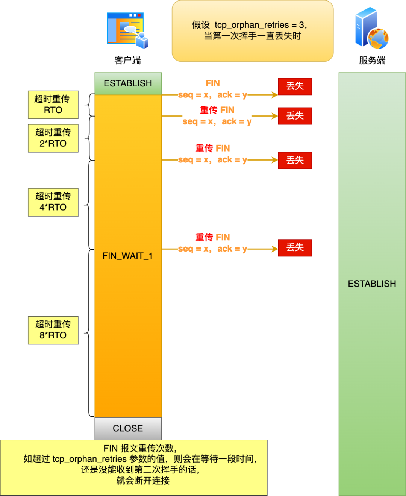
    - 第二次挥手丢失了，会发生什么
      - ACK 报文是不会重传的，所以如果服务端的第二次挥手丢失了，客户端就会触发超时重传机制，重传 FIN 报文，直到收到服务端的第二次挥手，或者达到最大的重传次数。
      - 当客户端收到第二次挥手，也就是收到服务端发送的 ACK 报文后，客户端就会处于 FIN_WAIT2 状态，在这个状态需要等服务端发送第三次挥手，也就是服务端的 FIN 报文。
        - 对于 close 函数关闭的连接，由于无法再发送和接收数据，所以FIN_WAIT2 状态不可以持续太久，而 tcp_fin_timeout 控制了这个状态下连接的持续时长，默认值是 60 秒。 意味着对于调用 close 关闭的连接，如果在 60 秒后还没有收到 FIN 报文，客户端（主动关闭方）的连接就会直接关闭。
        - 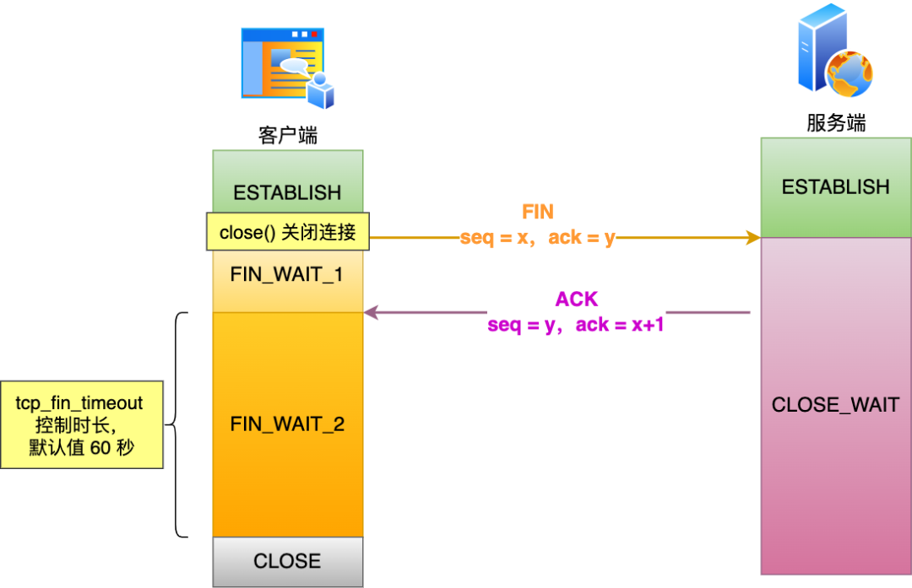
        - 如果主动关闭方使用 shutdown 函数关闭连接，指定了只关闭发送方向，而接收方向并没有关闭，那么意味着主动关闭方还是可以接收数据的。 此时，如果主动关闭方一直没收到第三次挥手，那么主动关闭方的连接将会一直处于 FIN_WAIT2 状态（tcp_fin_timeout 无法控制 shutdown 关闭的连接）
        - 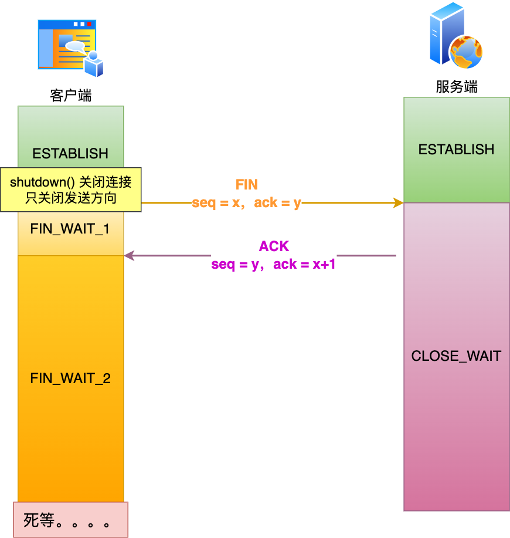
    - 第三次挥手丢失了，会发生什么
      - 当服务端（被动关闭方）收到客户端（主动关闭方）的 FIN 报文后，内核会自动回复 ACK，同时连接处于 CLOSE_WAIT 状态，顾名思义，它表示等待应用进程调用 close 函数关闭连接。
      - 此时，内核是没有权利替代进程关闭连接，必须由进程主动调用 close 函数来触发服务端发送 FIN 报文。
      - 服务端处于 CLOSE_WAIT 状态时，调用了 close 函数，内核就会发出 FIN 报文，同时连接进入 LAST_ACK 状态，等待客户端返回 ACK 来确认连接关闭。
      - 如果迟迟收不到这个 ACK，服务端就会重发 FIN 报文，重发次数仍然由 tcp_orphan_retries 参数控制，这与客户端重发 FIN 报文的重传次数控制方式是一样的。
      - 
    - [第四次挥手丢失了，会发生什么](https://mp.weixin.qq.com/s/TBz23qH0LWvB7fWYoGM4Rw)
      - 当客户端收到服务端的第三次挥手的 FIN 报文后，就会回 ACK 报文，也就是第四次挥手，此时客户端连接进入 TIME_WAIT 状态。 在 Linux 系统，TIME_WAIT 状态会持续 60 秒后才会进入关闭状态。
      - 服务端（被动关闭方）没有收到 ACK 报文前，还是处于 LAST_ACK 状态。 如果第四次挥手的 ACK 报文没有到达服务端，服务端就会重发 FIN 报文，重发次数仍然由前面介绍过的 tcp_orphan_retries 参数控制。
      - tcp_orphan_retries参数是0，但其实并不是不重试的意思。为0时，默认值为8. 也就是重试8次。
      - 如果服务端重试发第三次挥手FIN的过程中，还是同样的端口和IP,起了个新的客户端，这时候服务端重试的FIN被收到后，客户端就会认为是不正常的数据包，直接发个RST给服务端，这时候两端连接也会断开
      - 
  - TCP 的可靠性指的是什么
    - 可靠性指的是从网络 IO 缓冲中读出来的数据必须是无损的、无冗余的、有序的、无间隔的。翻译过来说要保证的可靠性的话，就要解决数据中出现的损坏，乱序，丢包，冗余这四个问题
  - TCP 的可靠性如何保证
    - 差错控制
      - 保证数据无损。TCP 的传输报文段中使用了校验和 checksum，保证本次传输的报文是无损的
      - 保证有序和不冗余。在传输报文中使用了 seq 字段去解决乱序及冗余问题
      - 保证数据报文们无间隔。在传输报文中使用了 ack 字段，也就是确认应答机制（ACK 延迟确认+累计应答机制） + 超时重传机制（重传机制还细分为快速重传机制（发三个数据包都没有回复））去解决了丢包导致数据出现间隔的问题（流量控制也能够有效的预防丢包的机制之一）
    - 流量控制
      - 流量控制（用于接受者）是为了控制发送端不要一味的发送数据导致网络阻塞，和阻止发送方发送的数据不要超过接收方的最大负载，因为超过最大负载会导致接收方丢弃数据而进一步触发超时重传去加重网络阻塞
      - 流量控制的主要手段是通过窗口去做的.每次接受方应答时，都会带一个 window 的字段（三次握手会确定初始的 window 字段），标识了现在接受方能够接受的最大数据量，发送方会根据这个 window 字段直接发送多个报文直到达到 window 的上限
    - 拥塞控制
      - 拥塞控制（用于网络）主要是为了在发生网络拥堵后不进一步触发 TCP 的超时重传进制导致进一步的网络拥堵和网络性能下降
      - 发送方会自己维护一个拥堵窗口，默认为 1 MSS（最大长度报文段）。控制手段主要有慢启动、拥塞避免、快重传、快恢复。
        - 慢启动。思路是一开始不要传输大量的数据，而是先试探网络中的拥堵程度再去逐渐增加拥塞窗口大小（一般是指数规律增长）
        - 拥塞避免。拥塞避免思路也和慢启动类似，只是按照线性规律去增加拥堵窗口的大小。
        - 快重传。指的是使发送方尽快重传丢失报文，而不是等超时避免去触发慢启动。所以接受方要收到失序报文后马上发送重复确认以及发送方收到三个重复的接受报文要接受重发。快重传成功后，就会执行快恢复算法
        - 快恢复。一般是将慢启动阈值和拥塞窗口都调整为现有窗口的一半，之后进行拥塞避免算法，也有实现是把调整为一半后，在增加3个MSS。
  - TCP 如何保证数据包的顺序传输
    - 数据报文自带 seq 序列号作为排序手段。TCP 三次握手成功后，双方会初始化 seq 序列号用于今后的数据传输，并且会作为传输的数据报文们排序的依据
    - 超时重传 + 快重传机制作为辅助。如果出现数据报文的失序或者乱序，就会触发超时重传或者快重传的机制补齐中间缺失的报文来保证整体的数据传输是有序的
  - TCP 三次握手 四次挥手 图例
    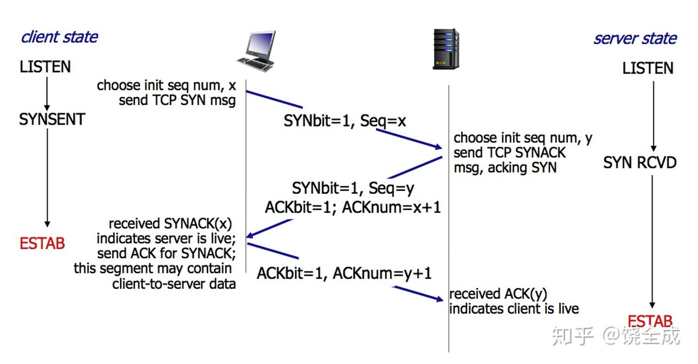
    
    - ISN
      - 三次握手的一个重要功能是客户端和服务端交换ISN(Initial Sequence Number), 以便让对方知道接下来接收数据的时候如何按序列号组装数据。
      - ISN = M + F(localhost, localport, remotehost, remoteport) M是一个计时器，每隔4毫秒加1。 F是一个Hash算法
    - 序列号回绕
      - 因为ISN是随机的，所以序列号容易就会超过2^31-1. 而tcp对于丢包和乱序等问题的判断都是依赖于序列号大小比较的
    - syn flood攻击
      - 如果恶意的向某个服务器端口发送大量的SYN包，则可以使服务器打开大量的半开连接，分配TCB（Transmission Control Block）, 从而消耗大量的服务器资源，同时也使得正常的连接请求无法被相应。
      - 延缓TCB分配方法
        - Syn Cache 系统在收到一个SYN报文时，在一个专用HASH表中保存这种半连接信息，直到收到正确的回应ACK报文再分配TCB
        - Syn Cookie 使用一种特殊的算法生成Sequence Number，这种算法考虑到了对方的IP、端口、己方IP、端口的固定信息
      - 使用SYN Proxy防火墙
    - 连接队列
      - 查看是否有连接溢出 `netstat -s | grep LISTEN`
      - 半连接队列满
        - 在三次握手协议中，服务器维护一个半连接队列，该队列为每个客户端的SYN包开设一个条目(服务端在接收到SYN包的时候，就已经创建了request_sock结构，存储在半连接队列中)，该条目表明服务器已收到SYN包，并向客户发出确认，正在等待客户的确认包。这些条目所标识的连接在服务器处于Syn_RECV状态，当服务器收到客户的确认包时，删除该条目，服务器进入ESTABLISHED状态。
        - 攻击者在短时间内发送大量的SYN包给Server(俗称SYN flood攻击)，用于耗尽Server的SYN队列。对于应对SYN 过多的问题，linux提供了几个TCP参数：tcp_syncookies、tcp_synack_retries、tcp_max_syn_backlog、tcp_abort_on_overflow 来调整应对。
        - 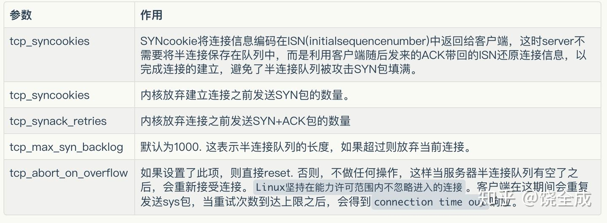
      - 全连接队列满
        - 当第三次握手时，当server接收到ACK包之后，会进入一个新的叫 accept 的队列
        - 当accept队列满了之后，即使client继续向server发送ACK的包，也会不被响应，此时ListenOverflows+1，同时server通过tcp_abort_on_overflow来决定如何返回，0表示直接丢弃该ACK，1表示发送RST通知client；相应的，client则会分别返回read timeout 或者 connection reset by peer
        - tcp_abort_on_overflow是0的话，server过一段时间再次发送syn+ack给client（也就是重新走握手的第二步），如果client超时等待比较短，就很容易异常了。而客户端收到多个 SYN ACK 包，则会认为之前的 ACK 丢包了。于是促使客户端再次发送 ACK ，在 accept队列有空闲的时候最终完成连接。若 accept队列始终满员，则最终客户端收到 RST 包（此时服务端发送syn+ack的次数超出了tcp_synack_retries）
        - 
      - Command line
        ```shell
        [root@server ~]# netstat -s | egrep "listen|LISTEN"
        667399 times the listen queue of a socket overflowed
        667399 SYNs to LISTEN sockets ignored
        比如上面看到的 667399 times ，表示全连接队列溢出的次数，隔几秒钟执行下，如果这个数字一直在增加的话肯定全连接队列偶尔满了。
        [root@server ~]# netstat -s | grep TCPBacklogDrop 查看 Accept queue 是否有溢出
        ```
        ```shell
        [root@server ~]# ss -lnt
        State Recv-Q Send-Q Local Address:Port Peer Address:Port 
        LISTEN 0     128     :6379 : 
        LISTEN 0     128     :22 :
        如果State是listen状态，Send-Q 表示第三列的listen端口上的全连接队列最大为50，第一列Recv-Q为全连接队列当前使用了多少。
        非 LISTEN 状态中 Recv-Q 表示 receive queue 中的 bytes 数量；Send-Q 表示 send queue 中的 bytes 数值。
        ```

  - [一个已经建立的 TCP 连接，客户端中途宕机了，而服务端此时也没有数据要发送，一直处于 establish 状态，客户端恢复后，向服务端建立连接，此时服务端会怎么处理？](https://mp.weixin.qq.com/s?__biz=MzUxODAzNDg4NQ==&mid=2247498170&idx=1&sn=8016a3ae1c7453dfa38062d84af820a9&chksm=f98dbd10cefa3406a5ccfad61c00c4d310d436a1bcfe8d464d94678ab195e013b2296498ac50&scene=21#wechat_redirect)
    - 客户端的 SYN 报文里的**端口号与历史连接不相同**
      - 如果客户端恢复后发送的 SYN 报文中的源端口号跟上一次连接的源端口号**不一样**，此时服务端会认为是新的连接要建立，于是就会通过三次握手来建立新的连接。那旧连接里处于 establish 状态的服务端最后会怎么样呢
      - 如果服务端发送了数据包给客户端，由于客户端的连接已经被关闭了，此时客户的内核就会回 RST 报文，服务端收到后就会释放连接。
      - 如果服务端一直没有发送数据包给客户端，在超过一段时间后， TCP 保活机制就会启动，检测到客户端没有存活后，接着服务端就会释放掉该连接。
    - 客户端的 SYN 报文里的**端口号与历史连接相同**
     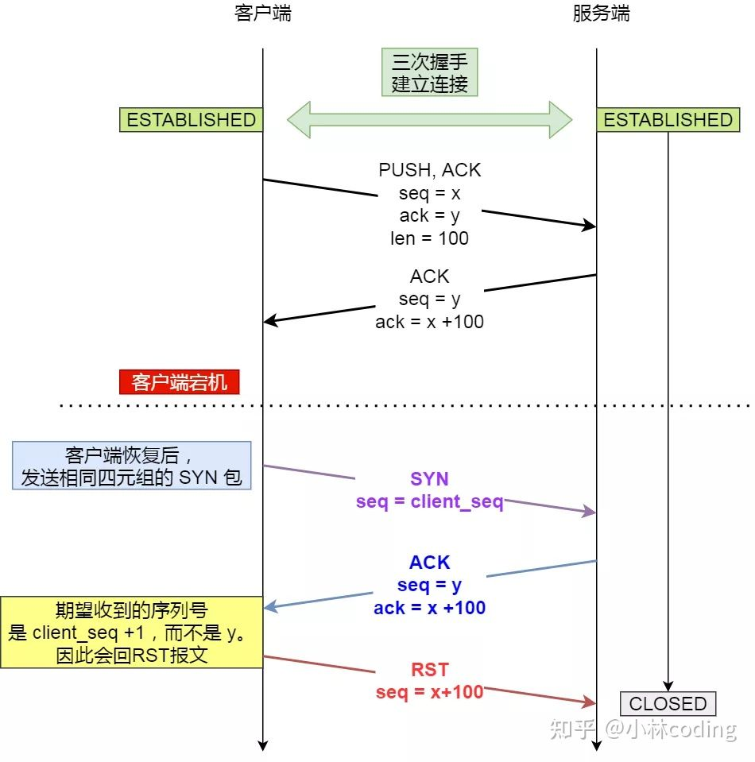
      - 处于 establish 状态的服务端如果收到了客户端的 SYN 报文（注意此时的 SYN 报文其实是乱序的，因为 SYN 报文的初始化序列号其实是一个随机数），会回复一个携带了正确序列号和确认号的 ACK 报文，这个 ACK 被称之为 Challenge ACK。接着，客户端收到这个 Challenge ACK，发现序列号并不是自己期望收到的，于是就会回 RST 报文，服务端收到后，就会释放掉该连接
      . rfc793 文档里的第 34 页里，有说到这个例子 -- Half-Open connection discovery
    - 如何关闭一个 TCP 连接？
      - 杀掉进程?
        - 在客户端杀掉进程的话，就会发送 FIN 报文，来断开这个客户端进程与服务端建立的所有 TCP 连接，这种方式影响范围只有这个客户端进程所建立的连接，而其他客户端或进程不会受影响。
        - 在服务端杀掉进程影响就大了，此时所有的 TCP 连接都会被关闭，服务端无法继续提供访问服务。
      - 伪造一个四元组相同的 RST 报文不就行了？
        - 如果 RST 报文的序列号不能落在对方的滑动窗口内，这个 RST 报文会被对方丢弃的，就达不到关闭的连接的效果
      - 我们可以伪造一个四元组相同的 SYN 报文，来拿到“合法”的序列号！如果处于 establish 状态的服务端，收到四元组相同的 SYN 报文后，会回复一个 Challenge ACK，这个 ACK 报文里的「确认号」，正好是服务端下一次想要接收的序列号. 然后用这个确认号作为 RST 报文的序列号，发送给服务端，此时服务端会认为这个 RST 报文里的序列号是合法的，于是就会释放连接！
        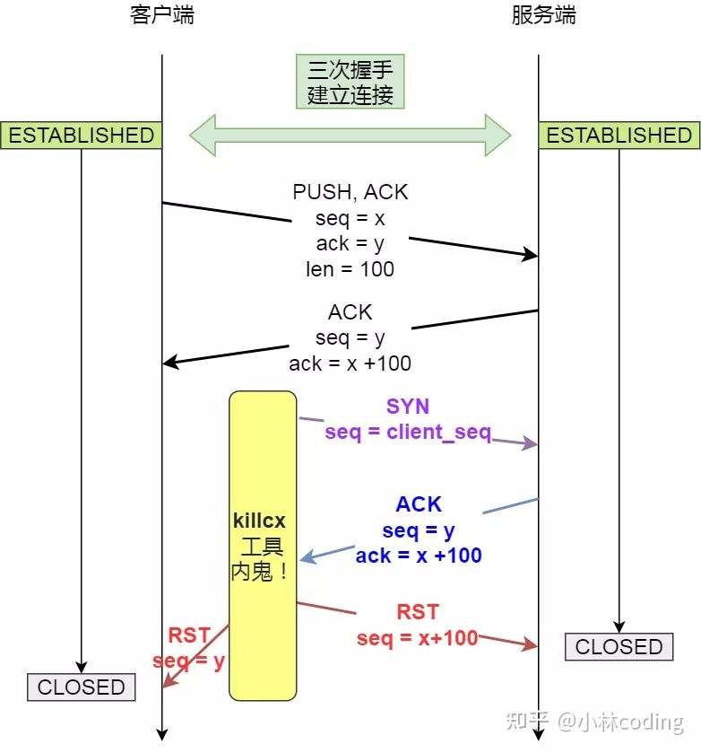
  - [收到RST，就一定会断开TCP连接吗](https://mp.weixin.qq.com/s/wh7YyKIHEdIlMxGaJFbqiw)
    - 什么是RST
      - RST 就是用于这种情况，一般用来异常地关闭一个连接。它是一个TCP包头中的标志位。
      - 正常情况下，不管是发出，还是收到置了这个标志位的数据包，相应的内存、端口等连接资源都会被释放。从效果上来看就是TCP连接被关闭了。
      - 而接收到 RST的一方，一般会看到一个 connection reset 或  connection refused 的报错。
    - 怎么知道收到RST了
      - 如果本端应用层尝试去执行 **读数据**操作，比如recv，应用层就会收到 **Connection reset by peer** 的报错，意思是远端已经关闭连接
      - 如果本端应用层尝试去执行**写数据**操作，比如send，那么应用层就会收到 **Broken pipe** 的报错，意思是发送通道已经坏了
    - 出现RST的场景有哪些
      - 端口不可用
        - 端口未监听 - 这个端口从来就没有"可用"过
          - 如果服务端没有执行过listen，那哈希表里也就不会有对应的sock，结果当然是拿不到。此时，正常情况下服务端会发RST给客户端。
          - 端口未监听就一定会发RST吗？
            - 只有在数据包没问题的情况下，比如校验和没问题，才会发RST包给对端。
        - 服务突然崩 - 曾经"可用"，但现在"不可用"
        - 
      - socket提前关闭
        - 本端提前关闭
          - 如果本端socket接收缓冲区还有数据未读，此时提前close() socket。那么本端会先把接收缓冲区的数据清空，然后给远端发一个RST。
        - 远端提前关闭
          - 远端已经close()了socket，此时本端还尝试发数据给远端。那么远端就会回一个RST。
          - 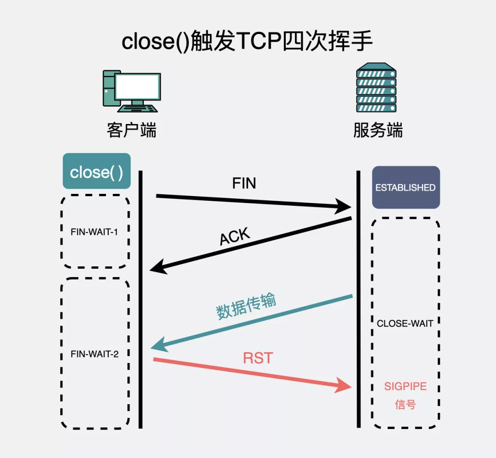
          - 客户端执行close()， 正常情况下，会发出第一次挥手FIN，然后服务端回第二次挥手ACK。如果在第二次和第三次挥手之间，如果服务方还尝试传数据给客户端，那么客户端不仅不收这个消息，还会发一个RST消息到服务端。直接结束掉这次连接???
    - 对方没收到RST，会怎么样？
      - RST，不需要ACK确认包。 因为RST本来就是设计来处理异常情况的
    - 收到RST就一定会断开连接吗
      - 不一定会断开。收到RST包，第一步会通过tcp_sequence先看下这个seq是否合法，其实主要是看下这个seq是否在合法接收窗口范围内。如果不在范围内，这个RST包就会被丢弃。
      - RST攻击
        - 有不怀好意的第三方介入，构造了一个RST包，且在TCP和IP等报头都填上客户端的信息，发到服务端，那么服务端就会断开这个连接。
        - 利用challenge ack获取seq
        - 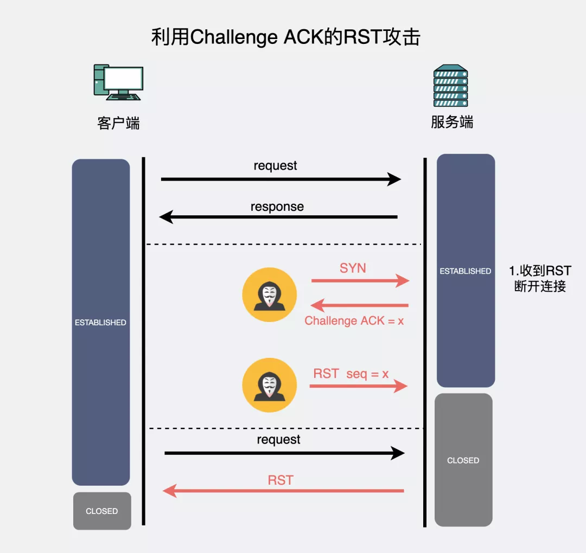

  - [TCP拥塞控制及谷歌的BBR算法](https://mp.weixin.qq.com/s/pmUdUvHgEhZzAhz2EP5Evg)
    - 流量控制 Flow Control - 微观层面点到点的流量控制
      - 在数据通信中，流量控制是管理两个节点之间数据传输速率的过程，以防止快速发送方压倒慢速接收方
      - 它为接收机提供了一种控制传输速度的机制，这样接收节点就不会被来自发送节点的数据淹没
      - 流量控制是通信双方之间约定数据量的一种机制，具体来说是借助于TCP协议的确认ACK机制和窗口协议来完成的。
      
    - 拥塞控制 - 宏观层面的控去避免网络链路的拥堵
      - 端到端流量控制算法也面临丢包、乱序、重传问题
      - TCP拥塞控制算法的目的可以简单概括为：公平竞争、充分利用网络带宽、降低网络延时、优化用户体验
      - TCP 传输层拥塞控制算法并不是简单的计算机网络的概念，也属于控制论范畴
      - TCP连接的发送方一般是基于丢包来判断当前网络是否发生拥塞，丢包可以由重传超时RTO和重复确认来做判断
        - 基于丢包策略的传统拥塞控制算法
         
        - 基于RTT延时策略来进行控制的
         
      - 拥塞窗口cwnd
        - 流量控制可以知道接收方在header中给出了rwnd接收窗口大小，发送方不能自顾自地按照接收方的rwnd限制来发送数据，因为网络链路是复用的，需要考虑当前链路情况来确定数据量，这也是我们要提的另外一个变量cwnd
        - Congestion Window (cwnd) is a TCP state variable that limits the amount of data the TCP can send into the network before receiving an ACK. 
        - The Receiver Window (rwnd) is a variable that advertises the amount of data that the destination side can receive. 
        - Together, the two variables are used to regulate data flow in TCP connections, minimize congestion, and improve network performance.
        - cwnd是在发送方维护的，cwnd和rwnd并不冲突，发送方需要结合rwnd和cwnd两个变量来发送数据
      - 策略
        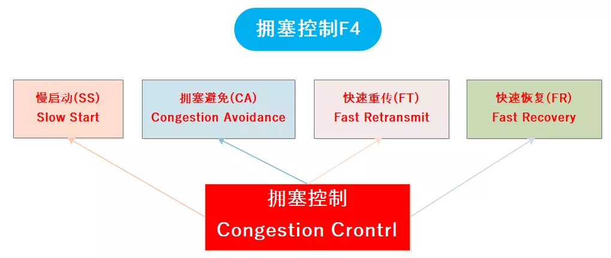
    - BBR算法
      - BBR算法是个主动的闭环反馈系统，通俗来说就是根据带宽和RTT延时来不断动态探索寻找合适的发送速率和发送量。
      - 该算法使用网络最近出站数据分组当时的最大带宽和往返时间来创建网络的显式模型。数据包传输的每个累积或选择性确认用于生成记录在数据包传输过程和确认返回期间的时间内所传送数据量的采样率。
      - 分别采样估计极大带宽和极小延时，并用二者乘积作为发送窗口，并且BBR引入了Pacing Rate限制数据发送速率，配合cwnd使用来降低冲击。
  - [连接一个 IP 不存在的主机时，握手过程是怎样的](https://mp.weixin.qq.com/s/BSU9j-TIpfFkHlZRLhLoYA)
    - 连一个 IP 不存在的主机时，握手过程是怎样的
      - 局域网内
        
        尝试测试一个不存在的ip
         ```go
             client, err := net.Dial("tcp", "192.168.31.7:8081")
             if err != nil {
                 fmt.Println("err:", err)
                 return
             }
       
             defer client.Close()
             go func() {
                 input := make([]byte, 1024)
                 for {
                     n, err := os.Stdin.Read(input)
                     if err != nil {
                         fmt.Println("input err:", err)
                         continue
                     }
                     client.Write([]byte(input[:n]))
                 }
             }()
       
             buf := make([]byte, 1024)
             for {
                 n, err := client.Read(buf)
                 if err != nil {
                     if err == io.EOF {
                         return
                     }
                     fmt.Println("read err:", err)
                     continue
                 }
                 fmt.Println(string(buf[:n]))
             }
         ```
        - 尝试抓包，可以发现根本没有三次握手的包，只有一些 ARP 包，在询问“谁是 192.168.31.7，告诉一下 192.168.31.6”
        - 为什么会发ARP请求？
          - 因为目的地址是瞎编的，本地ARP表没有目的机器的MAC地址，因此发出ARP消息。
        - 什么没有TCP握手包？
          - 因为协议栈的数据到了网络层后，在数据链路层前，就因为没有目的MAC地址，没法发出。因此抓包软件抓不到相关数据。
        - ARP本身是没有重试机制的，为什么ARP请求会发那么多遍？
          - 因为 TCP 协议的可靠性，会重发第一次握手的消息，但每一次都因为没有目的 MAC 地址而失败，每次都会发出ARP请求
      
        
        邻居子系统，它在网络层和数据链路层之间。可以通过ARP协议将目的IP转为对应的MAC地址，然后数据链路层就可以用这个MAC地址组装帧头

        先到本地ARP表查一下有没有 192.168.31.7 对应的 mac地址 `arp -a`
        
      - 局域网外
        - 瞎编一个不是  192.168.31.xx 形式的 IP 作为这次要用的局域网外IP， 比如 10.225.31.11。先抓包看一下, 这次的现象是能发出 TCP 第一次握手的 SYN包
        - 这个问题的答案其实在上面 ARP 的流程里已经提到过了，如果目的 IP 跟本机 IP 不在同一个局域网下，那么会去获取默认网关的 MAC 地址，这里就是指获取家用路由器的MAC地址。 此时ARP流程成功返回家用路由器的 MAC 地址，数据链路层加入帧头，消息通过网卡发到了家用路由器上。
    - 连IP 地址存在但端口号不存在的主机的握手过程
      - 目的IP是回环地址
        - 我们可以正常发消息到目的IP，因为对应的MAC地址和IP都是正确的，所以，数据从数据链路层到网络层都很OK。 直到传输层，TCP协议在识别到这个端口号对应的进程根本不存在时，就会把数据丢弃，响应一个RST消息给发送端。
        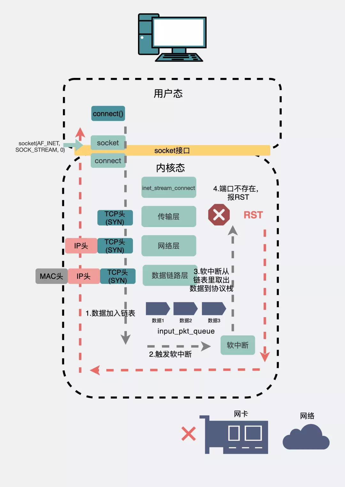
      - 目的IP在局域网内
        
      - 目的IP在局域网外
        - 现象却不一致。没有 RST 。而且触发了第一次握手的重试消息。这是为什么？
        - 很多发到 8080端口的消息都在防火墙这一层就被拒绝掉了，根本到不了目的主机里，而RST是在目的主机的TCP/IP协议栈里发出的，都还没到这一层，就更不可能发RST了。
    - Summary
      - 连一个 IP 不存在的主机时
        - 如果IP在局域网内，会发送N次ARP请求获得目的主机的MAC地址，同时不能发出TCP握手消息。
        - 如果IP在局域网外，会将消息通过路由器发出，但因为最终找不到目的地，触发TCP重试流程。
      - 连IP 地址存在但端口号不存在的主机时
        - 不管目的IP是回环地址还是局域网内外的IP地址，目的主机的传输层都会在收到握手消息后，发现端口不正确，发出RST消息断开连接。
        - 当然如果目的机器设置了防火墙策略，限制他人将消息发到不对外暴露的端口，那么这种情况，发送端就会不断重试第一次握手。
  - [IP层会分片 TCP层也还要分段](https://mp.weixin.qq.com/s/-r3f90E6CyIDLPq5W6w6ag)
    - 什么是TCP分段和IP分片
      - 传输层（TCP协议）里，叫分段 - MSS
      - 网络层（IP层），叫分片 - MTU
    - MSS
      - Maximum Segment Size 。TCP 提交给 IP 层最大分段大小，不包含 TCP Header 和  TCP Option，只包含 TCP Payload ，MSS 是 TCP 用来限制应用层最大的发送字节数
      - 假设 MTU= 1500 byte，那么 MSS = 1500- 20(IP Header) -20 (TCP Header) = 1460 byte
    - 如何查看MSS
      - TCP三次握手，而MSS会在三次握手的过程中传递给对方，用于通知对端本地最大可以接收的TCP报文数据大小（不包含TCP和IP报文首部）
      - B将自己的MSS发送给A，建议A在发数据给B的时候，采用MSS=1420进行分段。而B在发数据给A的时候，同样会带上MSS=1372。两者在对比后，会采用小的那个值（1372）作为通信的MSS值，这个过程叫MSS协商
    - 三次握手中协商了MSS就不会改变了吗
      - 当然不是，每次执行TCP发送消息的函数时，会重新计算一次MSS，再进行分段操作
    - 对端不传MSS会怎么样
      - TCP的报头, MSS是作为可选项引入的. 如果没有接收到对端TCP的MSS，本端TCP默认采用MSS=536Byte
    - MTU是什么
      - Maximum Transmit Unit，最大传输单元。其实这个是由数据链路层提供，为了告诉上层IP层，自己的传输能力是多大
    - 如何查看MTU - ifconfig
    - 为什么IP层会分片，TCP还要分段
      - 数据在TCP分段，就是为了在IP层不需要分片，同时发生重传的时候只重传分段后的小份数据
      - 但UDP本身不会分段，所以当数据量较大时，只能交给IP层去分片，然后传到底层进行发送。
    - TCP分段了，IP层就一定不会分片了吗
      - 如果链路上还有设备有更小的MTU，那么还会再分片，最后所有的分片都会在接收端处进行组装。
    - IP层怎么做到不分片
      - PMTU - 整个链路上，最小的MTU
      - 有一个获得这个PMTU的方法，叫 Path MTU Discovery `cat /proc/sys/net/ipv4/ip_no_pmtu_disc`
    - 总结
      - 数据在TCP分段，在IP层就不需要分片，同时发生重传的时候只重传分段后的小份数据
      - TCP分段时使用MSS，IP分片时使用MTU
      - MSS是通过MTU计算得到，在三次握手和发送消息时都有可能产生变化。
      - IP分片是不得已的行为，尽量不在IP层分片，尤其是链路上中间设备的IP分片。因此，在IPv6中已经禁止中间节点设备对IP报文进行分片，分片只能在链路的最开头和最末尾两端进行。
      - 建立连接后，路径上节点的MTU值改变时，可以通过PMTU发现更新发送端MTU的值。这种情况下，PMTU发现通过浪费N次发送机会来换取的PMTU，TCP因为有重传可以保证可靠性，在UDP就相当于消息直接丢了。
  - [TCP 的这些内存开销](https://mp.weixin.qq.com/s?__biz=MjM5Njg5NDgwNA==&mid=2247484398&idx=1&sn=f2b0a9098673dad134a228ecf9a8ac9e&scene=21#wechat_redirect)
    - 
    - 1. 内核会尽量及时回收发送缓存区、接收缓存区，但高版本做的更好
    - 2. 发送接收缓存区最小并一定不是 rmem 内核参数里的最小值，实际可能会更小
    - 3. 其它状态下，例如对于TIME_WAIT还会回收非必要的 socket_alloc 等对象
  - [既然打开 net.ipv4.tcp_tw_reuse 参数可以快速复用处于 TIME_WAIT 状态的 TCP 连接，那为什么 Linux 默认是关闭状态呢](https://mp.weixin.qq.com/s/yIXihfy7lFajyeL6mXhU_Q)
    - 在变相问 - 如果 TIME_WAIT 状态持续时间过短或者没有，会有什么问题？因为开启 tcp_tw_reuse 参数可以快速复用处于 TIME_WAIT 状态的 TCP 连接时，相当于缩短了 TIME_WAIT 状态的持续时间
    - TIME_WAIT
      - TIME_WAIT 是「主动关闭方」断开连接时的最后一个状态，该状态会持续 2MSL(Maximum Segment Lifetime) 时长，之后进入CLOSED 状态
      - MSL 指的是 TCP 协议中任何报文在网络上最大的生存时间，任何超过这个时间的数据都将被丢弃. Linux 默认为 30 秒，那么 2MSL 就是 60 秒
      - MSL vs TTL
        - MSL 是由网络层的 IP 包中的 TTL 来保证的，TTL 是 IP 头部的一个字段，用于设置一个数据报可经过的路由器的数量上限。报文每经过一次路由器的转发，IP 头部的 TTL 字段就会减 1，减到 0 时报文就被丢弃
        - MSL 的单位是时间，而 TTL 是经过路由跳数。所以 MSL 应该要大于等于 TTL 消耗为 0 的时间，以确保报文已被自然消亡
        - TTL 的值一般是 64，Linux 将 MSL 设置为 30 秒，意味着 Linux 认为数据报文经过 64 个路由器的时间不会超过 30 秒，如果超过了，就认为报文已经消失在网络中了。
    - Why TIME_WAIT
      - 防止历史连接中的数据，被后面相同四元组的连接错误的接收；
        - 序列号（SEQ）和初始序列号（ISN）
          - 序列号，是 TCP 一个头部字段. 为了保证消息的顺序性和可靠性，TCP 为每个传输方向上的每个字节都赋予了一个编号，以便于传输成功后确认、丢失后重传以及在接收端保证不会乱序。序列号是一个 32 位的无符号数，因此在到达 4G 之后再循环回到 0。
          - 初始序列号，在 TCP 建立连接的时候，客户端和服务端都会各自生成一个初始序列号，它是基于时钟生成的一个随机数，来保证每个连接都拥有不同的初始序列号。初始化序列号可被视为一个 32 位的计数器，该计数器的数值每 4 微秒加 1，循环一次需要 4.55 小时。
        - 序列号和初始化序列号并不是无限递增的，会发生回绕为初始值的情况，这意味着无法根据序列号来判断新老数据。
        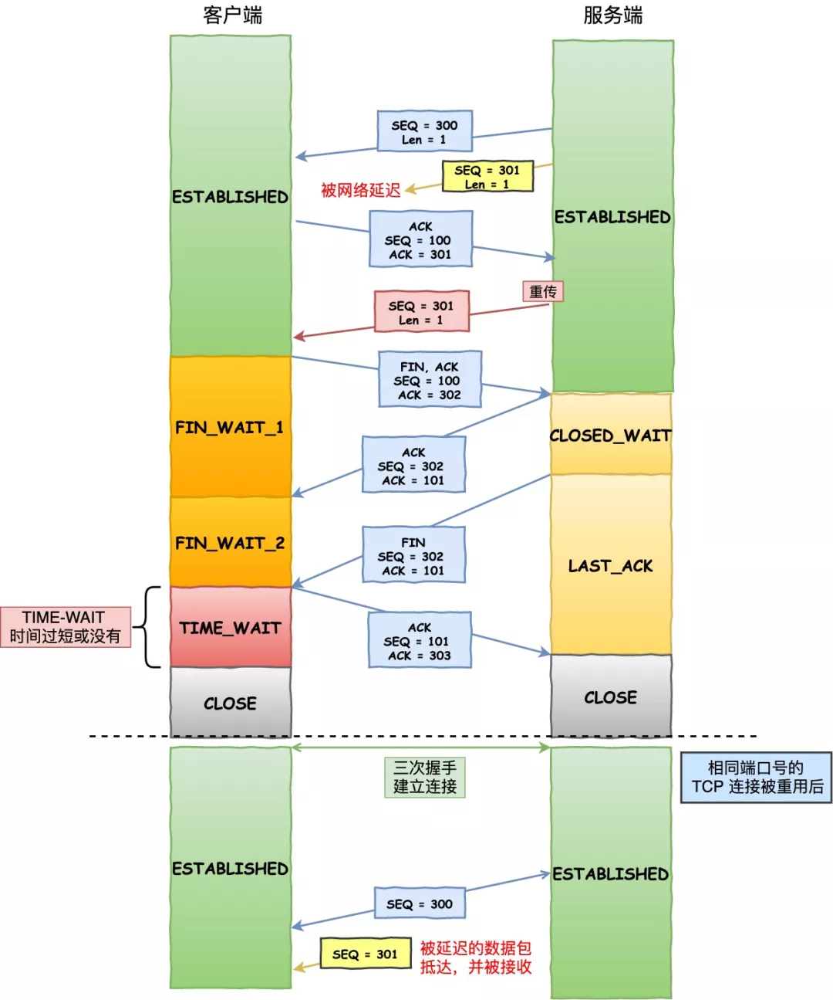
        - 为了防止历史连接中的数据，被后面相同四元组的连接错误的接收，因此 TCP 设计了 TIME_WAIT 状态，状态会持续 2MSL 时长，这个时间足以让两个方向上的数据包都被丢弃，使得原来连接的数据包在网络中都自然消失，再出现的数据包一定都是新建立连接所产生的
      - 保证「被动关闭连接」的一方，能被正确的关闭；
        - 如果客户端（主动关闭方）最后一次 ACK 报文（第四次挥手）在网络中丢失了，那么按照 TCP 可靠性原则，服务端（被动关闭方）会重发 FIN 报文
        - 假设客户端没有 TIME_WAIT 状态，而是在发完最后一次回 ACK 报文就直接进入 CLOSED 状态，如果该  ACK 报文丢失了，服务端则重传的 FIN 报文，而这时客户端已经进入到关闭状态了，在收到服务端重传的 FIN 报文后，就会回 RST 报文。服务端收到这个 RST 并将其解释为一个错误（Connection reset by peer），这对于一个可靠的协议来说不是一个优雅的终止方式
        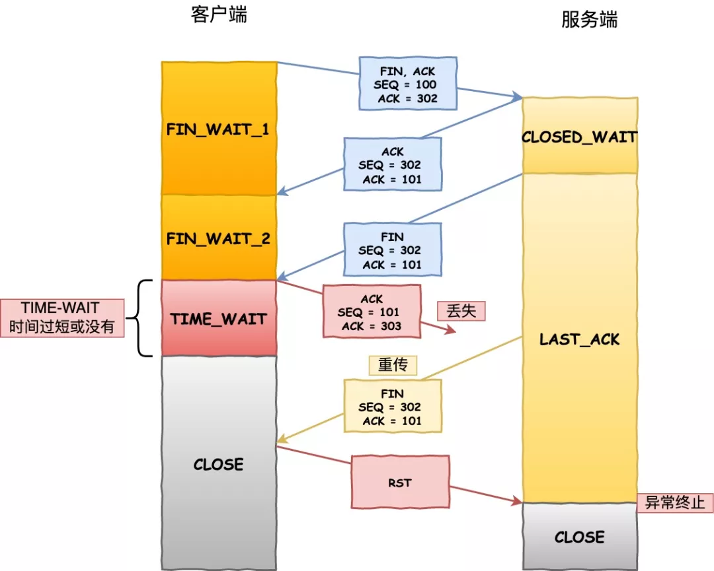
    - tcp_tw_reuse
      - Linux 操作系统提供了两个可以系统参数来快速回收处于 TIME_WAIT 状态的连接，这两个参数都是默认关闭的
        - net.ipv4.tcp_tw_reuse，如果开启该选项的话，客户端（连接发起方） 在调用 connect() 函数时，内核会随机找一个 TIME_WAIT 状态超过 1 秒的连接给新的连接复用，所以该选项只适用于连接发起方。
        - net.ipv4.tcp_tw_recycle，如果开启该选项的话，允许处于 TIME_WAIT 状态的连接被快速回收，该参数在 NAT 的网络下是不安全的
        - 要使得上面这两个参数生效，有一个前提条件，就是要打开 TCP 时间戳，即 net.ipv4.tcp_timestamps=1（默认即为 1）
      - 开启了 tcp_timestamps 参数，TCP 头部就会使用时间戳选项，它有两个好处，一个是便于精确计算 RTT ，另一个是能防止序列号回绕（PAWS）
      - PAWS
        - 在一个速度足够快的网络中传输大量数据时，序列号的回绕时间就会变短。如果序列号回绕的时间极短，我们就会再次面临之前延迟的报文抵达后序列号依然有效的问题。
        - 为了解决这个问题，就需要有 TCP 时间戳
        - 防回绕序列号算法要求连接双方维护最近一次收到的数据包的时间戳（Recent TSval），每收到一个新数据包都会读取数据包中的时间戳值跟 Recent TSval 值做比较，如果发现收到的数据包中时间戳不是递增的，则表示该数据包是过期的，就会直接丢弃这个数据包
    - 为什么 tcp_tw_reuse  默认是关闭的
      - 我们知道开启 tcp_tw_reuse 的同时，也需要开启 tcp_timestamps，意味着可以用时间戳的方式有效的判断回绕序列号的历史报文. RST 报文的时间戳即使过期了，只要 RST 报文的序列号在对方的接收窗口内，也是能被接受的
        
        - 因为快速复用 TIME_WAIT 状态的端口，导致新连接可能被回绕序列号的 RST 报文断开了，而如果不跳过 TIME_WAIT 状态，而是停留 2MSL 时长，那么这个 RST 报文就不会出现下一个新的连接。
      - 开启 tcp_tw_reuse 来快速复用 TIME_WAIT 状态的连接，如果第四次挥手的 ACK 报文丢失了，有可能会导致被动关闭连接的一方不能被正常的关闭
        
    - Summary
      - tcp_tw_reuse 的作用是让客户端快速复用处于 TIME_WAIT 状态的端口，相当于跳过了 TIME_WAIT 状态，这可能会出现这样的两个问题：
        - 历史 RST 报文可能会终止后面相同四元组的连接，因为 PAWS 检查到即使 RST 是过期的，也不会丢弃。
        - 如果第四次挥手的 ACK 报文丢失了，有可能被动关闭连接的一方不能被正常的关闭;
  - [SYN 报文什么时候情况下会被丢弃](https://mp.weixin.qq.com/s?__biz=MzUxODAzNDg4NQ==&mid=2247502230&idx=1&sn=5fb86772de17ab650088944d4d0adf62&chksm=f98d8d3ccefa042a96f02ad764cf0a70c3ebca18436f0a7cfa0780ff1b160ec9668e27d1bfb4&scene=178&cur_album_id=1337204681134751744#rd)
    - 开启 tcp_tw_recycle 参数，并且在 NAT 环境下，造成 SYN 报文被丢弃
      - tcp_tw_recycle 快速回收处于 TIME_WAIT 状态的连接， 前提条件，就是要打开 TCP 时间戳，即 net.ipv4.tcp_timestamps=1。 tcp_tw_recycle 在使用了 NAT 的网络下是不安全的
      - 对于服务器来说，如果同时开启了 recycle 和 timestamps 选项，则会开启一种称之为 per-host 的 PAWS 机制
        - PAWS 机制
          - tcp_timestamps 选项开启之后， PAWS 机制会自动开启，它的作用是防止 TCP 包中的序列号发生绕回
          - PAWS 就是为了避免这个问题而产生的，在开启 tcp_timestamps 选项情况下，一台机器发的所有 TCP 包都会带上发送时的时间戳，PAWS 要求连接双方维护最近一次收到的数据包的时间戳（Recent TSval），每收到一个新数据包都会读取数据包中的时间戳值跟 Recent TSval 值做比较，如果发现收到的数据包中时间戳不是递增的，则表示该数据包是过期的，就会直接丢弃这个数据包
        - per-host 的 PAWS 机制 - per-host 是对「对端 IP 做 PAWS 检查」，而非对「IP + 端口」四元组做 PAWS 检查。
          - Per-host PAWS 机制利用TCP option里的 timestamp 字段的增长来判断串扰数据，而 timestamp 是根据客户端各自的 CPU tick 得出的值
          - 当客户端 A 通过 NAT 网关和服务器建立 TCP 连接，然后服务器主动关闭并且快速回收 TIME-WAIT 状态的连接后，客户端 B 也通过 NAT 网关和服务器建立 TCP 连接，注意客户端 A  和 客户端 B 因为经过相同的 NAT 网关，所以是用相同的 IP 地址与服务端建立 TCP 连接，如果客户端 B 的 timestamp 比 客户端 A 的 timestamp 小，那么由于服务端的 per-host 的 PAWS 机制的作用，服务端就会丢弃客户端主机 B 发来的 SYN 包
          - tcp_tw_recycle 在使用了 NAT 的网络下是存在问题的，如果它是对 TCP 四元组做 PAWS 检查，而不是对「相同的 IP 做 PAWS 检查」，那么就不会存在这个问题了。
      - tcp_tw_recycle 在 Linux 4.12 版本后，直接取消了这一参数
    - accpet 队列满了，造成 SYN 报文被丢弃
      - TCP 三次握手的时候，Linux 内核会维护两个队列，分别是：
        - 半连接队列，也称 SYN 队列
        - 全连接队列，也称 accepet 队列
      
      - 在服务端并发处理大量请求时，如果 TCP accpet 队列过小，或者应用程序调用 accept() 不及时，就会造成 accpet 队列满了 ，这时后续的连接就会被丢弃，这样就会出现服务端请求数量上不去的现象。
      - ss `ss -lnt` 命令来看 accpet 队列大小，在「LISTEN 状态」时，Recv-Q/Send-Q 
        - Recv-Q：当前 accpet 队列的大小，也就是当前已完成三次握手并等待服务端 accept() 的 TCP 连接个数；
        - Send-Q：当前 accpet 最大队列长度，上面的输出结果说明监听 8088 端口的 TCP 服务进程，accpet 队列的最大长度为 128；
        - 如果 Recv-Q 的大小超过 Send-Q，就说明发生了 accpet 队列满的情况。
      - 要解决这个问题，我们可以：
        - 调大 accpet 队列的最大长度，调大的方式是通过调大 backlog 以及 somaxconn 参数。
        - 检查系统或者代码为什么调用 accept() 不及时
  - [Optimizing HTTP/2 prioritization with BBR and tcp_notsent_lowat](https://blog.cloudflare.com/http-2-prioritization-with-nginx/)
    - Adjust the configuration
    - `net.ipv4.tcp_notsent_lowat = 16384`
    - `net.core.default_qdisc = fq net.ipv4.tcp_congestion_control = bbr`
  - [Latency Spike](https://blog.cloudflare.com/the-story-of-one-latency-spike/)
    - Scenario
      - We ran thousands of HTTP queries against one server over a couple of hours. Almost all the requests finished in milliseconds, but, as you can clearly see, 5 requests out of thousands took as long as 1000ms to finish
    - Blame the network
      - They may indicate packet loss since the SYN packets are usually retransmitted at times 1s, 3s, 7s, 15, 31s.
      - ping test
        ```shell
        --- ping statistics ---
        114931 packets transmitted, 114805 received, 0% packet loss
        rtt min/avg/max/mdev = 10.434/11.607/1868.110/22.703 ms
        ```
    - tcpdump
        ```shell
        $ tcpdump -ttt -n -i eth2 icmp
        00:00.000000 IP x.x.x.a > x.x.x.b: ICMP echo request, id 19283
        00:01.296841 IP x.x.x.b > x.x.x.a: ICMP echo reply, id 19283
        ```
    - System Trap
      - we chose System Tap (stap). With a help of a flame graph we identified a function of interest: **net_rx_action**.
      - The net_rx_action function is responsible for handling packets in Soft IRQ mode. It will handle up to netdev_budget packets in one go
        ```shell
        sysctl net.core.netdev_budget
        net.core.netdev_budget = 300
      
        $ stap -v histogram-kernel.stp 'kernel.function("net_rx_action)"' 30
        Duration min:0ms avg:0ms max:23ms count:3685271
        ```
    - collapse the TCP
      - the receive buffer size value on a socket is a hint to the operating system of how much total memory it could use to handle the received data.
      - Most importantly, this includes not only the payload bytes that could be delivered to the application, but also the metadata around it.
      - a TCP socket structure contains a doubly-linked list of packets—the sk_buff structures. Each packet contains not only the data, but also the sk_buff metadata (sk_buff is said to take 240 bytes).
    - Tune the rmem
      - There are two ways to control the TCP socket receive buffer on Linux:
        - You can set setsockopt(SO_RCVBUF) explicitly.
        - Or you can leave it to the operating system and allow it to auto-tune it, using the tcp_rmem sysctl as a hint.
      - Since the receive buffer sizes are fairly large, garbage collection could take a long time. To test this we reduced the max rmem size to 2MiB and repeated the latency measurements
        ```shell
        $ sysctl net.ipv4.tcp_rmem
        net.ipv4.tcp_rmem = 4096 1048576 2097152
      
        $ stap -v histogram-kernel.stp 'kernel.function("tcp_collapse")' 300
        Duration min:0ms avg:0ms max:3ms count:592
      
        $ stap -v histogram-kernel.stp 'kernel.function("net_rx_action")'
        Duration min:0ms avg:0ms max:3ms count:3567235
        ```
  - [This is strictly a violation of the TCP specification](https://blog.cloudflare.com/this-is-strictly-a-violation-of-the-tcp-specification/)
    - Scenario
      - Apparently every now and then a connection going through CloudFlare would time out with 522 HTTP error
      - 522 error on CloudFlare indicates a connection issue between our edge server and the origin server. Most often the blame is on the origin server side
      - Test script
        ```shell
        $ nc 127.0.0.1 5000  -v
        nc: connect to 127.0.0.1 port 5000 (tcp) failed: Connection timed out
      
        # view from strace:
        socket(PF_INET, SOCK_STREAM, IPPROTO_TCP) = 3
        connect(3, {sa_family=AF_INET, sin_port=htons(5000), sin_addr=inet_addr("127.0.0.1")}, 16) = -110 ETIMEDOUT
        ```
      - netcat calls connect() to establish a connection to localhost. This takes a long time and eventually fails with ETIMEDOUT error. Tcpdump confirms that connect() did send SYN packets over loopback but never received any SYN+ACKs:
      - `$ sudo tcpdump -ni lo port 5000 -ttttt -S`
    - Loopback congestion
      - A little known fact is that it's not possible to have any packet loss or congestion on the loopback interface.
      - when an application sends packets to it, it immediately, still within the send syscall handling, gets delivered to the appropriate target. There is no buffering over loopback. Calling send over loopback triggers iptables, network stack delivery mechanisms and delivers the packet to the appropriate queue of the target application. Assuming the target application has some space in its buffers, packet loss over loopback is not possible.
    - Maybe the listening application misbehaved
      - Under normal circumstances connections to localhost are not supposed to time out. There is one corner case when this may happen though - when the listening application does not call accept() fast enough.
      - When that happens, the default behavior is to drop the new SYN packets. If the listening socket has a full accept queue, then new SYN packets will be dropped. The intention is to cause push-back, to slow down the rate of incoming connections. The peers should eventually re-send SYN packets, and hopefully by that time the accept queue will be freed. This behavior is controlled by the tcp_abort_on_overflow sysctl
      - `ss -n4lt 'sport = :5000'` The Send-Q column shows the backlog / accept queue size given to listen() syscall - 128 in our case. The Recv-Q reports on the number of outstanding connections in the accept queue - zero.
    - The problem
      - `ss -n4t | head` Further investigation revealed something peculiar. We noticed hundreds of CLOSE_WAIT sockets
    - What is CLOSE_WAIT anyway
      - CLOSE_WAIT - Indicates that the server has received the first FIN signal from the client and the connection is in the process of being closed. This means the socket is waiting for the application to execute close(). A socket can be in CLOSE_WAIT state indefinitely until the application closes it. Faulty scenarios would be like a file descriptor leak: server not executing close() on sockets leading to pile up of CLOSE_WAIT sockets.
      - Usually a Linux process can open up to 1,024 file descriptors. If our application did run out of file descriptors the accept syscall would return the EMFILE error. If the application further mishandled this error case, this could result in losing incoming SYN packets. Failed accept calls will not dequeue a socket from accept queue, causing the accept queue to grow. The accept queue will not be drained and will eventually overflow. An overflowing accept queue could result in dropped SYN packets and failing connection attempts.
      - `$ ls /proc/` pidof listener `/fd | wc -l`
    - What really happens
      - When the client application quits, the (127.0.0.1:some-port, 127.0.0.1:5000) socket enters the FIN_WAIT_1 state and then quickly transitions to FIN_WAIT_2. The FIN_WAIT_2 state should move on to TIME_WAIT if the client received FIN packet, but this never happens. The FIN_WAIT_2 eventually times out. On Linux this is 60 seconds, controlled by net.ipv4.tcp_fin_timeout sysctl.
      - This is where the problem starts. The (127.0.0.1:5000, 127.0.0.1:some-port) socket is still in CLOSE_WAIT state, while (127.0.0.1:some-port, 127.0.0.1:5000) has been cleaned up and is ready to be reused. When this happens the result is a total mess. One part of the socket won't be able to advance from the SYN_SENT state, while the other part is stuck in CLOSE_WAIT. The SYN_SENT socket will eventually give up failing with ETIMEDOUT.
  - [Sync Packet Handling](https://blog.cloudflare.com/syn-packet-handling-in-the-wild/)
    - The SYN queue
      - The SYN Queue stores inbound SYN packets (specifically: struct inet_request_sock). 
      - It's responsible for sending out SYN+ACK packets and retrying them on timeout.
      - `net.ipv4.tcp_synack_retries = 5`
    - The Accept queue
      - The Accept Queue contains fully established connections: ready to be picked up by the application. 
      - When a process calls accept(), the sockets are de-queued and passed to the application.
    - Queue size limits
      - The maximum allowed length of both the Accept and SYN Queues is taken from the backlog parameter passed to the listen(2) syscall by the application
        `listen(sfd, 1024)` Note: In kernels before 4.3 the SYN Queue length was counted differently.
      - This SYN Queue cap used to be configured by the `net.ipv4.tcp_max_syn_backlog` toggle, but this isn't the case anymore. 
      - Nowadays `net.core.somaxconn` caps both queue sizes. 
    - Perfect backlog value
      - The answer is: it depends
      - before version 1.11 Golang famously didn't support customizing backlog value
        - When the rate of incoming connections is really large, even with a performant application, the inbound SYN Queue may need a larger number of slots.
        - The backlog value controls the SYN Queue size. This effectively can be read as "ACK packets in flight". The larger the average round trip time to the client, the more slots are going to be used. In the case of many clients far away from the server, hundreds of milliseconds away, it makes sense to increase the backlog value.
        - The TCP_DEFER_ACCEPT option causes sockets to remain in the SYN-RECV state longer and contribute to the queue limits.
      - Overshooting the backlog is bad as well
        - Each slot in SYN Queue uses some memory. During a SYN Flood it makes no sense to waste resources on storing attack packets. Each struct inet_request_sock entry in SYN Queue takes 256 bytes of memory on kernel 4.14.
    - Slow application
      - What happens if the application can't keep up with calling accept() fast enough?
      - This is when the magic happens! When the Accept Queue gets full
        - Inbound SYN packets to the SYN Queue are dropped.
        - Inbound ACK packets to the SYN Queue are dropped.
        - The TcpExtListenOverflows / LINUX_MIB_LISTENOVERFLOWS counter is incremented.
        - The TcpExtListenDrops / LINUX_MIB_LISTENDROPS counter is incremented.
      - There is a strong rationale for dropping inbound packets: it's a push-back mechanism.
      - For completeness: it can be adjusted with the global net.ipv4.tcp_abort_on_overflow toggle, but better not touch it.
      - You can trace the Accept Queue overflow stats by looking at nstat counters:
        `$ nstat -az TcpExtListenDrops` This is a global counter
      - The first step should always be to print the Accept Queue sizes with ss:
        `$ ss -plnt sport = :6443|cat` The column Recv-Q shows the number of sockets in the Accept Queue, and Send-Q shows the backlog parameter.
    - SYN Flood
      - The solution is SYN Cookies. 
      - SYN Cookies are a construct that allows the SYN+ACK to be generated statelessly, without actually saving the inbound SYN and wasting system memory. SYN Cookies don't break legitimate traffic. When the other party is real, it will respond with a valid ACK packet including the reflected sequence number, which can be cryptographically verified.
      - When a SYN cookie is being sent out:
        - TcpExtTCPReqQFullDoCookies / LINUX_MIB_TCPREQQFULLDOCOOKIES is incremented.
        - TcpExtSyncookiesSent / LINUX_MIB_SYNCOOKIESSENT is incremented.
        - Linux used to increment TcpExtListenDrops but doesn't from kernel 4.7.
      - When an inbound ACK is heading into the SYN Queue with SYN cookies engaged:
        - TcpExtSyncookiesRecv / LINUX_MIB_SYNCOOKIESRECV is incremented when crypto validation succeeds.
        - TcpExtSyncookiesFailed / LINUX_MIB_SYNCOOKIESFAILED is incremented when crypto fails.
    - SYN Cookies and TCP Timestamps
      - The main problem is that there is very little data that can be saved in a SYN Cookie. 
      - With the MSS setting truncated to only 4 distinct values, Linux doesn't know any optional TCP parameters of the other party. Information about Timestamps, ECN, Selective ACK, or Window Scaling is lost, and can lead to degraded TCP session performance.
      - Fortunately Linux has a work around. If TCP Timestamps are enabled, the kernel can reuse another slot of 32 bits in the Timestamp field
  - [网络框架netpoll的源码实现](https://mp.weixin.qq.com/s?__biz=MzI2NDU4OTExOQ==&mid=2247534884&idx=1&sn=e66b4574dafc9b54b3aa194a41cbd903&scene=21#wechat_redirect)
    - [netpoll](https://github.com/cloudwego/netpoll/blob/develop/README_CN.md)是一款开源的golang编写的高性能网络框架(基于Multi-Reactor模型)，旨在用于处理rpc场景
    - net库问题
      - RPC 通常有较重的处理逻辑，因此无法串行处理 I/O。而 Go 的标准库 net 设计了 BIO(Blocking I/O) 模式的 API，使得 RPC 框架设计上只能为每个连接都分配一个 goroutine。 这在高并发下，会产生大量的 goroutine，大幅增加调度开销。
      - net.Conn 没有提供检查连接活性的 API，因此 RPC 框架很难设计出高效的连接池，池中的失效连接无法及时清理。
    - Reactor模型 - Multi-Reactor
      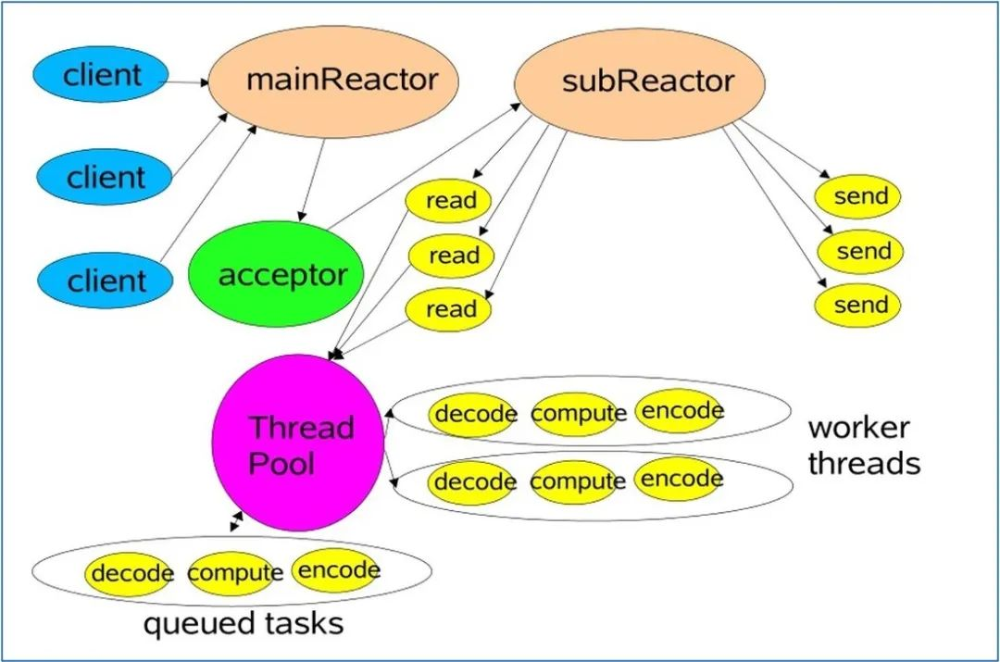
      - Multi-Reactor模型的原理如下：
        - mainReactor主要负责接收客户端的连接请求，建立新连接，接收完连接后mainReactor就会按照一定的负载均衡策略分发给其中一个subReactor进行管理。~~
        - subReactor会将新的客户端连接进行管理，负责后续该客户端的请求处理。
        - 通常Reactor线程主要负责IO的操作(数据读写)、而业务逻辑的处理会由专门的工作线程来执行。
      - 此处所指的Reactor，以epoll为例可以简单理解成一个Reactor对应于一个epoll对象，由一个线程进行处理，Reactor线程又称为IO线程。
    - netpoll server端内部结构
      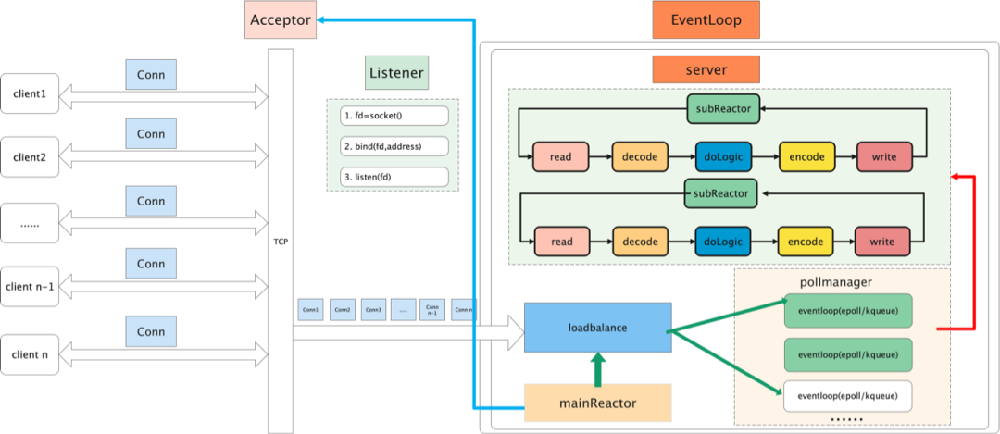
      - Listener:主要用来初始化Listener，内部调用标准库的net.Listen()，然后再封装了一层。具体的实现则是调用socket()、bind()、listen()等系统调用。
      - EventLoop:框架对外提供的接口，对外暴露Serve()方法来创建server端程序。
      - Poll: 是抽象出的一套接口，屏蔽底层不同操作系统平台接口的差异，linux下采用epoll来实现、bsd平台下则采用kqueue来实现。
      - pollmanager:Poll的管理器，可以理解成一个Poll池，也就是一组epoll或者kqueue集合。
      - loadbalance:负责均衡封装，主要用来从pollmanager按照一定的策略(随机、轮询、最小连接等)选择出来一个Poll实例，一般在客户端初始化完成后，server会调用该接口拿到一个Poll实例，并将新建立的客户端加入到Poll管理。 

- [golang 中是如何对 epoll 进行封装的](https://mp.weixin.qq.com/s/ey9Xb8B0WTg0nXAtya3SLQ)
  - 在 golang net 的 listen 中，会完成如下几件事：
    - 创建 socket 并设置非阻塞，
    - bind 绑定并监听本地的一个端口
    - 调用 listen 开始监听
    - epoll_create 创建一个 epoll 对象
    - epoll_etl 将 listen 的 socket 添加到 epoll 中等待连接到来
  - Accept 的调用了。该函数主要做了三件事
    - 调用 accept 系统调用接收一个连接
    - 如果没有连接到达，把当前协程阻塞掉
    - 新连接到来的话，将其添加到 epoll 中管理，然后返回
  - Write 的大体过程和 Read 是类似的。先是调用 Write 系统调用发送数据，如果内核发送缓存区不足的时候，就把自己先阻塞起来，然后等可写时间发生的时候再继续发送。其源码入口位于 net/  net.go。
  - 前面我们讨论的很多步骤里都涉及到协程的阻塞。例如 Accept 时如果新连接还尚未到达。再比如像 Read 数据的时候对方还没有发送，当前协程都不会占着 cpu 不放，而是会阻塞起来。
    那么当要等待的事件就绪的时候，被阻塞掉的协程又是如何被重新调度的呢？相信大家一定会好奇这个问题。
    - Go 语言的运行时会在调度或者系统监控中调用 sysmon，它会调用 netpoll，来不断地调用 epoll_wait 来查看 epoll   对象所管理的文件描述符中哪一个有事件就绪需要被处理了。如果有，就唤醒对应的协程来进行执行。

- always discard body e.g. io.Copy(ioutil.Discard, resp.Body) if you don't use it
  - HTTP client's Transport will not reuse connections unless the body is read to completion and closed
   ```go
   res, _ := client.Do(req)
   io.Copy(ioutil.Discard, res.Body)
   defer res.Body.Close()
   ```
     
   ```go
   // https://github.com/hashicorp/go-retryablehttp/blob/master/client.go
   // Try to read the response body so we can reuse this connection.
   func (c *Client) drainBody(body io.ReadCloser) {
       defer body.Close()
       _, err := io.Copy(ioutil.Discard, io.LimitReader(body, respReadLimit))
       if err != nil {
           if c.logger() != nil {
               switch v := c.logger().(type) {
               case LeveledLogger:
                   v.Error("error reading response body", "error", err)
               case Logger:
                   v.Printf("[ERR] error reading response body: %v", err)
               }
           }
       }
   }
   ```
- Q: golang的net如何对于epoll进行封装，使用上看似通过过程呢
  - 所有的网络操作以网络描述符netFD为中心实现，netFD与底层PollDesc结构绑定，当在一个netFD上读写遇到EAGAIN的错误的时候，把当前goroutine存储到这个netFD对应的PollDesc中，同时把goroutine给park 直到这个netFD发生读写事件，才将该goroutine激活重新开始。在底层通知goroutine再次发生读写事件的方式就是epoll事件驱动机制。
- Q: 为什么 gnet 会比 Go 原生的 net 包更快？
  - Multi-Reactors 模型相较于 Go 原生模型在以下场景具有性能优势：
    - 1. 高频创建新连接：我们从源码里可以知道 Go 模式下所有事件都是在一个 epoll 实例来管理的，接收新连接和 IO 读写；而在 Reactors 模式下，accept 新连接和 IO 读写分离，它们在各自独立的 goroutines 里用自己的 epoll 实例来管理网络事件。
    - 2. 海量网络连接：Go net 处理网络请求的模式是 goroutine per connection，甚至是 multiple goroutines per connection，而 gnet 一般使用与机器 CPU 核心数相同的 goroutines 来处理网络请求，所以在海量网络连接的场景下 gnet 更节省系统资源，进而提高性能。
    - 3. 时间窗口内连接总数大而活跃连接数少：这种场景下，Go 原生网络模型因为 goroutine per connection 模式，依然需要维持大量的 goroutines 去等待 IO 事件(保持 1:1 的关系)，Go scheduler 对大量 idle goroutines 的调度势必会损耗系统整体性能；而 gnet 模式下需要维护的仅仅是与 CPU 核心数相同的 goroutines，而且得益于 Reactors 模型和 epoll/kqueue，可以确保每个 goroutine 在大多数时间里都是在处理活跃连接。
    - 4. 短连接场景：gnet 内部维护了一个内存池，在短连接这种场景下，可以大量复用内存，进一步节省资源和提高性能。
  - gnet - Servers can utilize the SO_REUSEPORT 3 option which allows multiple sockets on the same host to bind to the same port and the OS kernel takes care of the load balancing for you, it wakes one socket per accpet event coming to resolved the thundering herd

- Q: Go 的网络模型有『惊群效应』吗？
  - 没有。 我们看下源码里是怎么初始化 listener 的 epoll 示例的：
    ```go
    var serverInit sync.Once
    
    func (pd *pollDesc) init(fd *FD) error {
        serverInit.Do(runtime_pollServerInit)
        ctx, errno := runtime_pollOpen(uintptr(fd.Sysfd))
    ```
    这里用了 sync.Once 来确保初始化一次 epoll 实例，这就表示一个 listener 只持有一个 epoll 实例来管理网络连接，既然只有一个 epoll 实例，当然就不存在『惊群效应』了
- [TCP/IP协议精华指南](https://mp.weixin.qq.com/s?__biz=MzkyMTIzMTkzNA==&mid=2247513631&idx=1&sn=9d1feccc4770cfe3ae1db1866b9a3ada&chksm=c184414ef6f3c858cf99b478473e716dd75a5304c8fbf2d28ac36e0071ad8693cd5469e8a727&scene=21#wechat_redirect)
  - 关于TCP option扩展为什么最大是40字节。
    - Data offset占4位，所以是2^4-1=15。每个单位代表4字节，所以是15*4=60字节，也就是TCP头部最大可以到60字节。
    - 基本TCP头部要20字节，所以TCP options是最大40字节。
  - 关于为什么最多只能放4个SACK块：
    - SACK是这样的:
       - 1个字节的kind:SACK
       - 1个字节的SACK长度
       - 8个字节的SACK块
    - 40-1-1=38, 而38mod8=4，所以最多放4个SACK块。
- [彻底弄懂TCP协议](https://mp.weixin.qq.com/s/_h2YPloSh3TQcAccHVc8Rg)
  - TCP 的三次握手、四次挥手
    - TCP 进行握手初始化一个连接的目标是：分配资源、初始化序列号(通知 peer 对端我的初始序列号是多少)，知道初始化连接的目标
    - 当 Peer 两端同时发起 SYN 来建立连接的时候，就出现了四次握手来建立连接(对于有些 TCP/IP 的实现，可能不支持这种同时打开的情况)
    - TCP 进行断开连接的目标是：回收资源、终止数据传输。
    - 由于 TCP 是全双工的，需要 Peer 两端分别各自拆除自己通向 Peer 对端的方向的通信信道。这样需要四次挥手来分别拆除通信信道
  - TCP 连接的初始化序列号能否固定
    - 被链路上的路由器缓存了(路由器会毫无先兆地缓存或者丢弃任何的数据包), 导致链接重用的情况
    - RFC793 中，建议 ISN 和一个假的时钟绑在一起，这个时钟会在每 4 微秒对 ISN 做加一操作，直到超过 2^32，又从 0 开始，这需要 4 小时才会产生 ISN 的回绕问题
    - 这种递增方式的 ISN，很容易让攻击者猜测到 TCP 连接的 ISN，现在的实现大多是在一个基准值的基础上进行随机的
  - 初始化连接的 SYN 超时问题
    - Linux 下默认会进行 5 次重发 SYN-ACK 包
    - SYN 超时需要 63 秒，那么就给攻击者一个攻击服务器的机会，攻击者在短时间内发送大量的 SYN 包给 Server(俗称 SYN flood 攻击)，用于耗尽 Server 的 SYN 队列
    - 对于应对 SYN 过多的问题，linux 提供了几个 TCP 参数：tcp_syncookies、tcp_synack_retries、tcp_max_syn_backlog、tcp_abort_on_overflow 来调整应对。
  - TCP 的 Peer 两端同时断开连接
    - TCP 的 Peer 两端同时发起 FIN 包进行断开连接，那么两端 Peer 可能出现完全一样的状态转移 FIN_WAIT1——>CLOSEING——->TIME_WAIT，也就会 Client 和 Server 最后同时进入 TIME_WAIT 状态。
  - 四次挥手能不能变成三次挥手呢
    - 答案是可能的。如果 Server 在收到 Client 的 FIN 包后，在也没数据需要发送给 Client 了，那么对 Client 的 ACK 包和 Server 自己的 FIN 包就可以合并成为一个包发送过去，这样四次挥手就可以变成三次了
  - TCP 的头号疼症 TIME_WAIT 状态
    - Peer 两端，哪一端会进入 TIME_WAIT 呢？为什么?
      - TCP 主动关闭连接的那一方会最后进入 TIME_WAIT。 
      - 据 TCP 协议规范，不对 ACK 进行 ACK，如果主动关闭方不进入 TIME_WAIT，那么主动关闭方在发送完 ACK 就走了的话，如果最后发送的 ACK 在路由过程中丢掉了，最后没能到被动关闭方，这个时候被动关闭方没收到自己 FIN 的 ACK 就不能关闭连接，接着被动关闭方会超时重发 FIN 包，但是这个时候已经没有对端会给该 FIN 回 ACK，被动关闭方就无法正常关闭连接了，所以主动关闭方需要进入 TIME_WAIT 以便能够重发丢掉的被动关闭方 FIN 的 ACK。
    - TIME_WAIT 状态是用来解决或避免什么问题呢？
      - 主动关闭方需要进入 TIME_WAIT 以便能够重发丢掉的被动关闭方 FIN 包的 ACK。
        - RST 包 connect reset by peer
        - Broken pipe，在收到 RST 包的时候，还往这个连接写数据，就会收到 Broken pipe 错误了
      - 防止已经断开的连接 1 中在链路中残留的 FIN 包终止掉新的连接 2(重用了连接 1 的所有的 5 元素(源 IP，目的 IP，TCP，源端口，目的端口)），这个概率比较低，因为涉及到一个匹配问题，迟到的 FIN 分段的序列号必须落在连接 2 的一方的期望序列号范围之内，虽然概率低
      - 防止链路上已经关闭的连接的残余数据包(a lost duplicate packet or a wandering duplicate packet) 干扰正常的数据包，造成数据流的不正常。
    - TIME_WAIT 会带来哪些问题呢？
      - 一个连接进入 TIME_WAIT 状态后需要等待 2*MSL(一般是 1 到 4 分钟)那么长的时间才能断开连接释放连接占用的资源，会造成以下问题
        - 作为服务器，短时间内关闭了大量的 Client 连接，就会造成服务器上出现大量的 TIME_WAIT 连接，占据大量的 tuple，严重消耗着服务器的资源。
        - 作为客户端，短时间内大量的短连接，会大量消耗的 Client 机器的端口，毕竟端口只有 65535 个，端口被耗尽了，后续就无法在发起新的连接了。
    - TIME_WAIT 的快速回收和重用
      - TIME_WAIT 快速回收
        - linux 下开启 TIME_WAIT 快速回收需要同时打开 tcp_tw_recycle 和 tcp_timestamps(默认打开)两选项
        - 在一个 NAT 后面的所有 Peer 机器在 Server 看来都是一个机器，NAT 后面的那么多 Peer 机器的系统时间戳很可能不一致，有些快，有些慢。这样，在 Server 关闭了与系统时间戳快的 Client 的连接后，在这个连接进入快速回收的时候，同一 NAT 后面的系统时间戳慢的 Client 向 Server 发起连接，这就很有可能同时满足上面的三种情况，造成该连接被 Server 拒绝掉。所以，在是否开启 tcp_tw_recycle 需要慎重考虑了
      - TIME_WAIT 重用
        - 只要满足下面两点中的一点，一个 TW 状态的四元组(即一个 socket 连接)可以重新被新到来的 SYN 连接使用。
          - 新连接 SYN 告知的初始序列号比 TIME_WAIT 老连接的末序列号大；
          - 如果开启了 tcp_timestamps，并且新到来的连接的时间戳比老连接的时间戳大。
        - 要同时开启 tcp_tw_reuse 选项和 tcp_timestamps 选项才可以开启 TIME_WAIT 重用，还有一个条件是：重用 TIME_WAIT 的条件是收到最后一个包后超过 1s
        - 但是如果 Client 做了 bind 端口那就是同个端口了。时间戳重用 TIME_WAIT 连接的机制的前提是 IP 地址唯一性，得出新请求发起自同一台机器，但是如果是 NAT 环境下就不能这样保证了，于是在 NAT 环境下，TIME_WAIT 重用还是有风险的。
      - tcp_tw_reuse vs SO_REUSEADDR
        - tcp_tw_reuse 是内核选项，而 SO_REUSEADDR 用户态的选项
        - SO_REUSEADDR 是告诉内核，如果端口忙，但 TCP 状态位于 TIME_WAIT，可以重用端口。如果端口忙，而 TCP 状态位于其他状态，重用端口时依旧得到一个错误信息，指明 Address already in use
    - 清掉 TIME_WAIT 的奇技怪巧
      - 修改 tcp_max_tw_buckets
        - tcp_max_tw_buckets 控制并发的 TIME_WAIT 的数量，默认值是 180000。如果超过默认值，内核会把多的 TIME_WAIT 连接清掉，然后在日志里打一个警告。官网文档说这个选项只是为了阻止一些简单的 DoS 攻击，平常不要人为的降低它。
      - 利用 RST 包从外部清掉 TIME_WAIT 链接
        - 根据 TCP 规范，收到任何的发送到未侦听端口、已经关闭的连接的数据包、连接处于任何非同步状态（LISTEN,SYS-SENT,SYN-RECEIVED）并且收到的包的 ACK 在窗口外，或者安全层不匹配，都要回执以 RST 响应(而收到滑动窗口外的序列号的数据包，都要丢弃这个数据包，并回复一个 ACK 包)，内核收到 RST 将会产生一个错误并终止该连接。我们可以利用 RST 包来终止掉处于 TIME_WAIT 状态的连接，其实这就是所谓的 RST 攻击了。
        - 利用 IP_TRANSPARENT 这个 socket 选项，它可以 bind 不属于本地的地址，因此可以从任意机器绑定 Client 地址以及端口 port1，然后向 Server 发起一个连接，Server 收到了窗口外的包于是响应一个 ACK，这个 ACK 包会路由到 Client 处。
        - 提前终止 TIME_WAIT 状态是可能会带来(问题二)中说的三点危害，具体的危害情况可以看下 RFC1337。RFC1337 中建议，不要用 RST 过早的结束 TIME_WAIT 状态。
  - TCP 的延迟确认机制
    - 如果收到了按序的两个包，那么只要对第二包做确认即可，这样也能省去一个 ACK 消耗。由于 TCP 协议不对 ACK 进行 ACK 的，RFC 建议最多等待 2 个包的积累确认，这样能够及时通知对端 Peer，我这边的接收情况
  - TCP 的重传机制以及重传的超时计算
    - 一个数据包从发出去到回来的时间 RTT——Round Trip Time，那么根据这个 RTT 我们就可以方便设置 TimeOut——RTO（Retransmission TimeOut）
      ```shell
      [1] 首先采样计算RTT值
      [2] 然后计算平滑的RTT，称为Smoothed Round Trip Time (SRTT)，SRTT = ( ALPHA * SRTT ) + ((1-ALPHA) * RTT)
      [3] RTO = min[UBOUND,max[LBOUND,(BETA*SRTT)]]
      
      演进
      SRTT = SRTT + α (RTT – SRTT)  —— 计算平滑RTT
      DevRTT = (1-β)*DevRTT + β*(|RTT-SRTT|) ——计算平滑RTT和真实的差距（加权移动平均）
      RTO= µ * SRTT + ∂ *DevRTT —— 神一样的公式
      （其中：在Linux下，α = 0.125，β = 0.25， μ = 1，∂ = 4 ——这就是算法中的“调得一手好参数”，nobody knows why, it just works…） 最后的这个算法在被用在今天的TCP协议中并工作非常好
      ```
    - Fast Retransmit(快速重传)的算法，就是在连续收到 3 次相同确认号的 ACK，那么就进行重传
    - Selective Acknowledgment(SACK，选择确认)机制
  - TCP 的流量控制
  - TCP 的拥塞控制
  - 系统调用 listen() 的 backlog 参数指的是什么
    - SYN 半连接队列的作用
      - 对于 SYN 半连接队列的大小是由（/proc/sys/net/ipv4/tcp_max_syn_backlog）这个内核参数控制的，有些内核似乎也受 listen 的 backlog 参数影响，取得是两个值的最小值。当这个队列满了，Server 会丢弃新来的 SYN 包，而 Client 端在多次重发 SYN 包得不到响应而返回（connection time out）错误。
    - accept 连接队列
      - accept 连接队列的大小是由 backlog 参数和（/proc/sys/net/core/somaxconn）内核参数共同决定，取值为两个中的最小值。当 accept 连接队列满了，协议栈的行为根据（/proc/sys/net/ipv4/tcp_abort_on_overflow）内核参数而定
      - 如果 tcp_abort_on_overflow=1，server 在收到 SYN_ACK 的 ACK 包后，协议栈会丢弃该连接并回复 RST 包给对端，这个是 Client 会出现(connection reset by peer)错误。
      - 如果 tcp_abort_on_overflow=0，server 在收到 SYN_ACK 的 ACK 包后，直接丢弃该 ACK 包。这个时候 Client 认为连接已经建立了，一直在等 Server 的数据，直到超时出现 read timeout 错误。
- [全网显示 IP 归属地](https://mp.weixin.qq.com/s/GhMshlpjqLsZmEES8wDRHA)
  - 如何通过 IP 找到地址 - 通过自治系统（Autonomous System）
    - IP地址 -> 地址块 -> 自治网络编码（ASN） -> 组织 -> 国家。
    - 可以根据 IP 地址定位到 ASN 所属组织，而 ASN 所属组织在进行 IP 地址分配的时候，都是会进行 IP 地址分配记录的。
  - IP 地址的隐私问题
    - 百度地图会一直用 App SDK 以及网页的方式记录 IP 和地址位置的关联，并允许反向查询，也就是可以根据 IP 地址反向查询到某个位置，这个数据精度可能精确到几百米。
    - 可以用 VPN 改变 IP，那是不是某些 App 就不知道我的精确位置了呀？其实并不是的，因为你的邻居可以出卖了你
- [TCP两次挥手，你见过吗？那四次握手呢](https://mp.weixin.qq.com/s/Z0EqSihRaRbMscrZJl-zxQ)
  - TCP是个面向连接的、可靠的、基于字节流的传输层通信协议
  - TCP四次挥手
    - FIN一定要程序执行close()或shutdown()才能发出吗？
      - 不一定。一般情况下，通过对socket执行 close() 或 shutdown() 方法会发出FIN。
      - 但实际上，只要应用程序退出，不管是主动退出，还是被动退出（因为一些莫名其妙的原因被kill了）, 都会发出 FIN。
      - FIN 是指"我不再发送数据"，因此shutdown() 关闭读不会给对方发FIN, 关闭写才会发FIN
    - 如果机器上FIN-WAIT-2状态特别多，是为什么
      - 当机器上FIN-WAIT-2状态特别多，那一般来说，另外一台机器上会有大量的 CLOSE_WAIT. 一般是因为对端一直不执行close()方法发出第三次挥手。
    - 主动方在close之后收到的数据，会怎么处理
      - 如果当前连接对应的socket的接收缓冲区有数据，会发RST。
      - 如果发送缓冲区有数据，那会等待发送完，再发第一次挥手的FIN
    - [close vs shutdown](https://stackoverflow.com/a/51528639/3011380)
      - Close()的含义是，此时要同时关闭发送和接收消息的功能
      - 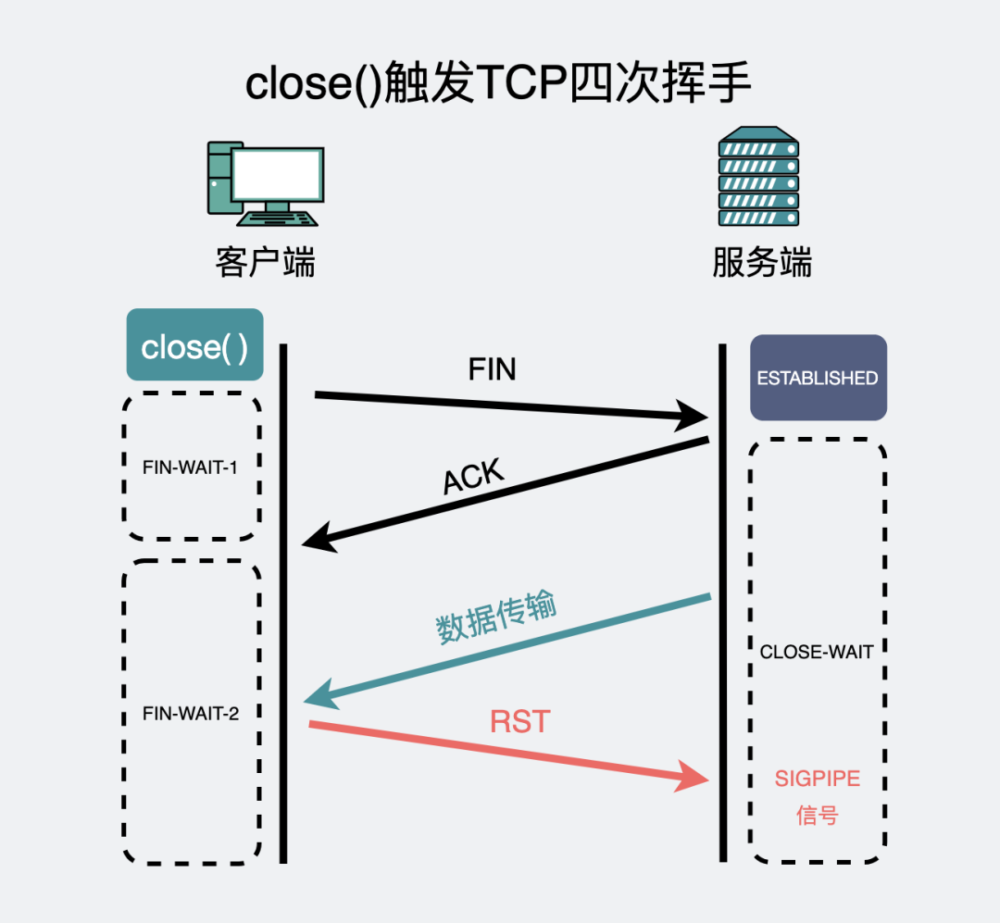
      - shutdown is a flexible way to block communication in one or both directions. When the second parameter is SHUT_RDWR, it will block both sending and receiving
      - 如果能做到只关闭发送消息，不关闭接收消息的功能，那就能继续收消息了。这种 half-close 的功能，通过调用shutdown() 方法就能做到
      - 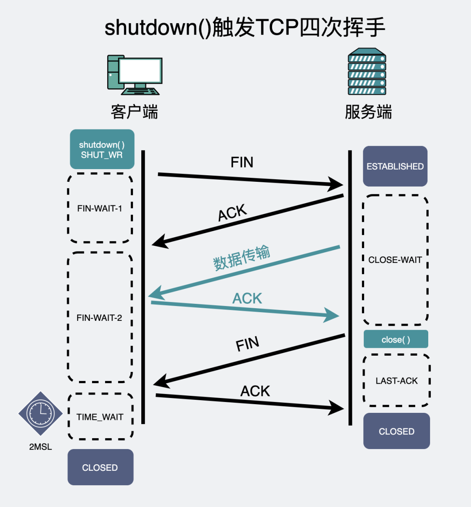
      - [Some opinion of rules would be:](https://stackoverflow.com/questions/4160347/close-vs-shutdown-socket)
        - Consider shutdown before close when possible
        - If you finished receiving (0 size data received) before you decided to shutdown, close the connection after the last send (if any) finished.
        - If you want to close the connection normally, shutdown the connection (with SHUT_WR, and if you don't care about receiving data after this point, with SHUT_RD as well), and wait until you receive a 0 size data, and then close the socket.
        - In any case, if any other error occurred (timeout for example), simply close the socket.
    - 怎么知道对端socket执行了close还是shutdown
      - 不管主动关闭方调用的是close()还是shutdown()，对于被动方来说，收到的就只有一个FIN
      - 第二次挥手和第三次挥手之间，如果被动关闭方想发数据，那么在代码层面上，就是执行了 send() 方法. send() 会把数据拷贝到本机的发送缓冲区。如果发送缓冲区没出问题，都能拷贝进去，所以正常情况下，send()一般都会返回成功
      - 然后被动方内核协议栈会把数据发给主动关闭方。
        - 如果上一次主动关闭方调用的是shutdown(socket_fd, SHUT_WR)。那此时，主动关闭方不再发送消息，但能接收被动方的消息，一切如常，皆大欢喜。
        - 如果上一次主动关闭方调用的是close()。那主动方在收到被动方的数据后会直接丢弃，然后回一个RST。
          - 被动方内核协议栈收到了RST，会把连接关闭。但内核连接关闭了，应用层也不知道（除非被通知）
          - 此时被动方应用层接下来的操作，无非就是读或写。
            - 如果是读，则会返回RST的报错，也就是我们常见的Connection reset by peer。
            - 如果是写，那么程序会产生SIGPIPE信号，应用层代码可以捕获并处理信号，如果不处理，则默认情况下进程会终止，异常退出。
      - 总结
        - 当被动关闭方 recv() 返回EOF时，说明主动方通过 close()或 shutdown(fd, SHUT_WR) 发起了第一次挥手。
        - 如果此时被动方执行两次 send()。
          - 第一次send(), 一般会成功返回。
          - 第二次send()时。如果主动方是通过 shutdown(fd, SHUT_WR) 发起的第一次挥手，那此时send()还是会成功。如果主动方通过 close()发起的第一次挥手，那此时会产生SIGPIPE信号，进程默认会终止，异常退出。不想异常退出的话，记得捕获处理这个信号。
    - 如果被动方一直不发第三次挥手，会怎么样
      - 第三次挥手，是由被动方主动触发的，比如调用close()。如果由于代码错误或者其他一些原因，被动方就是不执行第三次挥手
      - 主动方会根据自身第一次挥手的时候用的是 close() 还是 shutdown(fd, SHUT_WR) ，有不同的行为表现
        - 如果是 shutdown(fd, SHUT_WR) ，说明主动方其实只关闭了写，但还可以读，此时会一直处于 FIN-WAIT-2， 死等被动方的第三次挥手。
        - 如果是 close()， 说明主动方读写都关闭了，这时候会处于 FIN-WAIT-2一段时间，这个时间由 net.ipv4.tcp_fin_timeout 控制，一般是 60s，这个值正好跟2MSL一样 。超过这段时间之后，状态不会变成 `TIME-WAIT`，而是直接变成`CLOSED`。
      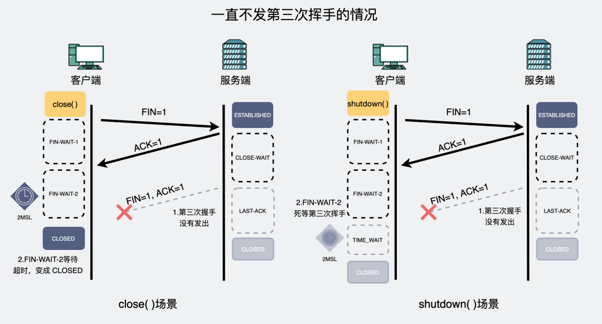
  - TCP三次挥手
    - 在第一次挥手之后，如果被动方没有数据要发给主动方。第二和第三次挥手是有可能合并传输的。这样就出现了三次挥手
    - 如果有数据要发，就不能是三次挥手了吗
      - 并不是。TCP中还有个特性叫延迟确认。可以简单理解为：接收方收到数据以后不需要立刻马上回复ACK确认包
      - 不是每一次发送数据包都能对应收到一个 ACK 确认包，因为接收方可以合并确认。而这个合并确认，放在四次挥手里，可以把第二次挥手、第三次挥手，以及他们之间的数据传输都合并在一起发送。因此也就出现了三次挥手
  - TCP两次挥手
    - 但如果TCP连接的两端，IP+端口是一样的情况下，那么在关闭连接的时候，也同样做到了一端发出了一个FIN，也收到了一个 ACK，只不过正好这两端其实是同一个socket
    - 这种两端IP+端口都一样的连接，叫TCP自连接
    - 一个socket能建立连接？
      - `nc -p 6666 127.0.0.1 6666`
      - 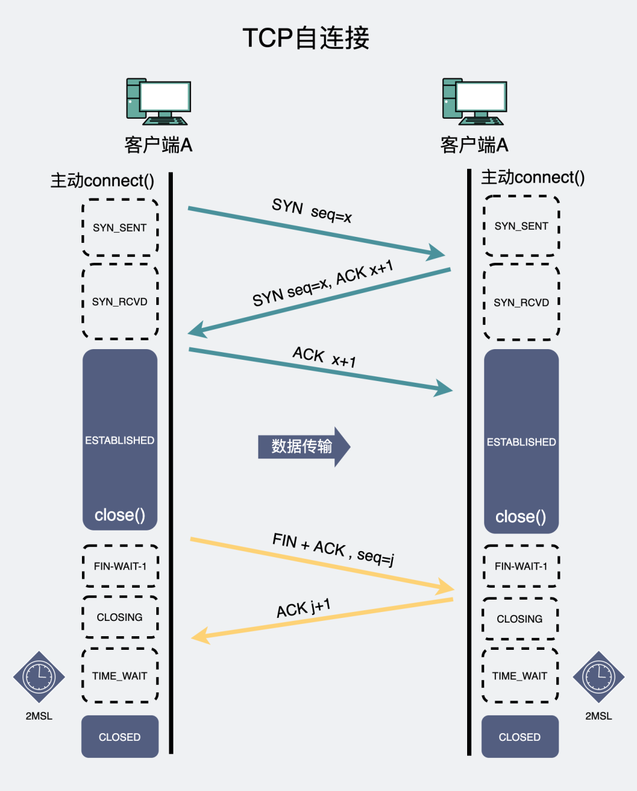
      - 一端发出第一次握手后，如果又收到了第一次握手的SYN包，TCP连接状态会怎么变化？
        - 第一次握手过后，连接状态就变成了SYN_SENT状态。如果此时又收到了第一次握手的SYN包，那么连接状态就会从SYN_SENT状态变成SYN_RCVD
      - 一端发出第二次握手后，如果又收到第二次握手的SYN+ACK包，TCP连接状态会怎么变化？
        - 第二握手过后，连接状态就变为SYN_RCVD了，此时如果再收到第二次握手的SYN+ACK包。连接状态会变为ESTABLISHED。
      - 一端第一次挥手后，又收到第一次挥手的包，TCP连接状态会怎么变化？
        - 第一次挥手过后，一端状态就会变成 FIN-WAIT-1。正常情况下，是要等待第二次挥手的ACK。但实际上却等来了 一个第一次挥手的 FIN包， 这时候连接状态就会变为CLOSING。
        - CLOSING 很少见，除了出现在自连接关闭外，一般还会出现在TCP两端同时关闭连接的情况下。
        - 处于CLOSING状态下时，只要再收到一个ACK，就能进入 TIME-WAIT 状态，然后等个2MSL，连接就彻底断开了。这跟正常的四次挥手还是有些差别的。大家可以滑到文章开头的TCP四次挥手再对比下。
      - 自连接的解决方案
        - 只要能保证客户端和服务端的端口不一致就行 `cat /proc/sys/net/ipv4/ip_local_port_range`
        - 参考golang标准网络库的实现，在连接建立完成之后判断下IP和端口是否一致，如果遇到自连接，则断开重试。
- [TCP握手和挥手的ACK为什么要加一](https://mp.weixin.qq.com/s/7dvs4k3zJDXzt8qA-vTYBA)
  - TCP在传输阶段的确认号是收到的报文的序列号加上载荷长度，也就是ack = seq + len。可是为什么在握手阶段，ack号是seq +len +1（或者说是seq+1，因为len=0）的呢？
  - TCP/IP详解（卷一）
    - 两端需要用“序列号加一”这个动作来表示对SYN标志位的确认。同样的道理，在TCP挥手阶段，确认号也是要加一的，也就是表示对FIN标志位的确认。
  - 挥手阶段的确认号需要“加一”，这样就可以把对FIN的ACK和之前的普通ACK区分开，避免迟到的ACK报文被认为是对FIN的ACK。而握手也跟挥手一样，采用了相同的做法。
- [网络基础与性能优化](https://mp.weixin.qq.com/s/9iVzwgpGBm3vZ5ObRFwK5g)
  - 常用的网络性能指标
    - 带宽：表示链路的最大传输速率，单位通常为 b/s （比特 / 秒）
    - 吞吐量：表示单位时间内成功传输的数据量，单位通常为 b/s（比特 / 秒）或者 B/s（字节 / 秒）
    - 延时：表示从网络请求发出后，一直到收到远端响应，所需要的时间延迟。在不同场景中，这一指标可能会有不同含义。比如，它可以表示，建立连接需要的时间（比如 TCP 握手延时），或一个数据包往返所需的时间（比如 RTT）
    - PPS：Packet Per Second（包 / 秒），表示以网络包为单位的传输速率。PPS 通常用来评估网络的转发能力基于 Linux 服务器的转发，则容易受网络包大小的影响。
    - 并发连接数：TCP 可以连接多少
    - 丢包率：丢包占总包的比重
    - 重传率：重新传输的网络包比例
  - Tool
    - route：用于显示和操作 IP 路由表，通过目标地址 ip 和子网掩码可以分析出发包路径
      - #route -n 查看路由表
      - ip route 用ip命令查看和操作IP路由的一些信息
    - sar -n DEV：显示网络信息，用 sar 分析网络更多的是用于流量和包量的检测和异常发现
    - nmap：用于网络探测和安全审核的工具
      ```shell
      nmap <target ip1 address> <target ip2 address> #快速扫描多个ip地址
      nmap -p(range) <target IP>    #指定端口和范围
      ```
    - iperf 是常用的网络性能测试工具，用来测试 TCP 和 UDP 的吞吐量，以客户端和服务器通信的方式，测试一段时间内的平均吞吐量 - 在服务器执行iperf -s 表示启动服务端，-i 表示汇报间隔，-p 表示监听端口
  - TCP 选项
    - SO_LINGER
      - 指定函数 close 对面向连接的协议如何操作，内核缺省 close 操作是立即返回，如果有数据残留在套接口缓冲区中则系统将试着将这些数据发送给对方。
      - 设置 l_onoff 为 0，则关闭 linger，close 直接返回，未发送数据将由内核完成传输
      - 设置 l_onoff 为非 0，l_linger 为 0，则打开 linger，则立即关闭该连接，通过发送 RST 分组 (而不是用正常的 FIN|ACK|FIN|ACK 四个分组) 来关闭该连接。如果发送缓冲区中如果有未发送完的数据，则丢弃。主动关闭一方的 TCP 状态则跳过 TIMEWAIT，直接进入 CLOSED
      - 设置 l_onoff 为非 0，l_linger 为非 0，将连接的关闭设置一个超时。如果 socket 发送缓冲区中仍残留数据，进程进入睡眠，内核进入定时状态去尽量去发送这些数据。在超时之前，如果所有数据都发送完且被对方确认，内核用正常的 FIN|ACK|FIN|ACK 四个分组来关闭该连接，close() 成功返回。如果超时之时，数据仍然未能成功发送及被确认，用上面的方式来关闭此连接。close() 返回 EWOULDBLOCK
      - 四次挥手断开连接主动关闭方会进入 TIME_WAIT 状态，TIME_WAIT 状态非常多的话会导致系统负载较大 (TIME_WAIT 本身不占用资源，但是处理 TIME_WAIT 需要耗费资源)，故可以通过设置打开 linger 则直接发送 RST 分组，这种情况不会产生 TIME_WAIT。
    - SO_REUSEADDR
      - 通常一个端口释放后会等待两分钟 (TIME_WAIT 时间) 之后才能再被使用，SO_REUSEADDR 是让端口释放后立即就可以被再次使用。
      - SO_REUSEADDR 用于对 TCP 套接字处于 TIME_WAIT 状态下的 socket，才可以重复绑定使用。server 程序总是应该在调用 bind() 之前设置 SO_REUSEADDR 套接字选项。在 TCP 连接中，主动关闭方会进入 TIME_WAIT 状态，因此这个功能也就是主动方收到被动方发送的 FIN 后，发送 ACK 后就可以断开连接，不再去处理该 ACK 丢失等情况。
    - TCP_NODELAY/TCP_CHORK
      - TCP_NODELAY 和 TCP_CHORK 都禁掉了 Nagle 算法，行为需求有些不同：
        - TCP_NODELAY 不使用 Nagle 算法，不会将小包进行拼接成大包再进行发送，而是直接将小包发送出去
        - TCP_CORK 适用于需要传送大量数据时，可以提高 TCP 的发行效率。设置 TCP_CORK 后将每次尽量发送最大的数据量，当然也有一个阻塞时间，当阻塞时间到的时候数据会自动传送
    - TCP_DEFER_ACCPT
      - 推迟接收，设置该选项后，服务器接收到第一个数据后，才会建立连接。(可以用来防范空连接攻击)
      - 当设置该选项后，服务器收到 connect 完成 3 次握手后，服务器仍然是 SYN_RECV，而不是 ESTABLISHED 状态，操作系统不会接收数据，直至收到一个数据才会进行 ESTABLISHED 状态。因此如果客户一直没有发送数据，则服务器会重传 SYN/ACK 报文，会有重传次数和超时值的限制。
    - SO_KEEPALIVE
      - SO_KEEPALIVE 保持连接检测对方主机是否崩溃，避免（服务器）永远阻塞于 TCP 连接的输入
      - tcp_keepalive_intvl，保活探测消息的发送频率。默认值为 75s。
      - tcp_keepalive_probes，TCP 发送保活探测消息以确定连接是否已断开的次数。默认值为 9
      - tcp_keepalive_time，在 TCP 保活打开的情况下，最后一次数据交换到 TCP 发送第一个保活探测消息的时间，即允许的持续空闲时间。默认值为 7200s（2h）
    - SO_SNDTIMEO & SO_RCVTIMEO
      - SO_RCVTIMEO 和 SO_SNDTIMEO ，它们分别用来设置 socket 接收数据超时时间和发送数据超时时间。
    - buffer size
      - 增大每个套接字的缓冲区大小 net.core.optmem_max；
      - 增大套接字接收缓冲区大小 net.core.rmem_max 和发送缓冲区大小 net.core.wmem_max；
      - 增大 TCP 接收缓冲区大小 net.ipv4.tcp_rmem 和发送缓冲区大小 net.ipv4.tcp_wmem
    - backlog
      - 设置 backlog 后，系统会和 / proc/sys/net/core/somaxconn 比较，取较小值作为真正的 backlog
      - 当已连接队列满后，如果设置 tcp_abort_on_overflow 为 0 表示如果三次握手第三步的时候全连接队列满了那么 server 扔掉 client 发过来的 ack
      - 当半连接队列满后，如果启用 syncookies (net.ipv4.tcp_syncookies = 1), 新的连接不进入未完成队列, 不受影响. 否则, 服务器不在接受新的连接.
- [用了TCP协议，就一定不会丢包吗](https://mp.weixin.qq.com/s/8cXYXAHZCJMPSaaMpDqYtQ)
  - 数据包的发送流程
    - 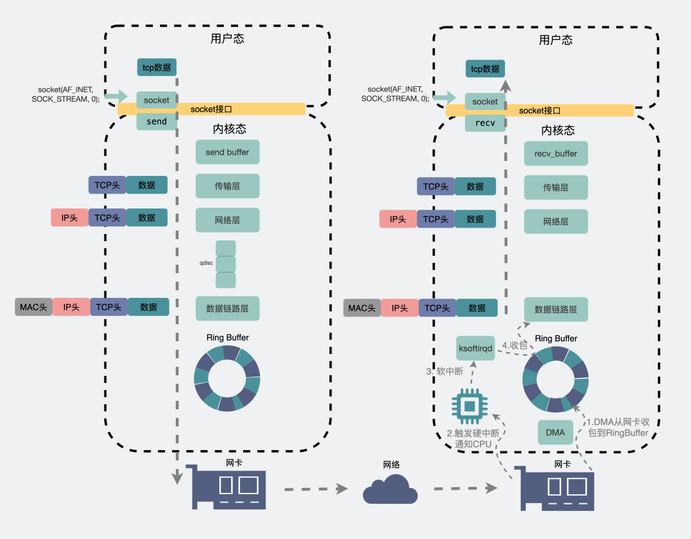
    - 消息会从聊天软件所在的用户空间拷贝到内核空间的发送缓冲区（send buffer），数据包就这样顺着传输层、网络层，进入到数据链路层，在这里数据包会经过流控（qdisc），再通过RingBuffer发到物理层的网卡。数据就这样顺着网卡发到了纷繁复杂的网络世界里。这里头数据会经过n多个路由器和交换机之间的跳转，最后到达目的机器的网卡处。
    - 目的机器的网卡会通知DMA将数据包信息放到RingBuffer中，再触发一个硬中断给CPU，CPU触发软中断让ksoftirqd去RingBuffer收包，于是一个数据包就这样顺着物理层，数据链路层，网络层，传输层，最后从内核空间拷贝到用户空间里的聊天软件里。
  - 建立连接时丢包
    - 第一次握手之后，会先建立个半连接，然后再发出第二次握手。这时候需要有个地方可以暂存这些半连接。这个地方就叫半连接队列。
    - 如果之后第三次握手来了，半连接就会升级为全连接，然后暂存到另外一个叫全连接队列的地方，坐等程序执行accept()方法将其取走使用。
    - 如果它们满了，那新来的包就会被丢弃。 可以通过下面的方式查看是否存在这种丢包行为
      - 全连接队列溢出次数 `# netstat -s | grep overflowed`
      - 半连接队列溢出次数 `# netstat -s | grep -i "SYNs to LISTEN sockets dropped"`
  - 流量控制丢包
    - 应用层能发网络数据包的软件有那么多，如果所有数据不加控制一股脑冲入到网卡，网卡会吃不消，那怎么办？让数据按一定的规则排个队依次处理，也就是所谓的qdisc(Queueing Disciplines，排队规则)，这也是我们常说的流量控制机制。
    - 我们可以通过下面的ifconfig命令查看到，里面涉及到的txqueuelen后面的数字1000，其实就是流控队列的长度。
    - 可以通过下面的ifconfig命令，查看TX下的dropped字段，当它大于0时，则有可能是发生了流控丢包。
  - 网卡丢包
    - RingBuffer过小导致丢包
      - 在接收数据时，会将数据暂存到RingBuffer接收缓冲区中，然后等着内核触发软中断慢慢收走。如果这个缓冲区过小，而这时候发送的数据又过快，就有可能发生溢出，此时也会产生丢包。
      - ifconfig 查看上面的overruns指标，它记录了由于RingBuffer长度不足导致的溢出次数。
      - 当然，用ethtool命令也能查看 `ethtool -S eth0|grep rx_queue_0_drops`
      - 但这里需要注意的是，因为一个网卡里是可以有多个RingBuffer的，所以上面的rx_queue_0_drops里的0代表的是第0个RingBuffer的丢包数，对于多队列的网卡，这个0还可以改成其他数字
    - 网卡性能不足
      - 我们可以通过ethtool加网卡名，获得当前网卡支持的最大速度 `ethtool eth0` 最大传输速度speed=1000Mb/s
      - 可以通过sar命令从网络接口层面来分析数据包的收发情况 txkB/s是指当前每秒发送的字节（byte）总数，rxkB/s是指每秒接收的字节（byte）总数
  - 接收缓冲区丢包
    - 我们一般使用TCP socket进行网络编程的时候，内核都会分配一个发送缓冲区和一个接收缓冲区。`sysctl net.ipv4.tcp_rmem`
    - 那么问题来了，如果缓冲区设置过小会怎么样
      - 对于发送缓冲区，执行send的时候，如果是阻塞调用，那就会等，等到缓冲区有空位可以发数据
      - 如果是非阻塞调用，就会立刻返回一个 EAGAIN 错误信息，意思是  Try again 。让应用程序下次再重试。这种情况下一般不会发生丢包。
      - 当接受缓冲区满了，事情就不一样了，它的TCP接收窗口会变为0，也就是所谓的零窗口，并且会通过数据包里的win=0，告诉发送端，"球球了，顶不住了，别发了"。一般这种情况下，发送端就该停止发消息了，但如果这时候确实还有数据发来，就会发生丢包。
      - 我们可以通过下面的命令里的TCPRcvQDrop查看到有没有发生过这种丢包现 `cat /proc/net/netstat`
  - 两端之间的网络丢包
    - ping命令查看丢包
      - 其实你只能知道你的机器和目的机器之间有没有丢包
    - mtr命令可以查看到你的机器和目的机器之间的每个节点的丢包情况
      - `-r是指report` 中间有一些是host是???，那个是因为mtr默认用的是ICMP包，有些节点限制了ICMP包，导致不能正常展示。
      - `mtr -r -u` 可以在mtr命令里加个-u，也就是使用udp包，就能看到部分???对应的IP
- [服务端如果只 bind 了 IP 地址和端口，而没有调用 listen 的话，然后客户端对服务端发起了连接建立，此时那么会发生什么呢](https://mp.weixin.qq.com/s/7P_1VkBeoArKuuEqGcR9ig)
  - 服务端如果只 bind 了 IP 地址和端口，而没有调用 listen 的话，然后客户端对服务端发起了连接建立，服务端会回 RST 报文。
    - Linux 内核处理收到 TCP 报文的入口函数是  tcp_v4_rcv，在收到 TCP 报文后，会调用 __inet_lookup_skb 函数找到 TCP 报文所属 socket 。
    - 查找监听套接口（__inet_lookup_listener）这个函数的实现是，根据目的地址和目的端口算出一个哈希值，然后在哈希表找到对应监听该端口的 socket。
    - 本次的案例中，服务端是没有调用 listen 函数的，所以自然也是找不到监听该端口的 socket。
    - 所以，__inet_lookup_skb 函数最终找不到对应的 socket，于是跳转到no_tcp_socket。
    - 在这个错误处理中，只要收到的报文（skb）的「校验和」没问题的话，内核就会调用 tcp_v4_send_reset 发送RST中止这个连接。
- [服务端挂了，客户端的 TCP 连接还在吗](https://mp.weixin.qq.com/s/eb8UbEcl2VftrCySY4bH3g)
  - 如果「服务端挂掉」指的是「服务端进程崩溃」，服务端的进程在发生崩溃的时候，内核会发送 FIN 报文，与客户端进行四次挥手。
    - 使用 kill -9 命令来模拟进程崩溃的情况，发现在 kill 掉进程后，服务端会发送 FIN 报文，与客户端进行四次挥手
  - 如果「服务端挂掉」指的是「服务端主机宕机」，那么是不会发生四次挥手的，具体后续会发生什么？还要看客户端会不会发送数据？
    - 当服务端的主机发生了宕机，是没办法和客户端进行四次挥手的，所以在服务端主机发生宕机的那一时刻，客户端是没办法立刻感知到服务端主机宕机了，只能在后续的数据交互中来感知服务端的连接已经不存在了。
    - 如果客户端会发送数据，由于服务端已经不存在，客户端的数据报文会超时重传，当重传总间隔时长达到一定阈值（内核会根据 tcp_retries2 设置的值计算出一个阈值）后，会断开 TCP 连接；
      - 在发生超时重传的过程中，每一轮的超时时间（RTO）都是倍数增长的
      - 而 RTO 是基于 RTT（一个包的往返时间） 来计算的，如果 RTT 较大，那么计算出来的 RTO 就越大
    - 如果客户端一直不会发送数据，再看客户端有没有开启 TCP keepalive 机制？
      - 如果有开启，客户端在一段时间没有进行数据交互时，会触发 TCP keepalive 机制，探测对方是否存在，如果探测到对方已经消亡，则会断开自身的 TCP 连接；
        - net.ipv4.tcp_keepalive_time=7200
        - net.ipv4.tcp_keepalive_intvl=75  
        - net.ipv4.tcp_keepalive_probes=9
        - web 服务软件一般都会提供 keepalive_timeout 参数，用来指定 HTTP 长连接的超时时间
      - 如果没有开启，客户端的 TCP 连接会一直存在，并且一直保持在 ESTABLISHED 状态。
- [拔掉网线后， 原本的 TCP 连接还存在吗](https://mp.weixin.qq.com/s?__biz=MzUxODAzNDg4NQ==&mid=2247504270&idx=1&sn=bce7d1e81a33c214ed210d12ee3a6b68&scene=21#wechat_redirect)
  - 客户端拔掉网线后，并不会直接影响 TCP 连接状态。所以，拔掉网线后，TCP 连接是否还会存在，关键要看拔掉网线之后，有没有进行数据传输。
  - 有数据传输的情况：
    - 在客户端拔掉网线后，如果服务端发送了数据报文，那么在服务端重传次数没有达到最大值之前，客户端就插回了网线，那么双方原本的 TCP 连接还是能正常存在，就好像什么事情都没有发生。
    - 在客户端拔掉网线后，如果服务端发送了数据报文，在客户端插回网线之前，服务端重传次数达到了最大值时，服务端就会断开 TCP 连接。等到客户端插回网线后，向服务端发送了数据，因为服务端已经断开了与客户端相同四元组的 TCP 连接，所以就会回 RST 报文，客户端收到后就会断开 TCP 连接。至此， 双方的 TCP 连接都断开了。
  - 没有数据传输的情况：
    - 如果双方都没有开启 TCP keepalive 机制，那么在客户端拔掉网线后，如果客户端一直不插回网线，那么客户端和服务端的 TCP 连接状态将会一直保持存在。
    - 如果双方都开启了 TCP keepalive 机制，那么在客户端拔掉网线后，如果客户端一直不插回网线，TCP keepalive 机制会探测到对方的 TCP 连接没有存活，于是就会断开 TCP 连接。而如果在 TCP 探测期间，客户端插回了网线，那么双方原本的 TCP 连接还是能正常存在。
- [如何使用 Wireshark 分析 TCP 吞吐瓶颈](https://mp.weixin.qq.com/s/KXPF-9f_VYRnEgIe22bxkQ)
  - Debug 网络质量的时候，我们一般会关注两个因素：延迟和吞吐量（带宽）。延迟比较好验证，Ping 一下或者 mtr 一下就能看出来。
  - 吞吐量的场景一般是所谓的长肥管道(Long Fat Networks, LFN) 比如下载大文件。吞吐量没有达到网络的上限，主要可能受 3 个方面的影响：
    - 发送端出现了瓶颈
      - 发送端出现瓶颈一般的情况是 buffer 不够大，因为发送的过程是，应用调用 syscall，将要发送的数据放到 buffer 里面，然后由系统负责发送出去
    - 接收端出现了瓶颈
    - 中间的网络层出现了瓶颈
  - TCP 为了优化传输效率
    - 保护接收端，发送的数据不会超过接收端的 buffer 大小 (Flow control)
      - 在两边连接建立的时候，会协商好接收端的 buffer 大小 (receiver window size, rwnd), 并且在后续的发送中，接收端也会在每一个 ack 回包中报告自己剩余和接受的 window 大小。
      - rwnd 查看方式
        - 这个 window size 直接就在 TCP header 里面，抓下来就能看这个字段 但是真正的 window size 需要乘以 factor, factor 是在 TCP 握手节点通过 TCP Options 协商的
    - 保护网络，发送的数据不会 overwhelming 网络 (Congestion Control, 拥塞控制), 如果中间的网络出现瓶颈，会导致长肥管道的吞吐不理想；
      - 对于网络的保护，原理也是维护一个 Window，叫做 Congestion window，拥塞窗口，cwnd, 这个窗口就是当前网络的限制，发送端不会发送超过这个窗口的容量（没有 ack 的总数不会超过 cwnd）。
      - 默认的算法是 cubic, 也有其他算法可以使用，比如 Google 的 BBR
      - 主要的逻辑是，慢启动(Slow start), 发送数据来测试，如果能正确收到 receiver 那边的 ack，说明当前网络能容纳这个吞吐，将 cwnd x 2，然后继续测试。直到下面一种情况发生：
         - 发送的包没有收到 ACK
         - cwnd 已经等于 rwnd 了
      - cwnd 查看方式
        - Congestion control 是发送端通过算法得到的一个动态变量，会试试调整，并不会体现在协议的传输数据中。所以要看这个，必须在发送端的机器上看。
        - Linux 中可以使用 ss -i 选项将 TCP 连接的参数都打印出来
  - Wireshark 分析
    - Statistics -> TCP Stream Graph -> Time Sequence(tcptrace)
    - Y 轴表示的 Sequence Number, 就是 TCP 包中的 Sequence Number，这个很关键。图中所有的数据，都是以 Sequence Number 为准的。
    - 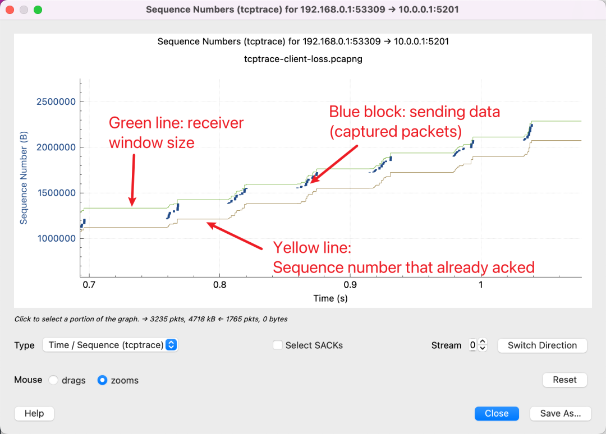
    - 几种常见的 pattern
      - 丢包
        - 
        - 很多红色 SACK，说明接收端那边重复在说：中间有一个包我没有收到，中间有一个包我没有收到。
      - 吞吐受到接收 window size 限制
        - 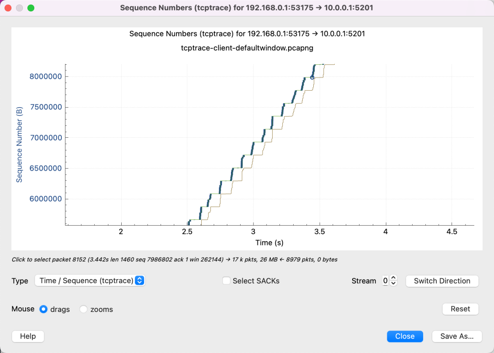
        - 从这个图可以看出，黄色的线（接收端一 ACK）一上升，蓝色就跟着上升（发送端就开始发），直到填满绿色的线（window size）。说明网络并不是瓶颈，可以调大接收端的 buffer size.
      - 吞吐受到网络质量限制
        - 
        - 从这张图中可以看出，接收端的 window size 远远不是瓶颈，还有很多空闲。
        - 放大可以看出，中间有很多丢包和重传，并且每次只发送一点点数据，这说明很有可能是 cwnd 太小了，受到了拥塞控制算法的限制。
- [弱网对抗之冗余策略](https://mp.weixin.qq.com/s/7AV6ws7IStwTbF0mla6qQw)
  - 我们可以通过一些简单基础的工具检测网络是否处于波动情况
    - ping 命令或者 Iperf 工具可以帮助统计丢包、延时以及单向抖动。我们用 ping 命令向一个远端的主机发送 ICMP 消息，远端主机会对你进行应答，这个过程中如果你发送出去的 ICMP 消息丢了，或者远端服务器应答的消息丢了，在命令行界面上，对应的 icmp_seq 就会显示超时未收到，这种情况就直观地体现了丢包。
  - 常用包恢复技术
    - 一种是发送端利用接收端通知或者超时的机制，重新将这个包发送过来；
      - 是我们熟知的自动重传请求 ARQ 技术。与 TCP 协议中的 ACK 应答机制不同，实时音视频场景使用的是 NACK 否定应答机制，通过接收端检查包序号的连续性，主动将丢失的包信息通知给发送端进行重新发送。这种方式的优点是在低延时场景下的恢复效率高，带宽利用率好，但在高延时场景下的效果比较差，存在重传风暴等情况。
    - 另一种则是基于其他收到的冗余包，在接收端将该包恢复出来。
      - Forward Error Correction (FEC) 即前向纠错编码，一种通过冗余发送对抗网络丢包的技术。它主要的技术原理就是分组编码，组内进行冗余恢复。假设每个分组由 k 个媒体包和 r 个冗余包组成，一个分组中 k+r 个数据包中任意 k 个包可以用来重建 k 个原始媒体包。这种方式的优势是根据先验知识进行冗余决策，不受延时影响。
  - 冗余策略
    - 在上述基本的包恢复技术下，为了使各种场景的整体抗弱网能力最大化，需要针对带宽分配、抗丢包技术的组合配置等进行一系列的优化，从而达到抗丢包能力、端到端延时、卡顿率、冗余率的平衡，达到“消耗最小的代价，实现最优的体验”。
    - 自适应调整策略
      - 冗余策略大致可以分为两类，一类是前向冗余，一类是被动冗余。
        - 我们知道前向冗余的优点是不需要交互，在高延时环境下更加适用，缺点是带宽占用过多。
        - 被动冗余的优点是按需发送，占用带宽较少，缺点是高延时场景效果会急剧下滑。
      - 我们的冗余策略则是在寻找一个平衡点，通过被动冗余和前向冗余策略比例的调整，在保证丢包恢复率（比如 99.5%）的前提下，尽量的减小冗余占比，尽量的减小抗丢包恢复时间。
    - 可靠重传策略 
      - 在接收端媒体缓存中，对于 seq 最新和最老范围内没有接收到的数据，接收端会发送 Nack 请求，然后发送端接收 Nack 请求，将相应的包传送过来。
    - 拥塞恢复场景下快速抑制 FEC 码率
      - 我们 FEC 使用 loss 计算 FEC 冗余率，为了防止抖动带来的剧烈变化，这个 loss 值被平滑过。但是对于一些场景，比如带宽突然掉落到较低的场景下，当拥塞状态解除后，网络丢包就会消失。这个时候，我们需要快速的抑制 FEC 码率，让出带宽给到媒体，这样可以尽快地提升画面质量。
    - 空余带宽利用优化
      - 缓升快降
        - 带宽分配过程中对每个媒体流使用的上一层传过来的空余码率进行缓升快降操作，防止高优先级码流过快让出空余带宽，导致低优先级码流的分配码率大幅波动。
      - 关键帧检测
        - 当某个媒体流开始收到关键帧的时候，降低该流让出空余带宽的量，使得整体输出码率的波动性降低。
      - 波峰检测
        - 使用 300ms 统计窗口判断波峰，出现较大的波峰数据时，降低该流让出带宽的量，减小整体输出码率的波动性。
- [MSS vs MTU](https://networkengineering.stackexchange.com/questions/8288/what-is-the-difference-between-mss-and-mtu)
  - [MTU](https://www.cloudflare.com/learning/network-layer/what-is-mtu/)
    - MTU is maximum IP packet size of a given link.
    - MTU is used for fragmentation i.e packet larger than MTU is fragmented. When two computing devices open a connection and begin exchanging packets, those packets are routed across multiple networks. It is necessary to take into account not just the MTU of the two devices at the ends of each communication, but all routers, switches, and servers in the middle as well. Packets that exceed the MTU on any point in the network path are fragmented.
    - If no fragmentation is wanted, either you have to check the MTU at each hop or use a helper protocol for that (Path MTU Discovery)
    - When is fragmentation not possible
      - IPv6 does NOT support packet fragmentation by routers, hence PMTUD with ICMPv6 is mandatory if you don't want to lose a packet somewhere because of small MTU. Endpoints can fragment, but not routers Also, IPv6 has a much higher MINIMUM MTU.
      - Fragmentation is also not possible when the "Don't Fragment" flag is activated in a packet's IP header.
    - What is path MTU discovery
      - Path MTU discovery, or PMTUD, is the process of discovering the MTU of all devices, routers, and switches on a network path.
      - IPv4: IPv4 allows fragmentation and thus includes the Don't Fragment flag in the IP header. PMTUD in IPv4 works by sending test packets along the network path with the Don't Fragment flag turned on. If any router or device along the path drops the packet, it sends back an ICMP message with its MTU. The source device lowers its MTU and sends another test packet. This process is repeated until the test packets are small enough to traverse the entire network path without being dropped.
      - IPv6: For IPv6, which does not allow fragmentation, PMTUD works in much the same way. The key difference is that IPv6 headers do not have the Don't Fragment option and so the flag is not set. Routers that support IPv6 will not fragment IPv6 packets, so if the test packets exceed the MTU, the routers drop the packets and send back corresponding ICMP messages without checking for a Don't Fragment flag. IPv6 PMTUD sends smaller and smaller test packets until the packets can traverse the entire network path, just like in IPv4.
  - [MSS](https://www.cloudflare.com/zh-cn/learning/network-layer/what-is-mss/)
    - MSS is a layer 4, or transport layer, metric. It is used with TCP, a transport layer protocol
    - Packets have several headers attached to them that contain information about their contents and destination. MSS measures the non-header portion of a packet, which is called the payload.
    - MSS is Maximum TCP segment size that a network-connected device can receive. MSS is measured in bytes
    - Packet exceeding MSS aren't fragmented, they're simply discarded.
    - MSS is normally decided in the TCP three-way handshake, both devices communicate the size of the packets they are able to receive (this can be called "MSS clamping"
    - MSS is determined by another metric that has to do with packet size: MTU
    - 
- [能ping通，TCP就一定能连通吗](https://mp.weixin.qq.com/s/fb2uUWz5ZjPEfYv_l6e4Zg)
  - 路由器可以通过OSPF协议生成路由表，利用数据包里的IP地址去跟路由表做匹配，选择最优路径后进行转发。
  - 当路由表一个都匹配不上时会走默认网关。当匹配上多个的时候，会先看匹配长度，如果一样就看管理距离，还一样就看路径成本。如果连路径成本都一样，那等价路径。如果路由开启了ECMP，那就可以同时利用这几条路径做传输。
  - ECMP可以提高链路带宽，同时利用五元组做哈希键进行路径选择，保证了同一条连接的数据包走同一条路径，减少了乱序的情况。
  - 可以通过traceroute命令查看到链路上是否有用到ECMP的情况。
  - 开启了ECMP的网络链路中，TCP和ping命令可能走的路径不同，甚至同样是TCP，不同连接之间，走的路径也不同，因此出现了连接时好时坏的问题，实在是走投无路了，可以考虑下是不是跟ECMP有关。
- [刚插上网线，电脑怎么知道自己的IP是什么](https://juejin.cn/post/7153255870447484936)
  - DHCP（Dynamic Host Configuration Protocol，动态主机配置协议）
    - 
    - DHCP Discover：在联网时，本机由于没有IP，也不知道DHCP服务器的IP地址是多少，所以根本不知道该向谁发起请求，于是索性选择广播，向本地网段内所有人发出消息，询问"谁能给个IP用用"。
    - DHCP Offer：不是DHCP服务器的机子会忽略你的广播消息，而DHCP服务器收到消息后，会在自己维护的一个IP池里拿出一个空闲IP，通过广播的形式给回你的电脑。
    - DHCP Request：你的电脑在拿到IP后，再次发起广播，就说"这个IP我要了"。
    - DHCP ACK：DHCP服务器此时再回复你一个ACK，意思是"ok的"。你就正式获得这个IP在一段时间（比如24小时）里的使用权了。后续只要IP租约不过期，就可以一直用这个IP进行通信了。
  - 为什么要有第三和第四阶段
    - 这是因为本地网段内，可能有不止一台DHCP服务器，在你广播之后，每个DHCP服务器都有可能给你发Offer。
  - DHCP抓包
    - 强行让电脑的en0网卡重新走一遍DHCP流程。 `sudo ipconfig set en0 DHCP`
    - DHCP是应用层的协议，基于传输层UDP协议进行数据传输 - 广播: 在本地网段内发广播消息，UDP只需要发给255.255.255.255。它实际上并不是值某个具体的机器，而是一个特殊地址
  - 为什么第二阶段不是广播，而是单播
    - 这是DHCP协议的一个小优化。原则上大家在DHCP offer阶段，都用广播，那肯定是最稳的，目标机器收到后自然就会进入第三阶段DHCP Request。而非目标机器，收到后解包后发现目的机器的mac地址跟自己的不同，也会丢掉这个包。
    - 在发DHCP Discover阶段设一个 Broadcast flag = 0 (unicast) 的标志位，告诉服务器，支持单播回复，于是服务器就会在DHCP Offer阶段以单播的形式进行回复。
  - 是不是每次联网都要经历DHCP四个阶段
    - 只要想联网，就需要IP，要用IP，就得走DHCP协议去分配
    - 我们会发现每次断开wifi再打开wifi时，机子会经历一个从没网到有网的过程。只发生了DHCP的第三和第四阶段。这是因为机子记录了曾经使用过 192.168.31.170这个IP，重新联网后，会优先再次请求这个IP，这样就省下了第一第二阶段的广播了
  - DHCP分配下来的IP一定不会重复吗？
    - IP如果重复分配了，那本地网段内就会出现两个同样的IP，这个IP下面却对应两个不同的mac地址。但其他机器上的ARP缓存中却只会记录其中一条mac地址到IP的映射关系。
    - 一个本地网段内，是可以有多个DHCP服务器的，而他们维护的IP地址范围是有可能重叠的，于是就有可能将相同的IP给到不同的机子。解决方案也很简单，修改两台DHCP服务器的维护的IP地址范围，让它们不重叠就行了。
  - 得到DHCP ACK之后立马就能使用这个IP了吗
    - 在得到DHCP ACK之后，机子不会立刻就用这个IP。 而是会先发三条ARP消息。
    - ARP消息的目的是通过IP地址去获得mac地址。所以普通的ARP消息里，是填了IP地址，不填mac地址的。
    - 但这三条ARP协议，比较特殊，它们叫无偿ARP（Gratuitous ARP），特点是它会把IP和mac地址都填好了，而且填的还是自己的IP和mac地址。
    - 目的有两个。
      - 一个是为了告诉本地网段内所有机子，从现在起，xx IP地址属于xx mac地址，让大家记录在ARP缓存中。   
      - 另一个就是看下本地网段里有没有其他机子也用了这个IP，如果有冲突的话，那需要重新再走一次DHCP流程。


