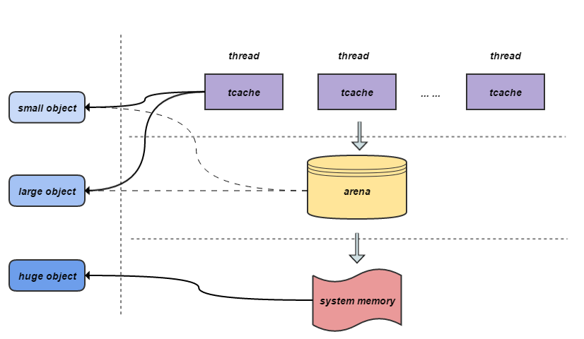
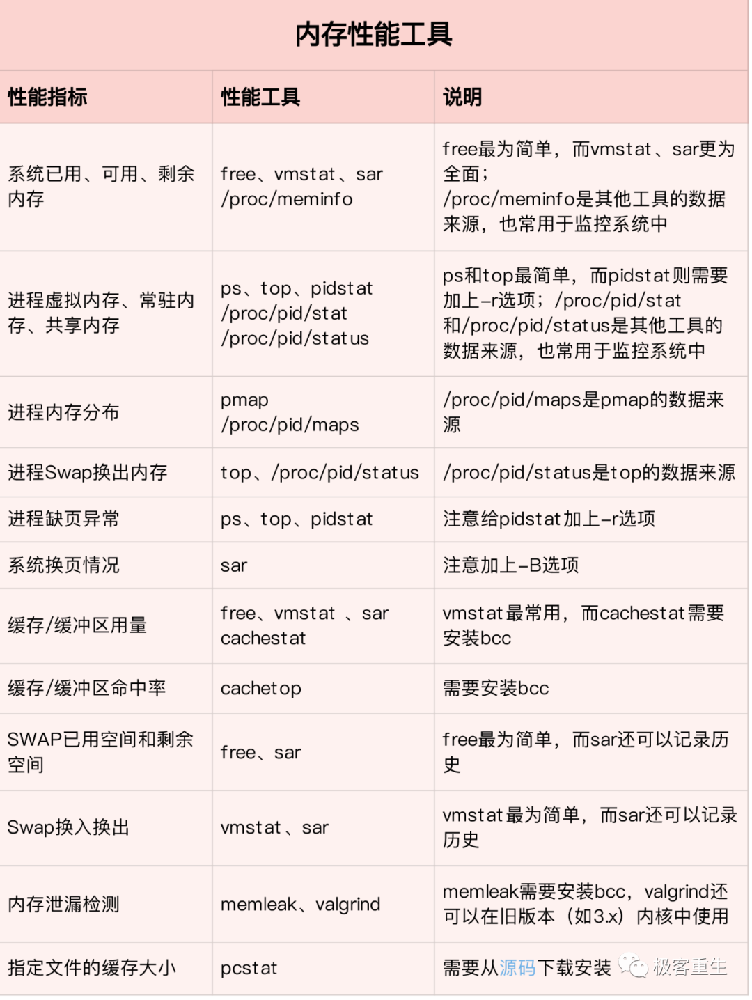
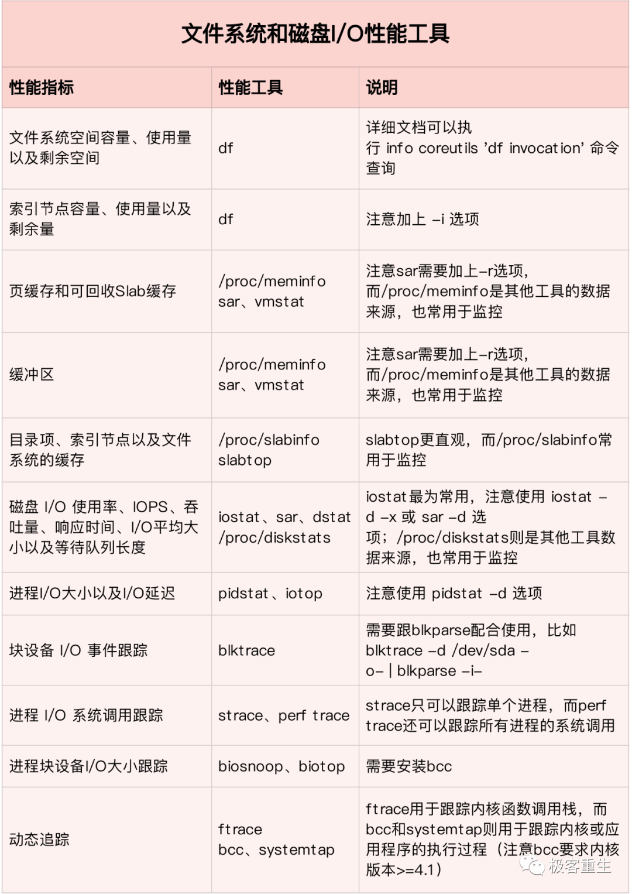
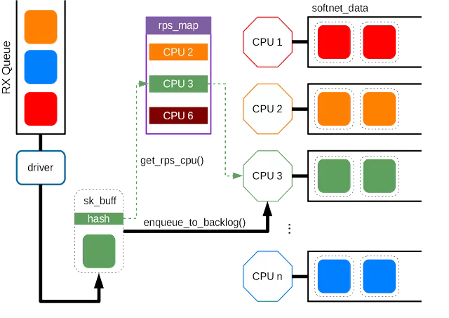

- [ptmalloc,tcmalloc和jemalloc内存分配策略](https://cloud.tencent.com/developer/article/1173720)
  - 操作系统内存布局
    
    32位默认内存布局
    
    64位内存布局
  - Ptmalloc
    - Ptmalloc采用主-从分配区的模式，当一个线程需要分配资源的时候，从链表中找到一个没加锁的分配区，在进行内存分配。
    - 小内存分配
      - [获取分配区(arena)并加锁] -> fast bin -> unsorted bin -> small bin -> large bin -> top chunk -> 扩展堆
    - 大内存分配
      - top chunk -> mmap
    - 注意事项：
      - Ptmalloc默认后分配内存先释放，因为内存回收是从top chunk开始的。
      - 避免多线程频繁分配和释放内存，会造成频繁加解锁。
      - 不要分配长生命周期的内存块，容易造成内碎片，影响内存回收。
    - Ptmalloc在性能上还是存在一些问题
      - 不同分配区（arena）的内存不能交替使用
      - 每个内存块分配都要浪费8字节内存
  - Tcmalloc
    - 内存管理分为线程内存和中央堆两部分
    - 小内存分配
      - 在线程缓存内的60个分配器（_文档上说60个，但是我在2.0的代码里看到得是86个_）分别维护了一个大小固定的自由空间链表，直接由这些链表分配内存的时候是不加锁的。但是中央堆是所有线程共享的，在由其分配内存的时候会加自旋锁(spin lock)。
    - 大内存分配
      - 对于大内存分配(大于8个分页, 即32K)，tcmalloc直接在中央堆里分配。中央堆的内存管理是以分页为单位的，同样按大小维护了256个空闲空间链表，前255个分别是1个分页、2个分页到255个分页的空闲空间，最后一个是更多分页的小的空间。这里的空间如果不够用，就会直接从系统申请了。
    - 资源释放
      - 首先计算其分页编号，然后再查找出它对应的span，如果它是一个小对象，则直接归入小对象分配器的空闲链表。等到空闲空间足够大以后划入中央堆。如果是大对象，则会把物理地址连续的前后的span也找出来，如果空闲则合并，并归入中央堆中。
  - Jemalloc
    - Jemalloc 把内存分配分为了三个部分
      - 第一部分类似tcmalloc，是分别以8字节、16字节、64字节等分隔开的small class；
      - 第二部分以分页为单位，等差间隔开的large class；
      - 然后就是huge class。
      - 内存块的管理也通过一种chunk进行，一个chunk的大小是2^k (默认4 MB)。通过这种分配实现常数时间地分配small和large对象，对数时间地查询huge对象的meta（使用红黑树）。
    - 小内存（small class）： 线程缓存bin -> 分配区bin(bin加锁) -> 问系统要
    - 中型内存（large class）：分配区bin(bin加锁) -> 问系统要
    - 大内存（huge class）： 直接mmap组织成N个chunk+全局huge红黑树维护(带缓存)
  - Jemalloc vs Tcmalloc
    - Jemalloc设计上比前两个复杂地多，其内部使用了红黑树管理分页和内存块。
    - Jemalloc对内存分配粒度分类地更细。这导致一方面比ptmalloc的锁争用要少，另一方面很多索引和查找都能回归到指数级别，方便了很多复杂功能的实现。
    - 在大内存分配上，内存碎片也会比tcmalloc少。
    - 因为他的结构比较复杂，记录了很多meta，所以在分配很多小内存的时候记录meta数据的空间会略微多于tcmalloc。但是又不像ptmalloc那样每一个内存块都有一个header，而采用全局的bitmap记录状态，所以大量小内存的时候，会比ptmalloc消耗的额外内存小。
- [ptmalloc、tcmalloc与jemalloc](https://www.cyningsun.com/07-07-2018/memory-allocator-contrasts.html)
  - Issue
    - 为了进行耗时优化，基础库这层按照惯例使用tcmalloc替代glibc标配的ptmalloc做优化，CPU消耗和耗时确实有所降低。但在晚上高峰时期，在CPU刚刚超过50%之后却出现了指数上升，服务在几分钟之内不可用。最终定位到是tcmalloc在内存分配的时候使用自旋锁，在锁冲突严重的时候导致CPU飙升
  - ptmalloc
    - 当某一线程需要调用malloc()分配内存空间时，该线程先查看线程私有变量中是否已经存在一个分配区，如果存在，尝试对该分配区加锁，如果加锁成功，使用该分配区分配内存，如果失败，该线程搜索循环链表试图获得一个没有加锁的分配区。如果所有的分配区都已经加锁，那么malloc()会开辟一个新的分配区，把该分配区加入到全局分配区循环链表并加锁，然后使用该分配区进行分配内存操作。在释放操作中，线程同样试图获得待释放内存块所在分配区的锁，如果该分配区正在被别的线程使用，则需要等待直到其他线程释放该分配区的互斥锁之后才可以进行释放操作
    - 从工作原理来看：
      - Fast bins是小内存块的高速缓存，当一些大小小于64字节的chunk被回收时，首先会放入fast bins中，在分配小内存时，首先会查看fast bins中是否有合适的内存块，如果存在，则直接返回fast bins中的内存块，以加快分配速度。
      - Usorted bin只有一个，回收的chunk块必须先放到unsorted bin中，分配内存时会查看unsorted bin中是否有合适的chunk，如果找到满足条件的chunk，则直接返回给用户，否则将unsorted bin的所有chunk放入small bins或是large bins中。
      - Small bins用于存放固定大小的chunk，共64个bin，最小的chunk大小为16字节或32字节，每个bin的大小相差8字节或是16字节，当分配小内存块时，采用精确匹配的方式从small bins中查找合适的chunk。
      - Large bins用于存储大于等于512B或1024B的空闲chunk，这些chunk使用双向链表的形式按大小顺序排序，分配内存时按最近匹配方式从large bins中分配chunk。
    
    - 问题
      - 如果后分配的内存先释放，无法及时归还系统。因为 ptmalloc 收缩内存是从 top chunk 开始,如果与 top chunk 相邻的 chunk 不能释放, top chunk 以下的 chunk 都无法释放。
      - 内存不能在线程间移动，多线程使用内存不均衡将导致内存浪费
      - 每个chunk至少8字节的开销很大
      - 不定期分配长生命周期的内存容易造成内存碎片，不利于回收。
      - 加锁耗时，无论当前分区有无耗时，在内存分配和释放时，会首先加锁。
  - tcmalloc
    - TCMalloc是专门对多线并发的内存管理而设计的，TCMalloc主要是在线程级实现了缓存，使得用户在申请内存时大多情况下是无锁内存分配。整个 TCMalloc 实现了三级缓存，分别是ThreadCache(线程级缓存)，Central Cache(中央缓存：CentralFreeeList)，PageHeap(页缓存)，最后两级需要加锁访问
      
    - tcmalloc的优势
      - 小内存可以在ThreadCache中不加锁分配(加锁的代价大约100ns)
      - 大内存可以直接按照大小分配不需要再像ptmalloc一样进行查找
      - 大内存加锁使用更高效的自旋锁
      - 减少了内存碎片
    - 问题
      - 使用自旋锁虽然减少了加锁效率，但是如果使用大内存较多的情况下，内存在Central Cache或者Page Heap加锁分配。而tcmalloc对大小内存的分配过于保守，在一些内存需求较大的服务（如推荐系统），小内存上限过低，当请求量上来，锁冲突严重，CPU使用率将指数暴增
  - jemalloc
    - jemalloc最大的优势还是其强大的多核/多线程分配能力. CPU的核心数量越多, 程序线程数越多, jemalloc的分配速度越快
    - jemalloc 按照内存分配请求的尺寸，分了 small object (例如 1 – 57344B)、 large object (例如 57345 – 4MB )、 huge object (例如 4MB以上)。jemalloc同样有一层线程缓存的内存名字叫tcache，当分配的内存大小小于tcache_maxclass时，jemalloc会首先在tcache的small object以及large object中查找分配，tcache不中则从arena中申请run，并将剩余的区域缓存到tcache。若arena找不到合适大小的内存块， 则向系统申请内存。当申请大小大于tcache_maxclass且大小小于huge大小的内存块时，则直接从arena开始分配。而huge object的内存不归arena管理， 直接采用mmap从system memory中申请，并由一棵与arena独立的红黑树进行管理。
    
- [Tunes EC2](https://www.brendangregg.com/blog/2017-12-31/reinvent-netflix-ec2-tuning.html)
  - for Ubuntu Xenial instances on EC2.
    - CPU
      `schedtool –B PID`
    - Virtual Memory
      ```shell
      vm.swappiness = 0       # from 60
      ```
    - Huge Pages
      ```shell
      # echo madvise > /sys/kernel/mm/transparent_hugepage/enabled
      ```
    - NUMA
      ```shell
      kernel.numa_balancing = 0
      ```
    - File System
      ```shell
      vm.dirty_ratio = 80                     # from 40
      vm.dirty_background_ratio = 5           # from 10
      vm.dirty_expire_centisecs = 12000       # from 3000
      mount -o defaults,noatime,discard,nobarrier …
      ```
    - Storage I/O
      ```shell
      /sys/block/*/queue/rq_affinity  2
      /sys/block/*/queue/scheduler        noop
      /sys/block/*/queue/nr_requests  256
      /sys/block/*/queue/read_ahead_kb    256
      mdadm –chunk=64 ...
      ```
    - Networking
      ```shell
      net.core.somaxconn = 1000
      net.core.netdev_max_backlog = 5000
      net.core.rmem_max = 16777216
      net.core.wmem_max = 16777216
      net.ipv4.tcp_wmem = 4096 12582912 16777216
      net.ipv4.tcp_rmem = 4096 12582912 16777216
      net.ipv4.tcp_max_syn_backlog = 8096
      net.ipv4.tcp_slow_start_after_idle = 0
      net.ipv4.tcp_tw_reuse = 1
      net.ipv4.ip_local_port_range = 10240 65535
      net.ipv4.tcp_abort_on_overflow = 1    # maybe
      ```
- [Network Overview](https://mp.weixin.qq.com/s?__biz=MzkyMTIzMTkzNA==&mid=2247563566&idx=1&sn=26156d79dffb3f0f10b6a26931f993cc&chksm=c1850e7ff6f28769b6ff3358366e917d3d54fc0f0563131422da4bed201768c958262b5d5a99&scene=21#wechat_redirect)
  - 协议
    - TCP UDP QUIC
  - 网络编程
    - Reactor是基于同步IO,事件驱动机制，reactor实现了一个被动事件接收和分发的模型，同步等待事件到来，并作出响应，Reactor实现相对简单，对于耗时短的处理场景处理高效，同时接收多个服务请求，并且依次同步的处理它们的事件驱动程序
      - redis - level trigger
      - nginx - edge trigger
    - Proactor基于异步IO，异步接收和同时处理多个服务请求的事件驱动程序，处理速度快，Proactor性能更高，能够处理耗时长的并发场景
  - Linux内核协议栈
    - [TCP/IP协议栈](https://mp.weixin.qq.com/s?__biz=MzkyMTIzMTkzNA==&mid=2247510568&idx=1&sn=79f335aaab5c0a36c0a66c5bfb1619ae&chksm=c1845d79f6f3d46f81b6fd24335eb8994c9daf21b6846d80af2cad73d9f638c5dda48b02892c&scene=21#wechat_redirect)
    - [Linux网络子系统](https://mp.weixin.qq.com/s?__biz=MzkyMTIzMTkzNA==&mid=2247532046&idx=2&sn=04ffe282ce1278297d124f0c382ba665&chksm=c184895ff6f300497eb2bcc63d352b6d6b374606399cb7dd5b5bb59a773e674a368f9f4c9169&scene=21#wechat_redirect)
  - [新技术基石 | eBPF and XDP](https://mp.weixin.qq.com/s?__biz=MzkyMTIzMTkzNA==&mid=2247511570&idx=1&sn=18d5f1045b7ed6e27e1c8fb36302c3f9&chksm=c1845943f6f3d055c2533d580acb2d4258daf2a84ffba30e2cc6376b3ffdb1687773ed4c19a3&scene=21#wechat_redirect)
    - 传统Linux网络驱动的问题
      - 中断开销突出，大量数据到来会触发频繁的中断（softirq）开销导致系统无法承受，
      - 需要把包从内核缓冲区拷贝到用户缓冲区，带来系统调用和数据包复制的开销，
      - 对于很多网络功能节点来说，TCP/IP协议并非是数据转发环节所必需的，
      - NAPI/Netmap等虽然减少了内核到用户空间的数据拷贝，但操作系统调度带来的cache替换也会对性能产生负面影响。
    - 改善iptables/netfilter的规模瓶颈，提高Linux内核协议栈IO性能，内核需要提供新解决方案，那就是eBPF/XDP框架
    - BPF 是 Linux内核中高度灵活和高效的类似虚拟机的技术，允许以安全的方式在各个挂钩点执行字节码。它用于许多Linux内核子系统，最突出的是网络、跟踪和安全（例如沙箱）。
    - XDP的全称是：eXpress DataPath，XDP 是Linux内核中提供高性能、可编程的网络数据包处理框架。
      - 直接接管网卡的RX数据包（类似DPDK用户态驱动）处理
      - 通过运行BPF指令快速处理报文；
      - 和Linux协议栈无缝对接；
  - 容器网络
    - Kubernetes本身并没有自己实现容器网络，而是通过插件化的方式自由接入进来。在容器网络接入进来需要满足如下基本原则：
      - Pod无论运行在任何节点都可以互相直接通信，而不需要借助NAT地址转换实现。
      - Node与Pod可以互相通信，在不限制的前提下，Pod可以访问任意网络。
      - Pod拥有独立的网络栈，Pod看到自己的地址和外部看见的地址应该是一样的，并且同个Pod内所有的容器共享同个网络栈。
    - 目前流行插件：Flannel、Calico、Weave、Contiv
    - Overlay模式：Flannel（UDP、vxlan）、Weave、Calico（IPIP）
    - 三层路由模式：Flannel（host-gw）、Calico（BGP）
    - Underlay网络：Calico（BGP）
  - [网络性能优化](https://mp.weixin.qq.com/s?__biz=MzkyMTIzMTkzNA==&mid=2247505264&idx=1&sn=0735027d6e20ca7bd2bdc7a7c04477f1&chksm=c1842221f6f3ab371d64032b5bae6e5cc65d8f0265745150f76794932c4d3ac8bf4058d60090&scene=21#wechat_redirect)
    - APP性能优化：空间局部性和时间局部性
    - 协议栈调优：numa亲和，中断亲和，软中断亲和，软中断队列大小，邻居表大小，连接跟踪表大小，TCP队列调整，协议栈内存分配，拥塞控制算法优化
    - Bypass内核协议栈：DPDK,RDMA.
    - 网卡优化：驱动配置，offload，网卡队列，智能网卡，高性能网卡。
    - 硬件加速器：ASIC、FPGA,网络处理器,多核处理器
  - 高性能网络
    - DPDK网络优化
      - PMD用户态驱动•CPU亲缘性和独占•内存大页和降低内存访问开销•避免False Sharing•内存对齐•cache对齐•NUMA•减少进程上下文切换•分组预测机制•利用流水线并发•为了利用空间局部性•充分挖掘网卡的潜能
    - RDMA 作为一种旁路内核的远程内存直接访问技术，被广泛应用于数据密集型和计算密集型场景中，是高性能计算、机器学习、数据中心、海量存储等领域的重要解决方案。
      - RDMA 具有零拷贝、协议栈卸载的特点。RDMA 将协议栈的实现下沉至RDMA网卡(RNIC)，绕过内核直接访问远程内存中的数据
  - [排障](https://mp.weixin.qq.com/s?__biz=MzkyMTIzMTkzNA==&mid=2247505250&idx=1&sn=a854ee9a456e27e3bd4202380e4782c8&chksm=c1842233f6f3ab251f1a686e4f4bbeaa305a73ff3b09d5846b3ae536153ed22ba716c99f0ae5&scene=21#wechat_redirect)

- [Linux问题分析与性能优化](https://mp.weixin.qq.com/s?__biz=MzkyMTIzMTkzNA==&mid=2247529939&idx=2&sn=f193d1ea112482945d8be3d97d1eba85&chksm=c1848282f6f30b94a2b1851d2a18a8ce0e026cc79b5ace4076909389704aaab185ccdc9c5bef&scene=21#wechat_redirect) 
  - 整体情况：
    - top/htop/atop命令查看进程/线程、CPU、内存使用情况，CPU使用情况；
    - dstat 2查看CPU、磁盘IO、网络IO、换页、中断、切换，系统I/O状态;
    - vmstat 2查看内存使用情况，内存状态；
    - iostat -d -x 2查看所有磁盘的IO情况，系统I/O状态；
    - iotop查看IO靠前的进程，系统的I/O状态；
    - perf top查看占用CPU最多的函数，CPU使用情况；
    - perf record -ag -- sleep 15;perf report查看CPU事件占比，调用栈，CPU使用情况；
    - sar -n DEV 2查看网卡的吞吐，网卡状态；
    - /usr/share/bcc/tools/filetop -C查看每个文件的读写情况，系统的I/O状态；
    - /usr/share/bcc/tools/opensnoop显示正在被打开的文件，系统的I/O状态；
    - mpstat -P ALL 1 单核CPU是否被打爆；
    - ps aux --sort=-%cpu 按CPU使用率排序，找出CPU消耗最多进程；
    - ps -eo pid,comm,rss | awk '{m=$3/1e6;s["*"]+=m;s[$2]+=m} END{for (n in s) printf"%10.3f GB  %s\n",s[n],n}' | sort -nr | head -20 统计前20内存占用；
    - awk 'NF>3{s["*"]+=s[$1]=$3*$4/1e6} END{for (n in s) printf"%10.1f MB  %s\n",s[n],n}' /proc/slabinfo | sort -nr | head -20  统计内核前20slab的占用；
  - 进程分析，进程占用的资源：
    - pidstat 2 -p 进程号查看可疑进程CPU使用率变化情况；
    - pidstat -w -p 进程号 2查看可疑进程的上下文切换情况；
    - pidstat -d -p 进程号 2查看可疑进程的IO情况；
    - lsof -p 进程号查看进程打开的文件；
    - strace -f -T -tt -p 进程号显示进程发起的系统调用；
  - 协议栈分析，连接/协议栈状态：
    - ethtool -S 查看网卡硬件情况；
    - cat /proc/net/softnet_stat/ifconfig eth1 查看网卡驱动情况；
    - netstat -nat|awk '{print awk $NF}'|sort|uniq -c|sort -n查看连接状态分布；
    - ss -ntp或者netstat -ntp查看连接队列；
    - netstat -s 查看协议栈情况；
  - 方法论
    - RED方法：监控服务的请求数（Rate）、错误数（Errors）、响应时间（Duration）
    - USE方法：监控系统资源的使用率（Utilization）、饱和度（Saturation）、错误数（Errors）。
  - Tools
    - 
    - 
    - 
    - 
- [服务器性能优化之网络性能优化](https://mp.weixin.qq.com/s?__biz=MzkyMTIzMTkzNA==&mid=2247561718&idx=1&sn=f93ad69bff3ab80665e4b9d67265e6bd&chksm=c18506a7f6f28fb12341c3e439f998d09c4b1d93f8bf59af6b1c6f4427cea0c48b51244a3e53&scene=21#wechat_redirect)
  - 以前
    - 网卡很慢，只有一个队列。当数据包到达时，网卡通过DMA复制数据包并发送中断，Linux内核收集这些数据包并完成中断处理。随着网卡越来越快，基于中断的模型可能会因大量传入数据包而导致 IRQ 风暴。
    - 为了解决这个问题，NAPI(中断+轮询)被提议。当内核收到来自网卡的中断时，它开始轮询设备并尽快收集队列中的数据包
    - 
  - RSS：接收端缩放 Receive Side Scaling
    - 具有多个RX / TX队列过程的数据包。当带有RSS 的网卡接收到数据包时，它会对数据包应用过滤器并将数据包分发到RX 队列。过滤器通常是一个哈希函数，可以通过“ethtool -X”进行配置
    - CPU 亲和性也很重要。最佳设置是分配一个 CPU 专用于一个队列。首先通过检查/proc/interrupt找出IRQ号，然后将CPU位掩码设置为/proc/irq/<IRQ_NUMBER>/smp_affinity来分配专用CPU。为避免设置被覆盖，必须禁用守护进程irqbalance。
  - RPS：接收数据包控制
    - RSS提供硬件队列，一个称为软件队列机制Receive Packet Steering （RPS）在Linux内核实现
    - 当驱动程序接收到数据包时，它会将数据包包装在套接字缓冲区 ( sk_buff ) 中，其中包含数据包的u32哈希值。散列是所谓的第 4 层散列（l4 散列），它基于源 IP、源端口、目的 IP 和目的端口，由网卡或__skb_set_sw_hash() 计算。由于相同 TCP/UDP 连接（流）的每个数据包共享相同的哈希值，因此使用相同的 CPU 处理它们是合理的。
    - RPS 的基本思想是根据每个队列的 rps_map 将同一流的数据包发送到特定的 CPU。这是 rps_map 的结构：映射根据 CPU 位掩码动态更改为`/sys/class/net/<dev>/queues/rx-<n>/rps_cpus`。
    - 
  - RFS: Receive Flow Steering
    - 尽管 RPS 基于流分发数据包，但它没有考虑用户空间应用程序。应用程序可能在 CPU A 上运行，而内核将数据包放入 CPU B 的队列中。由于 CPU A 只能使用自己的缓存，因此 CPU B 中缓存的数据包变得无用。
    - 代替每个队列的哈希至CPU地图，RFS维护全局flow-to-CPU的表，rps_sock_flow_table：该掩模用于将散列值映射成所述表的索引。
    - 
  - aRFS: Accelerated Receive Flow Steering
    - aRFS 进一步延伸RFS为RX队列硬件过滤。要启用 aRFS，它需要具有可编程元组过滤器和驱动程序支持的网卡。要启用ntuple 过滤器。
  - SO_REUSEPORT
    - SO_REUSEPORT支持多个进程或者线程绑定到同一端口，用以提高服务器程序的性能
      - 允许多个套接字 bind()/listen() 同一个TCP/UDP端口
        - 1.每一个线程拥有自己的服务器套接字。
        - 2.在服务器套接字上没有了锁的竞争。
      - 内核层面实现负载均衡。
      - 安全层面，监听同一个端口的套接字只能位于同一个用户下面。
    - 其核心的实现主要有三点：
      - 扩展socket option，增加 SO_REUSEPORT选项，用来设置 reuseport。
      - 修改 bind 系统调用实现，以便支持可以绑定到相同的 IP 和端口。
      - 修改处理新建连接的实现，查找 listener 的时候，能够支持在监听相同 IP 和端口的多个 sock 之间均衡选择
    - 带来意义
      - CPU之间平衡处理，水平扩展，模型简单，维护方便了，进程的管理和应用逻辑解耦，进程的管理水平扩展权限下放给程序员/管理员，可以根据实际进行控制进程启动/关闭，增加了灵活性。
      - 针对对客户端而言，表面上感受不到其变动，因为这些工作完全在服务器端进行。
      - 服务器无缝重启/切换，热更新，提供新的可能性
    - 已知问题
      - SO_REUSEPORT分为两种模式，即热备份模式和负载均衡模式，在早期的内核版本中，即便是加入对reuseport选项的支持，也仅仅为热备份模式，而在3.9内核之后，则全部改为了负载均衡模式
      - SO_REUSEPORT根据数据包的四元组{src ip, src port, dst ip, dst port}和当前绑定同一个端口的服务器套接字数量进行数据包分发。若服务器套接字数量产生变化，内核会把本该上一个服务器套接字所处理的客户端连接所发送的数据包（比如三次握手期间的半连接，以及已经完成握手但在队列中排队的连接）分发到其它的服务器套接字上面，可能会导致客户端请求失败。
    - 如何预防以上已知问题，一般解决思路：
      - 使用固定的服务器套接字数量，不要在负载繁忙期间轻易变化。
      - 允许多个服务器套接字共享TCP请求表(Tcp request table)。
      - 不使用四元组作为Hash值进行选择本地套接字处理，比如选择 会话ID或者进程ID，挑选隶属于同一个CPU的套接字。
      - 使用一致性hash算法。
    - 演进
      - 3.9之前内核，能够让多个socket同时绑定完全相同的ip+port，但不能实现负载均衡，实现是热备。
      - Linux 3.9之后，能够让多个socket同时绑定完全相同的ip+port，可以实现负载均衡。
      - Linux4.5版本后，内核引入了reuseport groups，它将绑定到同一个IP和Port，并且设置了SO_REUSEPORT选项的socket组织到一个group内部。目的是加快socket查询
    - 与其他特性关系
      - SO_REUSEADDR：主要是地址复用
        - 让处于time_wait状态的socket可以快速复用原ip+port
        - 使得0.0.0.0（ipv4通配符地址）与其他地址（127.0.0.1和10.0.0.x）不冲突
        - SO_REUSEADDR 的缺点在于，没有安全限制，而且无法保证所有连接均匀分配。
- [文件的 io 栈](https://mp.weixin.qq.com/s/IrZF9lWweEs1rhxuvMUCKA)
  - IO 从用户态走系统调用进到内核，内核的路径：`VFS → 文件系统 → 块层 → SCSI 层 `
    - VFS 负责通用的文件抽象语义，管理并切换文件系统；
    - 文件系统负责抽象出“文件的概念”，维护“文件”数据到块层的位置映射，怎么摆放数据，怎么抽象文件都是文件系统说了算；
    - 块层对底层硬件设备做一层统一的抽象，最重要的是做一些 IO 调度的策略。比如，尽可能收集批量 IO 聚合下发，让 IO 尽可能的顺序，合并 IO 请求减少 IO 次数等等；
    - SCSI 层则是负责最后对硬件磁盘的对接，驱动层，本质就是个翻译器
  - page cache 是发生在文件系统这里。通常我们确保数据落盘有两种方式：
    - Writeback 回刷数据的方式：write 调用 + sync 调用；
    - Direct IO 直刷数据的方式；
  


