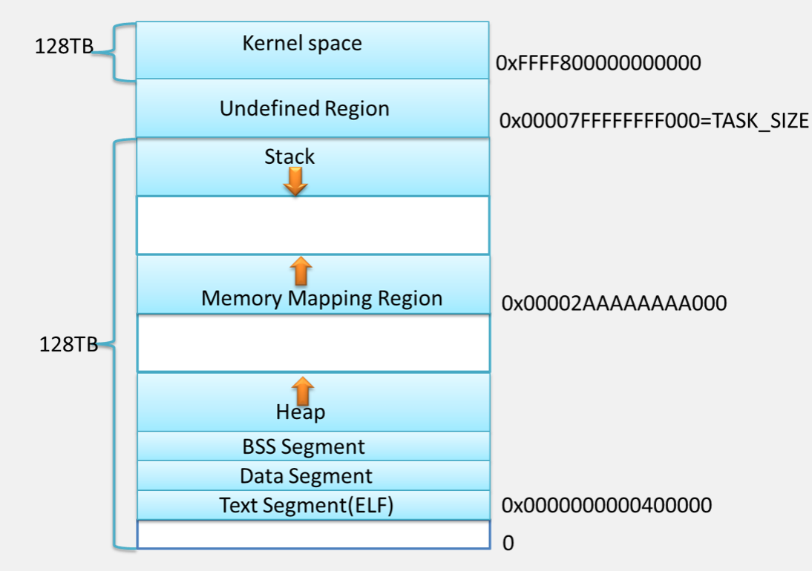
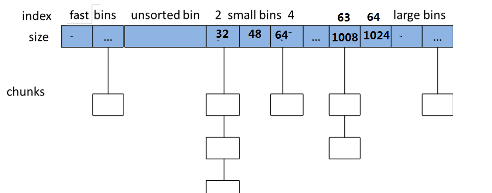

- [ptmalloc,tcmalloc和jemalloc内存分配策略](https://cloud.tencent.com/developer/article/1173720)
  - 操作系统内存布局
    
    32位默认内存布局
    
    64位内存布局
  - Ptmalloc
    - Ptmalloc采用主-从分配区的模式，当一个线程需要分配资源的时候，从链表中找到一个没加锁的分配区，在进行内存分配。
    - 小内存分配
      - [获取分配区(arena)并加锁] -> fast bin -> unsorted bin -> small bin -> large bin -> top chunk -> 扩展堆
    - 大内存分配
      - top chunk -> mmap
    - 注意事项：
      - Ptmalloc默认后分配内存先释放，因为内存回收是从top chunk开始的。
      - 避免多线程频繁分配和释放内存，会造成频繁加解锁。
      - 不要分配长生命周期的内存块，容易造成内碎片，影响内存回收。
    - Ptmalloc在性能上还是存在一些问题
      - 不同分配区（arena）的内存不能交替使用
      - 每个内存块分配都要浪费8字节内存
  - Tcmalloc
    - 内存管理分为线程内存和中央堆两部分
    - 小内存分配
      - 在线程缓存内的60个分配器（_文档上说60个，但是我在2.0的代码里看到得是86个_）分别维护了一个大小固定的自由空间链表，直接由这些链表分配内存的时候是不加锁的。但是中央堆是所有线程共享的，在由其分配内存的时候会加自旋锁(spin lock)。
    - 大内存分配
      - 对于大内存分配(大于8个分页, 即32K)，tcmalloc直接在中央堆里分配。中央堆的内存管理是以分页为单位的，同样按大小维护了256个空闲空间链表，前255个分别是1个分页、2个分页到255个分页的空闲空间，最后一个是更多分页的小的空间。这里的空间如果不够用，就会直接从系统申请了。
    - 资源释放
      - 首先计算其分页编号，然后再查找出它对应的span，如果它是一个小对象，则直接归入小对象分配器的空闲链表。等到空闲空间足够大以后划入中央堆。如果是大对象，则会把物理地址连续的前后的span也找出来，如果空闲则合并，并归入中央堆中。
  - Jemalloc
    - Jemalloc 把内存分配分为了三个部分
      - 第一部分类似tcmalloc，是分别以8字节、16字节、64字节等分隔开的small class；
      - 第二部分以分页为单位，等差间隔开的large class；
      - 然后就是huge class。
      - 内存块的管理也通过一种chunk进行，一个chunk的大小是2^k (默认4 MB)。通过这种分配实现常数时间地分配small和large对象，对数时间地查询huge对象的meta（使用红黑树）。
    - 小内存（small class）： 线程缓存bin -> 分配区bin(bin加锁) -> 问系统要
    - 中型内存（large class）：分配区bin(bin加锁) -> 问系统要
    - 大内存（huge class）： 直接mmap组织成N个chunk+全局huge红黑树维护(带缓存)
  - Jemalloc vs Tcmalloc
    - Jemalloc设计上比前两个复杂地多，其内部使用了红黑树管理分页和内存块。
    - Jemalloc对内存分配粒度分类地更细。这导致一方面比ptmalloc的锁争用要少，另一方面很多索引和查找都能回归到指数级别，方便了很多复杂功能的实现。
    - 在大内存分配上，内存碎片也会比tcmalloc少。
    - 因为他的结构比较复杂，记录了很多meta，所以在分配很多小内存的时候记录meta数据的空间会略微多于tcmalloc。但是又不像ptmalloc那样每一个内存块都有一个header，而采用全局的bitmap记录状态，所以大量小内存的时候，会比ptmalloc消耗的额外内存小。
- [ptmalloc、tcmalloc与jemalloc](https://www.cyningsun.com/07-07-2018/memory-allocator-contrasts.html)
  - Issue
    - 为了进行耗时优化，基础库这层按照惯例使用tcmalloc替代glibc标配的ptmalloc做优化，CPU消耗和耗时确实有所降低。但在晚上高峰时期，在CPU刚刚超过50%之后却出现了指数上升，服务在几分钟之内不可用。最终定位到是tcmalloc在内存分配的时候使用自旋锁，在锁冲突严重的时候导致CPU飙升
  - ptmalloc
    - 当某一线程需要调用malloc()分配内存空间时，该线程先查看线程私有变量中是否已经存在一个分配区，如果存在，尝试对该分配区加锁，如果加锁成功，使用该分配区分配内存，如果失败，该线程搜索循环链表试图获得一个没有加锁的分配区。如果所有的分配区都已经加锁，那么malloc()会开辟一个新的分配区，把该分配区加入到全局分配区循环链表并加锁，然后使用该分配区进行分配内存操作。在释放操作中，线程同样试图获得待释放内存块所在分配区的锁，如果该分配区正在被别的线程使用，则需要等待直到其他线程释放该分配区的互斥锁之后才可以进行释放操作
    - 从工作原理来看：
      - Fast bins是小内存块的高速缓存，当一些大小小于64字节的chunk被回收时，首先会放入fast bins中，在分配小内存时，首先会查看fast bins中是否有合适的内存块，如果存在，则直接返回fast bins中的内存块，以加快分配速度。
      - Usorted bin只有一个，回收的chunk块必须先放到unsorted bin中，分配内存时会查看unsorted bin中是否有合适的chunk，如果找到满足条件的chunk，则直接返回给用户，否则将unsorted bin的所有chunk放入small bins或是large bins中。
      - Small bins用于存放固定大小的chunk，共64个bin，最小的chunk大小为16字节或32字节，每个bin的大小相差8字节或是16字节，当分配小内存块时，采用精确匹配的方式从small bins中查找合适的chunk。
      - Large bins用于存储大于等于512B或1024B的空闲chunk，这些chunk使用双向链表的形式按大小顺序排序，分配内存时按最近匹配方式从large bins中分配chunk。
    
    - 问题
      - 如果后分配的内存先释放，无法及时归还系统。因为 ptmalloc 收缩内存是从 top chunk 开始,如果与 top chunk 相邻的 chunk 不能释放, top chunk 以下的 chunk 都无法释放。
      - 内存不能在线程间移动，多线程使用内存不均衡将导致内存浪费
      - 每个chunk至少8字节的开销很大
      - 不定期分配长生命周期的内存容易造成内存碎片，不利于回收。
      - 加锁耗时，无论当前分区有无耗时，在内存分配和释放时，会首先加锁。
  - tcmalloc
    - TCMalloc是专门对多线并发的内存管理而设计的，TCMalloc主要是在线程级实现了缓存，使得用户在申请内存时大多情况下是无锁内存分配。整个 TCMalloc 实现了三级缓存，分别是ThreadCache(线程级缓存)，Central Cache(中央缓存：CentralFreeeList)，PageHeap(页缓存)，最后两级需要加锁访问
      
    - tcmalloc的优势
      - 小内存可以在ThreadCache中不加锁分配(加锁的代价大约100ns)
      - 大内存可以直接按照大小分配不需要再像ptmalloc一样进行查找
      - 大内存加锁使用更高效的自旋锁
      - 减少了内存碎片
    - 问题
      - 使用自旋锁虽然减少了加锁效率，但是如果使用大内存较多的情况下，内存在Central Cache或者Page Heap加锁分配。而tcmalloc对大小内存的分配过于保守，在一些内存需求较大的服务（如推荐系统），小内存上限过低，当请求量上来，锁冲突严重，CPU使用率将指数暴增
  - jemalloc
    - jemalloc最大的优势还是其强大的多核/多线程分配能力. CPU的核心数量越多, 程序线程数越多, jemalloc的分配速度越快
    - jemalloc 按照内存分配请求的尺寸，分了 small object (例如 1 – 57344B)、 large object (例如 57345 – 4MB )、 huge object (例如 4MB以上)。jemalloc同样有一层线程缓存的内存名字叫tcache，当分配的内存大小小于tcache_maxclass时，jemalloc会首先在tcache的small object以及large object中查找分配，tcache不中则从arena中申请run，并将剩余的区域缓存到tcache。若arena找不到合适大小的内存块， 则向系统申请内存。当申请大小大于tcache_maxclass且大小小于huge大小的内存块时，则直接从arena开始分配。而huge object的内存不归arena管理， 直接采用mmap从system memory中申请，并由一棵与arena独立的红黑树进行管理。
    

