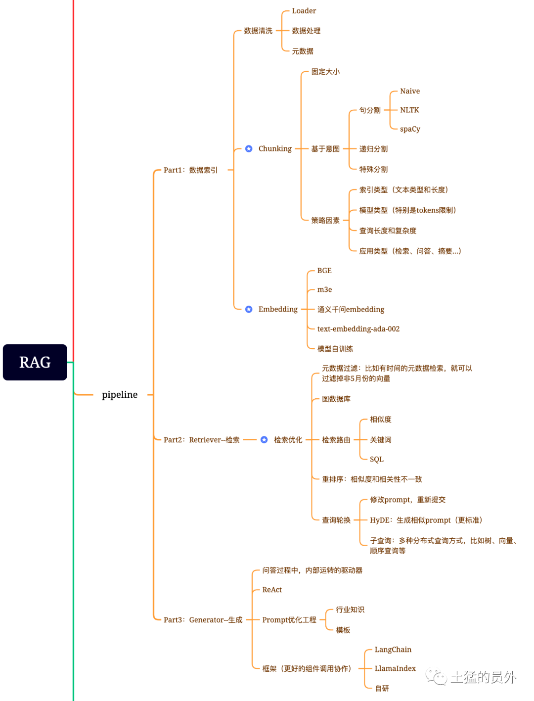
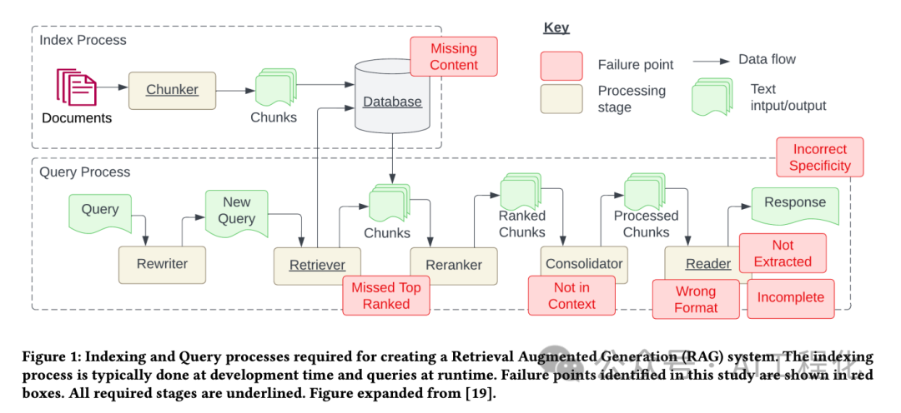
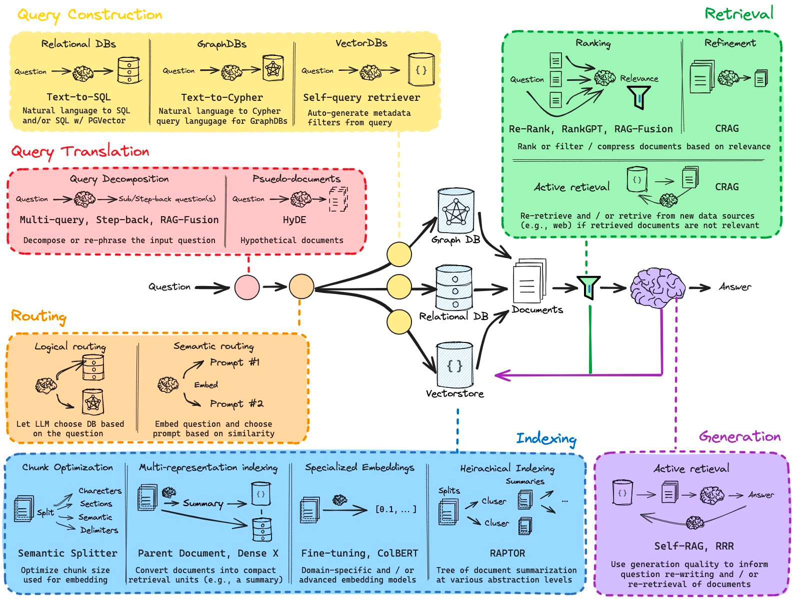

- [LLM 回答更加准确的秘密：为检索增强生成（RAG）添加引用源](https://mp.weixin.qq.com/s/I01YcEs_dV8fkSD-HaQQxg)
  - LLM 的最大问题就是缺乏最新的知识和特定领域的知识。
  - 业界有两种主要解决方法：微调和检索增强生成（RAG）
    - 微调的成本更高，需要使用的数据也更多，并且每一次 fine-tune 的时间比较久，企业无法经常去做这个事情，因为它的 cost 非常高. 因此主要适用于风格迁移（style transfer）的场景
    - RAG 方法使用例如 Milvus 之类的向量数据库，从而将知识和数据注入到应用中，更适用于通用场景
    - RAG 方法就意味着使用向量数据库存储真理数据，这样可以确保应用返回正确的信息和知识，而不是在缺乏数据时产生幻觉，捏造回答
  - 在LLM开发领域，有RAG，MRKL，Re-Act，Plan-Execute等模式
  - 大模型的内在基因
    - 在机器学习中，我们根据解决问题方法不同将模型分为两类，生成式和判别式
    - 判别式是直接寻找P(y|x),即y在x条件下的概率，找到决策边界，即根据x来判别y，故叫做判别式
    - 首先会生成P(x,y)的联合分布，即该类别固有的数学分布是什么样的，然后继而推算P(y|(x,y))，而y本身就是这个概率分布生成的，所以叫做生成式。
  - RAG
    - 第一步是用户向chatbot（即LLM应用）提出问题，
    - 第二步基于问题在数据库中检索相关问题，
    - 第三步，将检索结果top n的数据传给chatbot，chatbot基于用户问题以及检索到的相关信息进行合并形成最终的prompt，
    - 第四步，将prompt提交给大模型，
    - 第五步，大模型产生输出返回给chatbot，进而返回给用户。
    - 
  - 好处
    - 它能够基于这种模式，尽量减少大模型幻觉带来的问题。
    - 它减少了为了微调而准备问答对（带标记的样本数据），大大减少了复杂度。
    - prompt的构造过程，给了我们很大的操作空间，对于我们后续干预模型效果，完成特定业务需求提供了必要的手段。
- [MutiVector Retriever支持RAG架构下表格文字混合内容问答](https://mp.weixin.qq.com/s/Rxwee3Hd-j1xcBqnW8PRDg)
  - 1）利用 Unstructured库来解析pdf文档中的文本和表格。
  - 2）利用multi_vector来存储更适合检索的原始表、文本以及表摘要。
  - 3）利用LangChain Expression Language (LCEL)来实现chain。
- [改进召回（Retrieval）和引入重排（Reranking）提升RAG架构下的LLM应用效果]
  - RAG架构很好的解决了当前大模型Prompt learning过程中context window限制等问题
  - Issue
    - 以RAG召回为例，最原始的做法是通过top-k的方式从向量数据库中检索背景数据然后直接提交给LLM去生成答案，但这样存在检索出来的chunks并不一定完全和上下文相关的问题，最后导致大模型生成的结果质量不佳
  - Solution
    - 借鉴推荐系统做法，引入粗排或重排的步骤来改进效果
    - 原有的top-k向量检索召回扩大召回数目，再引入粗排模型，这里的模型可以是策略，轻量级的小模型，或者是LLM，对召回结果结合上下文进行重排，通过这样的改进模式可以有效提升RAG的效果。
    - 基于LLM的召回或重排
      - 在逻辑概念上，这种方法使用 LLM 来决定哪些文档/文本块与给定查询相关。prompt由一组候选文档组成，这时LLM 的任务是选择相关的文档集，并用内部指标对其相关性进行评分。
      - 为了避免因为大文档chunk化带来的内容分裂，在建库阶段也可做了一定优化，利用summary index对大文档进行索引。
      - llama-index提供了两种形式的抽象：作为独立的检索模块（ListIndexLLMRetriever）或重排模块（LLMRerank）。
    - 基于相对轻量的模型和算法
- [引入元数据(metadata)提升RAG](https://mp.weixin.qq.com/s/b8cMhdqSyC7O275GTLb4aQ)
  - 如果所有用户上传文档放到一个collection 是可以设置field 为用户id等标识, 然后通过langcchain封装的milvus里面的参数 search_params 来筛选出来  考虑建两个collection，public 和 individual, 然后根据用户鉴权判定查询的collection
- [数据预处理之——“局部向量化处理”的妙用](https://mp.weixin.qq.com/s/rBKsfUwokp3jZss6do7YRg?from=groupmessage&isappinstalled=0&scene=1&clicktime=1695784465&enterid=1695784465)
  - 文档内容embedding
    - 如你把切割后的embedding做一遍相似度对比，像冒泡一样去看看效果
    - QA bot冷启动的 vector store 质量很关键, 质量比较高的话，后面你才能从用户输入和答案里面，找一些不错的添加到库中
  - Issue
    - 原始资料信息量太大，碰巧触发的相似成分比较多，那么生成的提示增强信息也会一扯一箩筐。
    - 暴力输出给到大模型的增强Prompt太长（输入和输出都会消耗Token），造成响应慢、费Token、准确性大打折扣的后果
    - 面对高度垂直的任务类型时，“局部向量化处理”也能获得不错的效果
      - 前提：做好科学的文本分割，按照不重不漏(MECE）的原则，分门别类、以合理的颗粒度建立目录结构
- [Milvus + Towhee 搭建一个基础的 AI 聊天机器人](https://gist.github.com/egoebelbecker/07059b88a1c4daa96ec07937f8ca77b3)
- [指代消解](https://mp.weixin.qq.com/s/QYSdrMO6dGRy9_czCgqcKQ)
- [文本分块(Chunking)](https://mp.weixin.qq.com/s?__biz=MzIyOTA5NTM1OA==&mid=2247484262&idx=1&sn=430270e10268c4b97c3b5d983fdfb75b&chksm=e846a1b7df3128a139091d31e4793e2fdcb391da2e866cd914d0f0ecf38ce2d9f285d78c9a03&scene=21#wechat_redirect)
  - 分块（chunking）是将大块文本分解成小段的过程。
    - 当我们使用LLM embedding内容时，这是一项必要的技术，可以帮助我们优化从向量数据库被召回的内容的准确性。
    - 分块的主要原因是尽量减少我们Embedding内容的噪音。
    - 如果文本块尽量是语义独立的，也就是没有对上下文很强的依赖，这样子对语言模型来说是最易于理解的。因此，为语料库中的文档找到最佳块大小对于确保搜索结果的准确性和相关性至关重要。
    - 会话Agent 我们使用embedding的块为基于知识库的会话agent构建上下文，该知识库将代理置于可信信息中。对分块策略做出正确的选择很重要，原因有
      - 首先，它将决定上下文是否与我们的prompt相关。
      - 其次，考虑到我们可以为每个请求发送的tokens数量的限制，它将决定我们是否能够在将检索到的文本合并到prompt中发送到大模型(如OpenAI)。
  - Embedding长短内容
    - 当我们在嵌入内容（也就是embedding）时，我们可以根据内容是短（如句子）还是长（如段落或整个文档）来预测不同的行为
    - 当嵌入一个完整的段落或文档时，Embedding过程既要考虑整个上下文，也要考虑文本中句子和短语之间的关系。这可以产生更全面的向量表示，从而捕获文本的更广泛的含义和主题。
    - 另一方面，较大的输入文本大小可能会引入噪声或淡化单个句子或短语的重要性，从而在查询索引时更难以找到精确的匹配。
    - 查询的长度也会影响Embeddings之间的关系。较短的查询，如单个句子或短语，将专注于细节，可能更适合与句子级Embedding进行匹配。
  - 分块需要考虑的因素
    - 被索引内容的性质是什么? 这可能差别会很大，是处理较长的文档(如文章或书籍)，还是处理较短的内容(如微博或即时消息)？答案将决定哪种模型更适合您的目标，从而决定应用哪种分块策略。
    - 您使用的是哪种Embedding模型，它在多大的块大小上表现最佳？例如，sentence-transformer模型在单个句子上工作得很好，但像text- embedt-ada -002~[2]~这样的模型在包含256或512个tokens的块上表现得更好。
    - 你对用户查询的长度和复杂性有什么期望？用户输入的问题文本是简短而具体的还是冗长而复杂的？这也直接影响到我们选择分组内容的方式，以便在嵌入查询和嵌入文本块之间有更紧密的相关性。
    - 如何在您的特定应用程序中使用检索结果？ 例如，它们是否用于语义搜索、问答、摘要或其他目的？例如，和你底层连接的LLM是有直接关系的，LLM的tokens限制会让你不得不考虑分块的大小。
  - 分块的方法
    - 固定大小分块
      - 我们会在块之间保持一些重叠，以确保语义上下文不会在块之间丢失。在大多数情况下，固定大小的分块将是最佳方式
    - Content-Aware：基于内容意图分块
      - 句分割——Sentence splitting
        - Naive splitting: 最幼稚的方法是用句号(。) 和 “换行”来分割句子
        - NLTK: 自然语言工具包(NLTK)是一个流行的Python库，用于处理自然语言数据。它提供了一个句子标记器，
        - spaCy: spaCy是另一个用于NLP任务的强大Python库。它提供了一个复杂的句子分割功能，可以有效地将文本分成单独的句子，从而在生成的块中更好地保存上下文。
      - 递归分割
        - 递归分块使用一组分隔符以分层和迭代的方式将输入文本分成更小的块
      - 专门的分块
        - Markdown和LaTeX是您可能遇到的结构化和格式化内容的两个例子。在这些情况下，可以使用专门的分块方法在分块过程中保留内容的原始结构。
  - 策略选择
    - 预处理数据，在确定应用程序的最佳块大小之前，您需要先预处理数据以确保质量
    - 选择一定范围的块大小，数据预处理完成后，下一步就是选择一定范围的潜在块大小进行测试
    - 评估每种分块大小的性能，为了测试各种分块大小，可以在向量数据库中使用多个索引或具有多个命名空间的单个索引
    - llamaindex等框架为chunk增加描述性metadata，以及精心设计索引结构，比如treeindex等，进而解决因为chunking导致的跨chunk的上下文丢失问题
  - [测试 LangChain 分块](https://mp.weixin.qq.com/s/-ZgM3wItZUtY6nU_9FmJnw)
    - 我添加了五个实验，这个教程测试的分块长度从 32 到 64、128、256、512 不等，分块 overlap 从 4 到 8、16、32、64 不等的分块策略
- [Deconstructing RAG](https://blog.langchain.dev/deconstructing-rag/)
  - Query Transformations - a set of approaches focused on modifying the user input in order to improve retrieval
    - Query expansion - decomposes the input into sub-questions, each of which is a more narrow retrieval challenge
      - The multi-query retriever performs sub-question generation, retrieval, and returns the unique union of the retrieved docs.
      -  RAG fusion builds on by ranking of the returned docs from each of the sub-questions
      - Step-back prompting offers a third approach in this vein, generating a step-back question to ground an answer synthesis in higher-level concepts or principles
    - Query re-writing
    - Query compression
      - a user question follows a broader chat conversation. In order to properly answer the question, the full conversational context may be required. To address this, we use this prompt to compress chat history into a final question for retrieval
  - [Routing](https://blog.langchain.dev/applying-openai-rag/)
  - Query Construction
    - Text-to-SQL
    - Text-to-Cypher
    - Text-to-metadata filters
  - Indexing
    - CHunk size
    - [Document embedding strategy](https://github.com/langchain-ai/langchain/blob/master/cookbook/Multi_modal_RAG.ipynb?ref=blog.langchain.dev)
  - Post-Processing
    - [Re-ranking](https://github.com/langchain-ai/langchain/blob/master/cookbook/rag_fusion.ipynb?ref=blog.langchain.dev)
    - Classification
- [Multi-Vector Retriever for RAG on tables, text, and images](https://blog.langchain.dev/semi-structured-multi-modal-rag/)
- [基于 RAG 的 LLM 可生产应用 Ray](https://mp.weixin.qq.com/s/rjBa2CQxDK2dvdE53ShyOw)
- [Advanced RAG Techniques](https://pub.towardsai.net/advanced-rag-techniques-an-illustrated-overview-04d193d8fec6)
  - Advanced RAG
    - 
    - Chunking & vectorisation
      -  Search index
      - Vector store index
      - Hierarchical indices
    - Context enrichment
      - Sentence Window Retrieval
      - Auto-merging Retriever (aka Parent Document Retriever)
      - Fusion retrieval or hybrid search
      - Reranking & filtering
    - Query transformations
    - Fusion Retrieval or Hybrid Search: This section likely discusses the combination of different retrieval methods or the integration of various search techniques in RAG systems.
    - Reranking & Filtering: A discussion on methods for rearranging the order of retrieved information and filtering out irrelevant data.
    - Query Transformations: This part might explore how queries are modified or transformed to improve the retrieval process.
    - Chat Engine: A section that could focus on the application of RAG techniques in the development of chat engines.
    - Query Routing: Discusses the routing of queries to the most appropriate source or system component in a RAG setup.
    - Agents in RAG: This could delve into the role of agents (autonomous or semi-autonomous entities) in RAG systems.
    - Response Synthesizer: A section on how responses are generated or synthesized in RAG systems.
- [RAG 问题](https://mp.weixin.qq.com/s/2dwnwQGsqKWZQX8gEUV0Sw)
  - 朴素的RAG通常将文档分成块，嵌入它们，并检索与用户问题具有高语义相似性的块。但是，这会带来一些问题
    - 文档块可能包含降低检索效果的无关内容
      - Multi representation indexing：创建一个适合检索的文档表示（如摘要），并将其与原始文档一起存储在向量数据库中
    - 用户问题可能表达不清，难以进行检索
      - Query transformation：在本文中，我们将回顾一些转换人类问题的方法，以改善检索
    - 可能需要从用户问题中生成结构化查询
      - Query construction：将人类问题转换为特定的查询语法或语言
  - Solutions
    - [Multi-Vector Retriever for RAG on tables, text, and images](https://blog.langchain.dev/semi-structured-multi-modal-rag/)
    - Rewrite-Retrieve-Read
      - 使用LLM来重写用户查询，而不是直接使用原始用户查询进行检索
      - https://github.com/langchain-ai/langchain/blob/master/cookbook/rewrite.ipynb
    - [Step back prompting](https://medium.com/international-school-of-ai-data-science/enhancing-llms-reasoning-with-step-back-prompting-47fad1cf5968)
      - Step-Back Prompting是一种用于增强语言模型，特别是大型语言模型（LLMs）的推理和解决问题能力的技术。它涉及鼓励LLM从给定的问题或问题中后退一步，并提出一个更抽象、更高层次的问题，这个问题包含了原始询问的本质
      - 使用LLM生成一个“退后一步”的问题。这可以与或不使用检索一起使用。使用检索时，将使用“退后一步”问题和原始问题进行检索，然后使用两个结果来确定语言模型的响应
      - https://github.com/langchain-ai/langchain/blob/master/cookbook/stepback-qa.ipynb
    - Follow Up Questions
      - 在对话链中处理后续问题时，最基本和核心的地方查询转换的应用是非常重要的。在处理后续问题时，基本上有三种选择：
        - 只需嵌入后续问题。这意味着如果后续问题建立在或参考了之前的对话，它将失去那个问题。例如，如果我先问“在意大利我可以做什么”，然后问“那里有什么类型的食物” - 如果我只嵌入“那里有什么类型的食物”，我将无法知道“那里”指的是哪里。
        - 将整个对话（或最后的 k 条消息）嵌入。这样做的问题在于，如果后续的问题与之前的对话完全无关，那么它可能会返回完全无关的结果，这在生成过程中可能会造成干扰。
        - 使用LLM进行查询转换！
    - Multi Query Retrieval
      - LLM被用来生成多个搜索查询。然后，这些搜索查询可以并行执行，并将检索到的结果一起传递
      - https://python.langchain.com/docs/modules/data_connection/retrievers/MultiQueryRetriever
    - RAG-Fusion
      - 一篇近期的文章基于多查询检索的概念进行拓展。然而，他们并未将所有文档一并处理，而是使用互惠排名融合来重新排序文档。
      - https://github.com/langchain-ai/langchain/blob/master/cookbook/rag_fusion.ipynb
    - GATE [Generative Active Task Elicitation](https://mp.weixin.qq.com/s/eKmWN1NOUZBipQPwm8H_rw)
      - 生成式主动任务激发，与当下大模型被动的获取用户输入生成问题不同，提出了通过主动与用户对话来帮助用户生成更有效的Prompt，从而提高LLMs的准确性和可用性。
      - https://github.com/alextamkin/generative-elicitation
      - 生成式主动学习（Generative active learning）：大模型（LM）生成示例输入供用户标记（label）。这种方法的优点是向用户提供具体的场景，其中包括他们可能没有考虑过的一些场景。例如，在内容推荐方面，LM可能会生成一篇文章，如：您对以下文章感兴趣吗？The Art of Fusion Cuisine: Mixing Cultures and Flavors。
      - 生成“是”或“否”的问题（Generating yes-or-no questions）：我们限制LM生成二进制的是或否问题。这种方法使得模型能够引导用户提供更抽象的偏好，同时对用户来说也很容易回答。例如，模型可能通过询问用户的偏好来进行探测：Do you enjoy reading articles about health and wellness?
      - 生成开放性问题（Generating open-ended questions ）：LM生成需要自由形式自然语言回答的任意问题。这使得LM能够引导获取最广泛和最抽象的知识，但可能会导致问题过于宽泛或对用户来说具有挑战性。例如，LM可能会生成这样一个问题：What hobbies or activities do you enjoy in your free time ..., and why do these hobbies or activities captivate you?
  - https://blog.langchain.dev/query-transformations/
- [Self-RAG](https://mp.weixin.qq.com/s/Z1n4E4Z3DVbOctTY4XfXWw)
  - RAG非常有效，但它是一种固定的方法。无论是否相关（或根本不需要检索），K个段落总是被检索并放置在LLM的上下文中。Self-RAG通过教导LLM反思RAG过程并决定改进了这种方法。
    - 是否需要检索
    - 如果检索到的内容确实相关
    - 无论其产出是否高质量和真实
- [文档优化以及召回优化](https://juejin.cn/live/jpowermeetup24)
  - 文档优化
    - 针对文档特性选择embedding model
    - 针对性的文档分段模式
    - 文档转化为问题，使用问题召回 - 问题召回问题效果较好
  - 召回优化
    - 用户问题改写，使用改写的问题召回
    - 多路召回（把问题改写成多个问题），结合文档检索
    - 把问题编造假的文档，使用假文档召回
- [评估 RAG 的TruLens](https://mp.weixin.qq.com/s/4sBQeL0m09_V9Sya1voTqg)
  - https://colab.research.google.com/github/truera/trulens/blob/main/trulens_eval/examples/expositional/vector-dbs/milvus/milvus_evals_build_better_rags.ipynb
- [评估 RAG 的Ragas ](https://mp.weixin.qq.com/s/gFr0zYyOeIEtYgcM9olIYQ)
  - https://github.com/milvus-io/bootcamp/tree/master/evaluation
  - https://github.com/weaviate/recipes/blob/main/integrations/ragas/RAGAs-RAG-langchain.ipynb
  - https://towardsdatascience.com/evaluating-rag-applications-with-ragas-81d67b0ee31a
- [评估 RAG](https://mp.weixin.qq.com/s/OnfSxBJx_lVYV_MtyViUMw)
  - Ragas（https://docs.ragas.io/en/latest/concepts/metrics/context_recall.html）是专注于评估 RAG 应用的工具
  - Trulens-Eval（https://www.trulens.org/trulens_eval/install/）也是专门用于评估 RAG 指标的工具，它对 LangChain 和 Llama-Index 都有比较好的集成，可以方便地用于评估这两个框架搭建的 RAG 应用
  - [Phoenix](https://github.com/Arize-ai/phoenix)（https://docs.arize.com/phoenix/）有许多评估 LLM 的功能，比如评估 Embedding 效果、评估 LLM 本身
    - LLM Traces
    - Tracing with LlamaIndex
    - Tracing with LangChain
    - LLM Evals
  - 回归现实，从真实需求出发
    - 世界知识&私有知识混淆的: 乙烯和丙烯的关系是什么？ 大模型应该回答两者都属于有机化合物，还是根据近期产业资讯回答，两者的价格均在上涨？
    - 召回结果混淆
    - 多条件约束失效: Q 昨天《独家新闻》统计的化学制品行业的关注度排名第几
    - 全文/多文类意图失效
    - 复杂逻辑推理: Q 近期碳酸锂和硫酸镍同时下跌的时候，哪个在上涨？
- [Seven Failure Points When Engineering a Retrieval Augmented Generation System](https://mp.weixin.qq.com/s/iMTgxYELvESUnCFOglhcYg)
  - 
- [A Cheat Sheet and Some Recipes For Building Advanced RAG](https://blog.llamaindex.ai/a-cheat-sheet-and-some-recipes-for-building-advanced-rag-803a9d94c41b)
  - 
  - 基础 RAG
    - RAG 包括一个检索组件、一个外部知识库和一个生成组件。
    - 高级检索技术必须能够找到与用户查询最相关的文档
    - 块大小优化（Chunk-Size Optimization）：由于 LLM 受上下文长度的限制，因此在建立外部知识库时有必要对文档进行分块。分块过大或过小都会给生成组件带来影响，导致响应不准确。
    - 结构化的外部知识（Structured External Knowledge）：在复杂的情况下，可能有必要建立比基本向量索引更具结构性的外部知识，以便在处理合理分离的外部知识源时允许递归检索或路由检索。
    - 信息压缩（Information Compression）：LLM 不仅受到上下文长度的限制，而且如果检索到的文档包含太多噪音（即无关信息），响应速度也会下降
    - 结果重排（Result Re-Rank）：LLM 存在所谓的 "迷失在中间 "现象，即 LLM 只关注Prompt的两端。有鉴于此，在将检索到的文档交给生成组件之前对其重新排序是有好处的。
- [RAG from scratch]
  - 
- [RAG 系统开发中的 12 大痛点及解决方案](https://baoyu.io/translations/rag/12-rag-pain-points-and-proposed-solutions)
  - 缺失内容
    - 数据清洗的重要性
    - 精心设计的提示有助于提高准确性
  - 关键文档被遗漏
    - 通过调整 chunk_size 和 similarity_top_k 参数优化检索效果 -  [LlamaIndex 实现超参数自动调整](https://levelup.gitconnected.com/automating-hyperparameter-tuning-with-llamaindex-72fdd68e3b90)
    - 检索结果的优化排序 - CohereRerank 进行优化排序
  - 文档整合限制 —— 超出上下文
    
- [ Semantic Chunking for RAG](https://pub.towardsai.net/advanced-rag-05-exploring-semantic-chunking-97c12af20a4d)
  - Embedding-based chunking 
  -  BERT-based chunking techniques (naive, cross-segment, SeqModel)
  -  LLM-based chunking
- [提升RAG检索质量](https://mp.weixin.qq.com/s/rjsymQQwgE78fNZ60opE0w)
  - 查询扩展（Query expansion）
    - 使用生成的答案进行查询扩展
    - 用多个相关问题扩展查询
      - 利用 LLM 生成 N 个与原始查询相关的问题，然后将所有问题（加上原始查询）发送给检索系统
  - 跨编码器重排序（Cross-encoder re-ranking）
    - 根据输入查询与检索到的文档的相关性的分数对文档进行重排序
    - 交叉编码器是一种深度神经网络，它将两个输入序列作为一个输入进行处理。这样，模型就能直接比较和对比输入，以更综合、更细致的方式理解它们之间的关系。
  - 嵌入适配器（Embedding adaptors），可以支持检索到更多与用户查询密切匹配的相关文档
    - 适配器是以小型前馈神经网络的形式实现的，插入到预训练模型的层之间。训练适配器的根本目的是改变嵌入查询，从而为特定任务产生更好的检索结果。
    - 嵌入适配器是在嵌入阶段之后、检索之前插入的一个阶段。可以把它想象成一个矩阵（带有经过训练的权重），它采用原始嵌入并对其进行缩放。

