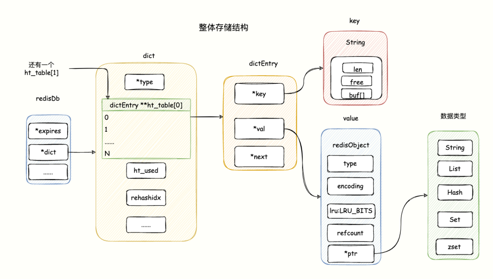
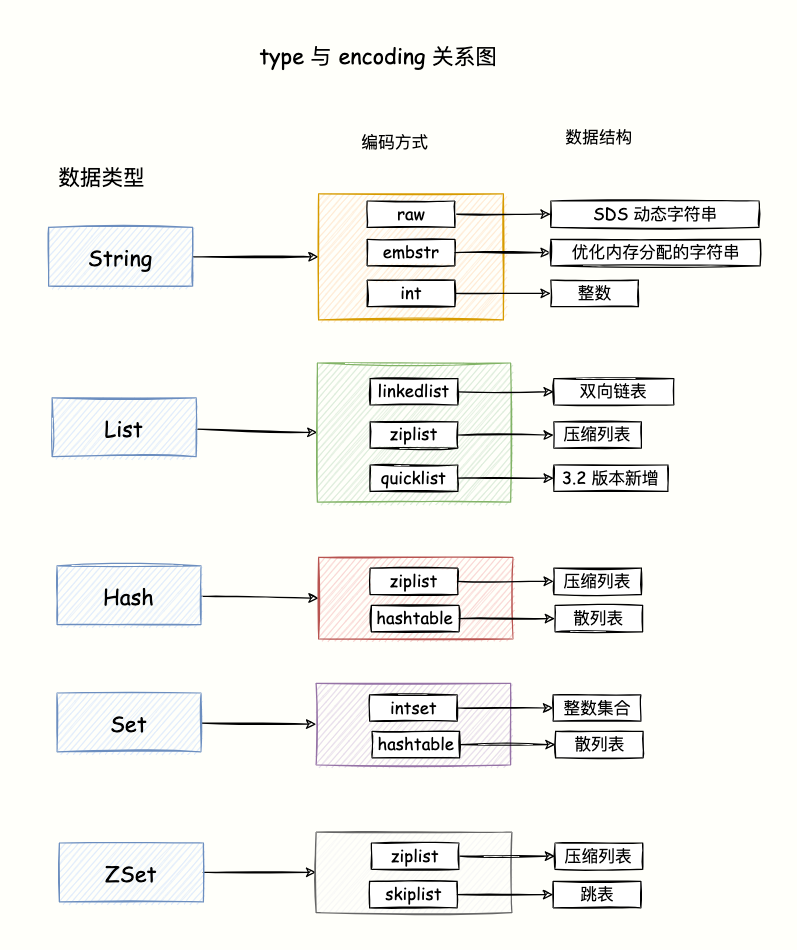

- 为什么需要主从复制？
  - 引入从库虽然导致了数据冗余，但是能够保证数据有异地备份，还能够在故障中快速恢复，能进行读写分离等
- 简述 Redis 的主从复制过程
  - 主从复制的发起者是 slave 节点，而不是 master 节点. 主从复制是推模型
  - 全量复制, 2.8 版本之前都是「全量复制」，具体流程是类似于 RDB 持久化的流程，slave 节点发送 psync 命令后 master 生成 RDB 文件，使用一个缓冲区记录之后的命令。
  - 部分复制,主要有三个关键概念，offset、copybuffer、runid
    - offset 是偏移量，
    - copybuffer 是复制积压缓冲区，每次主节点同步数据推自己的 offset 和 buffer 过来后比对双方数据的 offset，之后决定是否需要同步 buffer 里面的数据。
    -  runid 是每个 slave 节点启动时发给 master 节点，用于标识之前是否同步过，决定进行全量还是部分复制
  - 命令传播阶段主要有两个点，一个是同步增量数据，一个是主从之间发送心跳确认双方在线，slave 节点还会去发送自己的 offset 去获取更新命令
- AOF 重写的触发条件
  - 用户手动触发 bgrewriteaof
  - aof 文件大于阈值
  - aof 文件增长比例超过设置阈值
- 为什么哈希槽的槽数是 16384（2^14）
  - 哈希槽是在 redis 集群模式中用于数据分片的功能，redis 的一致性哈希算法是用了 CRC-16，最多可以哈希到 2^16 也就是可以支持 6W 左右的哈希槽，但是最后只设置了 1W6 左右的哈希槽
  - 心跳包可能会太大导致网络阻塞。redis 集群是使用 gossip 流言协议. 假设槽位设置到了最大，如果一个节点刚好都用到了这些槽位，会导致心跳包达到了 8K，在集群内如果进行传播会导致网络阻塞
  - 集群总节点数在大多数场景不会超过 1K个
  - 提高 gossip 流言协议的传播效率。每个节点都会保存自己用到的哈希槽的 bitmap，在基于流言协议大范围传播节点信息时，会「哈希槽/节点数」的压缩，如果槽位很多的话压缩比率就高，传播节点信息的效率就会高起来
- [Redis 为什么用跳表，而不用平衡树](https://mp.weixin.qq.com/s/c4KjLtZYBVNDTmrjyizVZA)
  - 跳表
    - zset 结构体里有两个数据结构：一个是跳表，一个是哈希表。这样的好处是既能进行高效的范围查询，也能进行高效单点查询。
    - 跳表是在链表基础上改进过来的，实现了一种「多层」的有序链表，这样的好处是能快读定位数据。
    - 跳表在创建节点的时候，随机生成每个节点的层数. 
      - 跳表在创建节点时候，会生成范围为[0-1]的一个随机数，如果这个随机数小于 0.25（相当于概率 25%），那么层数就增加 1 层，然后继续生成下一个随机数，直到随机数的结果大于 0.25 结束，最终确定该节点的层数。
      - 这样的做法，相当于每增加一层的概率不超过 25%，层数越高，概率越低，层高最大限制是 64。
  - 为什么用跳表而不用平衡树
    - 它们不是非常内存密集型的。基本上由你决定。改变关于节点具有给定级别数的概率的参数将使其比 btree 占用更少的内存。
    - Zset 经常需要执行 ZRANGE 或 ZREVRANGE 的命令，即作为链表遍历跳表。通过此操作，跳表的缓存局部性至少与其他类型的平衡树一样好。
    - 它们更易于实现、调试等。例如，由于跳表的简单性，我收到了一个补丁（已经在Redis master中），其中扩展了跳表，在 O(log(N) 中实现了 ZRANK。它只需要对代码进行少量修改。
    - 从内存占用上来比较，跳表比平衡树更灵活一些。平衡树每个节点包含 2 个指针（分别指向左右子树），而跳表每个节点包含的指针数目平均为 1/(1-p)，具体取决于参数 p 的大小。如果像 Redis里的实现一样，取 p=1/4，那么平均每个节点包含 1.33 个指针，比平衡树更有优势。
    - 在做范围查找的时候，跳表比平衡树操作要简单。在平衡树上，我们找到指定范围的小值之后，还需要以中序遍历的顺序继续寻找其它不超过大值的节点。如果不对平衡树进行一定的改造，这里的中序遍历并不容易实现。而在跳表上进行范围查找就非常简单，只需要在找到小值之后，对第 1 层链表进行若干步的遍历就可以实现。
    - 从算法实现难度上来比较，跳表比平衡树要简单得多。平衡树的插入和删除操作可能引发子树的调整，逻辑复杂，而跳表的插入和删除只需要修改相邻节点的指针，操作简单又快速。
- [Redis 突然变慢了如何排查并解决](https://mp.weixin.qq.com/s/-tcADbKihrfRBzMjl96Q2Q)
  - Redis 性能出问题了么
    - 正常情况下 Redis 处理的时间极短，在微秒级别。有的硬件配置比较高，当延迟 0.6ms，我们可能就认定变慢了。硬件比较差的可能 3 ms 我们才认为出现问题
    - 当你发现 Redis 运行时时的延迟是基线性能的 2 倍以上，就可以判定 Redis 性能变慢了
      - 延迟基线测量
        - redis-cli 命令提供了`–intrinsic-latency `选项，用来监测和统计测试期间内的最大延迟（以毫秒为单位），这个延迟可以作为 Redis 的基线性能
        - `redis-cli --intrinsic-latency 100` 参数100是测试将执行的秒数。我们运行测试的时间越长，我们就越有可能发现延迟峰值。 通常运行 100 秒通常是合适的，足以发现延迟问题了，当然我们可以选择不同时间运行几次，避免误差。
    - 慢指令监控
      - 使用 Redis 慢日志功能查出慢命令
        - slowlog 命令可以让我们快速定位到那些超出指定执行时间的慢命令，默认情况下命令若是执行时间超过 10ms 就会被记录到日志 slowlog 只会记录其命令执行的时间，不包含 io 往返操作，也不记录单由网络延迟引起的响应慢。
        - 我们可以根据基线性能来自定义慢命令的标准（配置成基线性能最大延迟的 2 倍），调整触发记录慢命令的阈值。 `redis-cli CONFIG SET slowlog-log-slower-than 6000`
        - 只需要查看最后 2 个慢命令，输入 slowlog get 2 即可
      - latency-monitor（延迟监控）工具。
        - Redis 在 2.8.13 版本引入了 Latency Monitoring 功能，用于以秒为粒度监控各种事件的发生频率启用延迟监视器的第一步是设置延迟阈值(单位毫秒)
        - `CONFIG SET latency-monitor-threshold 9`
  - 如何解决 Redis 变慢
    - 网络通信导致的延迟 - 需要 pipeline 来解决这个问题
    - Fork 生成 RDB 导致的延迟
      - 生成 RDB 快照，Redis 必须 fork 后台进程。fork 操作（在主线程中运行）本身会导致延迟。 Redis 使用操作系统的多进程写时复制技术 COW(Copy On Write) 来实现快照持久化，减少内存占用。
      - 从库加载 RDB 期间无法提供读写服务，所以主库的数据量大小控制在 2~4G 左右，让从库快速的加载完成。
    - 内存大页（transparent huge pages）
      - 采用了内存大页，生成 RDB 期间，即使客户端修改的数据只有 50B 的数据，Redis 需要复制 2MB 的大页。当写的指令比较多的时候就会导致大量的拷贝，导致性能变慢
    - swap：操作系统分页
      - 内存 swap 是操作系统里将内存数据在内存和磁盘间来回换入和换出的机制，涉及到磁盘的读写。
      - 触发 swap 的情况有哪些呢
        - Redis 使用了比可用内存更多的内存；
        - 与 Redis 在同一机器运行的其他进程在执行大量的文件读写 I/O 操作（包括生成大文件的 RDB 文件和 AOF 后台线程），文件读写占用内存，导致 Redis 获得的内存减少，触发了 swap。
- [Redis 内存优化神技，小内存保存大数据](https://mp.weixin.qq.com/s/rqOuadayzFwmThnPApx7SQ)
  - Redis 如何存储键值对
    - Redis 使用「dict」结构来保存所有的键值对（key-value）数据，这是一个全局哈希表，所以对 key 的查询能以 O(1) 时间得到。
    - 
  - 键值对优化
    - 优化神技：降低 Redis 内存使用的最粗暴的方式就是缩减键（key）与值（value）的长度。
      - 对于 key 的优化：使用单词简写方式优化内存占用。
      - value 的优化
        - 过滤不必要的数据：不要大而全的一股脑将所有信息保存，想办法去掉一些不必要的属性
        - 精简数据：比如用户的会员类型：0 表示「屌丝」、1 表示 「VIP」、2表示「VVIP」
        - 数据压缩：对数据的内容进行压缩，比如使用 GZIP、Snappy
        - 使用性能好，内存占用小的序列化方式
  - 小数据集合编码优化
    - 

