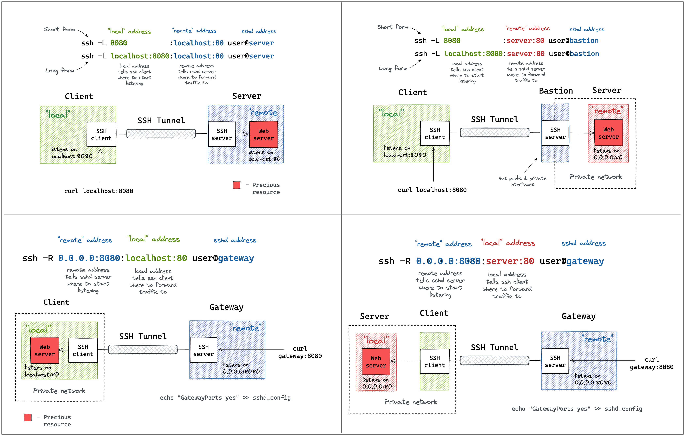

- [find 命令的 7 种用法](https://mp.weixin.qq.com/s/XS2KOhBeGeviusIqIBnxKg)
  - 如果你的 Linux 服务器上有一个名为 logs 的目录，如何删除该目录下最后一次访问时间超过一年的日志文件呢 `find . -type f -atime +365 -exec rm -rf {} \`
  - 按名称或正则表达式查找文件 `find ./yang/books -type f -name "*.pdf"`
  - 查找不同类型的文件 - 指定 -type 选项来搜索其他类型的文件 ``
  - 按指定的时间戳查找文件
    - 访问时间戳（atime）：最后一次读取文件的时间。
    - 修改时间戳（mtime）：文件内容最后一次被修改的时间。
    - 更改时间戳（ctime）：上次更改文件元数据的时间（如，所有权、位置、文件类型和权限设置）
    - + 表示“大于”，- 表示“小于”。所以我们可以搜索 ctime 在 5~10 天前的文 `find . -type f -ctime +5 -ctime -10`
  - 按大小查找文件 - 要查找大小为 10 MB ~ 1 GB 的文件 `find . -type f -size +10M -size -1G`
  - 按所有权查找文件 - 以下命令将查找所有属于 yang 的文件 `find -type f -user yang`
  - 在找到文件后执行命令 - `-exec` 选项后面的命令必须以分号（;）结束 `find . -type f -atime +5 -exec ls {} \;`
- [Top 20 Network Monitoring Tools in Linux](https://linoxide.com/network-monitoring-tools-linux/)
  - [Translation](https://mp.weixin.qq.com/s/VwPxTr5tBdteE2aJg1cYUA)
- 进程上次的启动时间
  - `ps -o lstart {pid}`
- [ip rate limit](https://making.pusher.com/per-ip-rate-limiting-with-iptables/index.html)
  ```shell
  $ iptables --new-chain SOCAT-RATE-LIMIT
  $ iptables --append SOCAT-RATE-LIMIT \
      --match hashlimit \
      --hashlimit-mode srcip \
      --hashlimit-upto 50/sec \
      --hashlimit-burst 100 \
      --hashlimit-name conn_rate_limit \
      --jump ACCEPT
  $ iptables --append SOCAT-RATE-LIMIT --jump DROP
  $ iptables -I INPUT -p tcp --dport 1234 --jump SOCAT-RATE-LIMIT
  ```
- [iptablse常用命令](https://mp.weixin.qq.com/s/1RIR_AECgDr45EENtPRK9w)
  - 清除iptables（常用） `iptables -F`
  - 备份iptables（常用） `iptables-save > iptables.txt`
  - 导入iptables（常用） `iptables-restore < iptables.txt`
  - 机器重启自动生效（常用） `service iptables save`
  - 清空某条规则： `iptables -t filter -D INPUT -s 1.2.3.4 -j DROP`
  - 禁止某个ip（下面用$ip表示）访问本机： `iptables -I INPUT -s $ip -j DROP`
  - 禁止某个ip段（下面用 mask表示，其中$mask是掩码）访问本机： `iptables -I INPUT -s $ip/$mask -j DROP`
  - 禁止本机访问某个ip（下面用$ip表示）： `iptables -A OUTPUT -d $ip -j DROP`
  -  禁止某个ip（下面用$ip表示）访问本机的80端口的tcp服务： `iptables -I INPUT -p tcp –dport 80 -s $ip -j DROP`
  - 禁止所有ip访问本机的80端口的tcp服务： `iptables -A INPUT -p tcp --dport 80 -j DROP`
  - 禁止所有ip访问本机的所有端口： `iptables -A INPUT -j DROP`
  - 禁止除了某个ip（下面用$ip表示）之外其他ip都无法访问本机的3306端口（常用）：
    - （1）首先 禁止所有 `iptables -I INPUT -p tcp --dport 3306 -j DROP`
    - （2）然后 开放个别 `iptables -I INPUT -s $ip -p tcp --dport 3306 -j ACCEPT`
- bash
  - 通过增加 -v 选项，即可开启详细模式，用于查看所执行的命令
  - 通过增加 -x 参数来进入 xtrace 模式，用于调试执行阶段的变量值。
  - 增加 -u 选项， 可以检查变量是否未定义/绑定
  - 组合使用 -vu 就可以直接看到具体出现问题的代码是什么内容
  - 在需要调试的位置设置 set -x ，在结束的位置设置 set +x ，这样调试日志中就只会记录我需要调试部分的日志了
  - set -e 选项。该选项在遇到首个 非0 值的时候会直接退出
- [SSH Tunnels](https://iximiuz.com/en/posts/ssh-tunnels/)
  - 


  
