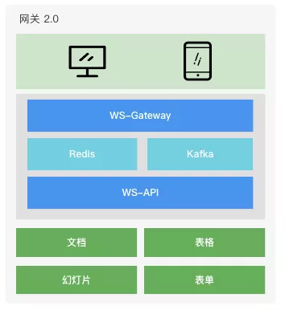

- [估算的一些方法](https://mp.weixin.qq.com/s/fH-AJpE99ulSLbC_1jxlqw)
  - 每个程序员都要了解的延迟数字
  
  - 一些数字积累
    - 某支付服务的支付峰值 60w QPS
    - Go GC 打开写屏障需要花费 10-30us
    - 内网中，一次网络请求的耗时是 ms 级别
    - 万兆网卡，1.25GB/s 打满
    - 4C8G 建 10w 到 20w 的连接没有问题
    - 因为机械硬盘的机械结构，随机 I/O 与顺序的 I/O 性能可能相差几百倍。固态硬盘则只有十几倍到几十倍之间
    - twitter 工程师认为，良好体验的网站平均响应时间应该在 500ms 左右，理想的时间是 200-300ms
    - 平均 QPS：日平均用户请求除以 4w。日平均用户请求，一般来自产品的评估。峰值 QPS：平均 QPS 的 2~4 倍
  - 本章最后有一个实战的例子：评估 twitter 的 QPS 和存储容量。
    
    先给出了一些预设：
      - 300 个 million 的月活跃用户
      - 50% 的用户每天都使用 twitter
      - 用户平均每天发表 2 条 tweets
      - 10% 的 tweets 包含多媒体
      - 多媒体数据保存 5 年
    
    下面是估算的过程：
      - 先预估 QPS：
        - DAU（每天的活跃用户数，Daily Active Users）为：300 million（总用户数） * 50% = 150 million
        - 发 tweets 的平均 QPS：150 million * 2 / 24 hour / 3600 second = ~3500
        - 高峰期 QPS 一般认为是平均 QPS 的 2 倍：2 * 3500 = 7000 QPS
      - 再来估算存储容量：
        - 假设多媒体的平均大小为 1MB，那么每天的存储容量为：150 million * 2 * 10% * 1MB = 30 TB。5 年的存储容量为 30 TB * 365 * 5 = 55 PB。
      - 最后这两个的估算过程是这样的：
        - 300 个 million * 10%* 1MB，1 MB 其实就是 6 个 0，相当于 million 要进化 2 次：million -> billion -> trillion，即从 M -> G -> T，于是结果等于 300 T * 10% = 30 T。
        - 30 TB * 365 * 5 = 30 TB * 1825 = 30 TB * 10^3 * 1.825，TB 进化一次变成 PB，于是等于 30 * 1.825 PB = 55 PB。
- [Go map[int64]int64 写入 redis 占用多少内存](https://mp.weixin.qq.com/s?__biz=MjM5MDUwNTQwMQ==&mid=2257487941&idx=1&sn=80cee0d0f88d73f57a25c496eef90393&scene=21#wechat_redirect)
  - 将内存中的一个超大的 map[int64]int64 写入到 redis，map 里的元素个数是千万级的。设计方案的时候，需要对 redis 的容量做一个估算。
  - 错误的示例
    - 如果不了解 redis 的话，可能你的答案是用元素个数直接乘以 16B（key 和 value 各占 8B）。我们假设元素个数是 5kw，那估算结果就是：5kw * 16B=50kk * 16B = 800MB
  - redis说起
    - Redis 中的一个 k-v 对用一个 entry 项表示，其中每个 entry 包含 key、value、next 三个指针，共 24 字节。由于 redis 使用 jemalloc 分配内存，因此一个 entry 需要申请 32 字节的内存。这里的 key, value 指针分别指向一个 RedisObject
       ```c++
       typedef struct redisObject {
           unsigned type:4;
           unsigned encoding:4;
           unsigned lru:LRU_BITS; 
           int refcount;
           void *ptr;
       } robj;
       ```
    - RedisObject 对应前面提到的各种数据类型，其中最简单的就是 redis 内部的字符串了。它有如下几种编码格式
      
    - 当字符串是一个整型时，直接放在 ptr 位置，不用再分配新的内存了，非常高效
    - 我们要写入 redis 的 map 中的 key 和 value 都是整数，因此直接将值写入 ptr 处即可。
      于是 map 的一个 key 占用的内存大小为：32（entry）+16（key）+16（value）=64B。于是，5kw 个 key 占用的内存大小是 5kw*64B = 50 kk * 64B = 3200MB ≈ 3G
    - 假如我们在 key 前面加上了前缀，那就会生成 SDS，占用的内存会变大，访问效率也会变差。
- [高并发系统建设经验总结](https://mp.weixin.qq.com/s/TTn3YNwKKWn5IS8F6HJHIg)
  - 基础设施
    - 异地多活
  - Database
    - 读写分离; 大部分业务特点是读多写少，因此使用读写分离架构可以有效降低数据库的负载，提升系统容量和稳定性
      - 缺点也是同样明显的
        - 主从延迟
        - 从库的数量是有限的
        - 无法解决 TPS 高的问题
    - 分库分表; 当读写分离不能满足业务需要时，就需要考虑使用分库分表模式了。当确定要对数据库做优化时，应该优先考虑使用读写分离的模式，只有在读写分离的模式已经没办法承受业务的流量时，我们才考虑分库分表的模式
    - 由于是多 master 的架构，分库分表除了包含读写分离模式的所有优点外，还可以解决读写分离架构中无法解决的 TPS 过高的问题，同时分库分表理论上是可以无限横向扩展的，也解决了读写分离架构下从库数量有限的问题。
    - 缺点
      - 改造成本高
      - 事务问题
        - 在分库分表后应该要尽量避免这种跨 DB 实例的操作，如果一定要这么使用，优先考虑使用补偿等方式保证数据最终一致性，如果一定要强一致性，常用的方案是通过分布式事务的方式。
      - 无法支持多维度查询
        - 第一种是引入一张索引表，这张索引表是没有分库分表的，还是以按用户 ID 分库分表为例，索引表上记录各种维度与用户 ID 之间的映射关系，请求需要先通过其他维度查询索引表得到用户 ID，再通过用户 ID 查询分库分表后的表。
        - 通过引入NoSQL的方式，比较常见的组合是ES+MySQL，或者HBase+MySQL的组合等，这种方案本质上还是通过 NoSQL 来充当第一种方案中的索引表的角色
      - 数据迁移
        - 停机迁移
        - 双写，这主要是针对新增的增量数据，存量数据可以直接进行数据同步，关于如何进行双写迁移网上已经有很多分享了，这里也就不赘述，核心思想是同时写老库和新库
  - 架构
    - 缓存
      - [如何保证缓存与数据库的数据一致性](https://coolshell.cn/articles/17416.html)
        - Write through
          ```shell
          lock(运单ID) {
           //...
           
              // 删除缓存
             deleteCache();
              // 更新DB
             updateDB();
              // 重建缓存
             reloadCache()
          }
          ```
          防止并发问题，写请求都需要加分布式锁，锁的粒度是以运单 ID 为 key，在执行完业务逻辑后，先删除缓存，再更新 DB，最后再重建缓存，这些操作都是同步进行的，在读请求中先查询缓存，如果缓存命中则直接返回，如果缓存不命中则查询 DB，然后直接返回，也就是说在读请求中不会操作缓存，这种方式把缓存操作都收敛在写请求中，且写请求是加锁的，有效防止了读写并发导致的写入脏缓存数据的问题。
      - 缓存要避免大 key 和热 key 的问题
      - 读写性能
        - 写性能，影响写性能的主要因素是 key/value 的数据大小，比较简单的场景可以使用JSON的序列化方式存储，但是在高并发场景下使用 JSON 不能很好的满足性能要求，而且也比较占存储空间，比较常见的替代方案有protobuf、thrift等等
        - 读性能的主要影响因素是每次读取的数据包的大小。在实践中推荐使用redis pipeline+批量操作的方式
      - 适当冗余
        - 适当冗余的意思是说我们在设计对外的业务查询接口的时候，可以适当的做一些冗余。
        - 我们一开始设计对外查询接口的时候能做一些适当的冗余，区分不同的业务场景，虽然这样势必会造成有些接口的功能是类似的，但在加缓存的时候就能有的放矢，针对不同的业务场景设计不同的方案，比如关键的流程要注重数据一种的保证，而非关键场景则允许数据短暂的不一致来降低缓存实现的成本
    - 消息队列
      - 在高并发系统的架构中，消息队列（MQ）是必不可少的，当大流量来临时，我们通过消息队列的异步处理和削峰填谷的特性来增加系统的伸缩性，防止大流量打垮系统，此外，使用消息队列还能使系统间达到充分解耦的目的。
    - 服务治理
      - 超时
      - 熔断，限流
      - 降级
      - 注册 发现
      - 安全
      - 监控
  - 应用
    - 补偿
      - 定时任务模式
      - 消息队列模式
    - 幂等
    - 异步化
- [Websocket 百万长连接技术实践](https://mp.weixin.qq.com/s/MUourpb0IqqFo5XlxRLE0w)
  - GateWay
    - 网关拆分为网关功能部分和业务处理部分，网关功能部分为 WS-Gateway：集成用户鉴权、TLS 证书验证和 WebSocket 连接管理等；业务处理部分为 WS-API：组件服务直接与该服务进行 gRPC 通信。可针对具体的模块进行针对性扩容；服务重构加上 Nginx 移除，整体硬件消耗显著降低；服务整合到石墨监控体系
    
    - 网关 客户端连接流程：
      - 客户端与 WS-Gateway 服务通过握手流程建立 WebSocket 连接；
      - 连接建立成功后，WS-Gateway 服务将会话进行节点存储，将连接信息映射关系缓存到 Redis 中，并通过 Kafka 向 WS-API 推送客户端上线消息；
      - WS-API 通过 Kafka 接收客户端上线消息及客户端上行消息；
      - WS-API 服务预处理及组装消息，包括从 Redis 获取消息推送的必要数据，并进行完成消息推送的过滤逻辑，然后 Pub 消息到 Kafka；
      - WS-Gateway 通过 Sub Kafka 来获取服务端需要返回的消息，逐个推送消息至客户端。
  - TLS 内存消耗优化
    - Go TLS 握手过程中消耗的内存 [issue](https://github.com/golang/go/issues/43563)
    - 采用七层负载均衡，在七层负载上进行 TLS 证书挂载，将 TLS 握手过程移交给性能更好的工具完成
  - Socket ID 设计
    - K8S 场景中，采用注册下发的方式返回编号，WS-Gateway 所有副本启动后向数据库写入服务的启动信息，获取副本编号，以此作为参数作为 SnowFlake 算法的副本编号进行 Socket ID 生产，服务重启会继承之前已有的副本编号，有新版本下发时会根据自增 ID 下发新的副本编号
  - 心跳机制
    - 避免大量客户端同时进行心跳上报对 Redis 产生压力。
      - 客户端建立 WebSocket 连接成功后，服务端下发心跳上报参数；
      - 客户端依据以上参数进行心跳包传输，服务端收到心跳后会更新会话时间戳；
      - 客户端其他上行数据都会触发对应会话时间戳更新；
      - 服务端定时清理超时会话，执行主动关闭流程；
    - 实现心跳正常情况下的动态间隔，每 x 次正常心跳上报，心跳间隔增加 a，增加上限为 y
  - 消息接收与发送
    - 发现每个 WebSocket 连接都会占用 3 个 goroutine，每个 goroutine 都需要内存栈，单机承载连十分有限，主要受制于大量的内存占用，而且大部分时间 c.writer() 是闲置状态，于是考虑，是否只启用 2 个 goroutine 来完成交互
    - 保留 c.reader() 的 goroutine，如果使用轮询方式从缓冲区读取数据，可能会产生读取延迟或者锁的问题，c.writer() 操作调整为主动调用，不采用启动 goroutine 持续监听，降低内存消耗
    - 调研了 gev 和 gnet 等基于事件驱动的轻量级高性能网络库，实测发现在大量连接场景下可能产生的消息延迟的问题，所以没有在生产环境下使用
  - 核心对象缓存
    - 网关部分的核心对象为 Connection 对象，围绕 Connection 进行了 run、read、write、close 等函数的开发
    - 使用 sync.pool 来缓存该对象，减轻 GC 压力，创建连接时，通过对象资源池获取 Connection 对象，生命周期结束之后，重置 Connection 对象后 Put 回资源池
      ```go
      var ConnectionPool = sync.Pool{
         New: func() interface{} {
            return &Connection{}
         },
      }
      
      func GetConn() *Connection {
         cli := ConnectionPool.Get().(*Connection)
         return cli
      }
      
      func PutConn(cli *Connection) {
         cli.Reset()
         ConnectionPool.Put(cli) // 放回连接池
      }
      ```
  - 数据传输过程优化
    - 消息流转过程中，需要考虑消息体的传输效率优化，采用 MessagePack 对消息体进行序列化，压缩消息体大小


